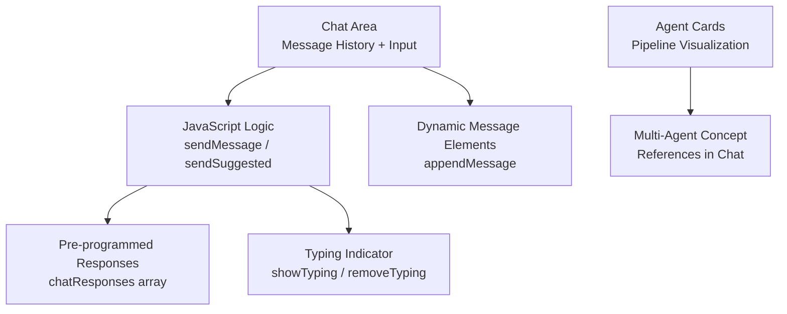
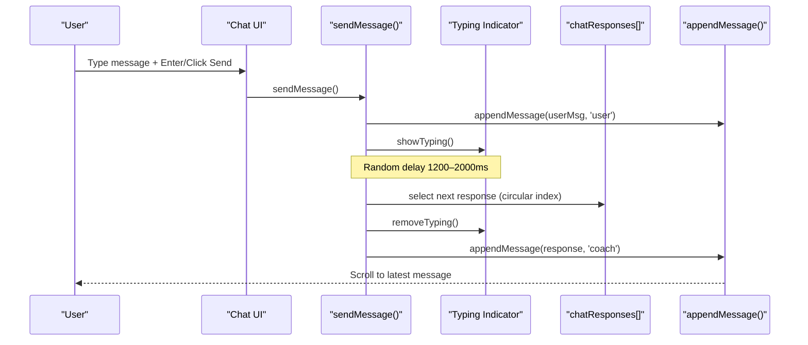
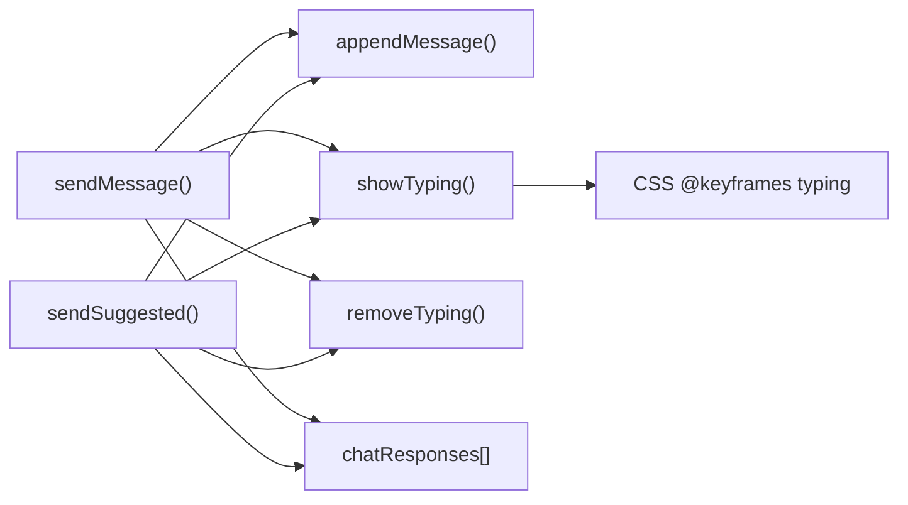

# AI Career Coach Interface

<cite>
**Referenced Files in This Document**
- [index.html](file://index.html)
</cite>

## Table of Contents
1. [Introduction](#introduction)
2. [Project Structure](#project-structure)
3. [Core Components](#core-components)
4. [Architecture Overview](#architecture-overview)
5. [Detailed Component Analysis](#detailed-component-analysis)
6. [Dependency Analysis](#dependency-analysis)
7. [Performance Considerations](#performance-considerations)
8. [Troubleshooting Guide](#troubleshooting-guide)
9. [Conclusion](#conclusion)

## Introduction
This document explains the conversational experience and simulated AI responses for the AI Career Coach chat interface. It focuses on how user messages are captured, displayed, and answered using a pre-programmed response set, with realistic timing and typing indicators. It also describes how the chat references a multi-agent system concept to frame guidance as synthesized insights from specialized agents (Skill Assessment, Market Intel, Career Path, etc.).

## Project Structure
The application is a single-page prototype implemented in one HTML file that includes:
- A hero/profile section with career readiness score and quick stats
- The AI Career Coach chat area with message history, suggested questions, and input handling
- A Multi-Agent Pipeline visualization showing agent roles and status
- Additional sections for skills gap analysis, market insights, action plan, and project recommendations

**Diagram sources**
- [index.html:172-226](file://index.html#L172-L226)
- [index.html:565-628](file://index.html#L565-L628)
- [index.html:228-280](file://index.html#L228-L280)

**Section sources**
- [index.html:1-70](file://index.html#L1-L70)
- [index.html:172-226](file://index.html#L172-L226)
- [index.html:228-280](file://index.html#L228-L280)
- [index.html:565-681](file://index.html#L565-L681)

## Core Components
- Chat area: scrollable message container with initial greeting and example conversation
- User input handling: text input with Enter key support and Send button
- Response display: dynamic creation of message bubbles for user and coach
- Pre-programmed responses: an array of curated guidance messages mixing Urdu and English
- Typing indicator: animated dots while “AI” is composing a reply
- Suggested questions: clickable buttons that trigger the same flow as manual input
- Multi-agent references: chat messages cite analyses from Skill Assessment, Market Intel, and Career Path agents

Key responsibilities:
- Capture and validate user input
- Append user messages to history
- Show typing animation
- Simulate processing delay
- Append coach responses
- Maintain scroll position at the latest message

**Section sources**
- [index.html:172-226](file://index.html#L172-L226)
- [index.html:565-628](file://index.html#L565-L628)

## Architecture Overview
The chat flow is event-driven and entirely client-side:
- User triggers sendMessage() via Enter or button click
- sendMessage() validates input, appends user message, shows typing, schedules a delayed response
- After a randomized delay, removeTyping() hides the indicator and appendMessage() renders the coach’s next response from chatResponses
- sendSuggested() mirrors this flow for predefined question buttons
- Messages are appended to the chatArea and auto-scrolled into view

**Diagram sources**
- [index.html:576-600](file://index.html#L576-L600)
- [index.html:602-628](file://index.html#L602-L628)

## Detailed Component Analysis

### Chat Area Implementation
- Container: a scrollable div with padding and spacing for messages
- Initial content: a coach greeting and an example student question followed by a coach analysis referencing multiple agents
- Suggested questions: three buttons that call sendSuggested() with their text
- Input row: text input bound to Enter key and a Send button calling sendMessage()

Styling highlights:
- Glass morphism background and subtle borders
- Distinct bubble styles for user vs coach
- Smooth slide-up animations for new messages
- Custom scrollbar styling for dark theme

**Section sources**
- [index.html:172-226](file://index.html#L172-L226)

### Message History and Dynamic Rendering
- appendMessage(type) creates a new message element with appropriate classes and inner HTML based on type
- For user messages: right-aligned bubble with avatar placeholder
- For coach messages: left-aligned bubble with bot avatar
- Automatically scrolls the chat area to the bottom after each append

Complexity:
- Each append is O(1) DOM insertion; scrolling is O(1) operation per message
- No heavy computations; safe for typical session lengths

**Section sources**
- [index.html:602-613](file://index.html#L602-L613)

### User Input Handling: sendMessage()
- Reads the input value, trims whitespace, and ignores empty submissions
- Appends the user message to the chat
- Clears the input field
- Shows typing indicator
- Uses setTimeout with a random delay between 1200ms and 2000ms to simulate realistic thinking time
- Removes typing indicator and appends the next coach response from chatResponses
- Increments a circular index to cycle through responses

Edge cases:
- Empty input is ignored
- Index wraps around when reaching the end of the array

**Section sources**
- [index.html:576-589](file://index.html#L576-L589)

### Suggested Questions: sendSuggested()
- Extracts the button’s text content as the user message
- Appends it to the chat
- Shows typing indicator
- After a randomized delay, removes typing and appends the next coach response
- Increments the response index

Behavioral note:
- Mirrors sendMessage() to ensure consistent UX across manual and suggested inputs

**Section sources**
- [index.html:591-600](file://index.html#L591-L600)

### Pre-programmed Responses: chatResponses Array
- Contains several curated guidance messages blending Urdu and English
- Topics include hybrid path advice, freelancing strategy, remote job steps, portfolio projects, and readiness score interpretation
- Responses are selected in a round-robin fashion via a global index

Design rationale:
- Provides immediate, contextual feedback without backend dependencies
- Demonstrates multi-agent synthesis in text (e.g., citing Skill Assessment, Market Intel, Career Path)

**Section sources**
- [index.html:567-573](file://index.html#L567-L573)

### Typing Indicator Animation: showTyping() and removeTyping()
- showTyping():
  - Creates a temporary message element with an animated dot sequence
  - Uses CSS keyframes defined in the page style for smooth pulsing
  - Appends to chatArea and scrolls to bottom
- removeTyping():
  - Finds and removes the typing indicator element if present

Animation details:
- Keyframe named typing animates opacity and scale to create a “thinking” effect
- Dots are staggered with different animation delays for natural motion

**Section sources**
- [index.html:22-43](file://index.html#L22-L43)
- [index.html:615-628](file://index.html#L615-L628)

### Multi-Agent System Integration and References
- The chat area header indicates “Powered by Multi-Agent System”
- Example coach messages reference data from:
  - Skill Assessment agent
  - Market Intel agent
  - Career Path agent
- The pipeline section visualizes six agents:
  - Career Coach (orchestrator)
  - Skill Assessment (evaluator)
  - Market Intel (Pakistan + Remote)
  - Career Path (planner)
  - Roadmap Gen (builder)
  - Progress Tracker (monitor)
- The runPipeline() function animates agent activation sequentially to simulate collaborative analysis

Conceptual mapping:
- Chat responses synthesize outputs from these agents, presenting a unified verdict and actionable plan

**Section sources**
- [index.html:172-183](file://index.html#L172-L183)
- [index.html:199-211](file://index.html#L199-L211)
- [index.html:228-280](file://index.html#L228-L280)
- [index.html:631-657](file://index.html#L631-L657)

### Chat Flow Examples
- Example 1: Manual input
  - User types a question and presses Enter
  - sendMessage() appends user message, shows typing, waits 1.2–2.0 seconds, then appends a coach response
- Example 2: Suggested question
  - User clicks a suggestion button
  - sendSuggested() performs the same flow as manual input
- Example 3: Repeated interactions
  - Each interaction advances the response index, cycling through chatResponses

Timing behavior:
- Randomized delay simulates realistic conversation pacing
- Auto-scroll ensures the latest message is always visible

**Section sources**
- [index.html:576-600](file://index.html#L576-L600)
- [index.html:602-628](file://index.html#L602-L628)

## Dependency Analysis
Internal dependencies:
- sendMessage() depends on appendMessage(), showTyping(), removeTyping(), and chatResponses
- sendSuggested() depends on appendMessage(), showTyping(), removeTyping(), and chatResponses
- showTyping() relies on CSS keyframes defined in the page style
- Pipeline animation depends on DOM elements representing agents and updates their active states

External dependencies:
- Tailwind CSS via CDN for utility classes
- Google Fonts (Inter) for typography

Coupling and cohesion:
- High cohesion within chat logic functions
- Low coupling to external services (no network calls)
- Clear separation between UI structure (HTML), styling (CSS), and behavior (JS)

Potential issues:
- Circular dependency risk is minimal due to linear function calls
- Global state (responseIndex) must be managed carefully if extending functionality

**Diagram sources**
- [index.html:565-628](file://index.html#L565-L628)
- [index.html:22-43](file://index.html#L22-L43)

**Section sources**
- [index.html:565-628](file://index.html#L565-L628)
- [index.html:22-43](file://index.html#L22-L43)

## Performance Considerations
- DOM operations are lightweight; appending messages and scrolling are efficient for typical usage
- Avoid excessive message accumulation by considering virtualization or pagination if scaling up
- Keep chatResponses concise to minimize memory footprint
- Debounce rapid repeated sends if needed to prevent UI thrashing
- Use requestAnimationFrame sparingly; current animations rely on CSS keyframes which are GPU-friendly

[No sources needed since this section provides general guidance]

## Troubleshooting Guide
Common issues and resolutions:
- Messages not appearing:
  - Ensure appendMessage() is called and chatArea exists in the DOM
  - Verify no JavaScript errors blocking execution
- Typing indicator not removed:
  - Confirm removeTyping() runs after the timeout and that the element id matches
- Input not sending:
  - Check that Enter key handler invokes sendMessage()
  - Validate that the input element id matches the selector
- Responses not cycling:
  - Ensure responseIndex increments correctly and wraps using modulo
- Visual glitches:
  - Confirm CSS classes for chat-msg and animations are applied
  - Check Tailwind CDN availability and font loading

**Section sources**
- [index.html:576-628](file://index.html#L576-L628)

## Conclusion
The AI Career Coach chat interface delivers a polished, interactive experience using client-side JavaScript to simulate realistic conversations. It combines message history management, user input handling, dynamic rendering, typing animations, and curated responses to provide immediate guidance. The integration with a multi-agent concept enriches the narrative by attributing insights to specialized agents, enhancing perceived intelligence and personalization. Future enhancements could include persistent chat storage, richer response selection logic, and optional backend integration for real-time AI capabilities.