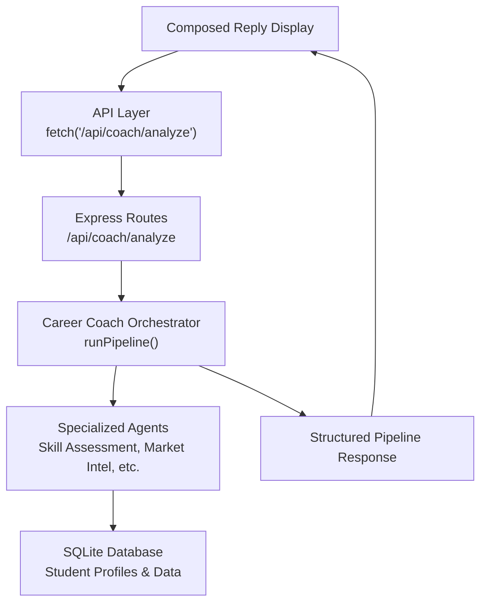
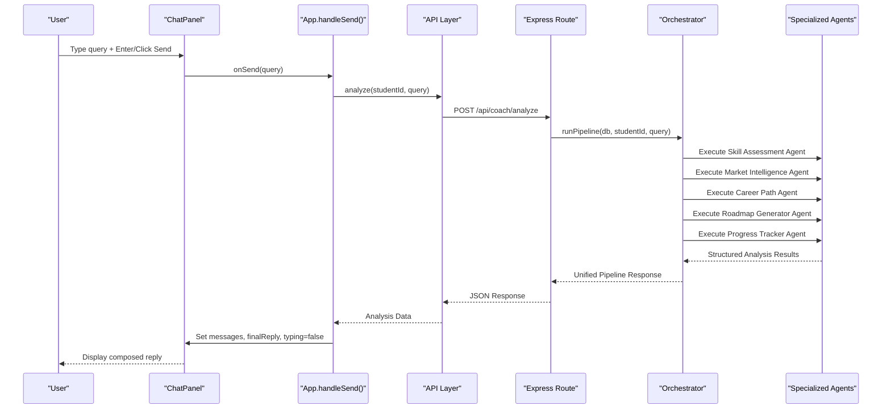
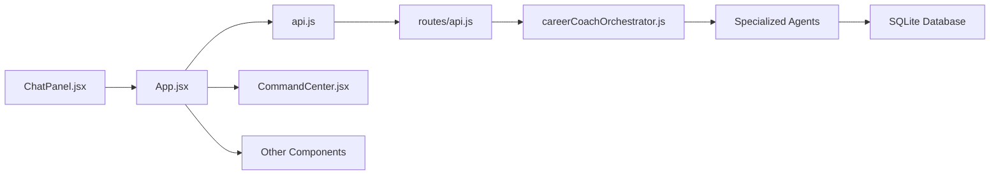

# AI Career Coach Interface

<cite>
**Referenced Files in This Document**
- [careerCoachOrchestrator.js](file://agents/careerCoachOrchestrator.js)
- [ChatPanel.jsx](file://frontend/src/components/ChatPanel.jsx)
- [App.jsx](file://frontend/src/App.jsx)
- [api.js](file://frontend/src/api.js)
- [api.js](file://routes/api.js)
- [index.html](file://index.html)
</cite>

## Update Summary
**Changes Made**
- Updated architecture overview to reflect real multi-agent orchestration instead of simulated responses
- Replaced pre-programmed response system with backend API integration
- Added detailed analysis of the career coach orchestrator and specialized agents
- Updated chat flow examples to show real-time pipeline execution
- Enhanced multi-agent system integration section with actual agent coordination
- Removed references to simulated chatResponses array and replaced with structured pipeline data

## Table of Contents
1. [Introduction](#introduction)
2. [Project Structure](#project-structure)
3. [Core Components](#core-components)
4. [Architecture Overview](#architecture-overview)
5. [Detailed Component Analysis](#detailed-component-analysis)
6. [Multi-Agent Orchestration System](#multi-agent-orchestration-system)
7. [Dependency Analysis](#dependency-analysis)
8. [Performance Considerations](#performance-considerations)
9. [Troubleshooting Guide](#troubleshooting-guide)
10. [Conclusion](#conclusion)

## Introduction
This document explains the conversational experience and AI-powered responses for the AI Career Coach chat interface. The system now uses a sophisticated multi-agent orchestration system that coordinates specialized agents (Skill Assessment, Market Intelligence, Career Path, Roadmap Generator, Progress Tracker) to provide genuine, data-driven career guidance instead of pre-programmed responses. The chat interface captures user queries, displays real-time typing indicators during pipeline execution, and presents synthesized recommendations based on actual student profiles and market data.

## Project Structure
The application consists of a React frontend with a modern chat interface and a Node.js backend with a multi-agent orchestration system:
- **Frontend**: React components with ChatPanel for messaging, App.jsx for state management and API calls
- **Backend**: Express routes coordinating the career coach orchestrator
- **Agents**: Specialized agents for different aspects of career analysis
- **Database**: SQLite storage for student profiles, skills, and progress tracking

**Diagram sources**
- [App.jsx:172-238](file://frontend/src/App.jsx#L172-L238)
- [api.js:33-41](file://frontend/src/api.js#L33-L41)
- [api.js:118-142](file://routes/api.js#L118-L142)
- [careerCoachOrchestrator.js:210-336](file://agents/careerCoachOrchestrator.js#L210-L336)

**Section sources**
- [ChatPanel.jsx:1-187](file://frontend/src/components/ChatPanel.jsx#L1-L187)
- [App.jsx:1-388](file://frontend/src/App.jsx#L1-L388)
- [careerCoachOrchestrator.js:1-337](file://agents/careerCoachOrchestrator.js#L1-L337)

## Core Components
- **Chat Panel**: Modern React component with message history, typing indicators, and suggested questions
- **Message Handling**: Real-time user input processing with Enter key support and Send button
- **Response Display**: Dynamic rendering of structured pipeline results with bilingual support
- **Typing Indicator**: Animated dots during multi-agent pipeline execution
- **Suggested Questions**: Predefined career paths that trigger full pipeline analysis
- **Multi-Agent Integration**: Backend orchestration coordinating specialized agents for genuine analysis

Key responsibilities:
- Capture and validate user input
- Send requests to multi-agent pipeline
- Display real-time typing indicators during processing
- Render structured analysis results as natural language
- Maintain conversation history and scroll position

**Section sources**
- [ChatPanel.jsx:18-23](file://frontend/src/components/ChatPanel.jsx#L18-L23)
- [App.jsx:172-238](file://frontend/src/App.jsx#L172-L238)

## Architecture Overview
The chat flow is now event-driven with real backend orchestration:
- User triggers message submission via Enter or button click
- Frontend sends request to `/api/coach/analyze` endpoint
- Backend orchestrator coordinates multiple specialized agents
- Each agent performs genuine analysis using student data and market information
- Results are synthesized into a unified recommendation with bilingual support
- Frontend displays typing indicators during pipeline execution and final composed reply

**Diagram sources**
- [App.jsx:172-238](file://frontend/src/App.jsx#L172-L238)
- [api.js:33-41](file://frontend/src/api.js#L33-L41)
- [api.js:118-142](file://routes/api.js#L118-L142)
- [careerCoachOrchestrator.js:210-336](file://agents/careerCoachOrchestrator.js#L210-L336)

## Detailed Component Analysis

### Chat Panel Implementation
- **Container**: Modern React component with smooth animations and responsive design
- **Message History**: Scrollable container with animated message appearance
- **Input Handling**: Text input with Enter key support and disabled state during processing
- **Typing Indicator**: Animated dots with "thinking" text during pipeline execution
- **Suggested Questions**: Three predefined career paths that trigger full analysis
- **Bilingual Support**: Messages adapt to selected language (English/Urdu)

Styling highlights:
- Glass morphism effects with parchment backgrounds
- Gradient buttons and smooth transitions
- Custom scrollbar styling for dark theme compatibility
- Responsive design for mobile and desktop

**Section sources**
- [ChatPanel.jsx:25-187](file://frontend/src/components/ChatPanel.jsx#L25-L187)

### Message History and Dynamic Rendering
- **Message State**: Array of message objects with role, text, and error properties
- **Dynamic Rendering**: Map through messages array with motion animations
- **User vs Coach Styling**: Distinct visual treatment for user (gradient) vs coach (parchment) messages
- **Error Handling**: Special styling for error messages with red border
- **Auto-scroll**: Automatic scrolling to latest message using refs

Complexity:
- React state management ensures efficient re-renders
- Motion library provides smooth animations without performance impact
- Memory efficient with proper cleanup of timers and state

**Section sources**
- [ChatPanel.jsx:64-96](file://frontend/src/components/ChatPanel.jsx#L64-L96)

### User Input Handling: handleSend()
- **Validation**: Checks for running state and valid student ID before processing
- **State Management**: Updates messages, sets typing indicator, resets command center
- **API Integration**: Calls analyze() function with student ID and query
- **Error Handling**: Catches network errors and displays user-friendly messages
- **Cleanup**: Clears timers and resets states in finally block

Edge cases:
- Prevents duplicate submissions during pipeline execution
- Handles student switching mid-pipeline by discarding stale results
- Manages memory leaks with proper timer cleanup

**Section sources**
- [App.jsx:172-238](file://frontend/src/App.jsx#L172-L238)

### Suggested Questions: Click Handlers
- **Predefined Queries**: Three career paths (AI/ML Engineer, Full Stack Web Developer, Data Analyst)
- **Event Binding**: onClick handlers that call onSend with predefined text
- **Disabled State**: Buttons disabled during pipeline execution to prevent conflicts
- **Visual Feedback**: Hover effects and active states for better UX

Behavioral note:
- Mirrors manual input handling to ensure consistent experience
- Triggers full multi-agent pipeline analysis for each suggestion

**Section sources**
- [ChatPanel.jsx:141-156](file://frontend/src/components/ChatPanel.jsx#L141-L156)

### Typing Indicator Animation
- **State Management**: Boolean typing state controls indicator visibility
- **Animation**: Framer Motion provides smooth fade-in/out with bouncing dots
- **Text Localization**: "Thinking" text adapts to selected language
- **Timing**: Shows during entire pipeline execution for realistic feedback

Animation details:
- Three animated dots with staggered delays for natural motion
- Smooth opacity transitions for appearance/disappearance
- Consistent timing across all animation phases

**Section sources**
- [ChatPanel.jsx:118-138](file://frontend/src/components/ChatPanel.jsx#L118-L138)

### Multi-Agent System Integration and References
- **Backend Orchestration**: Career Coach Orchestrator coordinates five specialized agents
- **Agent Roles**: 
  - Skill Assessment Agent evaluates strengths and gaps
  - Market Intelligence Agent analyzes local and remote demand
  - Career Path Agent determines optimal career trajectory
  - Roadmap Generator creates actionable weekly plans
  - Progress Tracker monitors completion and readiness scores
- **Data Flow**: Sequential agent execution with shared context
- **Result Synthesis**: Unified recommendation combining all agent outputs

Conceptual mapping:
- Chat responses synthesize outputs from specialized agents
- Each agent contributes specific expertise to the final recommendation
- Pipeline execution provides transparent progress visualization

**Section sources**
- [careerCoachOrchestrator.js:210-336](file://agents/careerCoachOrchestrator.js#L210-L336)
- [App.jsx:48-60](file://frontend/src/App.jsx#L48-L60)

### Chat Flow Examples
- **Example 1: Manual Input**
  - User types career question and presses Enter
  - handleSend() validates input and calls analyze() API
  - Typing indicator shows during pipeline execution
  - Final composed reply displays structured analysis results
- **Example 2: Suggested Question**
  - User clicks predefined career path button
  - Same pipeline execution as manual input
  - Consistent UX across interaction methods
- **Example 3: Error Handling**
  - Network failures display user-friendly error messages
  - Pipeline errors caught and logged appropriately
  - Graceful degradation when backend is unavailable

Timing behavior:
- Pipeline execution time varies based on database queries and agent complexity
- Typing indicator provides continuous feedback during processing
- Auto-scroll ensures latest content remains visible

**Section sources**
- [App.jsx:172-238](file://frontend/src/App.jsx#L172-L238)
- [ChatPanel.jsx:18-23](file://frontend/src/components/ChatPanel.jsx#L18-L23)

## Multi-Agent Orchestration System

### Career Coach Orchestrator
The orchestrator serves as the central coordination layer that manages the entire analysis pipeline:

**Core Responsibilities:**
- Student profile retrieval and validation
- Career target resolution from free-text queries
- Sequential agent execution with error handling
- Result synthesis and bilingual recommendation generation
- Database updates for readiness scores and progress tracking

**Target Resolution Logic:**
- Comparison query detection (e.g., "AI/ML vs Web")
- Exact match prioritization for specific roles
- Partial matching with weighted keyword scoring
- Fallback to student interests when no match found

**Section sources**
- [careerCoachOrchestrator.js:47-159](file://agents/careerCoachOrchestrator.js#L47-L159)

### Specialized Agent Coordination
Each agent performs specific analysis tasks:

**Skill Assessment Agent:**
- Evaluates student skills against target role requirements
- Calculates match percentage and identifies skill gaps
- Provides strength analysis and improvement recommendations

**Market Intelligence Agent:**
- Analyzes local and remote job market demand
- Tracks growth trends and salary expectations
- Provides geographic opportunity insights

**Career Path Agent:**
- Determines optimal career trajectory based on skills and market data
- Identifies milestone achievements and progression steps
- Recommends educational and certification pathways

**Roadmap Generator Agent:**
- Creates 4-week actionable plans with specific tasks
- Generates portfolio project recommendations
- Integrates with progress tracking system

**Progress Tracker Agent:**
- Monitors task completion and calculates readiness scores
- Updates student profiles with current status
- Provides progress visualization and motivation

**Section sources**
- [careerCoachOrchestrator.js:240-296](file://agents/careerCoachOrchestrator.js#L240-L296)

### API Integration Layer
The frontend communicates with the backend through a clean API layer:

**Analysis Endpoint:**
- POST `/api/coach/analyze` accepts student ID and query
- Returns structured pipeline results with agent logs
- Handles validation and error responses consistently

**Progress Management:**
- Task toggling recalculates readiness scores
- Optimistic updates provide immediate feedback
- Server synchronization ensures data consistency

**Section sources**
- [api.js:33-41](file://frontend/src/api.js#L33-L41)
- [api.js:44-52](file://frontend/src/api.js#L44-L52)
- [api.js:118-142](file://routes/api.js#L118-L142)

## Dependency Analysis
Internal dependencies:
- ChatPanel depends on App.jsx for state management and API calls
- App.jsx orchestrates the entire pipeline execution and result composition
- API layer abstracts backend communication with error handling
- Backend routes coordinate the career coach orchestrator
- Orchestrator manages specialized agent execution and result synthesis

External dependencies:
- React ecosystem (useState, useEffect, useRef) for state management
- Framer Motion for smooth animations and transitions
- Lucide React for iconography
- Express.js for backend routing
- SQLite for data persistence

Coupling and cohesion:
- High cohesion within React components with clear separation of concerns
- Low coupling between frontend and backend through REST API
- Clear separation between orchestration logic and individual agent implementations
- Modular architecture allows easy extension with new agents

Potential issues:
- Network failures handled gracefully with user-friendly error messages
- Memory management through proper timer cleanup and state disposal
- Race conditions prevented with student ID validation and ref guards

**Diagram sources**
- [ChatPanel.jsx:1-187](file://frontend/src/components/ChatPanel.jsx#L1-L187)
- [App.jsx:1-388](file://frontend/src/App.jsx#L1-L388)
- [api.js:1-64](file://frontend/src/api.js#L1-L64)
- [api.js:1-176](file://routes/api.js#L1-L176)
- [careerCoachOrchestrator.js:1-337](file://agents/careerCoachOrchestrator.js#L1-L337)

**Section sources**
- [App.jsx:1-388](file://frontend/src/App.jsx#L1-L388)
- [api.js:1-64](file://frontend/src/api.js#L1-L64)

## Performance Considerations
- **React Optimization**: Efficient state management with proper dependency arrays and memoization
- **Memory Management**: Timer cleanup prevents memory leaks during component lifecycle
- **Network Efficiency**: Single API call per analysis reduces server load
- **Animation Performance**: CSS transforms and GPU acceleration for smooth animations
- **Database Queries**: Optimized SQL queries with proper indexing considerations
- **Error Handling**: Graceful degradation when backend services are unavailable

Scalability considerations:
- Pipeline execution time increases with more complex queries
- Database connection pooling for concurrent requests
- Potential for caching frequently accessed student data
- Load balancing considerations for high-traffic scenarios

## Troubleshooting Guide
Common issues and resolutions:
- **Messages not appearing**:
  - Verify API endpoint connectivity and CORS configuration
  - Check browser console for network errors
  - Ensure proper error handling in catch blocks
- **Typing indicator not removing**:
  - Confirm finally block executes properly
  - Check for unhandled promise rejections
  - Verify component unmount cleanup
- **Pipeline execution fails**:
  - Validate student ID format and existence
  - Check database connectivity and schema
  - Review agent-specific error logs
- **Results not displaying**:
  - Verify composeReply function receives proper data structure
  - Check language context for translation keys
  - Ensure proper state updates in React components
- **Performance issues**:
  - Monitor network request times and optimize slow endpoints
  - Check for unnecessary re-renders in React components
  - Profile database query performance

**Section sources**
- [App.jsx:172-238](file://frontend/src/App.jsx#L172-L238)
- [api.js:7-20](file://frontend/src/api.js#L7-L20)

## Conclusion
The AI Career Coach chat interface has evolved from a simple simulated response system to a sophisticated multi-agent orchestration platform. The new architecture provides genuine, data-driven career guidance through coordinated specialized agents that analyze student profiles, market conditions, and career trajectories. The React frontend delivers a polished user experience with real-time feedback, while the backend ensures reliable analysis through robust error handling and database integration. Future enhancements could include additional agent specializations, enhanced analytics dashboards, and expanded language support for global accessibility.