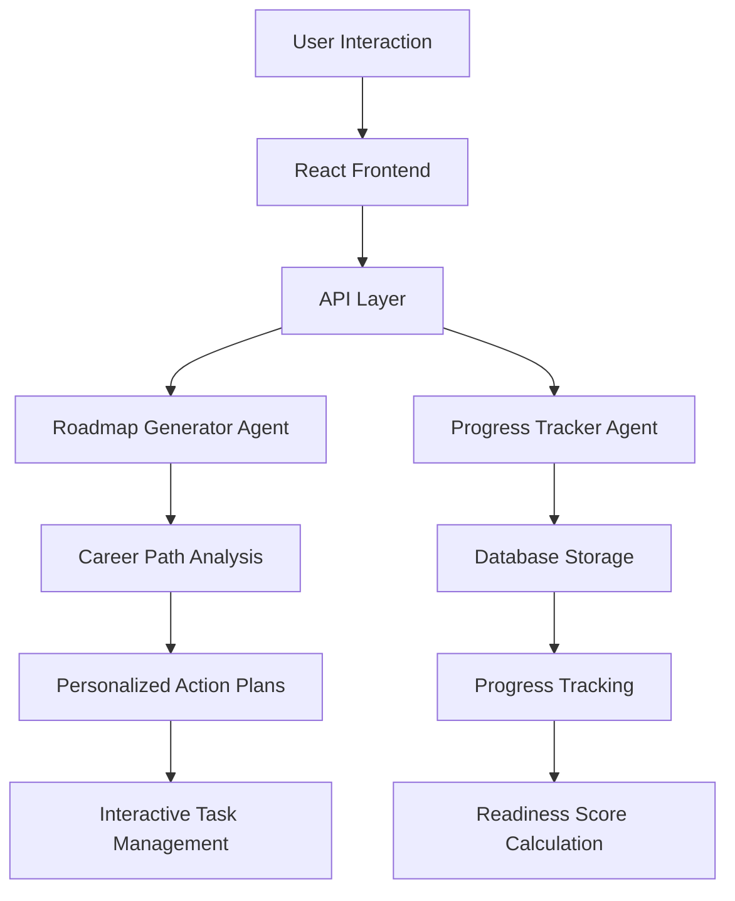
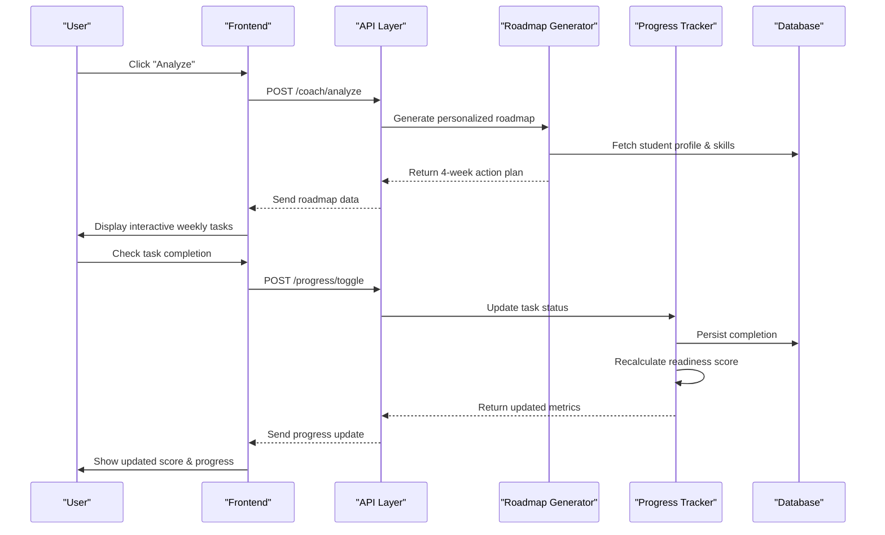
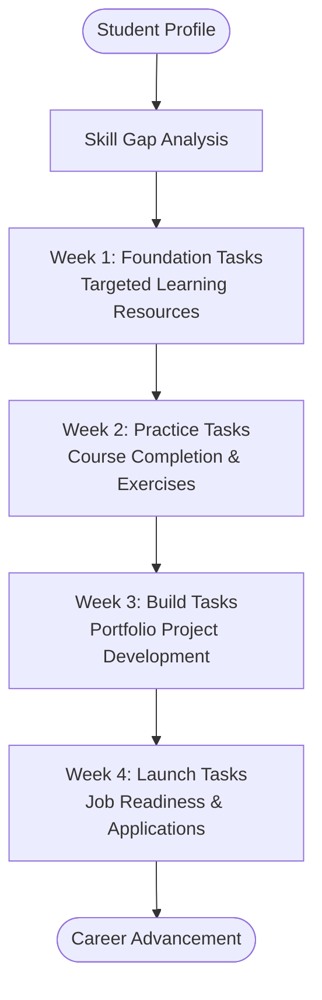
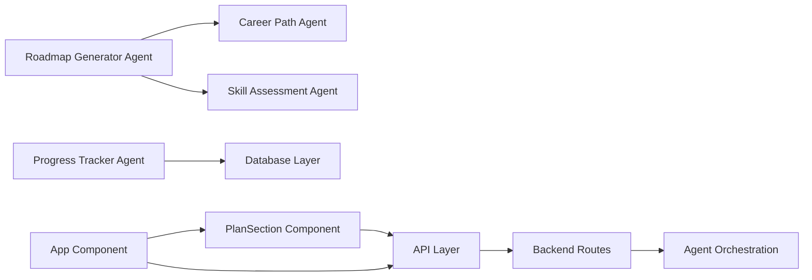

# Action Planning System

<cite>
**Referenced Files in This Document**
- [roadmapGeneratorAgent.js](file://agents/roadmapGeneratorAgent.js)
- [progressTrackerAgent.js](file://agents/progressTrackerAgent.js)
- [PlanSection.jsx](file://frontend/src/components/PlanSection.jsx)
- [api.js](file://routes/api.js)
- [App.jsx](file://frontend/src/App.jsx)
- [api.js](file://frontend/src/api.js)
</cite>

## Update Summary
**Changes Made**
- Updated action plan generation from static HTML to dynamic agent-based system
- Added comprehensive progress tracking with readiness score calculation
- Integrated portfolio project recommendations based on career paths
- Enhanced API endpoints for task management and progress tracking
- Updated frontend components to support dynamic action plans

## Table of Contents
1. [Introduction](#introduction)
2. [Project Structure](#project-structure)
3. [Core Components](#core-components)
4. [Architecture Overview](#architecture-overview)
5. [Detailed Component Analysis](#detailed-component-analysis)
6. [Dependency Analysis](#dependency-analysis)
7. [Performance Considerations](#performance-considerations)
8. [Troubleshooting Guide](#troubleshooting-guide)
9. [Conclusion](#conclusion)
10. [Appendices](#appendices)

## Introduction
This document explains the dynamic 4-week action planning system that generates personalized learning roadmaps through a multi-agent pipeline. The system creates tailored weekly tasks, portfolio project recommendations, and tracks progress with a readiness score calculation. It integrates skills gap analysis, market insights, and provides actionable steps for career advancement through an interactive web interface.

## Project Structure
The application consists of backend agents for intelligent action plan generation and a React frontend for interactive task management:

**Backend Agents:**
- Roadmap Generator Agent: Creates personalized 4-week action plans based on career paths and skill gaps
- Progress Tracker Agent: Manages task completion and calculates readiness scores
- Career Path Agent: Determines optimal career trajectory
- Market Intelligence Agent: Analyzes job market conditions

**Frontend Components:**
- PlanSection: Displays dynamic weekly tasks with interactive checkboxes
- App: Orchestrates the entire user experience and state management
- API Layer: Handles communication between frontend and backend services



**Diagram sources**
- [roadmapGeneratorAgent.js:156-181](file://agents/roadmapGeneratorAgent.js#L156-L181)
- [progressTrackerAgent.js:30-43](file://agents/progressTrackerAgent.js#L30-L43)
- [PlanSection.jsx:12-163](file://frontend/src/components/PlanSection.jsx#L12-L163)
- [App.jsx:240-278](file://frontend/src/App.jsx#L240-L278)

**Section sources**
- [roadmapGeneratorAgent.js:1-181](file://agents/roadmapGeneratorAgent.js#L1-L181)
- [progressTrackerAgent.js:1-134](file://agents/progressTrackerAgent.js#L1-L134)
- [PlanSection.jsx:1-163](file://frontend/src/components/PlanSection.jsx#L1-L163)

## Core Components
- **Dynamic Action Plan Generation**: Personalized 4-week plans created by roadmapGeneratorAgent.js based on career path and skill gaps
- **Progress Tracking System**: Real-time task completion tracking with readiness score calculation via progressTrackerAgent.js
- **Portfolio Project Recommendations**: Contextual project suggestions aligned with career goals and skill development
- **Interactive Task Management**: React-based UI with optimistic updates and server synchronization
- **Multi-Agent Pipeline Integration**: Seamless coordination between career analysis, skill assessment, and action planning

**Updated** The system now generates dynamic action plans instead of using static HTML content, providing personalized learning experiences based on individual profiles and career goals.

**Section sources**
- [roadmapGeneratorAgent.js:95-140](file://agents/roadmapGeneratorAgent.js#L95-L140)
- [progressTrackerAgent.js:64-134](file://agents/progressTrackerAgent.js#L64-L134)
- [PlanSection.jsx:57-110](file://frontend/src/components/PlanSection.jsx#L57-L110)

## Architecture Overview
The action planning system follows a multi-agent architecture where specialized agents collaborate to create personalized learning roadmaps:



**Diagram sources**
- [api.js:118-142](file://routes/api.js#L118-L142)
- [api.js:148-176](file://routes/api.js#L148-L176)
- [roadmapGeneratorAgent.js:156-181](file://agents/roadmapGeneratorAgent.js#L156-L181)
- [progressTrackerAgent.js:64-134](file://agents/progressTrackerAgent.js#L64-L134)

## Detailed Component Analysis

### Dynamic Action Plan Generation
The roadmapGeneratorAgent.js creates personalized 4-week action plans based on career paths and identified skill gaps:

**Week Structure:**
- **Week 1 (Foundation)**: Core skill building with targeted learning resources
- **Week 2 (Practice)**: Course completion and hands-on exercises
- **Week 3 (Build)**: Portfolio project development and deployment
- **Week 4 (Launch)**: Job readiness activities and applications

**Personalization Features:**
- Skill gap analysis drives specific learning objectives
- Career path determines portfolio project recommendations
- Resource mapping provides relevant learning materials
- Progressive difficulty scaling ensures appropriate challenge levels



**Diagram sources**
- [roadmapGeneratorAgent.js:95-140](file://agents/roadmapGeneratorAgent.js#L95-L140)
- [roadmapGeneratorAgent.js:164-169](file://agents/roadmapGeneratorAgent.js#L164-L169)

**Section sources**
- [roadmapGeneratorAgent.js:95-140](file://agents/roadmapGeneratorAgent.js#L95-L140)
- [roadmapGeneratorAgent.js:156-181](file://agents/roadmapGeneratorAgent.js#L156-L181)

### Progress Tracking and Readiness Scoring
The progressTrackerAgent.js manages task completion and calculates a deterministic readiness score using a weighted formula:

**Readiness Score Formula:**
```
Readiness = min(100, round(
  skillMatchPct * 0.50 +    // Skill alignment (max 50 pts)
  remoteDemandPct * 0.30 +  // Market demand (max 30 pts)  
  completedTasksRatio * 20  // Plan progress (max 20 pts)
))
```

**Key Features:**
- Real-time task status updates with database persistence
- Automatic readiness score recalculation on task completion
- Input validation and error handling for robust operation
- Comprehensive progress logging with timestamps

**Section sources**
- [progressTrackerAgent.js:30-43](file://agents/progressTrackerAgent.js#L30-L43)
- [progressTrackerAgent.js:64-134](file://agents/progressTrackerAgent.js#L64-L134)

### Interactive Task Management Interface
The PlanSection component provides an intuitive interface for managing weekly tasks with real-time feedback:

**UI Features:**
- Responsive grid layout adapting from mobile to desktop views
- Visual week indicators with accent colors and focus area badges
- Interactive checkboxes with strikethrough effect for completed tasks
- Portfolio project display with technology stack and impact ratings
- Optimistic updates with server synchronization

**Accessibility:**
- Semantic HTML structure with proper label associations
- Keyboard navigation support for all interactive elements
- Screen reader compatibility with descriptive text
- High contrast color scheme for better visibility

**Section sources**
- [PlanSection.jsx:57-110](file://frontend/src/components/PlanSection.jsx#L57-L110)
- [PlanSection.jsx:112-160](file://frontend/src/components/PlanSection.jsx#L112-L160)

### API Integration and State Management
The system integrates seamlessly with backend services through well-defined API endpoints:

**API Endpoints:**
- `POST /api/coach/analyze`: Runs full multi-agent pipeline
- `POST /api/progress/toggle`: Updates task status and recalculates readiness
- `GET /api/students/:id`: Retrieves student profile with progress data

**State Management:**
- Optimistic UI updates for immediate user feedback
- Error handling with rollback capabilities
- Loading states and progress indicators
- Cross-component state synchronization

**Section sources**
- [api.js:118-176](file://routes/api.js#L118-L176)
- [App.jsx:240-278](file://frontend/src/App.jsx#L240-L278)
- [api.js:32-52](file://frontend/src/api.js#L32-L52)

### Portfolio Project Recommendations
The system provides contextual portfolio project suggestions based on career paths:

**Project Templates:**
- **AI/ML Engineer**: Spam Email Classifier using Scikit-Learn
- **Full Stack Web Developer**: TaskFlow — Real-time Task Manager  
- **Data Analyst**: Pakistan Job Market Dashboard
- **Computer Science Foundation**: Algorithm Visualizer
- **Data Analytics Entry**: Student Grade Analyzer

**Recommendation Logic:**
- Career path determines project type and complexity
- Technology stack aligns with target role requirements
- Estimated duration and impact ratings guide prioritization
- Description includes implementation details and learning outcomes

**Section sources**
- [roadmapGeneratorAgent.js:13-49](file://agents/roadmapGeneratorAgent.js#L13-L49)
- [PlanSection.jsx:112-160](file://frontend/src/components/PlanSection.jsx#L112-L160)

## Dependency Analysis
The action planning system has clear dependency relationships between components:



**Key Dependencies:**
- **Frontend Dependencies**: React, Framer Motion for animations, Tailwind CSS for styling
- **Backend Dependencies**: Express.js for API routing, SQLite for data persistence
- **Agent Dependencies**: Multi-agent orchestration with shared state management
- **Integration Points**: Well-defined API contracts between frontend and backend

**Section sources**
- [roadmapGeneratorAgent.js:1-10](file://agents/roadmapGeneratorAgent.js#L1-L10)
- [progressTrackerAgent.js:1-20](file://agents/progressTrackerAgent.js#L1-L20)
- [PlanSection.jsx:1-4](file://frontend/src/components/PlanSection.jsx#L1-L4)

## Performance Considerations
- **Optimistic Updates**: Immediate UI feedback without waiting for server responses
- **Efficient State Management**: Minimal re-renders through careful state updates
- **Database Optimization**: Indexed queries for fast progress retrieval
- **Memory Management**: Proper cleanup of timers and event listeners
- **Network Efficiency**: Batched API calls and efficient data serialization

## Troubleshooting Guide
- **Action Plan Not Loading**: Verify backend service connectivity and check API endpoint responses
- **Task Toggle Issues**: Ensure proper task ID format and validate database connections
- **Readiness Score Not Updating**: Check progress tracker logic and database write operations
- **Portfolio Projects Missing**: Verify career path selection and portfolio project template availability
- **UI Rendering Issues**: Confirm proper data structure from API responses and component props

**Section sources**
- [progressTrackerAgent.js:64-88](file://agents/progressTrackerAgent.js#L64-L88)
- [App.jsx:240-278](file://frontend/src/App.jsx#L240-L278)

## Conclusion
The dynamic action planning system represents a significant evolution from static HTML-based planning to an intelligent, personalized learning experience. Through the integration of multiple AI agents, real-time progress tracking, and interactive user interfaces, the system provides comprehensive career advancement support. The modular architecture ensures scalability and maintainability while delivering a seamless user experience across devices and use cases.

## Appendices

### Appendix A: Weekly Task Structure
Each week contains four structured tasks with specific learning objectives:

**Week 1 - Foundation:**
- Targeted skill learning with curated resources
- Career path overview and goal setting
- Industry report analysis and trend identification

**Week 2 - Practice:**
- Free course completion on core skills
- Hands-on problem solving and coding challenges
- Mini-project development combining multiple skills

**Week 3 - Build:**
- Portfolio project scaffolding and setup
- Core feature implementation and testing
- Deployment preparation and documentation

**Week 4 - Launch:**
- Professional profile optimization
- Technical blog post creation
- Job application strategy and interview preparation

**Section sources**
- [roadmapGeneratorAgent.js:95-140](file://agents/roadmapGeneratorAgent.js#L95-L140)

### Appendix B: Readiness Score Calculation
The readiness score algorithm combines multiple factors to provide a comprehensive career readiness assessment:

**Score Components:**
- **Skill Match (50% weight)**: Alignment between current skills and target role requirements
- **Market Demand (30% weight)**: Current job market conditions and opportunities
- **Plan Progress (20% weight)**: Completion rate of recommended action items

**Calculation Process:**
- Input validation and range clamping for all parameters
- Weighted sum calculation with maximum cap at 100 points
- Deterministic output ensuring consistent scoring across runs

**Section sources**
- [progressTrackerAgent.js:30-43](file://agents/progressTrackerAgent.js#L30-L43)

### Appendix C: API Endpoint Reference
Comprehensive reference for all action planning related API endpoints:

**Analysis Endpoints:**
- `POST /api/coach/analyze`: Execute full multi-agent pipeline
- `GET /api/students/:id`: Retrieve student profile with progress data

**Progress Management:**
- `POST /api/progress/toggle`: Update task status and recalculate readiness
- `PATCH /api/students/:id`: Modify student profile information

**Response Formats:**
- Standardized JSON response structures
- Error handling with descriptive messages
- Progress tracking with timestamped entries

**Section sources**
- [api.js:118-176](file://routes/api.js#L118-L176)
- [api.js:27-112](file://routes/api.js#L27-L112)