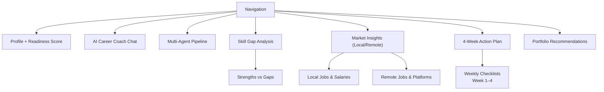
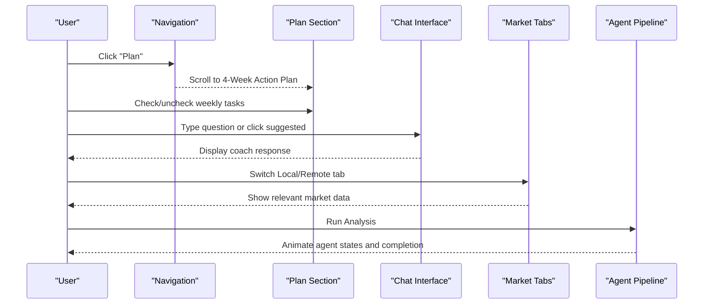
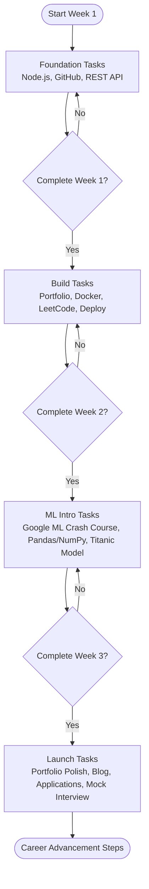
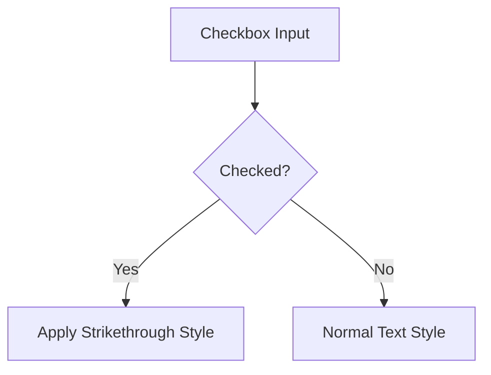
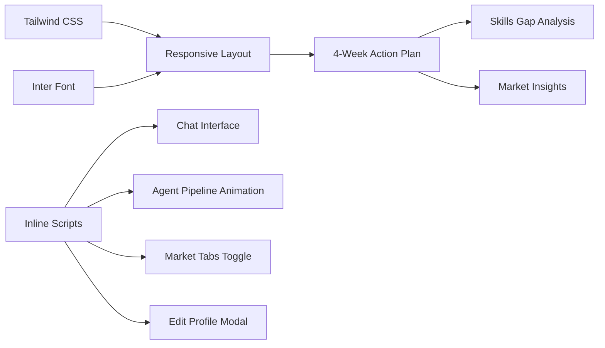

# Action Planning System

<cite>
**Referenced Files in This Document**
- [index.html](file://index.html)
</cite>

## Table of Contents
1. [Introduction](#introduction)
2. [Project Structure](#project-structure)
3. [Core Components](#core-components)
4. [Architecture Overview](#architecture-overview)
5. [Detailed Component Analysis](#detailed-component-analysis)
6. [Dependency Analysis](#dependency-analysis)
7. [Performance Considerations](#performance-considerations)
8. [Troubleshooting Guide](#troubleshooting-guide)
9. [Conclusion](#conclusion)
10. [Appendices](#appendices)

## Introduction
This document explains the 4-week action planning system embedded in a single-page web application designed to guide career advancement through structured learning and task management. The plan progresses from foundational skills (Week 1) to building projects (Week 2), introducing machine learning concepts (Week 3), and launching into job preparation (Week 4). It integrates with a skills gap analysis, provides actionable steps for career growth, and uses a responsive grid layout that adapts from mobile to desktop views.

## Project Structure
The application is implemented as a single HTML file with embedded CSS and JavaScript. Key sections include:
- Navigation bar with links to Profile, Coach, Agents, Skills, Market, and Plan
- Hero/Profile section showing education, current skills, interests, and career goal
- AI Career Coach chat interface with suggested questions and message handling
- Multi-Agent Pipeline visualization with animated agent states
- Skill Gap Analysis comparing strengths and gaps
- Pakistan Job Market Insights with Local and Remote tabs
- 4-Week Action Plan with weekly checklists and visual indicators
- Portfolio Project Recommendations
- Footer and Edit Profile modal

**Diagram sources**
- [index.html:47-70](file://index.html#L47-L70)
- [index.html:74-170](file://index.html#L74-L170)
- [index.html:172-226](file://index.html#L172-L226)
- [index.html:228-281](file://index.html#L228-L281)
- [index.html:283-313](file://index.html#L283-L313)
- [index.html:315-390](file://index.html#L315-L390)
- [index.html:392-458](file://index.html#L392-L458)
- [index.html:460-516](file://index.html#L460-L516)

**Section sources**
- [index.html:1-70](file://index.html#L1-L70)
- [index.html:72-527](file://index.html#L72-L527)

## Core Components
- 4-Week Action Plan: Structured weekly tasks with checkboxes and visual week navigation indicating the current week.
- Checklist Implementation: HTML checkboxes styled via .checklist-item CSS class; checked items display strikethrough effect.
- Week Navigation: Visual indicators highlight the current week (Week 1 highlighted with brand border) and show focus areas per week.
- Responsive Grid Layout: Uses Tailwind utility classes to adapt from mobile to desktop views across all sections.
- Skills Gap Integration: Strengths and gaps inform personalized weekly tasks and project recommendations.
- Market Insights: Local and remote job market data guide practical steps for job applications and skill focus.

**Section sources**
- [index.html:392-458](file://index.html#L392-L458)
- [index.html:283-313](file://index.html#L283-L313)
- [index.html:315-390](file://index.html#L315-L390)
- [index.html:22-43](file://index.html#L22-L43)

## Architecture Overview
The page is organized into modular sections that communicate through user interactions and lightweight JavaScript behaviors:
- Navigation anchors link to sections for quick access
- Chat interface handles messages and displays coach responses
- Pipeline animation sequentially highlights agents to simulate analysis flow
- Tabs toggle between local and remote market insights
- Modal toggles profile editing state

**Diagram sources**
- [index.html:47-70](file://index.html#L47-L70)
- [index.html:172-226](file://index.html#L172-L226)
- [index.html:315-390](file://index.html#L315-L390)
- [index.html:228-281](file://index.html#L228-L281)
- [index.html:392-458](file://index.html#L392-L458)

## Detailed Component Analysis

### 4-Week Action Plan
- Week 1 (Foundation): Node.js crash course, GitHub setup, REST API building, industry report reading.
- Week 2 (Build): Portfolio project start, Docker basics, LeetCode practice, deployment.
- Week 3 (ML Intro): Google ML Crash Course half, Pandas/NumPy exercises, Titanic dataset model, LinkedIn update.
- Week 4 (Launch): Portfolio polish and deploy, technical blog post, job applications, mock interview scheduling.

Visual Indicators:
- Current week highlighted with brand border (Week 1)
- Each week card shows label and focus area
- Checkboxes implement progress tracking with strikethrough when checked

Progressive Difficulty Scaling:
- Foundation → Build → ML Intro → Launch
- Integrates with skills gaps to prioritize learning and project work
- Aligns with market insights to tailor job search strategy

**Diagram sources**
- [index.html:392-458](file://index.html#L392-L458)

**Section sources**
- [index.html:392-458](file://index.html#L392-L458)

### Checklist Implementation
- HTML structure: Each task is wrapped in a label with an input checkbox and a span describing the task.
- Styling: .checklist-item CSS class applies spacing and cursor behavior; checked inputs trigger strikethrough styling on the span text.
- Accessibility: Labels associate with inputs for keyboard and screen reader support.

**Diagram sources**
- [index.html:41-43](file://index.html#L41-L43)
- [index.html:411-456](file://index.html#L411-L456)

**Section sources**
- [index.html:41-43](file://index.html#L41-L43)
- [index.html:411-456](file://index.html#L411-L456)

### Week Navigation and Visual Indicators
- Current week indicator: Week 1 card has a brand-colored border to highlight active focus.
- Labels: Each week card includes a week number and focus area (Foundation, Build, ML Intro, Launch).
- Consistent layout: Cards are arranged in a responsive grid that stacks on mobile and expands on larger screens.

**Section sources**
- [index.html:404-458](file://index.html#L404-L458)

### Skills Gap Integration
- Strengths: JavaScript/ES6+, React.js, Python, SQL/Databases, Git/Version Control with percentage bars.
- Gaps: TensorFlow/PyTorch, Data Preprocessing/Pandas, Node.js/Express, Docker/DevOps Basics, System Design Basics with percentage bars.
- Impact: Weekly tasks target identified gaps (e.g., Node.js/Express in Week 1, Docker in Week 2, Pandas/NumPy in Week 3).

**Section sources**
- [index.html:283-313](file://index.html#L283-L313)

### Market Insights and Job Preparation
- Local market: Top demand roles, salary ranges, hiring hubs in Pakistan.
- Remote market: Global demand, salary ranges, platforms for Pakistani developers.
- Alignment: Week 4 launch tasks include applying to local and remote positions and scheduling mock interviews.

**Section sources**
- [index.html:315-390](file://index.html#L315-L390)

### Portfolio Project Recommendations
- Full Stack Task Manager: High impact, ~2 weeks, technologies include React, Node.js, MongoDB, Socket.io.
- ML Sentiment Analyzer: Medium-high impact, ~1.5 weeks, technologies include Python, Flask, NLTK, Scikit-learn.
- Pakistan Job Trends Dashboard: Medium impact, ~1 week, technologies include React, Chart.js, Python, API.

**Section sources**
- [index.html:460-516](file://index.html#L460-L516)

## Dependency Analysis
- UI Dependencies: Tailwind CSS via CDN for responsive design and styling utilities.
- Font Dependencies: Inter font family loaded from Google Fonts.
- JavaScript Behaviors: Inline scripts handle chat messaging, pipeline animation, tab switching, modal toggling, and score counter animation.
- Section Coupling: The Action Plan references skills gaps and market insights to contextualize tasks and job search activities.

**Diagram sources**
- [index.html:7-21](file://index.html#L7-L21)
- [index.html:565-681](file://index.html#L565-L681)
- [index.html:392-458](file://index.html#L392-L458)
- [index.html:283-313](file://index.html#L283-L313)
- [index.html:315-390](file://index.html#L315-L390)

**Section sources**
- [index.html:7-21](file://index.html#L7-L21)
- [index.html:565-681](file://index.html#L565-L681)

## Performance Considerations
- Single-file architecture reduces HTTP requests but increases initial load size; consider splitting CSS/JS for production.
- Animations use CSS keyframes and minimal DOM manipulation to maintain smoothness.
- Responsive grid leverages Tailwind utilities for efficient layout without heavy custom CSS.
- Avoid excessive reflows by batching DOM updates in chat and pipeline animations.

[No sources needed since this section provides general guidance]

## Troubleshooting Guide
- Chat not responding: Ensure the input field ID matches the script reference and that event listeners are attached correctly.
- Tab switching not working: Verify IDs for market-local and market-remote containers and that the switchTab function toggles hidden classes properly.
- Pipeline animation stuck: Confirm the interval logic clears correctly and button state resets after completion.
- Modal not closing: Check that close functions remove/add the hidden class on the modal container.
- Checklist strikethrough not applied: Ensure the .checklist-item CSS rule targets the correct sibling span and that input:checked selector is valid.

**Section sources**
- [index.html:565-681](file://index.html#L565-L681)
- [index.html:41-43](file://index.html#L41-L43)

## Conclusion
The 4-week action planning system provides a clear, progressive roadmap from foundational skills to job readiness. It integrates skills gap analysis, market insights, and portfolio recommendations to deliver actionable steps for career advancement. The checklist implementation offers intuitive progress tracking, while responsive design ensures usability across devices. By following the weekly tasks and leveraging the included resources, users can systematically build competencies and prepare for employment opportunities both locally and remotely.

[No sources needed since this section summarizes without analyzing specific files]

## Appendices

### Appendix A: Week-by-Week Focus Areas
- Week 1: Foundation — Node.js crash course, GitHub setup, REST API building, industry report reading.
- Week 2: Build — Portfolio project start, Docker basics, LeetCode practice, deployment.
- Week 3: ML Intro — Google ML Crash Course half, Pandas/NumPy exercises, Titanic dataset model, LinkedIn update.
- Week 4: Launch — Portfolio polish and deploy, technical blog post, job applications, mock interview scheduling.

**Section sources**
- [index.html:404-458](file://index.html#L404-L458)

### Appendix B: Checklist Styling Details
- Class: .checklist-item
- Behavior: Checked inputs apply strikethrough to associated span text
- Visual consistency: Accent color for checkboxes aligns with brand palette

**Section sources**
- [index.html:41-43](file://index.html#L41-L43)