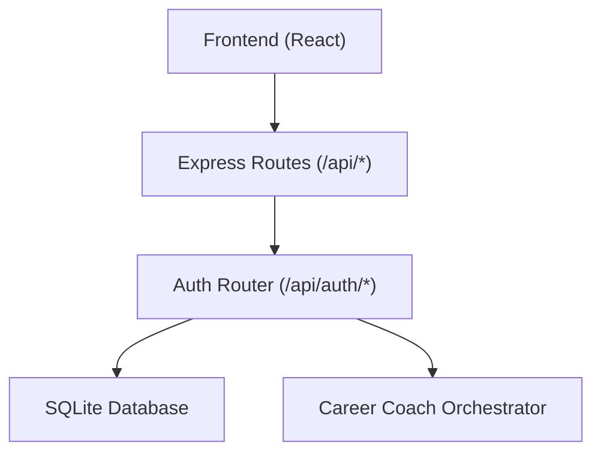
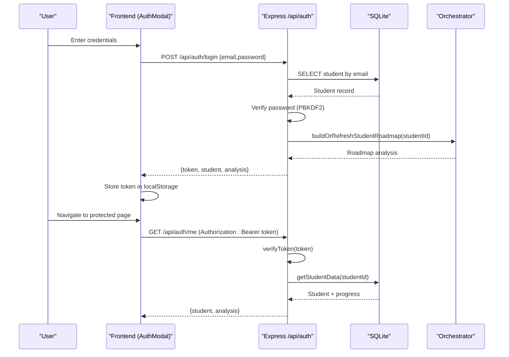
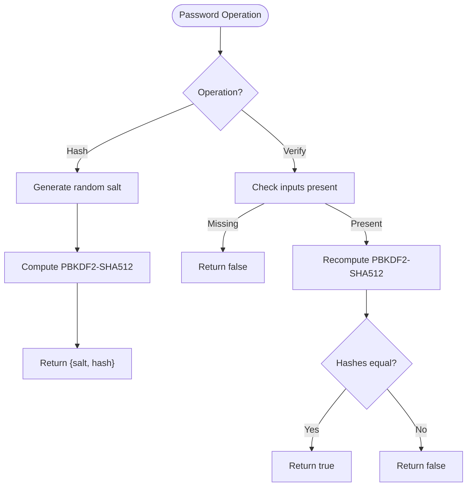
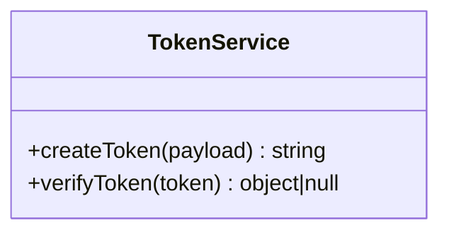
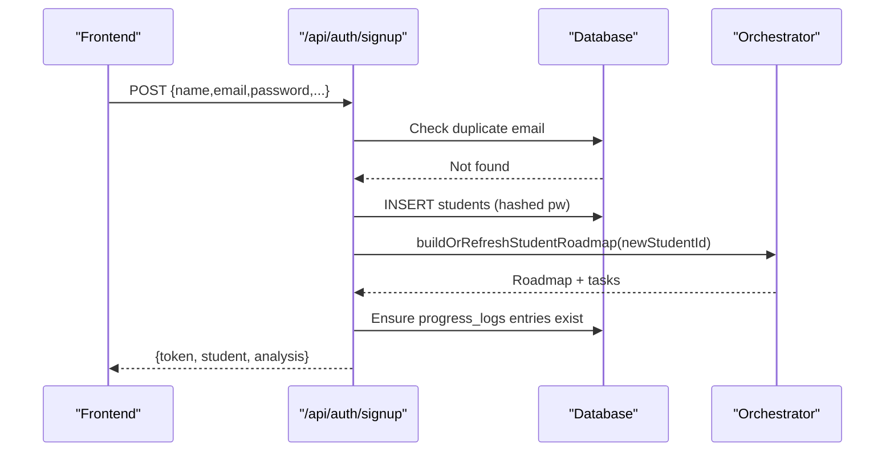
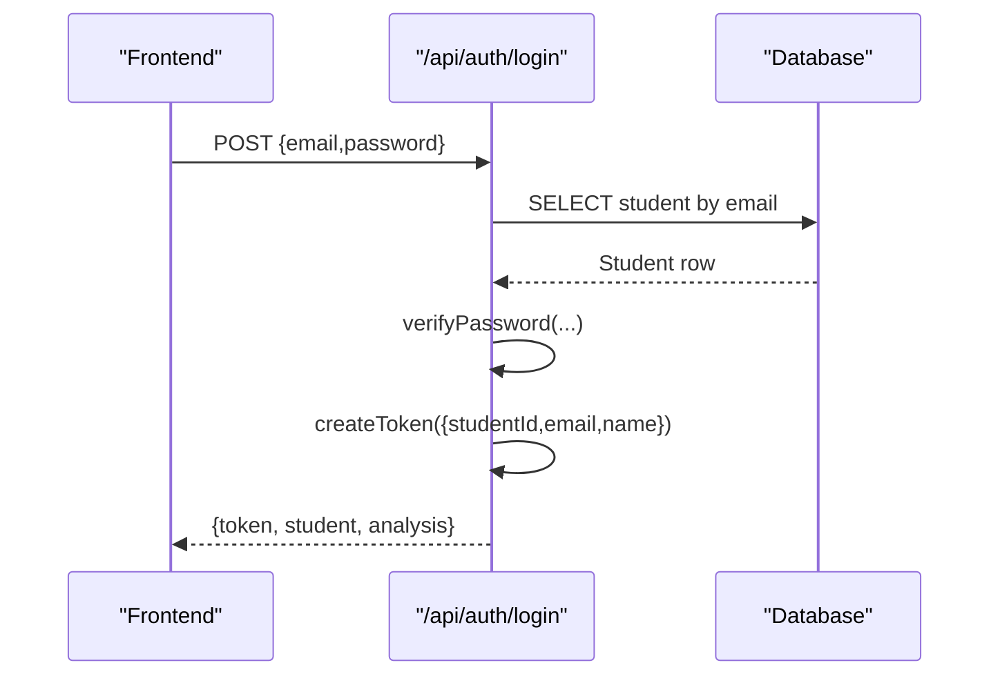
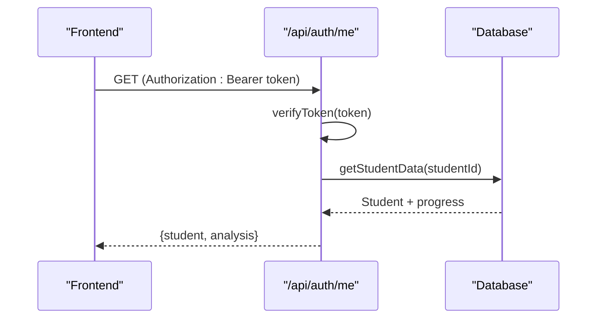
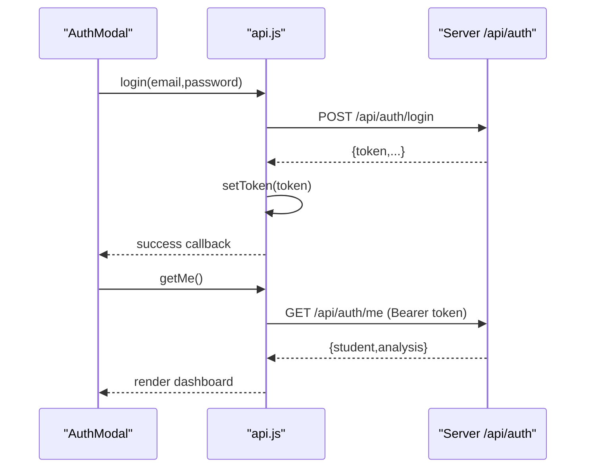
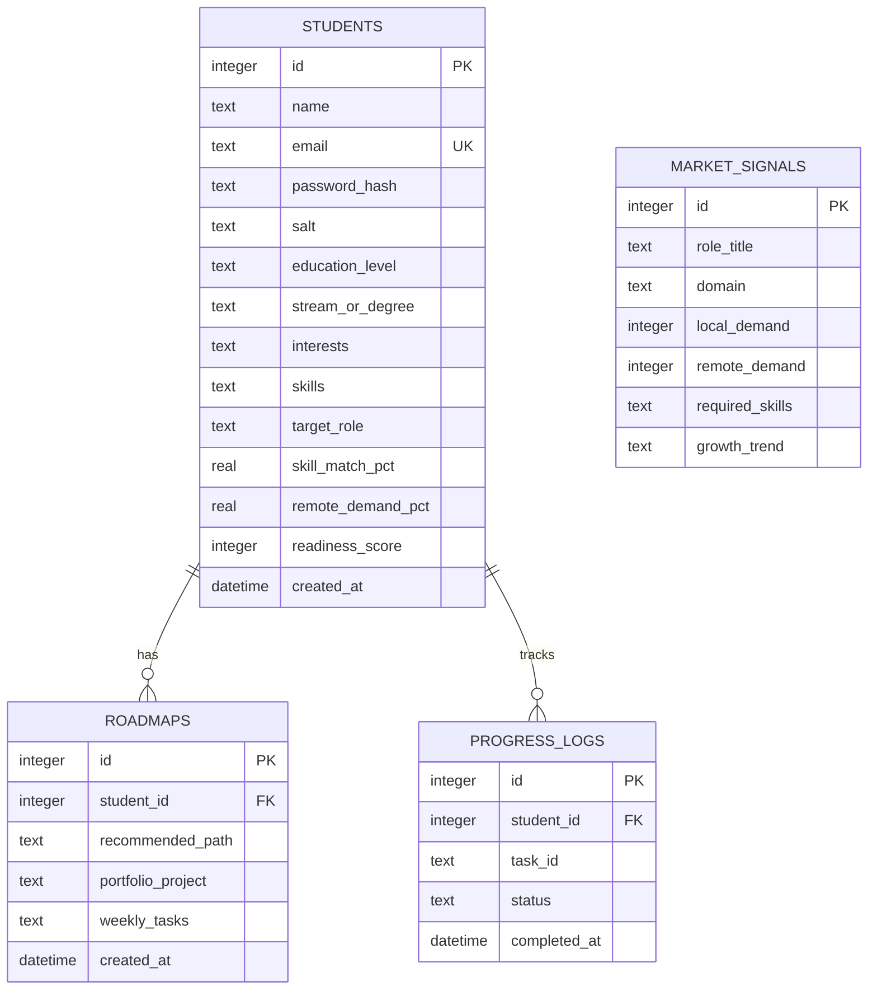
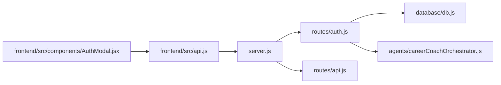

# Authentication System

<cite>
**Referenced Files in This Document**
- [server.js](file://server.js)
- [routes/auth.js](file://routes/auth.js)
- [database/db.js](file://database/db.js)
- [frontend/src/api.js](file://frontend/src/api.js)
- [frontend/src/components/AuthModal.jsx](file://frontend/src/components/AuthModal.jsx)
- [routes/api.js](file://routes/api.js)
- [database/seed.js](file://database/seed.js)
</cite>

## Table of Contents
1. [Introduction](#introduction)
2. [Project Structure](#project-structure)
3. [Core Components](#core-components)
4. [Architecture Overview](#architecture-overview)
5. [Detailed Component Analysis](#detailed-component-analysis)
6. [Dependency Analysis](#dependency-analysis)
7. [Performance Considerations](#performance-considerations)
8. [Troubleshooting Guide](#troubleshooting-guide)
9. [Conclusion](#conclusion)

## Introduction
This document explains the Authentication System for the CareerCompass application. It covers how users sign up, log in, and maintain authenticated sessions using a stateless token mechanism. It also documents how the frontend integrates with the backend to manage tokens and protected endpoints, and how user data is persisted securely in a SQLite database.

## Project Structure
The authentication system spans both server and client:
- Server-side Express routes handle signup, login, session retrieval, and logout.
- A custom lightweight JWT-like token scheme is used for stateless authentication.
- The database layer persists student records, progress logs, and roadmap data.
- The React frontend provides an interactive modal for login/signup and manages token storage and API calls.

**Diagram sources**
- [server.js:14-25](file://server.js#L14-L25)
- [routes/auth.js:1-6](file://routes/auth.js#L1-L6)
- [database/db.js:59-140](file://database/db.js#L59-L140)

**Section sources**
- [server.js:14-25](file://server.js#L14-L25)

## Core Components
- Auth Router: Implements signup, login, session retrieval, and logout; includes password hashing, verification, and token creation/verification.
- Database Layer: Initializes schema, provides query helpers, and persists changes to disk.
- Frontend API Client: Wraps fetch calls, stores/retrieves tokens from localStorage, and attaches Authorization headers.
- Auth Modal: User-facing form for login/signup with validation and demo accounts.

Key responsibilities:
- Securely store passwords using PBKDF2 with random salt.
- Issue short-lived, HMAC-signed tokens for stateless auth.
- Validate tokens on protected endpoints.
- Persist user profiles and progress data.

**Section sources**
- [routes/auth.js:11-61](file://routes/auth.js#L11-L61)
- [database/db.js:33-53](file://database/db.js#L33-L53)
- [frontend/src/api.js:3-12](file://frontend/src/api.js#L3-L12)
- [frontend/src/components/AuthModal.jsx:85-194](file://frontend/src/components/AuthModal.jsx#L85-L194)

## Architecture Overview
The authentication flow uses a stateless token approach:
- On successful signup or login, the server issues a signed token containing minimal user identity.
- The frontend stores the token and sends it via Authorization header for subsequent requests.
- Protected endpoints verify the token before returning sensitive data.

**Diagram sources**
- [routes/auth.js:258-328](file://routes/auth.js#L258-L328)
- [frontend/src/api.js:44-82](file://frontend/src/api.js#L44-L82)
- [database/db.js:66-114](file://database/db.js#L66-L114)

## Detailed Component Analysis

### Password Hashing and Verification
- Passwords are hashed using PBKDF2 with SHA-512 and a random 16-byte salt.
- Login verifies stored hash against provided password using the same parameters.
- Legacy/demo accounts without hashes allow fallback credentials for convenience.

**Diagram sources**
- [routes/auth.js:11-26](file://routes/auth.js#L11-L26)

**Section sources**
- [routes/auth.js:11-26](file://routes/auth.js#L11-L26)

### Token Creation and Verification
- Tokens are HMAC-SHA256 signed, base64url-encoded strings with header, body, and signature.
- Payload includes user identity and timestamps; validity window is set to 7 days.
- Verification checks signature integrity and expiration.

**Diagram sources**
- [routes/auth.js:28-61](file://routes/auth.js#L28-L61)

**Section sources**
- [routes/auth.js:28-61](file://routes/auth.js#L28-L61)

### Signup Flow
- Validates required fields and formats skills/interests/target role.
- Checks for duplicate emails.
- Inserts student record with hashed password and default metrics.
- Immediately runs multi-agent pipeline to generate roadmap and updates progress logs.
- Returns token, student profile, and initial analysis.

**Diagram sources**
- [routes/auth.js:170-256](file://routes/auth.js#L170-L256)
- [routes/auth.js:116-168](file://routes/auth.js#L116-L168)

**Section sources**
- [routes/auth.js:170-256](file://routes/auth.js#L170-L256)

### Login Flow
- Normalizes email and retrieves student record.
- Verifies password (supports legacy fallback).
- Builds or refreshes roadmap and returns token plus profile and analysis.

**Diagram sources**
- [routes/auth.js:258-300](file://routes/auth.js#L258-L300)

**Section sources**
- [routes/auth.js:258-300](file://routes/auth.js#L258-L300)

### Session Retrieval (/me)
- Requires Authorization: Bearer token.
- Verifies token and extracts studentId.
- Returns sanitized student data and current analysis.

**Diagram sources**
- [routes/auth.js:302-328](file://routes/auth.js#L302-L328)

**Section sources**
- [routes/auth.js:302-328](file://routes/auth.js#L302-L328)

### Logout
- Stateless logout endpoint that acknowledges request.
- Clients should clear local token storage.

**Section sources**
- [routes/auth.js:330-333](file://routes/auth.js#L330-L333)

### Frontend Integration
- Stores token in localStorage and attaches Authorization header for protected requests.
- Provides login/signup UI with validation and demo accounts.
- Handles errors uniformly via a shared response wrapper.

**Diagram sources**
- [frontend/src/api.js:44-82](file://frontend/src/api.js#L44-L82)
- [frontend/src/components/AuthModal.jsx:140-194](file://frontend/src/components/AuthModal.jsx#L140-L194)

**Section sources**
- [frontend/src/api.js:3-12](file://frontend/src/api.js#L3-L12)
- [frontend/src/components/AuthModal.jsx:85-194](file://frontend/src/components/AuthModal.jsx#L85-L194)

### Database Schema and Persistence
- Uses SQLite with tables for students, market signals, roadmaps, and progress logs.
- Provides safe wrappers for queries and writes, persisting to disk after mutations.
- Includes migrations to ensure schema compatibility across versions.

**Diagram sources**
- [database/db.js:71-137](file://database/db.js#L71-L137)

**Section sources**
- [database/db.js:59-140](file://database/db.js#L59-L140)

## Dependency Analysis
- Server mounts routers under /api, exposing health, auth, and general APIs.
- Auth router depends on database helpers and orchestrator for roadmap generation.
- Frontend api module centralizes token management and HTTP calls.

**Diagram sources**
- [server.js:14-25](file://server.js#L14-L25)
- [routes/auth.js:1-6](file://routes/auth.js#L1-L6)
- [routes/api.js:1-6](file://routes/api.js#L1-L6)
- [frontend/src/api.js:1-12](file://frontend/src/api.js#L1-L12)
- [frontend/src/components/AuthModal.jsx:1-10](file://frontend/src/components/AuthModal.jsx#L1-L10)

**Section sources**
- [server.js:14-25](file://server.js#L14-L25)
- [routes/auth.js:1-6](file://routes/auth.js#L1-L6)
- [routes/api.js:1-6](file://routes/api.js#L1-L6)

## Performance Considerations
- Password hashing uses PBKDF2 with moderate iterations; acceptable for prototype scale but consider tuning for production load.
- Token verification is CPU-light HMAC check; suitable for high throughput.
- Database operations use prepared statements and batched writes; ensure indexes on frequently queried columns (e.g., students.email) if scaling beyond prototype.
- Avoid unnecessary re-running of the multi-agent pipeline on every request; cache results per session where appropriate.

[No sources needed since this section provides general guidance]

## Troubleshooting Guide
Common issues and resolutions:
- Invalid credentials: Ensure email is normalized and password meets requirements; verify legacy fallback behavior for demo accounts.
- Expired or invalid token: Re-authenticate; ensure Authorization header format is correct ("Bearer <token>").
- Duplicate email during signup: Change email or log in with existing account.
- Database not initialized: Confirm initDatabase is called before any queries; check file permissions for persistence path.
- Network errors: Inspect CORS settings and server availability; confirm BASE URL and headers in frontend.

**Section sources**
- [routes/auth.js:170-256](file://routes/auth.js#L170-L256)
- [routes/auth.js:258-328](file://routes/auth.js#L258-L328)
- [database/db.js:59-140](file://database/db.js#L59-L140)
- [frontend/src/api.js:18-39](file://frontend/src/api.js#L18-L39)

## Conclusion
The Authentication System provides secure signup and login with robust password handling and a stateless token model. It integrates seamlessly with the frontend through a centralized API client and supports persistent storage of user profiles and progress. For production hardening, consider strengthening password parameters, adding rate limiting, and implementing token refresh mechanisms.

[No sources needed since this section summarizes without analyzing specific files]