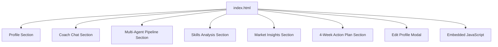
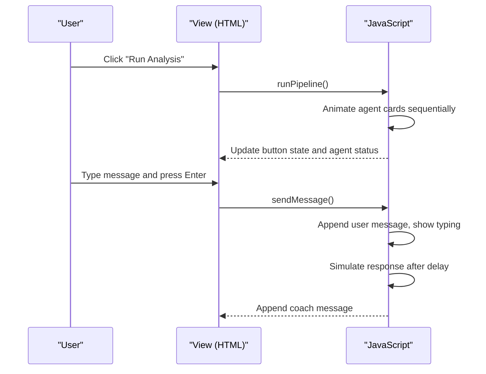
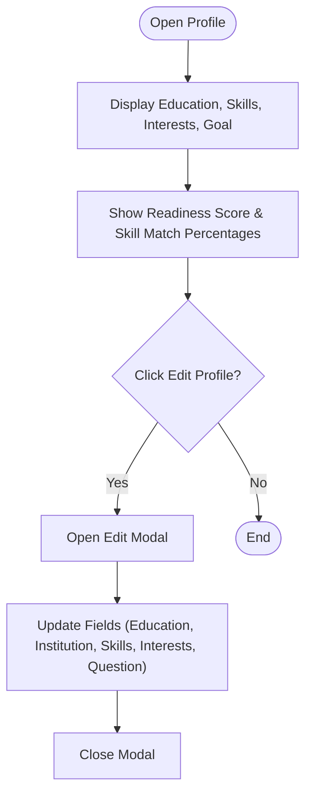
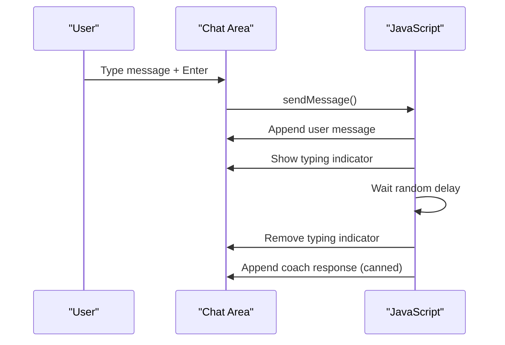
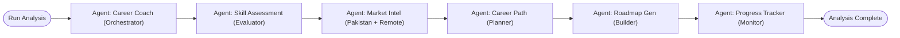
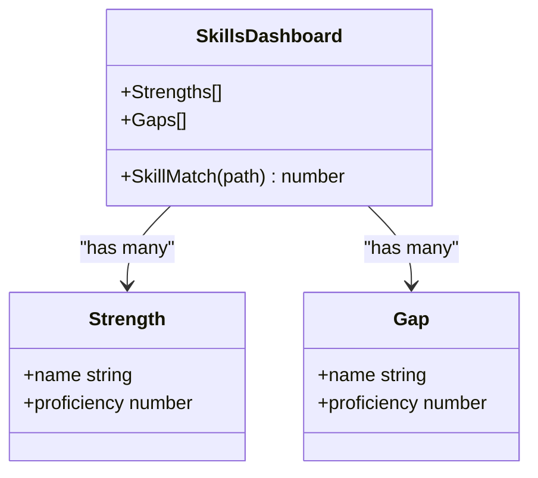
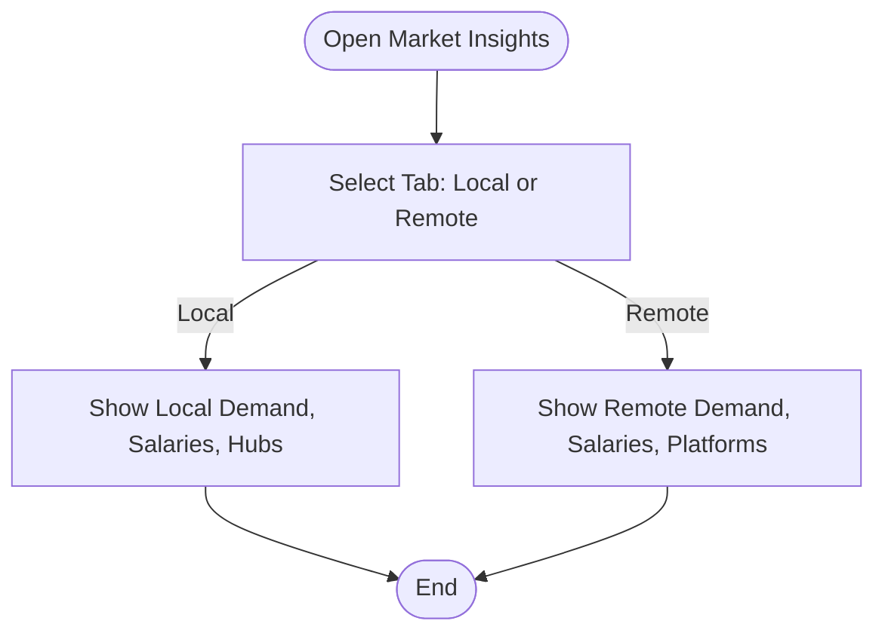
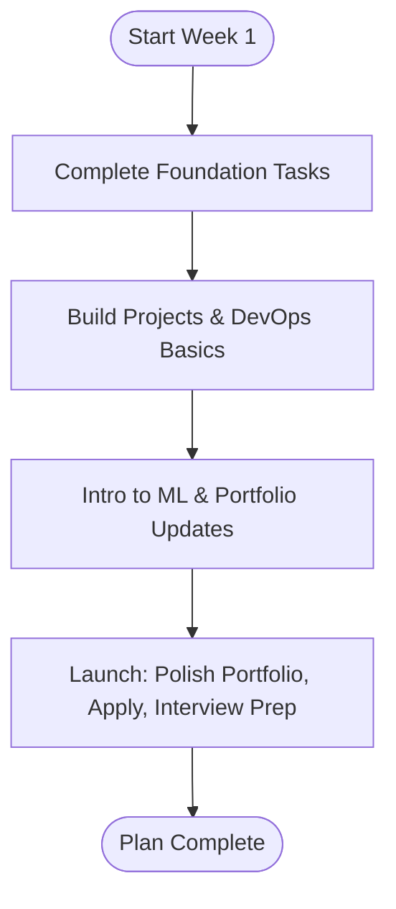
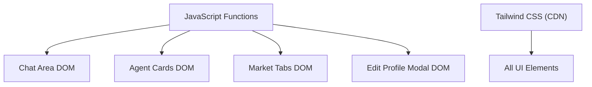

# Core Features

<cite>
**Referenced Files in This Document**
- [index.html](file://index.html)
</cite>

## Table of Contents
1. Introduction
2. Project Structure
3. Core Components
4. Architecture Overview
5. Detailed Component Analysis
6. Dependency Analysis
7. Performance Considerations
8. Troubleshooting Guide
9. Conclusion

## Introduction
CareerCompass is a single-page, prototype-grade career guidance application tailored for Pakistani students. It combines profile management, an AI-style coach chat with simulated responses, a multi-agent pipeline visualization, skills analysis (strengths and gaps), Pakistan-specific job market insights (local and remote), and a structured 4-week action plan. The entire experience is implemented within a single HTML file that includes Tailwind CSS via CDN, custom styles, and embedded JavaScript to drive interactivity.

The terminology used throughout aligns with the codebase: agent orchestration (multi-agent pipeline), skill matching (skills match percentages and gap detection), and market intelligence (Pakistan job market insights).

## Project Structure
The application is organized as a single HTML document with:
- A sticky navigation bar linking to sections: Profile, Coach, Agents, Skills, Market, Plan.
- Sections for each core feature, styled with glassmorphism and brand colors.
- Embedded JavaScript handling chat interactions, pipeline animation, tab switching, modal toggling, and score animations.

**Diagram sources**
- [index.html:47-70](file://index.html#L47-L70)
- [index.html:72-170](file://index.html#L72-L170)
- [index.html:172-226](file://index.html#L172-L226)
- [index.html:228-281](file://index.html#L228-L281)
- [index.html:283-313](file://index.html#L283-L313)
- [index.html:315-390](file://index.html#L315-L390)
- [index.html:392-458](file://index.html#L392-L458)
- [index.html:529-562](file://index.html#L529-L562)
- [index.html:564-681](file://index.html#L564-L681)

**Section sources**
- [index.html:47-70](file://index.html#L47-L70)
- [index.html:564-681](file://index.html#L564-L681)

## Core Components
- Profile Management System: Displays user data (education, skills, interests, career goal) and provides an edit modal for updating fields. Includes readiness score and quick stats showing skill match percentages for different paths.
- AI Career Coach Chat Interface: Simulated chat with typing indicators and canned responses based on user input or suggested questions.
- Multi-Agent Pipeline Visualization: Sequentially animates six agents (Orchestrator, Evaluator, Market Intel, Planner, Builder, Monitor) to represent agent orchestration during analysis.
- Skills Analysis Dashboard: Visualizes strengths and gaps with progress bars and percentages to support skill matching and gap detection.
- Pakistan Job Market Insights: Local and remote tabs showing demand, salary ranges, hiring hubs, and platforms for Pakistani developers.
- Structured 4-Week Action Planning: Weekly checklists with tasks focused on foundation, build, ML intro, and launch phases.

**Section sources**
- [index.html:72-170](file://index.html#L72-L170)
- [index.html:172-226](file://index.html#L172-L226)
- [index.html:228-281](file://index.html#L228-L281)
- [index.html:283-313](file://index.html#L283-L313)
- [index.html:315-390](file://index.html#L315-L390)
- [index.html:392-458](file://index.html#L392-L458)

## Architecture Overview
At runtime, the single-file architecture orchestrates UI state and interactions through embedded JavaScript functions bound to DOM elements. There are no external APIs; all logic is client-side and static.

**Diagram sources**
- [index.html:228-281](file://index.html#L228-L281)
- [index.html:564-681](file://index.html#L564-L681)

## Detailed Component Analysis

### Profile Management System
- User Data Display: Shows education level, current skills, interests, and career goal. Quick stats include readiness score and skill match percentages for AI/ML and Full Stack paths.
- Editing Capabilities: An “Edit Profile” button opens a modal with fields for education level, institution, skills, interests, and career question. Save closes the modal without persisting changes in this prototype.
- Configuration Options: Editable fields in the modal allow users to adjust profile inputs that conceptually influence downstream analyses (skill matching, market intelligence, planning).

**Diagram sources**
- [index.html:72-170](file://index.html#L72-L170)
- [index.html:529-562](file://index.html#L529-L562)

**Section sources**
- [index.html:72-170](file://index.html#L72-L170)
- [index.html:529-562](file://index.html#L529-L562)

### AI Career Coach Chat Interface
- Simulated Responses: A predefined set of responses cycles through when the user sends a message or clicks suggested questions. Typing indicator simulates processing time before displaying the coach’s reply.
- Interaction Patterns: Input validation prevents empty messages; appending messages updates scroll position automatically.
- Usage Pattern: Users can type freely or choose from suggested prompts to receive contextual guidance aligned with their profile and goals.

**Diagram sources**
- [index.html:172-226](file://index.html#L172-L226)
- [index.html:564-681](file://index.html#L564-L681)

**Section sources**
- [index.html:172-226](file://index.html#L172-L226)
- [index.html:564-681](file://index.html#L564-L681)

### Multi-Agent Pipeline Visualization
- Agent Roles:
  - Career Coach (Orchestrator)
  - Skill Assessment (Evaluator)
  - Market Intel (Pakistan + Remote)
  - Career Path (Planner)
  - Roadmap Gen (Builder)
  - Progress Tracker (Monitor)
- Sequential Processing: The “Run Analysis” button triggers a stepwise animation highlighting each agent card in order, then marks previous agents as complete and resets the button after completion.
- Purpose: Demonstrates agent orchestration by visually representing how multiple specialized agents collaborate to produce a cohesive career roadmap.

**Diagram sources**
- [index.html:228-281](file://index.html#L228-L281)
- [index.html:564-681](file://index.html#L564-L681)

**Section sources**
- [index.html:228-281](file://index.html#L228-L281)
- [index.html:564-681](file://index.html#L564-L681)

### Skills Analysis Dashboard
- Strengths: Lists existing competencies with proficiency percentages and visual progress bars.
- Gaps: Identifies areas needing improvement with lower proficiency levels and color-coded urgency.
- Skill Matching: Quick stats show match percentages for different career paths (AI/ML vs Full Stack), indicating how well current skills align with target roles.

**Diagram sources**
- [index.html:283-313](file://index.html#L283-L313)
- [index.html:72-170](file://index.html#L72-L170)

**Section sources**
- [index.html:283-313](file://index.html#L283-L313)
- [index.html:72-170](file://index.html#L72-L170)

### Pakistan Job Market Insights
- Local Opportunities: Displays top demand roles, average salary ranges in PKR, and key hiring hubs across cities.
- Remote Opportunities: Shows global demand, USD salary ranges, and platforms suitable for Pakistani developers.
- Tab Switching: Toggle between local and remote views using tab buttons controlled by JavaScript.

**Diagram sources**
- [index.html:315-390](file://index.html#L315-L390)
- [index.html:564-681](file://index.html#L564-L681)

**Section sources**
- [index.html:315-390](file://index.html#L315-L390)
- [index.html:564-681](file://index.html#L564-L681)

### Structured 4-Week Action Planning System
- Week-by-Week Checklists: Each week focuses on a theme—Foundation, Build, ML Intro, Launch—with actionable tasks and checkboxes for tracking progress.
- Personalization: Tasks reflect the user’s path (Full Stack base + AI/ML layer) and local context (e.g., reading about Pakistan’s IT industry).
- Usage Pattern: Users mark completed tasks to visualize weekly progress and maintain momentum toward career goals.

**Diagram sources**
- [index.html:392-458](file://index.html#L392-L458)

**Section sources**
- [index.html:392-458](file://index.html#L392-L458)

## Dependency Analysis
- Single-File Coupling: All features share the same DOM and JavaScript scope. Functions like sendMessage, runPipeline, switchTab, openEditProfile, closeEditProfile operate directly on elements identified by IDs or classes.
- External Dependencies: Tailwind CSS via CDN provides styling utilities; Google Fonts for typography. No backend or API dependencies exist in this prototype.
- Internal Relationships:
  - Chat interacts with DOM nodes for messages and typing indicators.
  - Pipeline animation manipulates agent card classes and statuses.
  - Market tabs toggle visibility of local vs remote content.
  - Modal toggles visibility of the edit profile overlay.

**Diagram sources**
- [index.html:564-681](file://index.html#L564-L681)
- [index.html:7-21](file://index.html#L7-L21)

**Section sources**
- [index.html:564-681](file://index.html#L564-L681)
- [index.html:7-21](file://index.html#L7-L21)

## Performance Considerations
- Client-Side Only: Since there are no network requests, performance is dominated by DOM manipulation and CSS animations.
- Animation Efficiency: Use of requestAnimationFrame for score animation ensures smooth updates. Interval-based pipeline animation runs briefly and resets state efficiently.
- Memory Footprint: Minimal memory usage due to small DOM size and lack of heavy libraries beyond Tailwind.
- Scalability Notes: For larger datasets or real-time features, consider moving logic into modules, adding caching strategies, and introducing asynchronous operations with proper error handling.

[No sources needed since this section provides general guidance]

## Troubleshooting Guide
- Chat Not Responding: Ensure the input field has focus and a non-empty message is entered. Verify that the Enter key handler triggers sendMessage and that appendMessage targets the correct chat area element.
- Pipeline Stuck: If the Run Analysis button remains disabled, check that the interval clears properly and that the final state resets the button text and classes.
- Market Tabs Not Switching: Confirm that both tab buttons have onclick handlers calling switchTab with the correct tab identifiers and that the corresponding content containers have the expected IDs.
- Modal Not Closing: Ensure closeEditProfile removes the hidden class from the modal container and that the save button invokes the same function.

**Section sources**
- [index.html:564-681](file://index.html#L564-L681)

## Conclusion
CareerCompass demonstrates a cohesive, single-file implementation of core career guidance features: profile management, simulated AI coaching, multi-agent pipeline visualization, skills analysis, localized market insights, and a structured action plan. While it is a prototype without live APIs, it effectively showcases agent orchestration, skill matching, and market intelligence concepts through interactive UI patterns and embedded JavaScript. Developers can extend functionality by integrating real data sources, modularizing scripts, and enhancing personalization while preserving the clear, accessible structure established here.

[No sources needed since this section summarizes without analyzing specific files]