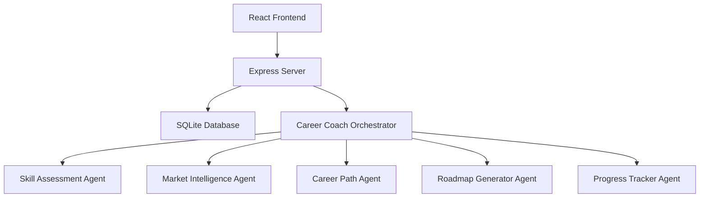
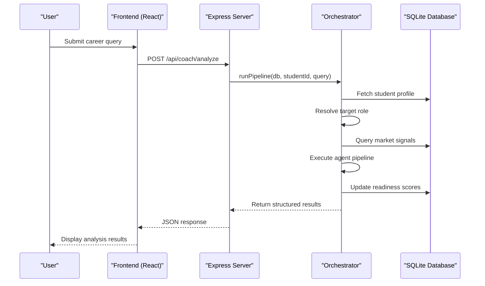
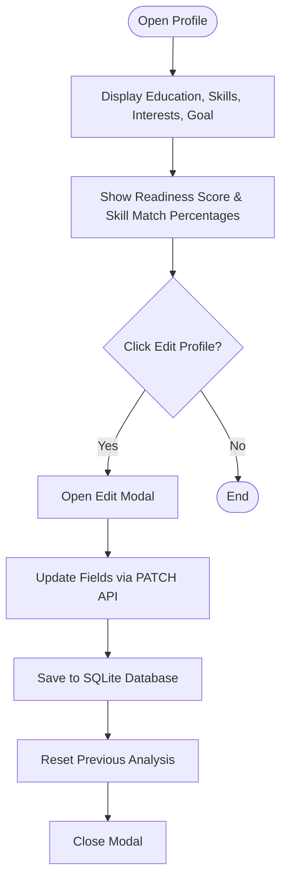
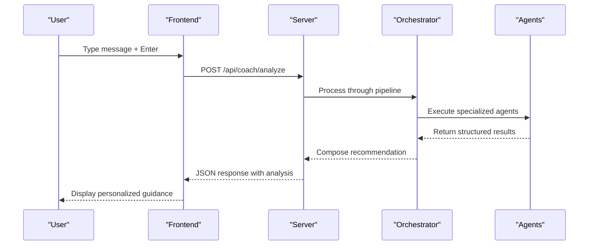
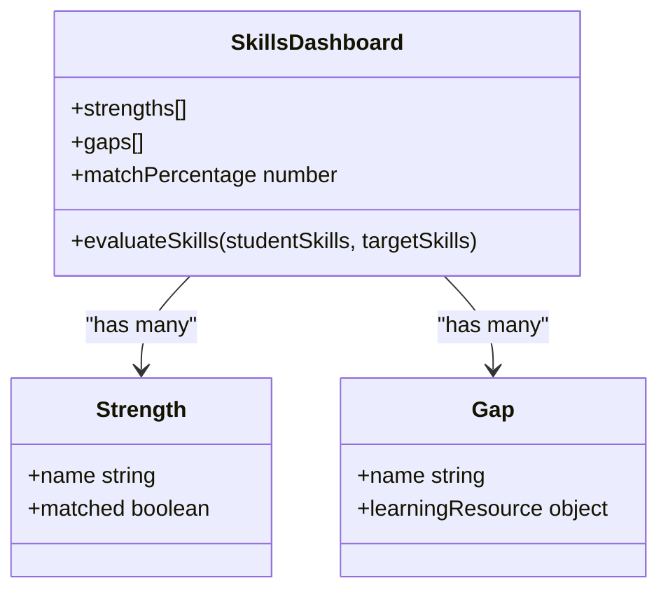
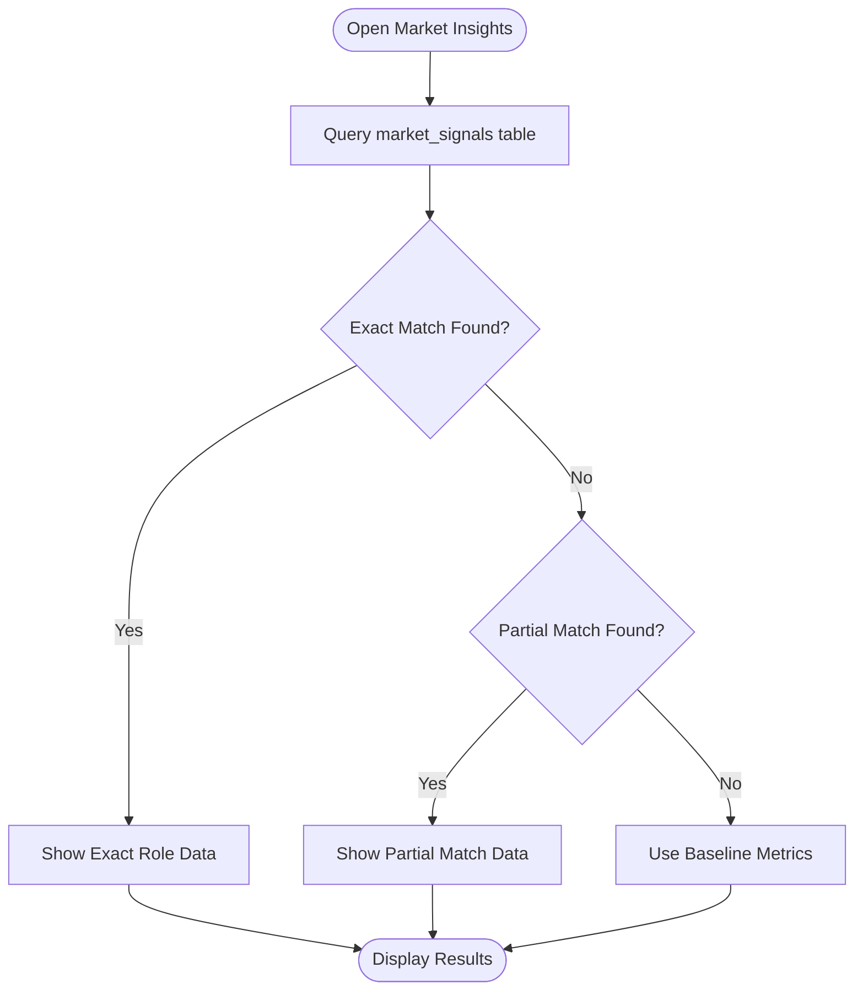
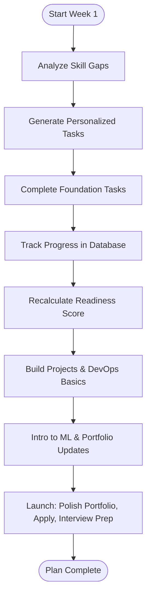
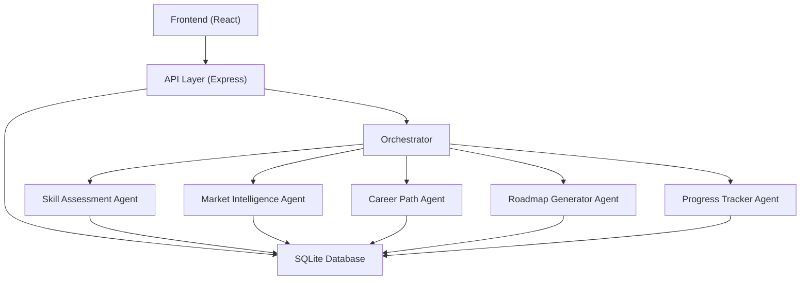

# Core Features

<cite>
**Referenced Files in This Document**
- [server.js](file://server.js)
- [routes/api.js](file://routes/api.js)
- [agents/careerCoachOrchestrator.js](file://agents/careerCoachOrchestrator.js)
- [agents/skillAssessmentAgent.js](file://agents/skillAssessmentAgent.js)
- [agents/marketIntelligenceAgent.js](file://agents/marketIntelligenceAgent.js)
- [agents/careerPathAgent.js](file://agents/careerPathAgent.js)
- [agents/roadmapGeneratorAgent.js](file://agents/roadmapGeneratorAgent.js)
- [agents/progressTrackerAgent.js](file://agents/progressTrackerAgent.js)
- [database/db.js](file://database/db.js)
- [frontend/src/App.jsx](file://frontend/src/App.jsx)
- [frontend/src/components/CommandCenter.jsx](file://frontend/src/components/CommandCenter.jsx)
- [frontend/src/components/ProfileCard.jsx](file://frontend/src/components/ProfileCard.jsx)
- [frontend/src/components/SkillsSection.jsx](file://frontend/src/components/SkillsSection.jsx)
- [frontend/src/api.js](file://frontend/src/api.js)
</cite>

## Update Summary
**Changes Made**
- Replaced single-file prototype description with a full multi-agent system architecture
- Updated all core features to reflect sophisticated backend agent orchestration instead of simulated client-side logic
- Added detailed documentation for each specialized agent (career coach orchestrator, skill assessment, market intelligence, career path planning, roadmap generation, progress tracking)
- Updated architecture diagrams to show real API calls and database interactions
- Enhanced implementation details with actual server endpoints, database schema, and frontend-backend communication patterns
- Revised troubleshooting guide to address network requests and backend integration

## Table of Contents
1. Introduction
2. Project Structure
3. Core Components
4. Architecture Overview
5. Detailed Component Analysis
6. Dependency Analysis
7. Performance Considerations
8. Troubleshooting Guide
9. Conclusion

## Introduction
CareerCompass is a comprehensive career guidance application that combines profile management, an AI-style coach chat interface, a sophisticated multi-agent pipeline visualization, skills analysis with strength identification and gap detection, Pakistan-specific job market insights, and a structured 4-week action planning system. The application has evolved from a single-file prototype to a full-stack solution featuring a Node.js backend with Express, SQLite database, and React frontend with sophisticated multi-agent orchestration.

The terminology used throughout aligns with the codebase: agent orchestration (multi-agent pipeline coordination), skill matching (deterministic skill comparison algorithms), and market intelligence (Pakistan job market data analysis).

## Project Structure
The application follows a modern full-stack architecture:
- **Backend**: Node.js/Express server with RESTful API endpoints
- **Database**: SQLite with persistent storage for student profiles, market signals, and progress tracking
- **Frontend**: React application with component-based architecture and real-time state management
- **Agents**: Specialized JavaScript modules handling different aspects of career analysis

**Diagram sources**
- [server.js:13-23](file://server.js#L13-L23)
- [routes/api.js:118-142](file://routes/api.js#L118-L142)
- [agents/careerCoachOrchestrator.js:210-336](file://agents/careerCoachOrchestrator.js#L210-L336)

**Section sources**
- [server.js:1-37](file://server.js#L1-37)
- [routes/api.js:1-176](file://routes/api.js#L1-L176)

## Core Components
- **Profile Management System**: Displays user data (education, skills, interests, career goal) with real-time editing capabilities through PATCH API endpoints and persistent storage in SQLite database.
- **AI Career Coach Chat Interface**: Integrated with multi-agent pipeline that processes queries through specialized agents and returns personalized recommendations based on student profile and market analysis.
- **Multi-Agent Pipeline Visualization**: Real-time animation showing six specialized agents processing sequentially: Career Coach (Orchestrator), Skill Assessment (Evaluator), Market Intel (Pakistan + Remote), Career Path (Planner), Roadmap Gen (Builder), Progress Tracker (Monitor).
- **Skills Analysis Dashboard**: Deterministic skill matching algorithm comparing student skills against target role requirements with visual progress indicators and gap identification.
- **Pakistan Job Market Insights**: Local and remote opportunity data sourced from market_signals database table with demand percentages, salary ranges, and hiring platform recommendations.
- **Structured 4-Week Action Planning**: Dynamic task generation based on identified skill gaps with progress tracking and readiness score recalculation.

**Section sources**
- [frontend/src/components/ProfileCard.jsx:1-111](file://frontend/src/components/ProfileCard.jsx#L1-L111)
- [frontend/src/App.jsx:171-238](file://frontend/src/App.jsx#L171-L238)
- [frontend/src/components/CommandCenter.jsx:27-35](file://frontend/src/components/CommandCenter.jsx#L27-L35)
- [agents/skillAssessmentAgent.js:34-73](file://agents/skillAssessmentAgent.js#L34-L73)
- [agents/marketIntelligenceAgent.js:81-118](file://agents/marketIntelligenceAgent.js#L81-L118)
- [agents/roadmapGeneratorAgent.js:156-180](file://agents/roadmapGeneratorAgent.js#L156-L180)

## Architecture Overview
The application implements a sophisticated multi-agent system where the Career Coach Orchestrator coordinates five specialized agents to provide comprehensive career guidance. The frontend communicates with the backend through RESTful APIs, which process requests through the agent pipeline and return structured results.

**Diagram sources**
- [frontend/src/App.jsx:171-238](file://frontend/src/App.jsx#L171-L238)
- [routes/api.js:118-142](file://routes/api.js#L118-L142)
- [agents/careerCoachOrchestrator.js:210-336](file://agents/careerCoachOrchestrator.js#L210-L336)

## Detailed Component Analysis

### Profile Management System
**Updated** Now integrates with backend database for persistent profile management and real-time updates.

- **User Data Display**: Shows education level, current skills, interests, and career goal with dynamic rendering from database records.
- **Editing Capabilities**: An “Edit Profile” button triggers PATCH API calls to update education_level, interests, and skills fields with validation and error handling.
- **Configuration Options**: Editable fields persist changes to SQLite database and trigger analysis reset when skills or interests change.

**Diagram sources**
- [frontend/src/components/ProfileCard.jsx:102-107](file://frontend/src/components/ProfileCard.jsx#L102-L107)
- [routes/api.js:27-69](file://routes/api.js#L27-L69)
- [frontend/src/App.jsx:281-303](file://frontend/src/App.jsx#L281-L303)

**Section sources**
- [frontend/src/components/ProfileCard.jsx:1-111](file://frontend/src/components/ProfileCard.jsx#L1-L111)
- [routes/api.js:27-69](file://routes/api.js#L27-L69)
- [frontend/src/App.jsx:281-303](file://frontend/src/App.jsx#L281-L303)

### AI Career Coach Chat Interface
**Updated** Now powered by sophisticated multi-agent system instead of simulated responses.

- **Multi-Agent Processing**: User queries are processed through the complete agent pipeline including skill assessment, market intelligence, career path selection, and roadmap generation.
- **Personalized Responses**: Final recommendations are composed from structured pipeline data with bilingual support (English and Roman Urdu).
- **Real-time Feedback**: Typing indicators and step-by-step execution visualization during agent processing.

**Diagram sources**
- [frontend/src/App.jsx:171-238](file://frontend/src/App.jsx#L171-L238)
- [routes/api.js:118-142](file://routes/api.js#L118-L142)
- [agents/careerCoachOrchestrator.js:165-198](file://agents/careerCoachOrchestrator.js#L165-L198)

**Section sources**
- [frontend/src/App.jsx:171-238](file://frontend/src/App.jsx#L171-L238)
- [agents/careerCoachOrchestrator.js:165-198](file://agents/careerCoachOrchestrator.js#L165-L198)

### Multi-Agent Pipeline Visualization
**Updated** Now represents actual backend agent execution with real-time status updates.

- **Agent Roles**: Six specialized agents execute in sequence: Career Coach (Orchestrator), Skill Assessment (Evaluator), Market Intel (Pakistan + Remote), Career Path (Planner), Roadmap Gen (Builder), Progress Tracker (Monitor).
- **Sequential Processing**: The “Run Analysis” button triggers API calls with animated step progression showing IDLE → EXECUTING → COMPLETE states.
- **Purpose**: Demonstrates agent orchestration by visually representing how multiple specialized agents collaborate to produce cohesive career roadmaps.

```mermaid
flowchart LR
Start(["Run Analysis"]) --> API["POST /api/coach/analyze"]
API --> A1["Agent: Career Coach (Orchestrator)"]
A1 --> A2["Agent: Skill Assessment (Evaluator)"]
A2 --> A3["Agent: Market Intel (Pakistan + Remote)"]
A3 --> A4["Agent: Career Path (Planner)"]
A4 --> A5["Agent: Roadmap Gen (Builder)"]
A5 --> A6["Agent: Progress Tracker (Monitor)"]
A6 --> Result["Analysis Complete"]
```

**Diagram sources**
- [frontend/src/components/CommandCenter.jsx:27-35](file://frontend/src/components/CommandCenter.jsx#L27-L35)
- [routes/api.js:118-142](file://routes/api.js#L118-L142)
- [agents/careerCoachOrchestrator.js:222-296](file://agents/careerCoachOrchestrator.js#L222-L296)

**Section sources**
- [frontend/src/components/CommandCenter.jsx:27-531](file://frontend/src/components/CommandCenter.jsx#L27-L531)
- [agents/careerCoachOrchestrator.js:222-296](file://agents/careerCoachOrchestrator.js#L222-L296)

### Skills Analysis Dashboard
**Updated** Now uses deterministic algorithm for accurate skill matching and gap detection.

- **Strengths**: Lists existing competencies matched against target role requirements using case-insensitive string normalization.
- **Gaps**: Identifies areas needing improvement with precise skill gap analysis and learning resource recommendations.
- **Skill Matching**: Calculates exact match percentages using normalized skill comparison with detailed breakdown of strengths vs. gaps.

**Diagram sources**
- [agents/skillAssessmentAgent.js:34-73](file://agents/skillAssessmentAgent.js#L34-L73)
- [frontend/src/components/SkillsSection.jsx:26-129](file://frontend/src/components/SkillsSection.jsx#L26-L129)

**Section sources**
- [agents/skillAssessmentAgent.js:34-73](file://agents/skillAssessmentAgent.js#L34-L73)
- [frontend/src/components/SkillsSection.jsx:26-129](file://frontend/src/components/SkillsSection.jsx#L26-L129)

### Pakistan Job Market Insights
**Updated** Now powered by market_signals database with real demand data and trend analysis.

- **Local Opportunities**: Displays top demand roles, average salary ranges in PKR, and key hiring hubs across Pakistani cities with percentage-based demand metrics.
- **Remote Opportunities**: Shows global demand percentages, USD salary ranges, and platforms suitable for Pakistani developers with growth trend indicators.
- **Tab Switching**: Toggle between local and remote views using tab buttons with dynamic content loading from database queries.

**Diagram sources**
- [agents/marketIntelligenceAgent.js:81-118](file://agents/marketIntelligenceAgent.js#L81-L118)
- [database/db.js:86-97](file://database/db.js#L86-L97)

**Section sources**
- [agents/marketIntelligenceAgent.js:81-118](file://agents/marketIntelligenceAgent.js#L81-L118)
- [database/db.js:86-97](file://database/db.js#L86-L97)

### Structured 4-Week Action Planning System
**Updated** Now generates personalized plans based on identified skill gaps with progress tracking integration.

- **Week-by-Week Checklists**: Each week focuses on a theme—Foundation, Build, ML Intro, Launch—with actionable tasks dynamically generated from skill gap analysis.
- **Personalization**: Tasks reflect the user’s path (Full Stack base + AI/ML layer) and include specific learning resources mapped to identified gaps.
- **Progress Tracking**: Task completion updates readiness scores and persists progress to database with real-time score recalculation.

**Diagram sources**
- [agents/roadmapGeneratorAgent.js:95-140](file://agents/roadmapGeneratorAgent.js#L95-L140)
- [agents/progressTrackerAgent.js:64-133](file://agents/progressTrackerAgent.js#L64-L133)

**Section sources**
- [agents/roadmapGeneratorAgent.js:95-140](file://agents/roadmapGeneratorAgent.js#L95-L140)
- [agents/progressTrackerAgent.js:64-133](file://agents/progressTrackerAgent.js#L64-L133)

## Dependency Analysis
**Updated** Now includes full-stack dependencies with backend services and database connections.

- **Frontend Dependencies**: React components communicate with Express server through RESTful API endpoints defined in api.js module.
- **Backend Dependencies**: Express server manages database connections, routes, and agent orchestration with SQLite persistence.
- **Agent Dependencies**: Specialized agents depend on database queries and shared utility functions for consistent data processing.
- **Database Schema**: SQLite tables for students, market_signals, roadmaps, and progress_logs with foreign key relationships.

**Diagram sources**
- [frontend/src/api.js:1-64](file://frontend/src/api.js#L1-L64)
- [routes/api.js:1-176](file://routes/api.js#L1-L176)
- [database/db.js:71-120](file://database/db.js#L71-L120)

**Section sources**
- [frontend/src/api.js:1-64](file://frontend/src/api.js#L1-L64)
- [routes/api.js:1-176](file://routes/api.js#L1-L176)
- [database/db.js:71-120](file://database/db.js#L71-L120)

## Performance Considerations
**Updated** Now accounts for network requests, database operations, and agent processing time.

- **Network Optimization**: API requests are handled with proper error handling and timeout management for better user experience.
- **Database Efficiency**: SQLite queries use parameterized statements and efficient indexing for fast data retrieval and updates.
- **Agent Processing**: Sequential agent execution minimizes memory usage while providing comprehensive analysis results.
- **Frontend State Management**: React state updates are optimized with proper dependency arrays and cleanup functions to prevent memory leaks.

## Troubleshooting Guide
**Updated** Now addresses network connectivity, backend errors, and database issues.

- **Chat Not Responding**: Verify server is running on port 3000, check network connectivity, and ensure database is properly initialized.
- **Pipeline Stuck**: Check if all agents are executing properly, verify database connections, and review agent logs for errors.
- **Market Tabs Not Switching**: Confirm API endpoints are responding correctly and database contains market_signals data.
- **Profile Updates Failing**: Validate input data format, check database permissions, and verify student ID exists in database.
- **Network Errors**: Handle fetch failures gracefully with user-friendly error messages and retry mechanisms.

**Section sources**
- [frontend/src/App.jsx:156-160](file://frontend/src/App.jsx#L156-L160)
- [routes/api.js:138-141](file://routes/api.js#L138-L141)
- [agents/careerCoachOrchestrator.js:226-228](file://agents/careerCoachOrchestrator.js#L226-L228)

## Conclusion
CareerCompass has evolved from a simple prototype to a sophisticated multi-agent career guidance system that demonstrates advanced software architecture principles. The application successfully implements agent orchestration, deterministic skill matching, and comprehensive market intelligence through a well-structured full-stack architecture. The modular design allows for easy extension and maintenance while providing users with personalized, data-driven career guidance tailored to the Pakistani context. Developers can extend functionality by adding new agents, enhancing market data, or integrating additional external APIs while maintaining the clear separation of concerns established in the current architecture.