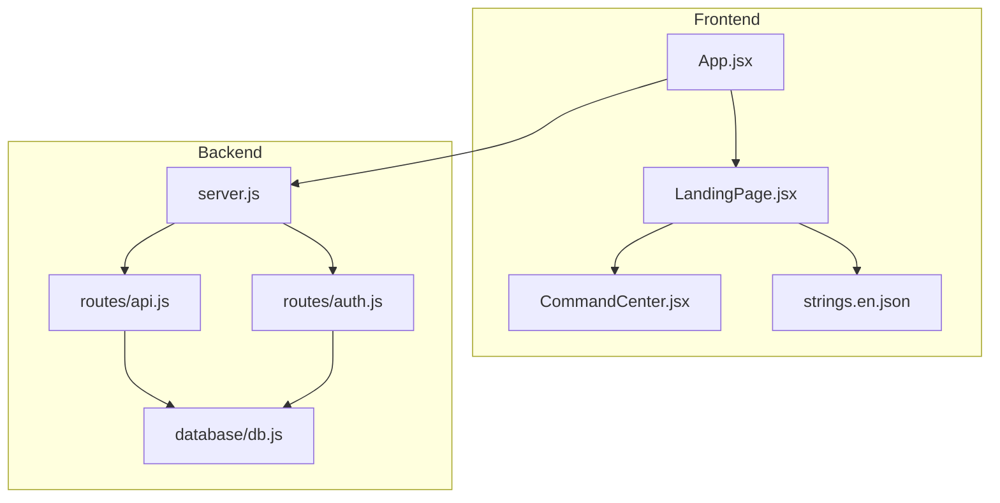
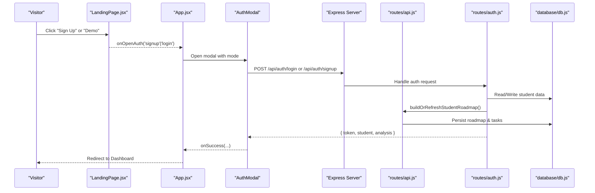
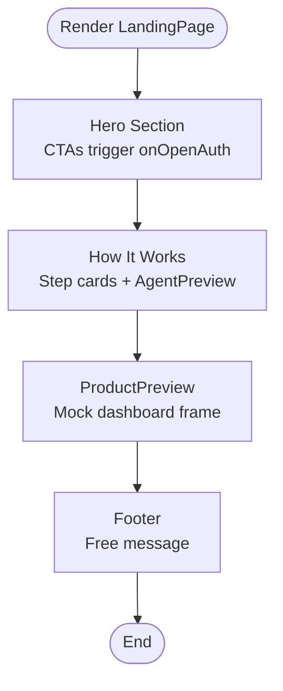
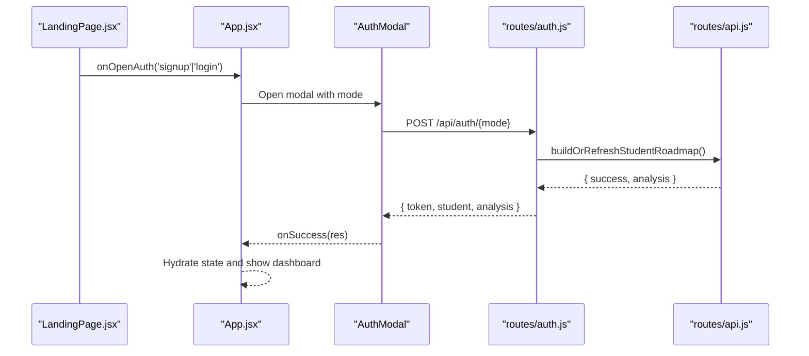
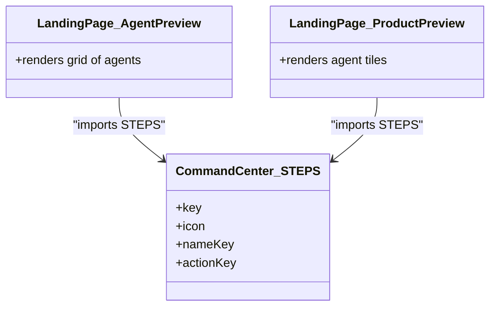
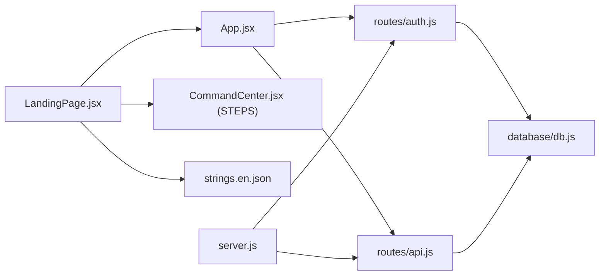

# Landing Page

<cite>
**Referenced Files in This Document**
- [LandingPage.jsx](file://frontend/src/components/LandingPage.jsx)
- [App.jsx](file://frontend/src/App.jsx)
- [CommandCenter.jsx](file://frontend/src/components/CommandCenter.jsx)
- [strings.en.json](file://frontend/src/i18n/strings.en.json)
- [server.js](file://server.js)
- [api.js](file://routes/api.js)
- [auth.js](file://routes/auth.js)
- [db.js](file://database/db.js)
- [README.md](file://README.md)
</cite>

## Table of Contents
1. [Introduction](#introduction)
2. [Project Structure](#project-structure)
3. [Core Components](#core-components)
4. [Architecture Overview](#architecture-overview)
5. [Detailed Component Analysis](#detailed-component-analysis)
6. [Dependency Analysis](#dependency-analysis)
7. [Performance Considerations](#performance-considerations)
8. [Troubleshooting Guide](#troubleshooting-guide)
9. [Conclusion](#conclusion)

## Introduction
This document explains the Landing Page implementation for CareerCompass, a multi-agent AI career guidance platform tailored for Pakistani students. The landing page is the first experience for logged-out visitors and guides them to sign up or try a demo. It includes an animated hero, a “How It Works” walkthrough, a product preview mockup, and a footer. When users click Sign Up or Demo, the shared authentication modal opens to complete onboarding and generate a personalized roadmap via the backend pipeline.

## Project Structure
The landing page is part of the React frontend and integrates with the Express backend through API routes. Key files involved:
- Frontend components render the landing page and orchestrate user actions (e.g., opening auth).
- Backend routes handle authentication and pipeline execution.
- Database layer persists student profiles, roadmaps, and progress logs.

**Diagram sources**
- [App.jsx:1-433](file://frontend/src/App.jsx#L1-L433)
- [LandingPage.jsx:1-309](file://frontend/src/components/LandingPage.jsx#L1-L309)
- [CommandCenter.jsx:1-531](file://frontend/src/components/CommandCenter.jsx#L1-L531)
- [strings.en.json:1-207](file://frontend/src/i18n/strings.en.json#L1-L207)
- [server.js:1-39](file://server.js#L1-L39)
- [api.js:1-200](file://routes/api.js#L1-L200)
- [auth.js:1-333](file://routes/auth.js#L1-L333)
- [db.js:1-139](file://database/db.js#L1-L139)

**Section sources**
- [App.jsx:1-433](file://frontend/src/App.jsx#L1-L433)
- [server.js:1-39](file://server.js#L1-L39)

## Core Components
- LandingPage: Renders the visitor-facing sections (hero, how it works, product preview, footer) and triggers authentication flows.
- App: Orchestrates routing between landing and dashboard, manages auth state, and coordinates pipeline execution.
- CommandCenter: Visualizes the six-agent pipeline steps; reused by the landing page’s agent preview.
- i18n strings: Provide localized labels for all UI text.

Key responsibilities:
- LandingPage exposes onOpenAuth to open the AuthModal with login/signup modes.
- App conditionally renders LandingPage when no user is authenticated.
- CommandCenter provides a compact view of the six agents used in the landing preview.

**Section sources**
- [LandingPage.jsx:1-309](file://frontend/src/components/LandingPage.jsx#L1-L309)
- [App.jsx:81-336](file://frontend/src/App.jsx#L81-L336)
- [CommandCenter.jsx:27-35](file://frontend/src/components/CommandCenter.jsx#L27-L35)
- [strings.en.json:178-198](file://frontend/src/i18n/strings.en.json#L178-L198)

## Architecture Overview
The landing page is a client-side component that:
- Displays marketing content and CTAs.
- Opens the shared AuthModal to authenticate or create a student profile.
- On successful auth, transitions to the dashboard where the multi-agent pipeline runs.

**Diagram sources**
- [LandingPage.jsx:92-107](file://frontend/src/components/LandingPage.jsx#L92-L107)
- [App.jsx:124-176](file://frontend/src/App.jsx#L124-L176)
- [auth.js:170-300](file://routes/auth.js#L170-L300)
- [api.js:115-167](file://routes/api.js#L115-L167)
- [db.js:79-132](file://database/db.js#L79-L132)

## Detailed Component Analysis

### LandingPage.jsx
- Hero section: Animated brand logo, title, tagline, body copy, and two CTAs (“Sign Up”, “Demo”) that call onOpenAuth with appropriate modes.
- How It Works: Four-step explanation using icons and localized titles/descriptions; step 2 includes a mini AgentPreview grid.
- ProductPreview: Browser-frame mockup showing agent tiles, progress/score, and sample weekly tasks to illustrate the dashboard experience.
- Footer: Simple messaging about being free and built for the hackathon.

Behavioral highlights:
- Uses framer-motion for fade-up animations and staggered children.
- Leverages i18n keys under the “landing” namespace for all visible text.
- Reuses STEPS from CommandCenter to display agent names/icons consistently.

**Diagram sources**
- [LandingPage.jsx:62-112](file://frontend/src/components/LandingPage.jsx#L62-L112)
- [LandingPage.jsx:114-155](file://frontend/src/components/LandingPage.jsx#L114-L155)
- [LandingPage.jsx:157-279](file://frontend/src/components/LandingPage.jsx#L157-L279)
- [LandingPage.jsx:281-309](file://frontend/src/components/LandingPage.jsx#L281-L309)

**Section sources**
- [LandingPage.jsx:1-309](file://frontend/src/components/LandingPage.jsx#L1-L309)
- [strings.en.json:178-198](file://frontend/src/i18n/strings.en.json#L178-L198)

### App.jsx integration
- Conditional rendering: If no currentUser, renders Navbar + LandingPage + AuthModal.
- Auth flow: openAuth sets modal mode; onSuccess hydrates student and analysis, then switches to dashboard.
- Pipeline execution: After login/signup, App can run analyze to animate the CommandCenter steps and update scores.

**Diagram sources**
- [App.jsx:124-176](file://frontend/src/App.jsx#L124-L176)
- [auth.js:170-300](file://routes/auth.js#L170-L300)
- [api.js:115-167](file://routes/api.js#L115-L167)

**Section sources**
- [App.jsx:81-336](file://frontend/src/App.jsx#L81-L336)

### CommandCenter.jsx reuse
- Provides the canonical list of six pipeline agents (STEPS), which the landing page uses to show an agent preview and product mockup.
- Ensures consistent naming and icons across the landing and dashboard experiences.

**Diagram sources**
- [CommandCenter.jsx:27-35](file://frontend/src/components/CommandCenter.jsx#L27-L35)
- [LandingPage.jsx:36-60](file://frontend/src/components/LandingPage.jsx#L36-L60)
- [LandingPage.jsx:203-222](file://frontend/src/components/LandingPage.jsx#L203-L222)

**Section sources**
- [CommandCenter.jsx:1-531](file://frontend/src/components/CommandCenter.jsx#L1-L531)
- [LandingPage.jsx:36-60](file://frontend/src/components/LandingPage.jsx#L36-L60)
- [LandingPage.jsx:203-222](file://frontend/src/components/LandingPage.jsx#L203-L222)

### Internationalization (i18n)
- All visible text on the landing page is sourced from strings.en.json under the “landing” namespace.
- Keys include hero body, how-it-work steps, agents preview label, preview caption, and footer messages.

**Section sources**
- [strings.en.json:178-198](file://frontend/src/i18n/strings.en.json#L178-L198)

## Dependency Analysis
- LandingPage depends on:
  - i18n hook for localization.
  - CommandCenter.STEPS for agent metadata.
  - Auth flow via props (onOpenAuth) provided by App.
- App orchestrates:
  - Rendering LandingPage when unauthenticated.
  - Opening AuthModal and handling success callbacks.
  - Running the pipeline and updating UI state.
- Backend:
  - server.js mounts routes for health, auth, and API.
  - api.js exposes endpoints for student updates, roadmap retrieval, and pipeline execution.
  - auth.js handles signup/login/me/logout and builds/refreshes roadmaps.
  - db.js initializes SQLite and persists changes.

**Diagram sources**
- [LandingPage.jsx:1-309](file://frontend/src/components/LandingPage.jsx#L1-L309)
- [App.jsx:1-433](file://frontend/src/App.jsx#L1-L433)
- [CommandCenter.jsx:1-531](file://frontend/src/components/CommandCenter.jsx#L1-L531)
- [strings.en.json:1-207](file://frontend/src/i18n/strings.en.json#L1-L207)
- [server.js:1-39](file://server.js#L1-L39)
- [api.js:1-200](file://routes/api.js#L1-L200)
- [auth.js:1-333](file://routes/auth.js#L1-L333)
- [db.js:1-139](file://database/db.js#L1-L139)

**Section sources**
- [server.js:1-39](file://server.js#L1-L39)
- [api.js:1-200](file://routes/api.js#L1-L200)
- [auth.js:1-333](file://routes/auth.js#L1-L333)
- [db.js:1-139](file://database/db.js#L1-L139)

## Performance Considerations
- Animations: Use framer-motion sparingly; the landing page applies fade-up and staggered children to avoid heavy reflows.
- Network calls: Authentication and roadmap generation are triggered only after user action (CTA or demo login), minimizing unnecessary requests.
- Data hydration: On successful auth, the dashboard hydrates with existing analysis if available, avoiding redundant pipeline runs.
- Persistence: Database writes occur on critical mutations (profile updates, task toggles, roadmap creation), reducing write frequency.

[No sources needed since this section provides general guidance]

## Troubleshooting Guide
Common issues and resolutions:
- Backend not reachable: If the network error appears during pipeline execution or auth, ensure the server is running on port 3000 and CORS is enabled.
- Invalid student ID: Validation errors indicate malformed IDs; verify inputs before calling endpoints.
- Roadmap fetch failures: Check database initialization and table schema; ensure foreign keys are enabled and tables exist.
- Token issues: Expired or invalid tokens result in session errors; re-authenticate to obtain a new token.

Relevant endpoints and behaviors:
- POST /api/auth/login and /api/auth/signup: Validate inputs, persist student data, generate roadmap, return token and analysis.
- GET /api/students/:id/roadmap: Returns stored roadmap and analysis; refreshes if needed.
- POST /api/coach/analyze: Executes the multi-agent pipeline and returns results.

**Section sources**
- [api.js:143-167](file://routes/api.js#L143-L167)
- [api.js:173-200](file://routes/api.js#L173-L200)
- [auth.js:170-300](file://routes/auth.js#L170-L300)
- [db.js:79-132](file://database/db.js#L79-L132)

## Conclusion
The Landing Page provides a polished, animated introduction to CareerCompass, guiding visitors to sign up or try a demo. It integrates seamlessly with the authentication system and the multi-agent pipeline to deliver personalized career roadmaps. By leveraging consistent agent metadata and localized content, it ensures a cohesive experience from first visit to dashboard onboarding.

[No sources needed since this section summarizes without analyzing specific files]