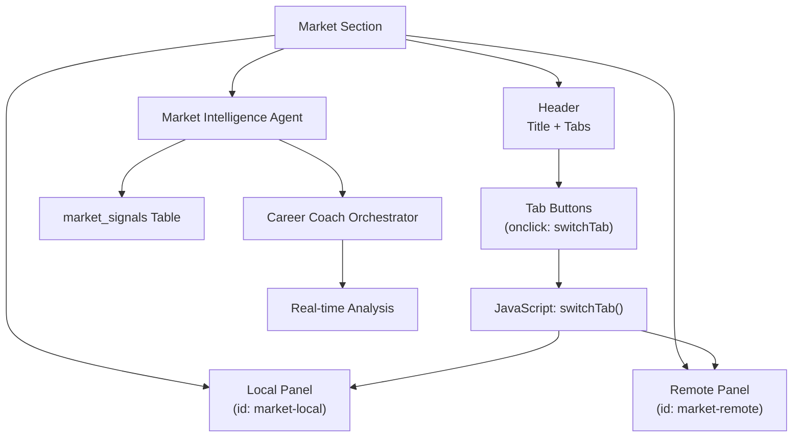
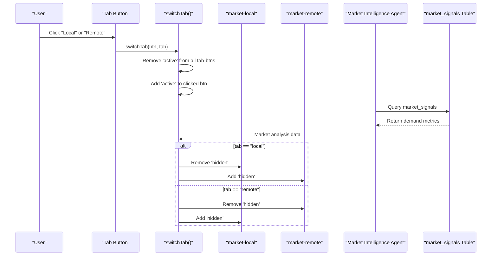
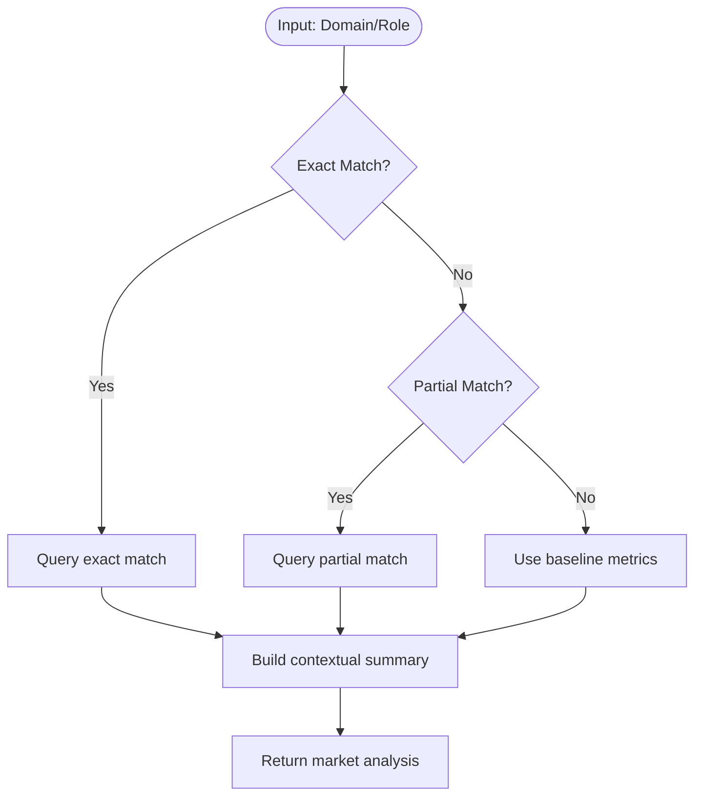

# Market Intelligence Section

<cite>
**Referenced Files in This Document**
- [marketIntelligenceAgent.js](file://agents/marketIntelligenceAgent.js)
- [db.js](file://database/db.js)
- [seed.js](file://database/seed.js)
- [careerCoachOrchestrator.js](file://agents/careerCoachOrchestrator.js)
- [MarketSection.jsx](file://frontend/src/components/MarketSection.jsx)
- [api.js](file://routes/api.js)
- [index.html](file://index.html)
</cite>

## Update Summary
**Changes Made**
- Updated architecture overview to reflect dynamic market intelligence agent system
- Added comprehensive documentation for marketIntelligenceAgent.js functionality
- Enhanced database schema documentation for market_signals table
- Updated frontend integration showing real-time market data display
- Added API endpoint documentation for market analysis queries
- Expanded Pakistan-specific context with actual market data from database

## Table of Contents
1. [Introduction](#introduction)
2. [Project Structure](#project-structure)
3. [Core Components](#core-components)
4. [Architecture Overview](#architecture-overview)
5. [Detailed Component Analysis](#detailed-component-analysis)
6. [Database Schema and Data](#database-schema-and-data)
7. [Frontend Integration](#frontend-integration)
8. [API Endpoints](#api-endpoints)
9. [Performance Considerations](#performance-considerations)
10. [Troubleshooting Guide](#troubleshooting-guide)
11. [Conclusion](#conclusion)

## Introduction
This document explains the Pakistan Job Market Insights section that presents both local and remote opportunities for Pakistani developers through a dynamic market intelligence system. The system now leverages a sophisticated multi-agent pipeline where market intelligence is powered by `marketIntelligenceAgent.js`, analyzing Pakistani local and remote hiring demand with salary signals stored in the `market_signals` table. It covers the tabbed interface, three-column layout per tab (demand levels, salary ranges, top platforms/hubs), and the intelligent switching between Local and Remote content based on real-time market data.

## Project Structure
The market insights are implemented as a modern React component with embedded animations and dynamic data fetching. The relevant UI is organized under a dedicated section with:
- A header containing the title and two tab buttons (Local and Remote).
- Two tab panels: one for local market data and one for remote opportunities.
- Each panel uses a responsive three-column grid to present demand, salaries, and platforms/hubs.
- Integration with the career coach orchestrator for real-time market analysis.

**Diagram sources**
- [index.html:315-390](file://index.html#L315-L390)
- [marketIntelligenceAgent.js:1-119](file://agents/marketIntelligenceAgent.js#L1-L119)
- [careerCoachOrchestrator.js:245-249](file://agents/careerCoachOrchestrator.js#L245-L249)

**Section sources**
- [index.html:315-390](file://index.html#L315-L390)

## Core Components
- **Dynamic Tab Controls**: Two buttons labeled Local and Remote that trigger switching via an inline onclick handler calling switchTab().
- **Intelligent Tab Panels**:
  - Local panel (id: market-local): Three columns showing top local demand roles, average PKR salary ranges by level, and top hiring hubs including cities and remote platforms.
  - Remote panel (id: market-remote): Three columns showing global remote demand roles, USD salary ranges by level, and recommended platforms for Pakistani developers.
- **Market Intelligence Integration**: Real-time data fetching from the market_signals table through the market intelligence agent.
- **Styling**:
  - Active tab button state managed via a class-based style rule.
  - Content visibility controlled by toggling a hidden utility class on each panel.

Key behaviors:
- Clicking a tab removes the active class from all tab buttons and adds it to the clicked button.
- The function then hides or shows the corresponding panel by toggling the hidden class based on the selected tab.
- Dynamic content updates based on market intelligence analysis results.

**Section sources**
- [index.html:325-328](file://index.html#L325-L328)
- [index.html:330-389](file://index.html#L330-L389)
- [index.html:659-665](file://index.html#L659-L665)
- [index.html:42](file://index.html#L42)

## Architecture Overview
The market insights feature follows a sophisticated multi-agent architecture:
- **UI Layer**: React components handle user interactions and display formatted market data.
- **Agent Layer**: Market intelligence agent queries the market_signals table and generates human-readable summaries.
- **Data Layer**: SQLite database stores structured market data with demand metrics and growth trends.
- **Integration Layer**: Career coach orchestrator coordinates between agents and manages data flow.

**Diagram sources**
- [index.html:325-328](file://index.html#L325-L328)
- [marketIntelligenceAgent.js:81-118](file://agents/marketIntelligenceAgent.js#L81-L118)
- [careerCoachOrchestrator.js:245-249](file://agents/careerCoachOrchestrator.js#L245-L249)

## Detailed Component Analysis

### Market Intelligence Agent System
The market intelligence system is powered by a sophisticated agent that analyzes Pakistani job market data:

**Search Strategy**:
1. Exact match on domain or role_title (case-insensitive)
2. Partial LIKE match on domain or role_title  
3. Fallback to baseline metrics if nothing matches

**Demand Tier Classification**:
- Very High: ≥85%
- Strong: ≥70%
- Moderate: ≥50%
- Low: <50%

**Summary Generation**: Creates contextualized recommendations for Pakistani graduates comparing local vs remote opportunities.

**Diagram sources**
- [marketIntelligenceAgent.js:81-118](file://agents/marketIntelligenceAgent.js#L81-L118)

**Section sources**
- [marketIntelligenceAgent.js:1-119](file://agents/marketIntelligenceAgent.js#L1-L119)

### Database Schema and Market Signals
The market intelligence system relies on a well-structured database schema:

**market_signals Table Structure**:
- `role_title`: Target job role (e.g., "AI/ML Engineer", "Full Stack Web Developer")
- `domain`: Industry domain (e.g., "Data & AI", "Web", "Data")
- `local_demand`: Percentage representing local market demand (0-100)
- `remote_demand`: Percentage representing remote market demand (0-100)
- `required_skills`: JSON array of required technical skills
- `growth_trend`: Market trend classification ("High Growth", "Stable High", "Growing", "Moderate")

**Sample Market Data**:
- AI/ML Engineer: 78% local demand, 92% remote demand, "High Growth"
- Full Stack Web Developer: 85% local demand, 88% remote demand, "Stable High"
- Data Analyst: 80% local demand, 84% remote demand, "Growing"

**Section sources**
- [db.js:86-97](file://database/db.js#L86-L97)
- [seed.js:82-117](file://database/seed.js#L82-L117)

### Frontend Integration and Display
The MarketSection component provides a modern, animated interface:

**Three-Column Layout**:
1. **Demand Overview**: Visual bars showing local vs remote demand percentages
2. **Salary Ranges**: PKR salary ranges for different experience levels
3. **Hiring Hubs**: Major Pakistani tech hubs and remote platforms

**Dynamic Features**:
- Animated demand bars with smooth transitions
- Contextual market summaries based on analysis results
- Responsive design for mobile and desktop viewing
- Integration with internationalization system for bilingual support

**Section sources**
- [MarketSection.jsx:1-126](file://frontend/src/components/MarketSection.jsx#L1-L126)

### Tabbed Interface and Switch Logic
The tabbed interface maintains its core functionality while integrating with the new market intelligence system:

**Tab Management**:
- Inline event handlers call switchTab(), passing the clicked element and target tab identifier
- switchTab() clears active states and toggles panel visibility
- Maintains backward compatibility with existing HTML structure

**Enhanced Features**:
- Dynamic content updates based on market analysis
- Integration with career coach orchestrator for personalized insights
- Real-time data synchronization with backend services

**Section sources**
- [index.html:325-328](file://index.html#L325-L328)
- [index.html:659-665](file://index.html#L659-L665)

## Database Schema and Data
The market intelligence system is built on a robust SQLite database with comprehensive market signal tracking:

**Table Structure**:
- **students**: User profiles with education background and skill assessments
- **market_signals**: Comprehensive job market data with demand metrics
- **roadmaps**: Personalized career development plans
- **progress_logs**: Task completion tracking and progress monitoring

**Data Integrity**:
- Foreign key constraints ensure referential integrity
- CHECK constraints validate numeric ranges (0-100 for demand percentages)
- JSON validation ensures proper formatting of skill arrays and complex objects

**Section sources**
- [db.js:71-120](file://database/db.js#L71-L120)

## Frontend Integration
The React-based frontend provides a modern, interactive user experience:

**Component Architecture**:
- **MarketSection**: Main container component with motion animations
- **DemandBar**: Reusable component for visualizing demand percentages
- **Icon Integration**: Uses Lucide React icons for consistent visual language

**State Management**:
- Props-driven data flow from parent components
- Animation state handled by Framer Motion
- Internationalization support through LanguageContext

**Responsive Design**:
- Mobile-first approach with Tailwind CSS utilities
- Grid layouts that adapt to different screen sizes
- Consistent spacing and typography across breakpoints

**Section sources**
- [MarketSection.jsx:1-126](file://frontend/src/components/MarketSection.jsx#L1-L126)

## API Endpoints
The system exposes RESTful APIs for market analysis and student management:

**Market Analysis Endpoint**:
- **POST /api/coach/analyze**: Runs full multi-agent pipeline including market intelligence
- **Body**: `{ studentId: number, query: string }`
- **Response**: Unified JSON with market analysis, skill assessment, and roadmap generation

**Student Management Endpoints**:
- **GET /api/students**: Lists all students for profile switching
- **PATCH /api/students/:id**: Updates student profile fields
- **GET /api/students/:id**: Returns detailed student profile with progress data

**Progress Tracking**:
- **POST /api/progress/toggle**: Toggles task status and recalculates readiness scores

**Section sources**
- [api.js:114-142](file://routes/api.js#L114-L142)
- [api.js:144-176](file://routes/api.js#L144-L176)

## Performance Considerations
- **Client-side Optimization**: Minimal DOM manipulation with efficient class toggling
- **Database Efficiency**: SQLite provides fast queries for market signal lookups
- **Animation Performance**: Framer Motion handles smooth transitions without blocking main thread
- **Memory Management**: Proper cleanup of database connections and animation states
- **Network Optimization**: Efficient API calls with proper error handling and fallbacks

## Troubleshooting Guide
**Common Issues and Solutions**:

**Tab Switching Problems**:
- Verify tab buttons have correct onclick handlers calling switchTab with expected arguments
- Ensure panel IDs match exactly: market-local and market-remote
- Confirm hidden utility class is available in stylesheet or Tailwind configuration

**Market Data Display Issues**:
- Check that market intelligence agent has proper database access
- Verify market_signals table contains valid data entries
- Ensure API endpoints are properly configured and accessible

**Animation Performance**:
- Monitor browser performance for memory leaks in animation loops
- Check for excessive re-renders causing performance degradation
- Validate that Framer Motion animations are properly cleaned up

**Database Connection Issues**:
- Ensure database initialization completes before market intelligence queries
- Verify file permissions for SQLite database file
- Check for concurrent access conflicts in multi-user scenarios

**Section sources**
- [index.html:325-328](file://index.html#L325-L328)
- [marketIntelligenceAgent.js:81-118](file://agents/marketIntelligenceAgent.js#L81-L118)

## Conclusion
The Pakistan Job Market Insights section has evolved into a sophisticated market intelligence system that provides dynamic, data-driven insights for Pakistani developers. The integration of marketIntelligenceAgent.js enables real-time analysis of local and remote job markets, while maintaining the intuitive tabbed interface users expect. The system successfully combines traditional static content with dynamic market data, offering both immediate value through established information and ongoing relevance through live market analysis.

The architecture supports scalability for additional market segments, enhanced analytics capabilities, and integration with external job market APIs. The three-column layout effectively communicates complex market data in an accessible format, while the underlying database schema provides a solid foundation for future enhancements and data-driven features.

This implementation represents a significant advancement from static market information to a living, breathing market intelligence platform that adapts to changing job market conditions and provides actionable insights for Pakistani developers seeking both local and remote opportunities.