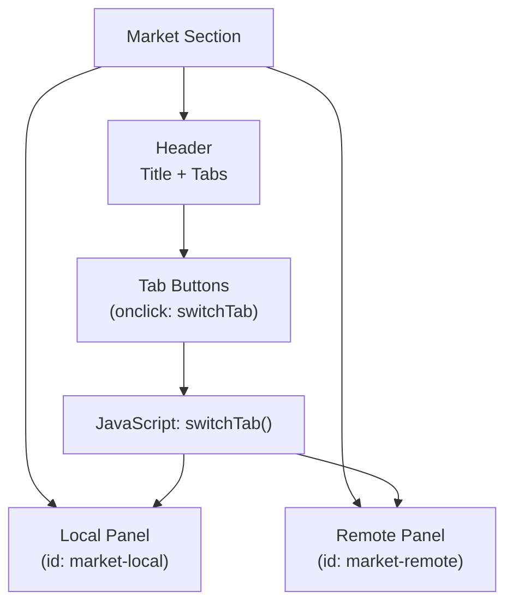
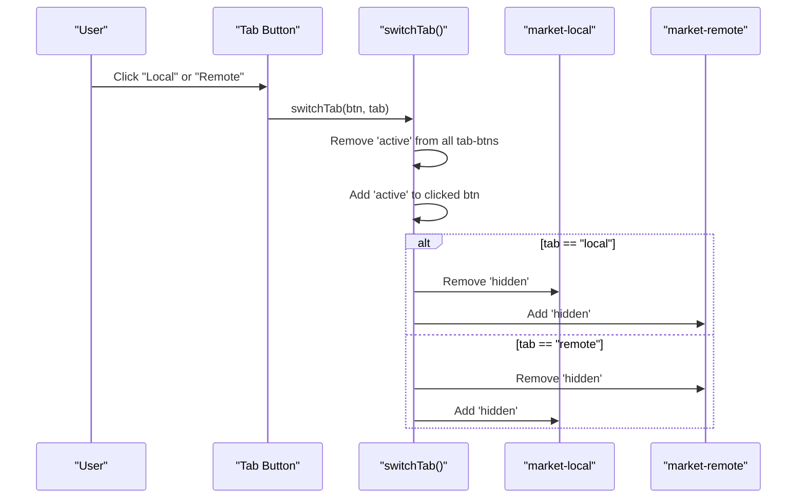
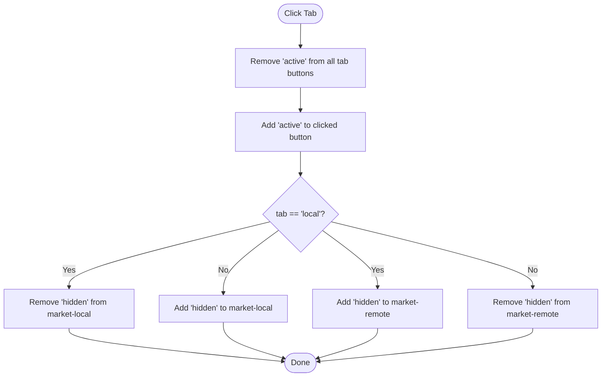
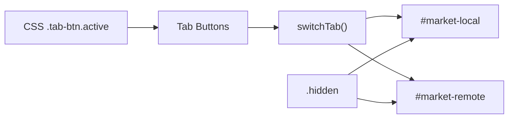

# Market Intelligence Section

<cite>
**Referenced Files in This Document**
- [index.html](file://index.html)
</cite>

## Table of Contents
1. [Introduction](#introduction)
2. [Project Structure](#project-structure)
3. [Core Components](#core-components)
4. [Architecture Overview](#architecture-overview)
5. [Detailed Component Analysis](#detailed-component-analysis)
6. [Dependency Analysis](#dependency-analysis)
7. [Performance Considerations](#performance-considerations)
8. [Troubleshooting Guide](#troubleshooting-guide)
9. [Conclusion](#conclusion)

## Introduction
This document explains the Pakistan Job Market Insights section that presents both local and remote opportunities for Pakistani developers. It covers the tabbed interface, the three-column layout per tab (demand levels, salary ranges, top platforms/hubs), and the JavaScript logic that switches between Local and Remote content. It also documents the styling approach for active tabs and content visibility toggling, and contextualizes the data within major hiring hubs in Pakistan and global remote platforms accessible to Pakistani developers.

## Project Structure
The market insights are implemented as a single self-contained HTML page with embedded CSS and JavaScript. The relevant UI is organized under a dedicated section with:
- A header containing the title and two tab buttons (Local and Remote).
- Two tab panels: one for local market data and one for remote opportunities.
- Each panel uses a responsive three-column grid to present demand, salaries, and platforms/hubs.

**Diagram sources**
- [index.html:315-390](file://index.html#L315-L390)
- [index.html:659-665](file://index.html#L659-L665)

**Section sources**
- [index.html:315-390](file://index.html#L315-L390)

## Core Components
- Tab controls: Two buttons labeled Local and Remote that trigger switching via an inline onclick handler calling switchTab().
- Tab panels:
  - Local panel (id: market-local): Three columns showing top local demand roles, average PKR salary ranges by level, and top hiring hubs including cities and remote platforms.
  - Remote panel (id: market-remote): Three columns showing global remote demand roles, USD salary ranges by level, and recommended platforms for Pakistani developers.
- Styling:
  - Active tab button state managed via a class-based style rule.
  - Content visibility controlled by toggling a hidden utility class on each panel.

Key behaviors:
- Clicking a tab removes the active class from all tab buttons and adds it to the clicked button.
- The function then hides or shows the corresponding panel by toggling the hidden class based on the selected tab.

**Section sources**
- [index.html:325-328](file://index.html#L325-L328)
- [index.html:330-389](file://index.html#L330-L389)
- [index.html:659-665](file://index.html#L659-L665)
- [index.html:42](file://index.html#L42)

## Architecture Overview
The market insights feature follows a simple client-side architecture:
- UI triggers (tab buttons) call a shared JavaScript function.
- The function updates UI state (active tab) and toggles visibility of content panels.
- No server calls are involved; all data is static within the HTML.

**Diagram sources**
- [index.html:325-328](file://index.html#L325-L328)
- [index.html:330-389](file://index.html#L330-L389)
- [index.html:659-665](file://index.html#L659-L665)

## Detailed Component Analysis

### Tabbed Interface and Switch Logic
- The tab buttons use inline event handlers to call switchTab(), passing the clicked element and the target tab identifier ("local" or "remote").
- switchTab():
  - Clears the active state from all tab buttons.
  - Sets the active state on the clicked button.
  - Toggles the hidden class on the two panels based on the selected tab.

**Diagram sources**
- [index.html:659-665](file://index.html#L659-L665)

**Section sources**
- [index.html:325-328](file://index.html#L325-L328)
- [index.html:659-665](file://index.html#L659-L665)

### Local Tab: Demand, Salaries, Hubs
- Top Demand — Local:
  - Full Stack Developer: High
  - React Developer: High
  - Python Developer: Medium
  - ML Engineer: Growing
  - Data Analyst: Growing
- Avg. Salary Range (PKR/mo):
  - Jr. Full Stack: 80K–150K
  - Jr. ML Engineer: 90K–160K
  - Mid React Dev: 150K–300K
  - Sr. AI Engineer: 250K–500K
  - Data Scientist: 200K–400K
- Top Hiring Hubs:
  - Lahore — Systems Ltd, Arbisoft
  - Karachi — 10Pearls, VentureDive
  - Islamabad — TkXel, Contour Software
  - Remote — Toptal, Turing, Crossover

These items are presented in a three-column grid for clarity and quick scanning.

**Section sources**
- [index.html:330-360](file://index.html#L330-L360)

### Remote Tab: Global Opportunities, Platforms, USD Salaries
- Remote Demand — Global:
  - Full Stack (MERN/Next.js): Very High
  - AI/ML Engineer: Very High
  - DevOps Engineer: High
  - Cloud Engineer (AWS): High
- Remote Salary (USD/mo):
  - Jr. Full Stack: $800–$2,000
  - ML Engineer: $1,500–$4,000
  - Mid Full Stack: $2,000–$5,000
  - Sr. AI/ML: $4,000–$8,000
- Platforms for Pakistani Devs:
  - Toptal — Premium freelance
  - Turing — AI-matched remote
  - Upwork — Build reputation
  - LinkedIn — Direct outreach

**Section sources**
- [index.html:361-389](file://index.html#L361-L389)

### CSS Styling for Tabs and Visibility
- Active tab button styling:
  - A class-based rule sets background and text color when a tab button has the active class.
- Content visibility:
  - Panels are shown or hidden by toggling a utility class that sets display to none when applied.
- Layout:
  - Each tab panel uses a responsive grid to create a three-column layout across breakpoints.

Implementation notes:
- The active state is applied programmatically via JavaScript.
- The hidden class is toggled based on the selected tab to ensure only one panel is visible at a time.

**Section sources**
- [index.html:42](file://index.html#L42)
- [index.html:330-389](file://index.html#L330-L389)
- [index.html:659-665](file://index.html#L659-L665)

### Pakistan-Specific Context
- Major hiring hubs:
  - Lahore, Karachi, and Islamabad are highlighted with representative companies.
- Remote opportunities:
  - Both local and remote sections emphasize availability of remote work for Pakistani developers through global platforms.

**Section sources**
- [index.html:351-358](file://index.html#L351-L358)
- [index.html:380-388](file://index.html#L380-L388)

## Dependency Analysis
- UI elements depend on:
  - Inline event handlers on tab buttons to invoke switchTab().
  - DOM IDs for the two panels to toggle visibility.
  - CSS classes for active state and hidden visibility.
- JavaScript dependency:
  - switchTab() is the central function coordinating UI state changes.

**Diagram sources**
- [index.html:325-328](file://index.html#L325-L328)
- [index.html:330-389](file://index.html#L330-L389)
- [index.html:42](file://index.html#L42)
- [index.html:659-665](file://index.html#L659-L665)

**Section sources**
- [index.html:325-328](file://index.html#L325-L328)
- [index.html:330-389](file://index.html#L330-L389)
- [index.html:42](file://index.html#L42)
- [index.html:659-665](file://index.html#L659-L665)

## Performance Considerations
- Client-side only: No network requests; interactions are instant.
- Minimal DOM manipulation: Only toggling classes and updating button states.
- Responsive grid: Uses utility classes to adapt to screen sizes without heavy reflows.

[No sources needed since this section provides general guidance]

## Troubleshooting Guide
- If tabs do not switch:
  - Ensure the tab buttons have the correct onclick handlers calling switchTab with the expected arguments.
  - Verify that the panel IDs match exactly: market-local and market-remote.
  - Confirm that the hidden utility class is available in the stylesheet or Tailwind configuration used by the page.
- If active state does not appear:
  - Check that the active class is being added to the clicked button and removed from others.
  - Ensure the CSS rule for .tab-btn.active is loaded and not overridden.

**Section sources**
- [index.html:325-328](file://index.html#L325-L328)
- [index.html:330-389](file://index.html#L330-L389)
- [index.html:42](file://index.html#L42)
- [index.html:659-665](file://index.html#L659-L665)

## Conclusion
The Pakistan Job Market Insights section provides a clear, interactive view of local and remote opportunities using a lightweight tabbed interface. The switchTab() function manages active states and content visibility efficiently, while the three-column layout organizes demand indicators, salary ranges, and key platforms/hubs for quick comprehension. The content reflects Pakistan-specific hiring hubs and global remote platforms, enabling users to explore both domestic and international career paths effectively.