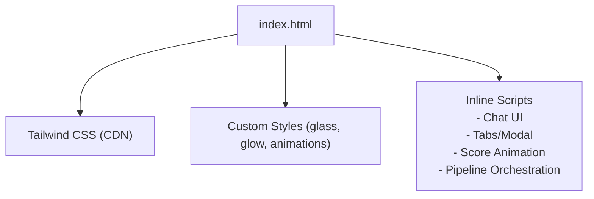
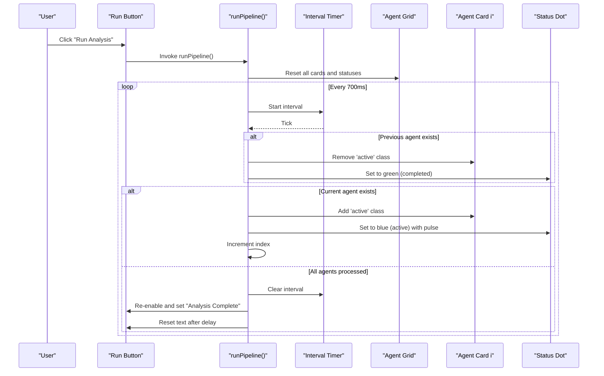
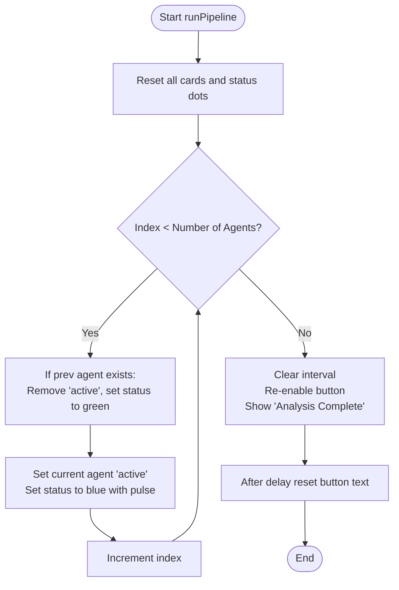
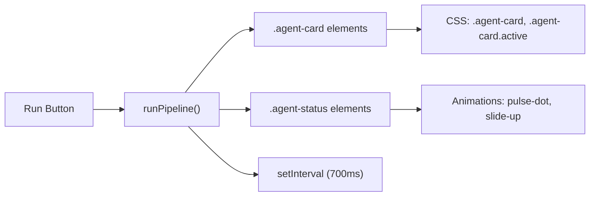

# Multi-Agent Pipeline Visualization

<cite>
**Referenced Files in This Document**
- [index.html](file://index.html)
</cite>

## Table of Contents
1. [Introduction](#introduction)
2. [Project Structure](#project-structure)
3. [Core Components](#core-components)
4. [Architecture Overview](#architecture-overview)
5. [Detailed Component Analysis](#detailed-component-analysis)
6. [Dependency Analysis](#dependency-analysis)
7. [Performance Considerations](#performance-considerations)
8. [Troubleshooting Guide](#troubleshooting-guide)
9. [Conclusion](#conclusion)

## Introduction
This document explains the multi-agent pipeline visualization that demonstrates sequential agent processing and status tracking. It focuses on six agent cards representing a Career Coach (orchestrator), Skill Assessment (evaluator), Market Intel (Pakistan + Remote), Career Path (planner), Roadmap Gen (builder), and Progress Tracker (monitor). The documentation details how the runPipeline() function orchestrates the sequential activation of agents with visual feedback, including CSS classes and status indicators, and how an interval-based animation system progresses through agents every 700ms to update status dots from gray (idle) to blue (active) to green (completed). It also covers button state management during execution and provides examples of how each agent’s role is represented visually to demonstrate collaborative problem-solving architecture.

## Project Structure
The project is implemented as a single-page application contained within one HTML file. It includes:
- Tailwind CSS via CDN for styling
- Custom CSS for glassmorphism, glow effects, animations, and agent card states
- Inline JavaScript handling chat interactions, tab switching, modal behavior, score animation, and the pipeline orchestration

**Diagram sources**
- [index.html:1-21](file://index.html#L1-L21)
- [index.html:22-43](file://index.html#L22-L43)
- [index.html:565-681](file://index.html#L565-L681)

**Section sources**
- [index.html:1-21](file://index.html#L1-L21)
- [index.html:22-43](file://index.html#L22-L43)
- [index.html:565-681](file://index.html#L565-L681)

## Core Components
- Agent Cards: Six cards represent the pipeline stages. Each card contains an icon, title, subtitle describing its role, and a status dot indicator.
- Status Indicators: Small circular dots under each card show idle (gray), active (blue with pulse), or completed (green).
- Pipeline Button: Triggers the runPipeline() function; changes text and disables while running.
- Pipeline Orchestration: An interval-driven sequence that highlights each agent card in order, updates status dots, and resets after completion.

Key implementation references:
- Agent grid and cards: [index.html:237-280](file://index.html#L237-L280)
- Pipeline button: [index.html:235](file://index.html#L235)
- runPipeline() logic: [index.html:631-657](file://index.html#L631-L657)
- CSS for agent-card and active state: [index.html:34-36](file://index.html#L34-L36)
- Status dot base styles and animations: [index.html:28-33](file://index.html#L28-L33)

**Section sources**
- [index.html:237-280](file://index.html#L237-L280)
- [index.html:235](file://index.html#L235)
- [index.html:631-657](file://index.html#L631-L657)
- [index.html:34-36](file://index.html#L34-L36)
- [index.html:28-33](file://index.html#L28-L33)

## Architecture Overview
The pipeline visualization models a sequential workflow where each agent processes in turn, providing clear visual feedback to the user. The flow is driven by an interval timer that advances through the agent list, toggling active states and updating status dots accordingly.

**Diagram sources**
- [index.html:235](file://index.html#L235)
- [index.html:631-657](file://index.html#L631-L657)
- [index.html:237-280](file://index.html#L237-L280)

## Detailed Component Analysis

### Agent Cards and Roles
Each agent card visually communicates its role through iconography, title, and subtitle:
- Career Coach (Orchestrator): Central coordinator that initiates and sequences other agents.
- Skill Assessment (Evaluator): Assesses current skills and identifies gaps.
- Market Intel (Pakistan + Remote): Provides local and global market insights.
- Career Path (Planner): Synthesizes inputs to propose career pathways.
- Roadmap Gen (Builder): Generates actionable steps and milestones.
- Progress Tracker (Monitor): Tracks progress and updates metrics.

Visual representation references:
- Agent grid and roles: [index.html:237-280](file://index.html#L237-L280)

**Section sources**
- [index.html:237-280](file://index.html#L237-L280)

### CSS Classes and Active State Styling
- .agent-card: Base styling with transition and hover effects.
- .agent-card.active: Highlights the currently active agent with border color and enhanced shadow.
- .agent-status: Base style for the status dot.
- Idle: Gray background (default).
- Active: Blue background with pulsing animation.
- Completed: Green background indicating finished processing.

References:
- Base and active styles: [index.html:34-36](file://index.html#L34-L36)
- Status dot base and animations: [index.html:28-33](file://index.html#L28-L33)

**Section sources**
- [index.html:34-36](file://index.html#L34-L36)
- [index.html:28-33](file://index.html#L28-L33)

### Interval-Based Animation System
The runPipeline() function uses setInterval to advance through agents every 700ms:
- On each tick, it marks the previous agent as completed (green) and removes active highlighting.
- It then activates the next agent (blue with pulse) and increments the index.
- When all agents are processed, it clears the interval, re-enables the button, shows completion text, and resets the button after a delay.

References:
- Pipeline orchestration: [index.html:631-657](file://index.html#L631-L657)

**Diagram sources**
- [index.html:631-657](file://index.html#L631-L657)

**Section sources**
- [index.html:631-657](file://index.html#L631-L657)

### Button State Management During Execution
- Before start: Button displays “▶ Run Analysis”.
- During execution: Button becomes disabled, text changes to “⏳ Analyzing...”, and opacity reduces.
- After completion: Button re-enabled, text changes to “✓ Analysis Complete”, then resets back to “▶ Run Analysis” after a short delay.

References:
- Button element and click handler: [index.html:235](file://index.html#L235)
- State transitions in runPipeline(): [index.html:631-657](file://index.html#L631-L657)

**Section sources**
- [index.html:235](file://index.html#L235)
- [index.html:631-657](file://index.html#L631-L657)

### Visual Representation of Collaborative Problem-Solving
The pipeline demonstrates collaboration by sequentially activating specialized agents:
- Orchestrator (Career Coach) coordinates the process.
- Evaluator (Skill Assessment) informs planners about skill gaps.
- Market Intel provides context for both local and remote opportunities.
- Planner (Career Path) synthesizes data into actionable pathways.
- Builder (Roadmap Gen) constructs step-by-step plans.
- Monitor (Progress Tracker) tracks outcomes and readiness.

This sequence visually communicates how multiple agents collaborate to produce a cohesive career roadmap.

References:
- Agent roles and layout: [index.html:237-280](file://index.html#L237-L280)

**Section sources**
- [index.html:237-280](file://index.html#L237-L280)

## Dependency Analysis
The pipeline depends on:
- DOM elements: Agent cards and status dots identified by class selectors and attributes.
- CSS classes: .agent-card, .agent-card.active, .agent-status, and animation utilities.
- Timing: setInterval driving the 700ms cadence.
- Button control: Disabling/enabling and text updates during lifecycle.

**Diagram sources**
- [index.html:235](file://index.html#L235)
- [index.html:237-280](file://index.html#L237-L280)
- [index.html:631-657](file://index.html#L631-L657)
- [index.html:28-33](file://index.html#L28-L33)
- [index.html:34-36](file://index.html#L34-L36)

**Section sources**
- [index.html:235](file://index.html#L235)
- [index.html:237-280](file://index.html#L237-L280)
- [index.html:631-657](file://index.html#L631-L657)
- [index.html:28-33](file://index.html#L28-L33)
- [index.html:34-36](file://index.html#L34-L36)

## Performance Considerations
- Interval cadence: 700ms provides smooth visual pacing without overwhelming the UI.
- Minimal DOM manipulation: Only active class and status dot classes are toggled per tick.
- No heavy computations: The pipeline is purely UI-driven; actual analysis would be simulated or integrated later.
- Accessibility: Ensure focus states and keyboard navigation remain usable when the button is disabled.

[No sources needed since this section provides general guidance]

## Troubleshooting Guide
Common issues and resolutions:
- Agents not animating: Verify that agent cards have the .agent-card class and status dots use .agent-status.
- Status dots not changing colors: Confirm that runPipeline() correctly sets className for status dots to include bg-emerald-500 (completed) and bg-brand-500 animate-pulse-dot (active).
- Button remains disabled: Check that the interval is cleared and button properties are reset after completion.
- Incorrect sequencing: Ensure the index increment and boundary checks are correct so the last agent completes and the loop exits.

References:
- Pipeline logic and state updates: [index.html:631-657](file://index.html#L631-L657)
- Status dot classes and animations: [index.html:28-33](file://index.html#L28-L33)
- Agent card structure: [index.html:237-280](file://index.html#L237-L280)

**Section sources**
- [index.html:631-657](file://index.html#L631-L657)
- [index.html:28-33](file://index.html#L28-L33)
- [index.html:237-280](file://index.html#L237-L280)

## Conclusion
The multi-agent pipeline visualization effectively demonstrates sequential agent processing with clear visual feedback. Through well-defined CSS classes, status indicators, and an interval-driven orchestration, it showcases how specialized agents collaborate to build a personalized career roadmap. The design balances simplicity and clarity, making complex workflows accessible to users while laying a foundation for future integration with real agent services.

[No sources needed since this section summarizes without analyzing specific files]