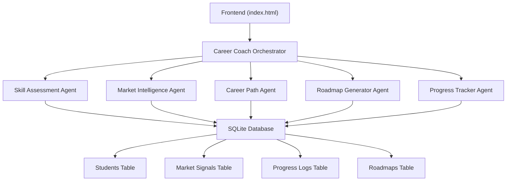
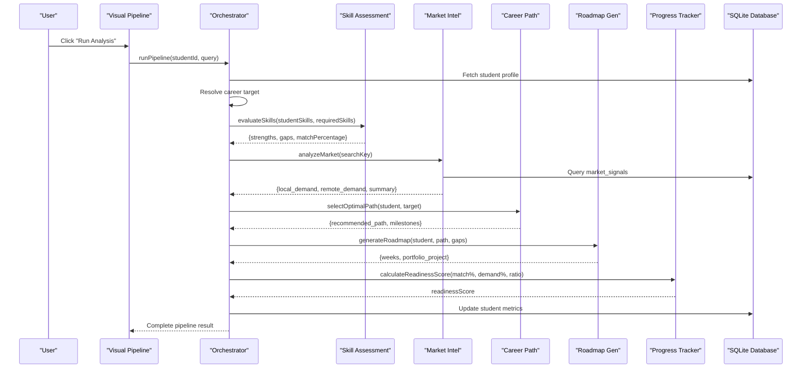
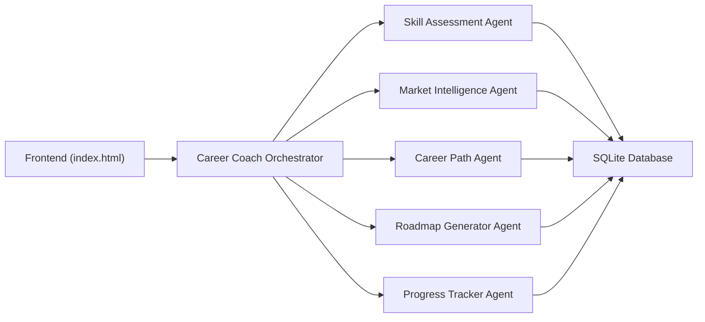

# Multi-Agent Pipeline Visualization

<cite>
**Referenced Files in This Document**
- [index.html](file://index.html)
- [careerCoachOrchestrator.js](file://agents/careerCoachOrchestrator.js)
- [skillAssessmentAgent.js](file://agents/skillAssessmentAgent.js)
- [marketIntelligenceAgent.js](file://agents/marketIntelligenceAgent.js)
- [careerPathAgent.js](file://agents/careerPathAgent.js)
- [roadmapGeneratorAgent.js](file://agents/roadmapGeneratorAgent.js)
- [progressTrackerAgent.js](file://agents/progressTrackerAgent.js)
- [db.js](file://database/db.js)
- [seed.js](file://database/seed.js)
</cite>

## Update Summary
**Changes Made**
- Updated to reflect fully implemented multi-agent pipeline with six specialized agents
- Added detailed documentation of actual processing logic in each agent module
- Enhanced architecture overview to show real data flow between agents
- Updated component analysis to document real agent capabilities and database integration
- Added new sections covering agent orchestration, data persistence, and bilingual recommendations

## Table of Contents
1. [Introduction](#introduction)
2. [Project Structure](#project-structure)
3. [Core Components](#core-components)
4. [Architecture Overview](#architecture-overview)
5. [Detailed Component Analysis](#detailed-component-analysis)
6. [Agent Processing Logic](#agent-processing-logic)
7. [Data Flow and Persistence](#data-flow-and-persistence)
8. [Visual Pipeline Interface](#visual-pipeline-interface)
9. [Dependency Analysis](#dependency-analysis)
10. [Performance Considerations](#performance-considerations)
11. [Troubleshooting Guide](#troubleshooting-guide)
12. [Conclusion](#conclusion)

## Introduction
This document explains the fully implemented multi-agent pipeline visualization that demonstrates sequential agent processing with real computational logic and status tracking. The system features six specialized agents representing a Career Coach (orchestrator), Skill Assessment (evaluator), Market Intelligence (Pakistan + Remote), Career Path (planner), Roadmap Generator (builder), and Progress Tracker (monitor). Each agent performs actual data processing using SQLite database queries, deterministic algorithms, and collaborative problem-solving to generate personalized career recommendations. The documentation details how the orchestrator's `runPipeline()` function coordinates the sequential activation of agents with visual feedback, including CSS classes and status indicators, while maintaining real-time progress tracking through an interval-based animation system.

## Project Structure
The project implements a complete multi-agent system with separate modules for each agent, database management, and a frontend visualization layer:

**Diagram sources**
- [careerCoachOrchestrator.js:22-26](file://agents/careerCoachOrchestrator.js#L22-L26)
- [db.js:71-120](file://database/db.js#L71-L120)

**Section sources**
- [index.html:228-281](file://index.html#L228-L281)
- [careerCoachOrchestrator.js:1-337](file://agents/careerCoachOrchestrator.js#L1-L337)
- [db.js:1-125](file://database/db.js#L1-L125)

## Core Components
The multi-agent system consists of six specialized agents, each with distinct responsibilities and processing capabilities:

### Agent Roles and Responsibilities
- **Career Coach (Orchestrator)**: Central coordinator that fetches student profiles, resolves career targets, and sequences other agents
- **Skill Assessment (Evaluator)**: Compares student skills against target role requirements using deterministic matching algorithms
- **Market Intelligence (Pakistan + Remote)**: Queries market demand data from SQLite database and generates contextualized summaries
- **Career Path (Planner)**: Scores predefined career paths against student profiles using weighted scoring algorithms
- **Roadmap Generator (Builder)**: Creates 4-week action plans with portfolio project recommendations based on skill gaps
- **Progress Tracker (Monitor)**: Calculates readiness scores using weighted formulas and tracks task completion progress

### Visual Pipeline Interface
The frontend displays six agent cards with real-time status indicators showing idle (gray), active (blue with pulse), or completed (green) states. The pipeline button triggers the orchestrator's `runPipeline()` function which coordinates the entire processing sequence.

**Section sources**
- [index.html:237-280](file://index.html#L237-L280)
- [careerCoachOrchestrator.js:210-337](file://agents/careerCoachOrchestrator.js#L210-L337)

## Architecture Overview
The pipeline follows a sequential workflow where each agent processes data and passes results to the next agent, creating a comprehensive career analysis system:

**Diagram sources**
- [careerCoachOrchestrator.js:210-337](file://agents/careerCoachOrchestrator.js#L210-L337)
- [db.js:71-120](file://database/db.js#L71-L120)

## Detailed Component Analysis

### Career Coach Orchestrator Agent
The orchestrator serves as the central coordination layer, managing the entire pipeline execution:

**Key Functions:**
- `resolveTarget()`: Intelligent career target resolution with priority-based matching
- `buildRecommendation()`: Generates bilingual (English + Roman Urdu) recommendations
- `runPipeline()`: Main orchestration function coordinating all six agents

**Processing Logic:**
1. Fetches student profile from SQLite database
2. Resolves career target using keyword matching and comparison detection
3. Coordinates sequential execution of remaining five agents
4. Aggregates results into unified response structure
5. Persists readiness scores back to database

**Section sources**
- [careerCoachOrchestrator.js:47-159](file://agents/careerCoachOrchestrator.js#L47-L159)
- [careerCoachOrchestrator.js:165-198](file://agents/careerCoachOrchestrator.js#L165-L198)
- [careerCoachOrchestrator.js:210-337](file://agents/careerCoachOrchestrator.js#L210-L337)

### Skill Assessment Agent
Performs deterministic skill matching between student capabilities and target role requirements:

**Algorithm Features:**
- Case-insensitive normalization for accurate matching
- Exact string comparison with preserved casing in results
- Comprehensive gap analysis with percentage calculations
- Deterministic output ensuring consistent results

**Output Structure:**
- Strengths: Skills the student already possesses
- Gaps: Missing skills needed for target role
- Match Percentage: Calculated success rate
- Total counts for strengths and gaps

**Section sources**
- [skillAssessmentAgent.js:16-74](file://agents/skillAssessmentAgent.js#L16-L74)

### Market Intelligence Agent
Queries and analyzes market demand data for Pakistani tech roles:

**Search Strategy:**
1. Exact match on domain or role title (case-insensitive)
2. Partial LIKE match for flexible searching
3. Fallback to baseline metrics when no matches found

**Contextual Analysis:**
- Generates human-readable summaries tailored for Pakistani graduates
- Provides opportunity comparisons between local and remote markets
- Includes growth trend analysis and platform recommendations

**Section sources**
- [marketIntelligenceAgent.js:28-60](file://agents/marketIntelligenceAgent.js#L28-L60)
- [marketIntelligenceAgent.js:81-119](file://agents/marketIntelligenceAgent.js#L81-L119)

### Career Path Agent
Evaluates and selects optimal career paths using weighted scoring algorithms:

**Scoring Factors:**
- Education level match (40 points maximum)
- Interest keyword overlap (12 points per match)
- Explicit target preference bonus (30 points)

**Available Paths:**
- AI/ML Engineer (Data & AI domain)
- Full Stack Web Developer (Web domain)
- Data Analyst (Data domain)
- Computer Science Foundation (CS Fundamentals)
- Data Analytics Entry (Data domain)

**Section sources**
- [careerPathAgent.js:12-83](file://agents/careerPathAgent.js#L12-L83)
- [careerPathAgent.js:93-158](file://agents/careerPathAgent.js#L93-L158)

### Roadmap Generator Agent
Creates personalized 4-week action plans with portfolio project recommendations:

**Week Structure:**
- Week 1: Foundation - Core Skill Build
- Week 2: Practice - Course Completion & Exercises
- Week 3: Build - Portfolio Project Development
- Week 4: Launch - Job Readiness & Applications

**Portfolio Projects:**
- Role-specific project templates with technology stacks
- Estimated durations and impact ratings
- Real-world applicability for Pakistani job market

**Section sources**
- [roadmapGeneratorAgent.js:13-49](file://agents/roadmapGeneratorAgent.js#L13-L49)
- [roadmapGeneratorAgent.js:95-181](file://agents/roadmapGeneratorAgent.js#L95-L181)

### Progress Tracker Agent
Calculates career readiness scores and manages task completion tracking:

**Readiness Score Formula:**
- Skill alignment (50% weight): Student's skill match percentage
- Market demand (30% weight): Remote job market demand percentage
- Plan progress (20% weight): Completed tasks ratio

**Task Management:**
- Toggle task status between pending and completed
- Automatic readiness score recalculation
- Database persistence of progress updates

**Section sources**
- [progressTrackerAgent.js:30-43](file://agents/progressTrackerAgent.js#L30-L43)
- [progressTrackerAgent.js:64-134](file://agents/progressTrackerAgent.js#L64-L134)

## Agent Processing Logic
The pipeline executes agents sequentially with each agent building upon previous results:

### Step-by-Step Execution Flow

1. **Student Profile Loading**
   - Fetches student data from SQLite database
   - Parses JSON skill arrays and interest strings
   - Validates student existence and data integrity

2. **Career Target Resolution**
   - Analyzes user query for comparison patterns (e.g., "AI/ML vs Web")
   - Applies priority-based matching with fallback strategies
   - Extracts required skills for target role

3. **Skill Assessment Processing**
   - Normalizes student skills for case-insensitive comparison
   - Identifies strengths and gaps against target requirements
   - Calculates match percentage deterministically

4. **Market Intelligence Analysis**
   - Queries market_signals table for demand metrics
   - Generates contextualized summaries for Pakistani context
   - Provides local and remote demand comparisons

5. **Career Path Selection**
   - Scores predefined paths against student profile
   - Considers education level, interests, and explicit preferences
   - Returns optimal path with alternatives

6. **Roadmap Generation**
   - Creates 4-week structured learning plan
   - Recommends portfolio projects based on selected path
   - Integrates skill gaps into weekly task assignments

7. **Progress Tracking and Scoring**
   - Calculates readiness score using weighted formula
   - Updates database with computed metrics
   - Persists results for future reference

**Section sources**
- [careerCoachOrchestrator.js:222-337](file://agents/careerCoachOrchestrator.js#L222-L337)

## Data Flow and Persistence
The system maintains data consistency through SQLite database operations:

### Database Schema
- **students**: Stores personal information, skills, and computed metrics
- **market_signals**: Contains job market data for different roles
- **roadmaps**: Saves generated career plans and project recommendations
- **progress_logs**: Tracks individual task completion status

### Data Persistence Strategy
- All write operations automatically persist to disk via `saveToDisk()`
- Read operations use prepared statements for security and performance
- Foreign key constraints maintain referential integrity
- JSON fields store complex data structures (skills, roadmaps, projects)

### State Management
- Readiness scores updated after each pipeline execution
- Task completion tracked with timestamps
- Market demand percentages stored for historical analysis
- Student metrics aggregated across multiple pipeline runs

**Section sources**
- [db.js:71-120](file://database/db.js#L71-L120)
- [db.js:36-53](file://database/db.js#L36-L53)
- [seed.js:43-209](file://database/seed.js#L43-L209)

## Visual Pipeline Interface
The frontend provides real-time visualization of agent processing with interactive elements:

### Agent Card System
Each agent card displays:
- Icon representing agent type
- Agent name and role description
- Status indicator dot (idle/active/completed)
- Glass morphism styling with hover effects

### Animation System
- **Interval-based progression**: 700ms intervals advance through agents
- **Status transitions**: Gray → Blue (pulsing) → Green color coding
- **Active highlighting**: Border color and shadow effects during processing
- **Completion feedback**: Button state changes and completion messages

### Interactive Elements
- Pipeline trigger button with disabled state during execution
- Real-time status updates reflecting backend processing
- Responsive grid layout adapting to screen sizes
- Accessibility considerations for keyboard navigation

**Section sources**
- [index.html:235-280](file://index.html#L235-L280)
- [index.html:631-657](file://index.html#L631-L657)
- [index.html:28-36](file://index.html#L28-L36)

## Dependency Analysis
The multi-agent system has well-defined dependencies between components:

### Module Dependencies
- **Orchestrator** depends on all five specialist agents
- **Agents** depend on database interface for data access
- **Frontend** depends on orchestrator API for pipeline execution
- **Database** provides persistent storage for all components

### Runtime Dependencies
- SQLite database must be initialized before pipeline execution
- Student records must exist for pipeline to process
- Market signals data required for intelligence analysis
- Progress logs needed for readiness score calculation

### External Dependencies
- Tailwind CSS for styling and animations
- SQL.js for in-memory SQLite database operations
- Node.js runtime for server-side agent execution

**Diagram sources**
- [careerCoachOrchestrator.js:22-26](file://agents/careerCoachOrchestrator.js#L22-L26)
- [db.js:1-20](file://database/db.js#L1-L20)

**Section sources**
- [careerCoachOrchestrator.js:22-26](file://agents/careerCoachOrchestrator.js#L22-L26)
- [db.js:1-20](file://database/db.js#L1-L20)

## Performance Considerations
The multi-agent system is optimized for efficient processing:

### Computational Efficiency
- **Deterministic algorithms**: No random operations ensure consistent performance
- **Database indexing**: Primary keys and foreign keys optimize query performance
- **Memory management**: In-memory SQLite database reduces I/O overhead
- **Batch operations**: Multiple database operations grouped for efficiency

### Scalability Factors
- **Modular architecture**: Each agent operates independently for easy scaling
- **Database abstraction**: Clean separation between business logic and data access
- **Stateless processing**: Agents don't maintain persistent state between calls
- **Resource cleanup**: Proper disposal of database connections and resources

### User Experience Optimization
- **Non-blocking UI**: Visual pipeline continues during backend processing
- **Progressive feedback**: Real-time status updates keep users informed
- **Error handling**: Graceful degradation when data is missing or invalid
- **Responsive design**: Adapts to various screen sizes and devices

## Troubleshooting Guide
Common issues and their solutions in the multi-agent pipeline:

### Database Issues
- **Connection errors**: Ensure `initDatabase()` is called before any agent execution
- **Missing data**: Verify seed script has been run to populate initial data
- **Schema conflicts**: Check database version compatibility and migration scripts

### Agent Processing Errors
- **Skill assessment failures**: Validate input arrays contain proper skill strings
- **Market intelligence timeouts**: Implement retry logic for database queries
- **Career path scoring issues**: Verify student profile contains required fields

### Pipeline Execution Problems
- **Orchestrator hangs**: Check for infinite loops in agent sequencing
- **Memory leaks**: Monitor database connection lifecycle and resource cleanup
- **State synchronization**: Ensure frontend status matches backend processing state

### Visual Interface Issues
- **Animation glitches**: Verify CSS classes are properly applied and removed
- **Status indicator problems**: Check DOM element references and class names
- **Button state conflicts**: Implement proper event handling for concurrent executions

**Section sources**
- [careerCoachOrchestrator.js:226-229](file://agents/careerCoachOrchestrator.js#L226-L229)
- [skillAssessmentAgent.js:35-47](file://agents/skillAssessmentAgent.js#L35-L47)
- [marketIntelligenceAgent.js:82-90](file://agents/marketIntelligenceAgent.js#L82-L90)
- [index.html:631-657](file://index.html#L631-L657)

## Conclusion
The fully implemented multi-agent pipeline represents a sophisticated career guidance system that combines specialized AI agents with real-time visualization and persistent data management. The system successfully demonstrates collaborative problem-solving architecture where each agent contributes unique expertise to create comprehensive career recommendations. Through deterministic algorithms, database integration, and responsive user interface, the pipeline provides actionable insights for Pakistani students navigating their career paths. The modular design ensures scalability and maintainability while the bilingual support makes the system accessible to diverse user bases. This implementation serves as a foundation for future enhancements including machine learning integration, expanded market data, and personalized recommendation engines.