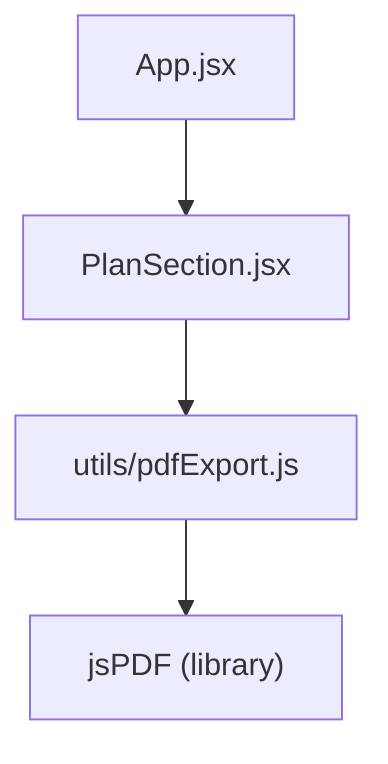
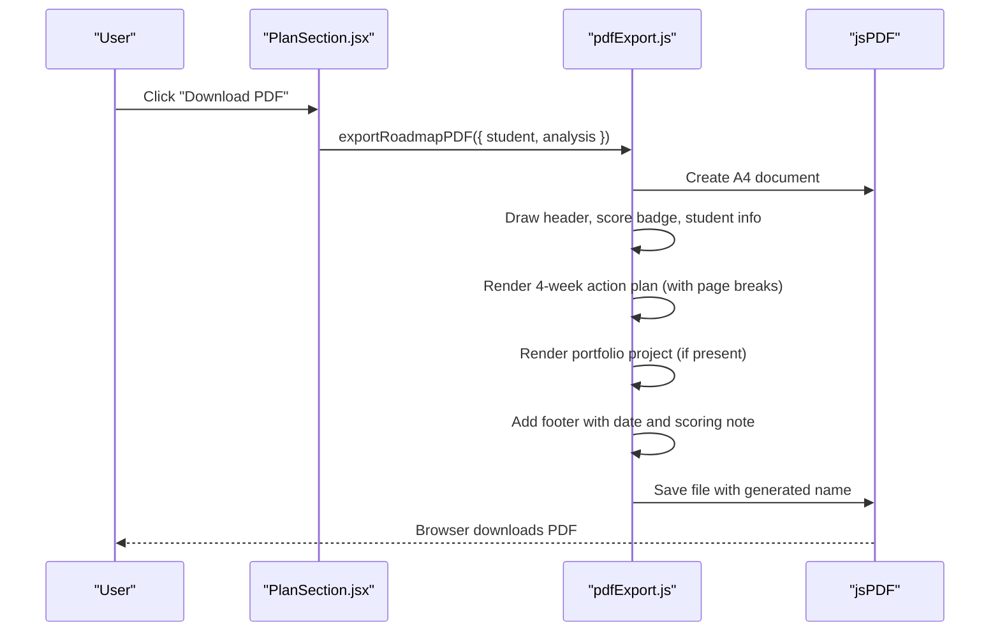
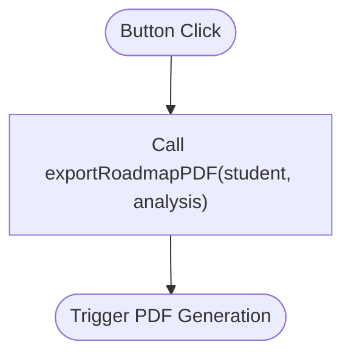
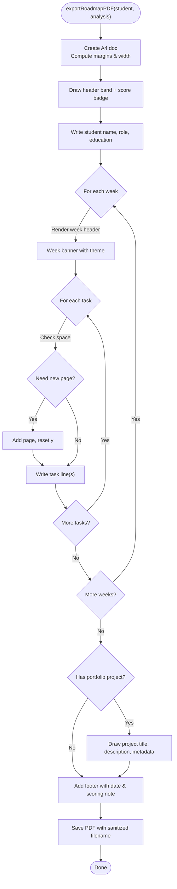
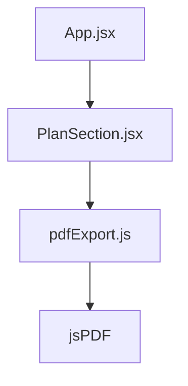

# PDF Export Functionality

<cite>
**Referenced Files in This Document**
- [pdfExport.js](file://frontend/src/utils/pdfExport.js)
- [PlanSection.jsx](file://frontend/src/components/PlanSection.jsx)
- [App.jsx](file://frontend/src/App.jsx)
</cite>

## Table of Contents
1. [Introduction](#introduction)
2. [Project Structure](#project-structure)
3. [Core Components](#core-components)
4. [Architecture Overview](#architecture-overview)
5. [Detailed Component Analysis](#detailed-component-analysis)
6. [Dependency Analysis](#dependency-analysis)
7. [Performance Considerations](#performance-considerations)
8. [Troubleshooting Guide](#troubleshooting-guide)
9. [Conclusion](#conclusion)

## Introduction
This document explains the PDF export functionality that generates a branded, printable Career Roadmap report from the application’s analysis and student data. The feature is implemented as a client-side utility that renders a structured A4 PDF with a consistent theme, including a header, student information, a 4-week action plan, and a recommended portfolio project. It is triggered by a user action in the Plan section and uses a popular PDF library to produce the final file for download.

## Project Structure
The PDF export feature spans two primary files:
- A UI trigger in the Plan section component that calls the export function with current state.
- A dedicated utility that builds and saves the PDF using a PDF generation library.

**Diagram sources**
- [App.jsx:403-446](file://frontend/src/App.jsx#L403-L446)
- [PlanSection.jsx:58-64](file://frontend/src/components/PlanSection.jsx#L58-L64)
- [pdfExport.js:11-12](file://frontend/src/utils/pdfExport.js#L11-L12)

**Section sources**
- [PlanSection.jsx:58-64](file://frontend/src/components/PlanSection.jsx#L58-L64)
- [pdfExport.js:11-12](file://frontend/src/utils/pdfExport.js#L11-L12)

## Core Components
- Plan Section button: Renders a “Download PDF” button that invokes the export function with the current student and analysis objects.
- PDF Utility: Builds an A4 PDF with a white/gold/brown theme, writes sections for student info, weekly tasks, and portfolio project, handles page breaks, and triggers a browser save.

Key responsibilities:
- Extracting relevant fields from the analysis and student objects.
- Rendering a header band, score badge, and footer.
- Iterating through weekly tasks and wrapping text to fit page width.
- Adding a new page when content exceeds available space.
- Saving the generated PDF with a filename derived from the student name.

**Section sources**
- [PlanSection.jsx:58-64](file://frontend/src/components/PlanSection.jsx#L58-L64)
- [pdfExport.js:36-192](file://frontend/src/utils/pdfExport.js#L36-L192)

## Architecture Overview
The export flow is a simple client-side sequence:
1. User clicks “Download PDF” in the Plan section.
2. The component calls the export function with current state.
3. The utility constructs a PDF, draws themed sections, and saves it.

**Diagram sources**
- [PlanSection.jsx:58-64](file://frontend/src/components/PlanSection.jsx#L58-L64)
- [pdfExport.js:36-192](file://frontend/src/utils/pdfExport.js#L36-L192)

## Detailed Component Analysis

### Plan Section Trigger
- Purpose: Provide a one-click way to generate and download the roadmap PDF.
- Behavior: On click, passes the current student and analysis props to the export utility.
- Data contract: Expects analysis to include weeklyTasks and portfolioProject; expects student to include name and readiness_score.

**Diagram sources**
- [PlanSection.jsx:58-64](file://frontend/src/components/PlanSection.jsx#L58-L64)

**Section sources**
- [PlanSection.jsx:58-64](file://frontend/src/components/PlanSection.jsx#L58-L64)

### PDF Utility Implementation
- Purpose: Generate a branded, print-ready PDF containing the student’s roadmap and insights.
- Key behaviors:
  - Creates an A4 PDF with margins and calculates usable content width.
  - Draws a header band with branding and a score badge aligned to the right.
  - Writes student details (name, target role, education).
  - Iterates through weekly tasks, marking completed tasks distinctly and wrapping long lines.
  - Adds a new page when content approaches the bottom margin.
  - Includes a recommended portfolio project section with title, description, tech stack, duration, and impact.
  - Adds a footer with generation date and a note about scoring weights.
  - Saves the PDF with a sanitized filename based on the student name.

**Diagram sources**
- [pdfExport.js:36-192](file://frontend/src/utils/pdfExport.js#L36-L192)

**Section sources**
- [pdfExport.js:36-192](file://frontend/src/utils/pdfExport.js#L36-L192)

### Application Context and State Flow
- The dashboard composes multiple sections, including PlanSection, which receives the latest analysis and student data.
- When analysis is available, the Plan section exposes the PDF export button.
- The app manages analysis state and updates student scores after pipeline completion, ensuring the exported PDF reflects the most recent results.

**Diagram sources**
- [App.jsx:403-446](file://frontend/src/App.jsx#L403-L446)
- [PlanSection.jsx:58-64](file://frontend/src/components/PlanSection.jsx#L58-L64)

**Section sources**
- [App.jsx:403-446](file://frontend/src/App.jsx#L403-L446)
- [PlanSection.jsx:58-64](file://frontend/src/components/PlanSection.jsx#L58-L64)

## Dependency Analysis
- PlanSection depends on the export utility to perform PDF generation.
- The export utility depends on a PDF generation library to create and save the document.
- The app orchestrates state that feeds both components.

**Diagram sources**
- [App.jsx:403-446](file://frontend/src/App.jsx#L403-L446)
- [PlanSection.jsx:58-64](file://frontend/src/components/PlanSection.jsx#L58-L64)
- [pdfExport.js:11-12](file://frontend/src/utils/pdfExport.js#L11-L12)

**Section sources**
- [PlanSection.jsx:58-64](file://frontend/src/components/PlanSection.jsx#L58-L64)
- [pdfExport.js:11-12](file://frontend/src/utils/pdfExport.js#L11-L12)

## Performance Considerations
- Text wrapping and multi-line rendering are handled per task and description, which can be CPU-intensive for large plans. Consider limiting the number of tasks or pages if performance becomes an issue.
- Page break checks occur during iteration; ensure the dataset size remains reasonable to avoid excessive reflows.
- The PDF is generated entirely in the browser; heavy content may cause temporary UI pauses. Debouncing or offloading via Web Workers could be considered for very large datasets.

[No sources needed since this section provides general guidance]

## Troubleshooting Guide
Common issues and resolutions:
- Missing data: If student or analysis is undefined or incomplete, the PDF may render placeholders or omit sections. Ensure the Plan section has valid props before exporting.
- Language support: The PDF uses a Latin-only font; non-Latin characters may not render correctly. The export always produces English output regardless of the app’s language setting.
- Large content overflow: If many tasks exist, the utility automatically adds new pages. Verify that the expected content fits across pages and that no critical sections are truncated.
- File naming: Filenames are sanitized from the student name. If names contain special characters, they are removed to ensure safe filenames.

**Section sources**
- [pdfExport.js:7-9](file://frontend/src/utils/pdfExport.js#L7-L9)
- [pdfExport.js:43-48](file://frontend/src/utils/pdfExport.js#L43-L48)
- [pdfExport.js:112-130](file://frontend/src/utils/pdfExport.js#L112-L130)
- [pdfExport.js:132-175](file://frontend/src/utils/pdfExport.js#L132-L175)
- [pdfExport.js:177-192](file://frontend/src/utils/pdfExport.js#L177-L192)

## Conclusion
The PDF export feature provides a streamlined way to capture and share a student’s personalized career roadmap. It integrates tightly with the Plan section and leverages a robust PDF generation utility to deliver a clean, branded document. By understanding the data contracts and behavior outlined here, developers can extend or customize the export while maintaining consistency and reliability.

[No sources needed since this section summarizes without analyzing specific files]