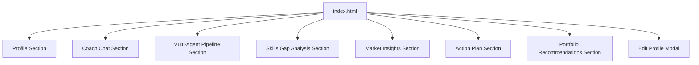
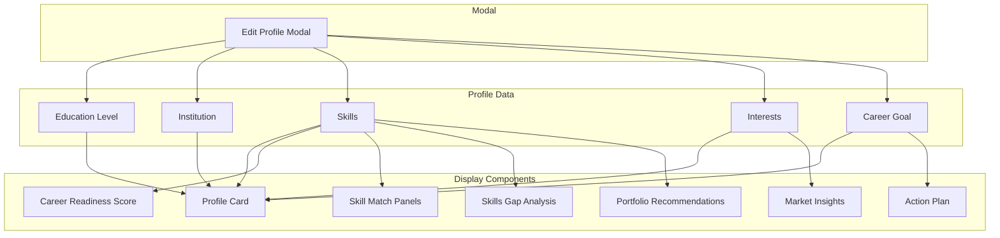
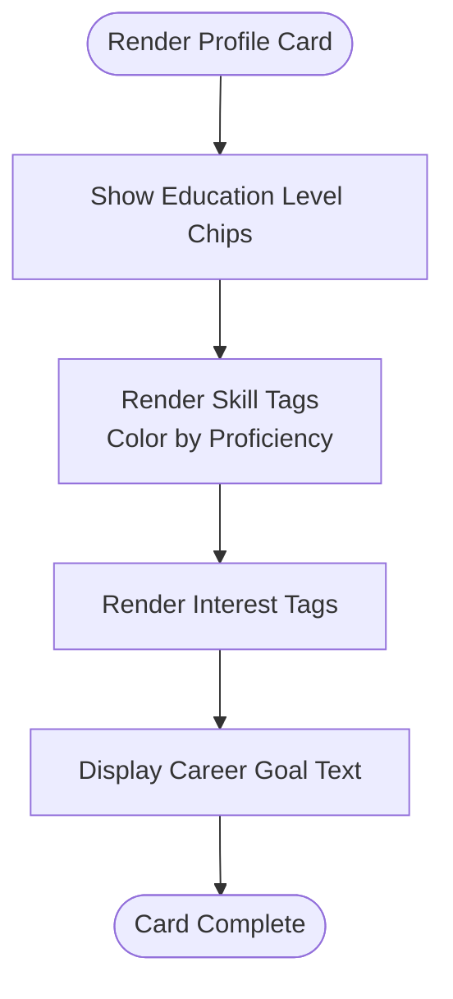
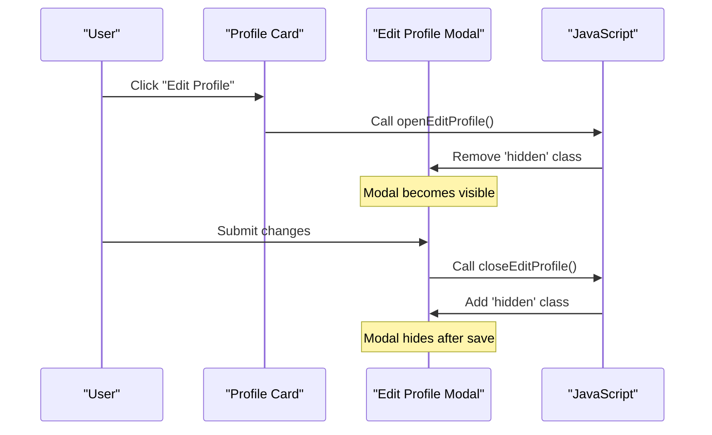
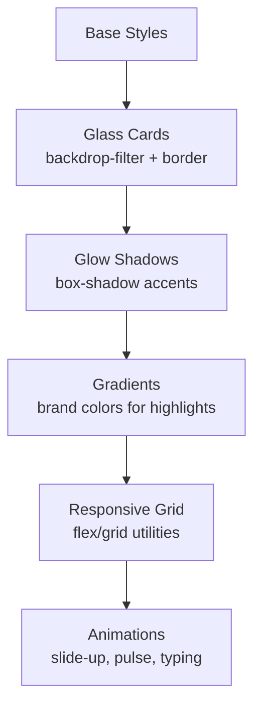
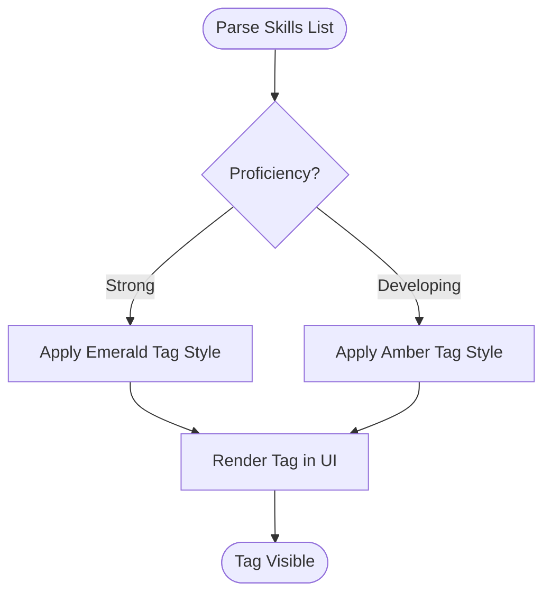
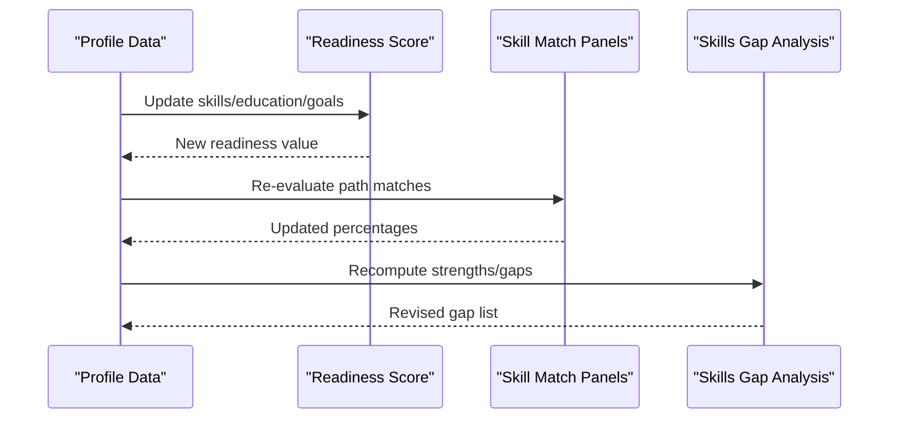
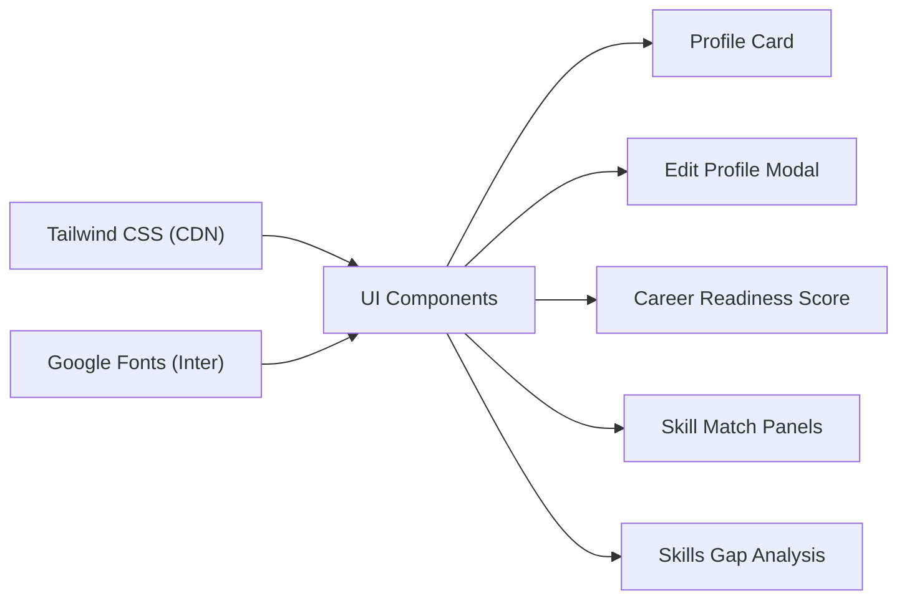

# Profile Management System

<cite>
**Referenced Files in This Document**
- [index.html](file://index.html)
</cite>

## Table of Contents
1. [Introduction](#introduction)
2. [Project Structure](#project-structure)
3. [Core Components](#core-components)
4. [Architecture Overview](#architecture-overview)
5. [Detailed Component Analysis](#detailed-component-analysis)
6. [Dependency Analysis](#dependency-analysis)
7. [Performance Considerations](#performance-considerations)
8. [Troubleshooting Guide](#troubleshooting-guide)
9. [Conclusion](#conclusion)

## Introduction
This document explains the profile management system within a single-page prototype that showcases user data display and editing capabilities. It focuses on:
- The profile card showing education level, current skills, interests, and career goal with visual indicators
- The edit profile modal with form fields for education level, institution, skills input, interests, and a career question textarea
- JavaScript functions openEditProfile() and closeEditProfile() that toggle modal visibility
- CSS styling including glass morphism effects, gradient backgrounds, and responsive layout patterns
- How profile data is structured and displayed, including skill tags color-coded by proficiency (emerald for strong skills, amber for developing skills)
- Integration points between profile data and other features such as career readiness scoring and skill gap analysis

## Project Structure
The application is implemented as a single HTML file containing:
- Inline Tailwind CSS via CDN for utility-first styling
- Custom CSS for glass morphism, glow effects, animations, and score rings
- A responsive grid-based layout with sections for profile, coach chat, multi-agent pipeline, skills gap analysis, market insights, action plan, and portfolio recommendations
- An embedded script section handling chat interactions, pipeline animation, tab switching, modal toggling, and score counter animation

**Section sources**
- [index.html:1-684](file://index.html#L1-L684)

## Core Components
- Profile Card: Displays user identity, education level, current skills, interests, and career goal. Skills are shown as tags with color coding to indicate proficiency levels.
- Edit Profile Modal: A glass-morphism overlay with form fields to update education level, institution, skills, interests, and career question. Toggled via openEditProfile() and closeEditProfile().
- Career Readiness Score: A circular progress indicator reflecting an overall readiness metric derived from profile data and assessments.
- Skill Match Panels: Show match percentages for different career paths (e.g., AI/ML vs Full Stack), indicating gaps and progress.
- Skills Gap Analysis: Strengths and gaps presented with progress bars and color-coded metrics.
- Market Insights: Local and remote job market data with tabs for switching views.
- Multi-Agent Pipeline: Visual workflow showing agent roles and status during analysis runs.
- Action Plan: Week-by-week checklist aligned with career goals and skill development.
- Portfolio Recommendations: Suggested projects with tech stacks, timelines, and impact ratings.

**Section sources**
- [index.html:74-170](file://index.html#L74-L170)
- [index.html:283-313](file://index.html#L283-L313)
- [index.html:315-390](file://index.html#L315-L390)
- [index.html:392-458](file://index.html#L392-L458)
- [index.html:460-516](file://index.html#L460-L516)
- [index.html:529-562](file://index.html#L529-L562)

## Architecture Overview
The profile management system integrates multiple UI components that share a common data context (profile attributes). While this prototype uses static markup, the structure supports dynamic updates where profile changes would cascade into:
- Updated skill tags and proficiency indicators
- Recalculated career readiness score
- Adjusted skill match percentages and gap analysis
- Refined market insights and recommended projects

[No sources needed since this diagram shows conceptual relationships, not specific code structure]

## Detailed Component Analysis

### Profile Card Implementation
- Education Level: Presented as selectable or highlighted chips; one chip indicates the active level.
- Current Skills: Rendered as tags with color coding:
  - Emerald tags denote strong skills
  - Amber tags denote developing skills
- Interests: Displayed as sky-colored tags for clarity and distinction
- Career Goal: Shown as a concise statement guiding coaching and planning

**Section sources**
- [index.html:77-121](file://index.html#L77-L121)

### Edit Profile Modal Functionality
- Fields:
  - Education Level: Select dropdown
  - Institution: Text input
  - Skills: Comma-separated text input
  - Interests: Text input
  - Career Question: Textarea
- Visibility Control:
  - openEditProfile(): Removes hidden class to show modal
  - closeEditProfile(): Adds hidden class to hide modal
- Styling: Glass-morphism background, backdrop blur, rounded corners, and glow effect

**Diagram sources**
- [index.html:118-120](file://index.html#L118-L120)
- [index.html:529-562](file://index.html#L529-L562)
- [index.html:667-669](file://index.html#L667-L669)

**Section sources**
- [index.html:529-562](file://index.html#L529-L562)
- [index.html:667-669](file://index.html#L667-L669)

### CSS Styling: Glass Morphism, Gradients, and Responsive Layout
- Glass Morphism: Semi-transparent backgrounds with backdrop blur and subtle borders create depth and modern aesthetics
- Glow Effects: Box shadows add emphasis to cards and interactive elements
- Gradient Backgrounds: Brand gradients used for avatars, buttons, and highlights
- Responsive Patterns: Grid layouts adapt across breakpoints; sections reflow on smaller screens
- Animations: Slide-up transitions for modals and messages; pulsing dots for typing indicators; animated score counter

**Section sources**
- [index.html:22-43](file://index.html#L22-L43)
- [index.html:45-70](file://index.html#L45-L70)
- [index.html:529-562](file://index.html#L529-L562)

### Skill Tags and Color Coding
- Strong Skills: Emerald tags indicate proficiency and confidence
- Developing Skills: Amber tags highlight areas for growth
- Interests: Sky tags differentiate personal interests from technical skills
- Visual Indicators: Borders and background opacities provide clear hierarchy and readability

**Section sources**
- [index.html:95-103](file://index.html#L95-L103)

### Integration with Career Readiness Scoring and Skill Gap Analysis
- Career Readiness Score: Reflects overall preparedness based on skills, interests, and goals; updated when profile changes
- Skill Match Panels: Compute match percentages for different career paths using current skills and target requirements
- Skills Gap Analysis: Compares strengths against gaps to inform learning priorities and project recommendations
- Market Insights: Aligns local and remote opportunities with skills and interests to guide decisions

**Section sources**
- [index.html:123-169](file://index.html#L123-L169)
- [index.html:283-313](file://index.html#L283-L313)

## Dependency Analysis
- UI Dependencies:
  - Tailwind CSS via CDN provides utility classes for layout, spacing, typography, and colors
  - Google Fonts (Inter) ensures consistent typography
- Internal Dependencies:
  - Profile card depends on skill tag rendering logic
  - Modal depends on JavaScript functions for visibility control
  - Score and panels depend on profile data for calculations
- External Integrations:
  - No backend APIs are connected in this prototype; all data is static but structured for future integration

**Section sources**
- [index.html:7-21](file://index.html#L7-L21)
- [index.html:22-43](file://index.html#L22-L43)

## Performance Considerations
- Minimal DOM Manipulation: Modal toggling uses simple class changes for performance
- Efficient Rendering: Static markup avoids heavy reflows; dynamic content limited to chat and pipeline animations
- Animation Optimization: Use requestAnimationFrame for score counter; CSS animations for lightweight effects
- Scalability: Structured data model allows efficient updates without full page reloads

[No sources needed since this section provides general guidance]

## Troubleshooting Guide
- Modal Not Opening/Closing:
  - Ensure openEditProfile() and closeEditProfile() are correctly bound to button onclick handlers
  - Verify the modal element ID matches the selector in JavaScript
- Skill Tags Not Updating:
  - Confirm skills input parsing logic splits by commas and assigns correct proficiency classes
- Score Not Animating:
  - Check that the score element ID exists and the animation function targets it
- Tab Switching Issues:
  - Validate that market-local and market-remote containers have correct IDs and classes

**Section sources**
- [index.html:667-669](file://index.html#L667-L669)
- [index.html:671-680](file://index.html#L671-L680)
- [index.html:659-665](file://index.html#L659-L665)

## Conclusion
The profile management system provides a cohesive interface for displaying and editing user profile data with clear visual indicators and responsive design. The integration points with career readiness scoring and skill gap analysis enable personalized guidance and actionable insights. The architecture supports future enhancements through modular data binding and dynamic updates while maintaining a clean, performant user experience.

[No sources needed since this section summarizes without analyzing specific files]