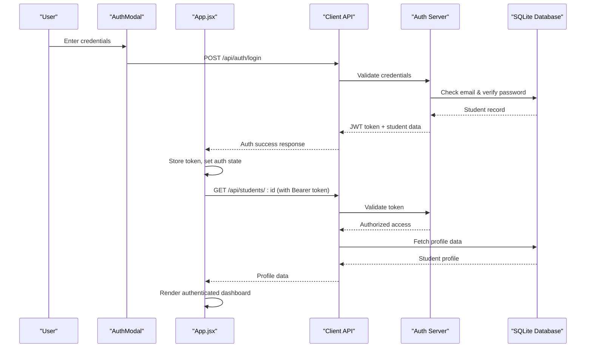
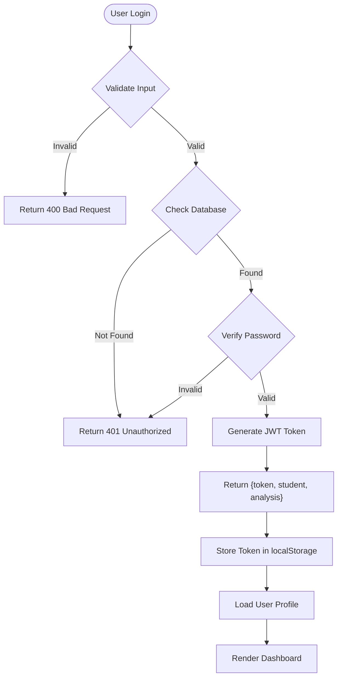
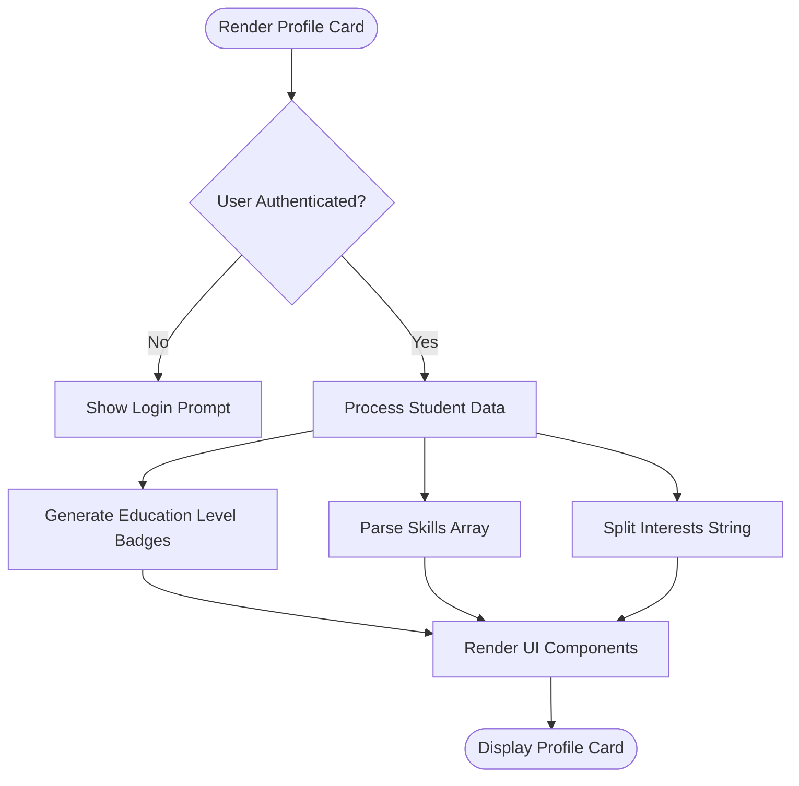
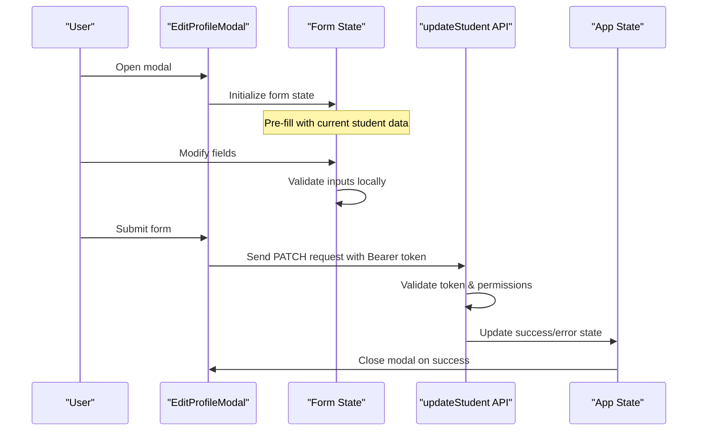
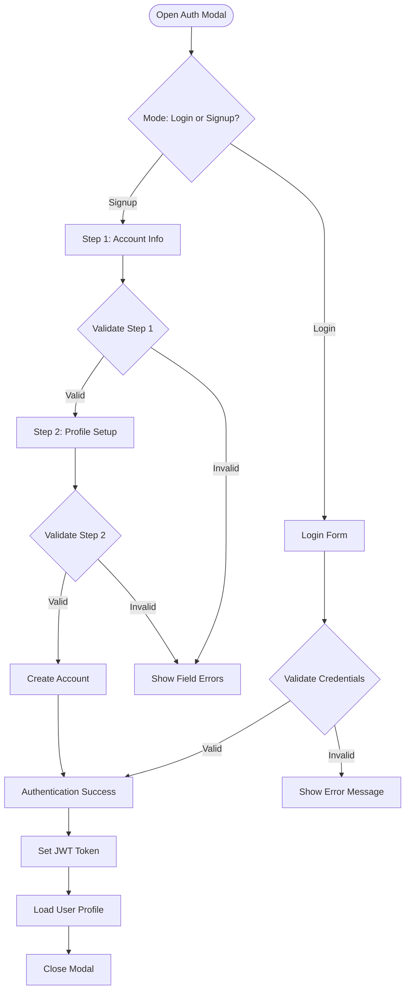
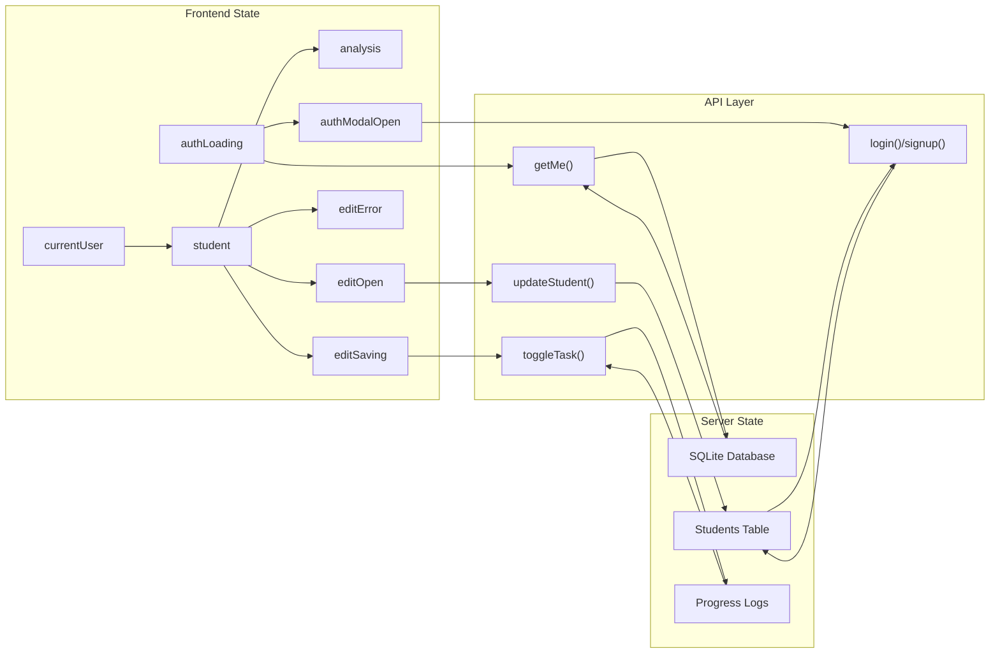
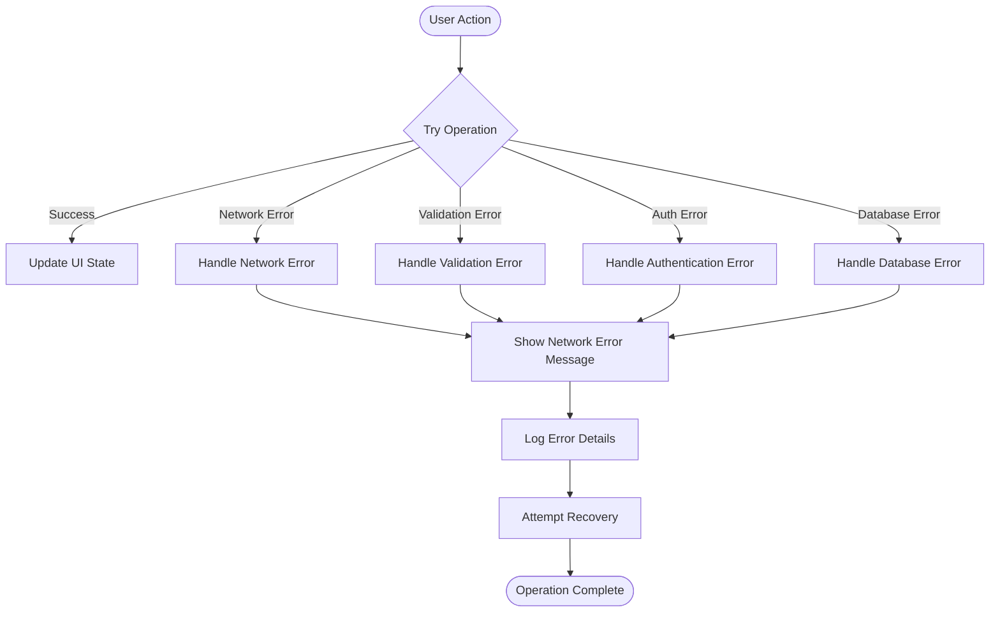

# Profile Management System

<cite>
**Referenced Files in This Document**
- [ProfileCard.jsx](file://frontend/src/components/ProfileCard.jsx)
- [EditProfileModal.jsx](file://frontend/src/components/EditProfileModal.jsx)
- [AuthModal.jsx](file://frontend/src/components/AuthModal.jsx)
- [api.js](file://routes/api.js)
- [auth.js](file://routes/auth.js)
- [db.js](file://database/db.js)
- [seed.js](file://database/seed.js)
- [App.jsx](file://frontend/src/App.jsx)
- [api.js](file://frontend/src/api.js)
</cite>

## Update Summary
**Changes Made**
- Enhanced database schema with authentication fields (email, password_hash, salt, target_role, created_at) and migration logic for backward compatibility
- Implemented complete JWT-based authentication system with secure password hashing using PBKDF2
- Added comprehensive authentication modal with multi-step signup process and demo user support
- Integrated authentication state management throughout the application lifecycle
- Updated API endpoints to support authenticated profile operations with Bearer token validation
- Enhanced security measures including password verification, token expiration handling, and legacy account support

## Table of Contents
1. [Introduction](#introduction)
2. [Project Structure](#project-structure)
3. [Core Components](#core-components)
4. [Architecture Overview](#architecture-overview)
5. [Database Schema and Data Persistence](#database-schema-and-data-persistence)
6. [Authentication System](#authentication-system)
7. [RESTful API Endpoints](#restful-api-endpoints)
8. [Detailed Component Analysis](#detailed-component-analysis)
9. [Data Flow and State Management](#data-flow-and-state-management)
10. [Validation and Error Handling](#validation-and-error-handling)
11. [Performance Considerations](#performance-considerations)
12. [Troubleshooting Guide](#troubleshooting-guide)
13. [Conclusion](#conclusion)

## Introduction
This document explains the profile management system within Career Compass, which provides comprehensive user data display and editing capabilities backed by a persistent SQLite database with full authentication support. The system has evolved from a static prototype to a full-stack application featuring:

- **SQLite Database Integration**: All profile data is now persisted in a SQLite database with proper schema validation and enhanced authentication fields
- **JWT-Based Authentication**: Secure user authentication with password hashing, token management, and session handling
- **RESTful API Endpoints**: Server-side endpoints handle all profile CRUD operations with comprehensive validation and authentication
- **Real-time Data Synchronization**: Frontend components fetch and update data through asynchronous API calls with authentication context
- **Robust Error Handling**: Network failures, validation errors, authentication failures, and database exceptions are properly handled
- **Persistent State**: User profiles survive page refreshes and application restarts with automatic session restoration

The system focuses on displaying education level, current skills, interests, and career goals with visual indicators, while providing edit functionality through a modal interface that persists changes to the database. Users can now register accounts, log in securely, and manage their personalized career profiles with full authentication protection.

## Project Structure
The application follows a modern React + Express architecture with clear separation between frontend components and backend services, enhanced with authentication layers:

```mermaid
graph TB
subgraph "Frontend (React)"
A["ProfileCard.jsx"] --> B["EditProfileModal.jsx"]
B --> C["AuthModal.jsx"]
C --> D["App.jsx"]
D --> E["api.js (Client)"]
end
subgraph "Backend (Express)"
F["api.js (Server)"] --> G["auth.js"]
G --> H["db.js"]
H --> I["SQLite Database"]
end
E --> F
I --> J["students table (enhanced)"]
I --> K["progress_logs table"]
I --> L["roadmaps table"]
I --> M["market_signals table"]
end
subgraph "Authentication Layer"
N["JWT Token Management"]
O["Password Hashing (PBKDF2)"]
P["Session Validation"]
end
G --> N
G --> O
G --> P
```

**Section sources**
- [ProfileCard.jsx:1-111](file://frontend/src/components/ProfileCard.jsx#L1-L111)
- [EditProfileModal.jsx:1-180](file://frontend/src/components/EditProfileModal.jsx#L1-L180)
- [AuthModal.jsx:1-571](file://frontend/src/components/AuthModal.jsx#L1-L571)
- [api.js:1-200](file://routes/api.js#L1-L200)
- [auth.js:1-333](file://routes/auth.js#L1-L333)
- [db.js:1-141](file://database/db.js#L1-L141)

## Core Components
The profile management system consists of several key components that work together to provide a seamless user experience with authentication:

### Profile Card Component
- **Education Level Display**: Shows selectable chips for Intermediate and Graduate levels with visual indicators
- **Skills Visualization**: Renders skill tags with appropriate styling based on proficiency context
- **Interests Display**: Shows comma-separated interests as styled tags
- **Career Goal Integration**: Displays career-related information for coaching recommendations
- **Authentication Context**: Displays user-specific profile data after successful authentication

### Edit Profile Modal
- **Form Fields**: Education level selection, institution input, skills textarea, interests textarea
- **Validation**: Client-side validation before sending data to server
- **Persistence**: Saves changes via PATCH API endpoint with proper error handling
- **User Experience**: Glass-morphism design with backdrop blur and smooth animations
- **Authentication Required**: Protected by Bearer token validation

### Authentication Modal
- **Multi-Step Signup**: Two-step registration process with account creation and profile setup
- **Login Interface**: Email/password authentication with demo user support
- **Form Validation**: Real-time field validation with user-friendly error messages
- **Progressive Enhancement**: Step-by-step wizard for better user experience
- **Demo Access**: Pre-configured demo users for immediate exploration

### Data Management Layer
- **API Client**: Centralized fetch wrapper with JSON parsing, error handling, and authentication headers
- **State Management**: React hooks manage loading states, authentication status, and data synchronization
- **Optimistic Updates**: UI updates immediately while waiting for server confirmation
- **Session Management**: Automatic token persistence and session restoration

**Section sources**
- [ProfileCard.jsx:5-111](file://frontend/src/components/ProfileCard.jsx#L5-L111)
- [EditProfileModal.jsx:11-180](file://frontend/src/components/EditProfileModal.jsx#L11-L180)
- [AuthModal.jsx:85-571](file://frontend/src/components/AuthModal.jsx#L85-L571)
- [App.jsx:134-469](file://frontend/src/App.jsx#L134-L469)

## Architecture Overview
The profile management system follows a client-server architecture with SQLite database persistence and comprehensive authentication:



**Diagram sources**
- [AuthModal.jsx:140-168](file://frontend/src/components/AuthModal.jsx#L140-L168)
- [api.js:44-52](file://frontend/src/api.js#L44-L52)
- [auth.js:258-300](file://routes/auth.js#L258-L300)
- [App.jsx:176-222](file://frontend/src/App.jsx#L176-L222)

The architecture ensures data consistency and security through:
- **JWT Authentication**: Stateless token-based authentication with 7-day validity
- **Server-side Validation**: All input is validated before database updates
- **Secure Password Storage**: PBKDF2 hashing with random salt generation
- **Token Expiration**: Automatic session renewal and logout handling
- **Legacy Support**: Backward compatibility for accounts without passwords

## Database Schema and Data Persistence
The system uses SQLite with an enhanced schema that enforces data integrity through constraints and includes authentication fields:

### Enhanced Students Table Schema
```sql
CREATE TABLE students (
  id                INTEGER PRIMARY KEY AUTOINCREMENT,
  name              TEXT NOT NULL,
  email             TEXT UNIQUE,
  password_hash     TEXT,
  salt              TEXT,
  education_level   TEXT NOT NULL CHECK(education_level IN ('Intermediate','Graduate')),
  stream_or_degree  TEXT,
  interests         TEXT,
  skills            TEXT DEFAULT '[]',
  target_role       TEXT,
  skill_match_pct   REAL DEFAULT 0,
  remote_demand_pct REAL DEFAULT 0,
  readiness_score   INTEGER DEFAULT 0 CHECK(readiness_score BETWEEN 0 AND 100),
  created_at        DATETIME DEFAULT CURRENT_TIMESTAMP
)
```

### Key Features
- **Authentication Fields**: email (unique), password_hash, salt for secure password storage
- **Career Targeting**: target_role field for personalized career recommendations
- **Audit Trail**: created_at timestamp for account creation tracking
- **Data Types**: Proper typing with TEXT for strings, REAL for percentages, INTEGER for scores
- **Constraints**: CHECK constraints enforce valid values (education levels, score ranges)
- **Default Values**: sensible defaults for optional fields like skills array
- **Foreign Keys**: Referential integrity maintained across related tables

### Migration Strategy
- **Automatic Migration**: Database schema automatically updated when new fields are missing
- **Backward Compatibility**: Legacy accounts without passwords supported with default credentials
- **Safe Upgrades**: ALTER TABLE statements only execute if columns don't exist
- **Error Handling**: Graceful handling of migration failures

**Section sources**
- [db.js:71-101](file://database/db.js#L71-L101)
- [seed.js:43-79](file://database/seed.js#L43-L79)

## Authentication System
The system implements a comprehensive JWT-based authentication system with secure password handling:

### Password Security
- **PBKDF2 Hashing**: Industry-standard password hashing with SHA-512 algorithm
- **Random Salt Generation**: Unique salt for each password to prevent rainbow table attacks
- **Configurable Iterations**: 1000 iterations for optimal security vs performance balance
- **Legacy Account Support**: Default credentials for accounts created before password hashing

### JWT Token Management
- **Stateless Tokens**: Self-contained tokens with embedded user information
- **7-Day Validity**: Automatic expiration for security
- **HMAC-SHA256 Signing**: Cryptographic signature verification
- **Payload Security**: Includes studentId, email, and name for user identification

### Authentication Flow


**Diagram sources**
- [auth.js:14-26](file://routes/auth.js#L14-L26)
- [auth.js:31-61](file://routes/auth.js#L31-L61)
- [auth.js:258-300](file://routes/auth.js#L258-L300)

### Session Management
- **Automatic Restoration**: Token loaded from localStorage on app startup
- **Graceful Degradation**: Invalid/expired tokens trigger re-authentication
- **Logout Handling**: Clear token and reset application state
- **Protected Routes**: API requests include Bearer token for authentication

**Section sources**
- [auth.js:11-61](file://routes/auth.js#L11-L61)
- [auth.js:170-333](file://routes/auth.js#L170-L333)
- [api.js:3-12](file://frontend/src/api.js#L3-L12)

## RESTful API Endpoints
The backend exposes RESTful endpoints for profile management with comprehensive validation and authentication:

### Authentication Endpoints

#### POST /api/auth/signup
Creates a new student account with secure password hashing:
- **Required Fields**: name, email, password, education_level
- **Optional Fields**: stream_or_degree, interests, skills, target_role
- **Validation**: Email format, password strength, education level constraints
- **Response**: JWT token, student profile, initial analysis

#### POST /api/auth/login
Authenticates existing users with password verification:
- **Required Fields**: email, password
- **Legacy Support**: Default credentials for accounts without passwords
- **Response**: JWT token, student profile, generated roadmap

#### GET /api/auth/me
Retrieves current authenticated user's profile:
- **Authentication**: Requires valid Bearer token
- **Response**: Full student profile with progress statistics

#### POST /api/auth/logout
Clears user session:
- **Authentication**: Optional but recommended
- **Response**: Success confirmation

### Profile Management Endpoints

#### GET /api/students
Returns all students for the student switcher functionality.

#### GET /api/students/:id
Returns detailed student profile including skills array and progress statistics.

#### PATCH /api/students/:id
Updates profile fields with strict validation:
- **education_level**: Must be "Intermediate" or "Graduate"
- **interests**: Must be a string
- **skills**: Must be an array of strings

### Additional Endpoints
- **GET /api/students/:id/roadmap**: Returns stored roadmap and multi-agent analysis
- **POST /api/coach/analyze**: Runs multi-agent pipeline analysis
- **POST /api/progress/toggle**: Toggles task status and recalculates readiness score

### Request/Response Examples
```javascript
// Authentication request
POST /api/auth/login
{
  "email": "user@example.com",
  "password": "securePassword123"
}

// Success response
{
  "success": true,
  "message": "Logged in successfully.",
  "token": "eyJhbGciOiJIUzI1NiIsInR5cCI6IkpXVCJ9...",
  "student": {
    "id": 1,
    "name": "Ali Khan",
    "email": "ali@example.com",
    "education_level": "Graduate",
    "target_role": "AI/ML Engineer",
    "readiness_score": 43
  },
  "analysis": {
    "success": true,
    "targetRole": "AI/ML Engineer",
    "readinessScore": 43
  }
}

// Profile update request
PATCH /api/students/1
{
  "education_level": "Graduate",
  "interests": "AI, Machine Learning, Web Dev",
  "skills": ["Python", "JavaScript", "React"]
}
```

**Section sources**
- [auth.js:170-333](file://routes/auth.js#L170-L333)
- [api.js:19-200](file://routes/api.js#L19-L200)
- [api.js:44-132](file://frontend/src/api.js#L44-L132)

## Detailed Component Analysis

### Profile Card Implementation
The ProfileCard component displays student information with dynamic styling based on data and authentication context:



**Key Features:**
- **Dynamic Skill Tags**: Skills rendered as styled tags with consistent formatting
- **Education Level Badges**: Visual indicators showing current education level with checkmarks
- **Interest Tags**: Comma-separated interests displayed as individual tags
- **Responsive Design**: Adapts to different screen sizes gracefully
- **Edit Integration**: Seamless connection to EditProfileModal for profile updates

**Section sources**
- [ProfileCard.jsx:5-111](file://frontend/src/components/ProfileCard.jsx#L5-L111)

### Edit Profile Modal Functionality
The modal provides a comprehensive interface for editing profile data with authentication context:



**Form Fields:**
- **Education Level**: Radio buttons for Intermediate/Graduate selection
- **Institution**: Text input for educational institution
- **Skills**: Textarea for comma-separated skill list
- **Interests**: Textarea for interest areas
- **Career Question**: Textarea for career guidance questions

**Section sources**
- [EditProfileModal.jsx:11-180](file://frontend/src/components/EditProfileModal.jsx#L11-L180)

### Authentication Modal Implementation
The AuthModal provides a comprehensive authentication interface with multi-step signup:



**Features:**
- **Multi-Step Signup**: Progressive form with validation at each step
- **Demo User Access**: Pre-configured accounts for immediate exploration
- **Field Validation**: Real-time validation with user-friendly error messages
- **Password Strength**: Minimum length requirements and visibility toggle
- **Skill Selection**: Interactive skill tag system with preset options
- **Target Role Selection**: Career-focused role selection with visual indicators

**Section sources**
- [AuthModal.jsx:85-571](file://frontend/src/components/AuthModal.jsx#L85-L571)

### CSS Styling and Visual Design
The system employs modern CSS techniques for an engaging user interface with authentication-aware styling:

- **Glass Morphism Effects**: Semi-transparent backgrounds with backdrop blur create depth
- **Gradient Backgrounds**: Brand gradients used for avatars and interactive elements
- **Responsive Layout**: Grid-based layouts that adapt across breakpoints
- **Animation Effects**: Smooth transitions for modals, hover states, and loading indicators
- **Color Coding**: Consistent color scheme for different data types and states
- **Authentication States**: Visual feedback for login/logout states and session status

**Section sources**
- [ProfileCard.jsx:22-28](file://frontend/src/components/ProfileCard.jsx#L22-L28)
- [EditProfileModal.jsx:54-71](file://frontend/src/components/EditProfileModal.jsx#L54-L71)
- [AuthModal.jsx:200-216](file://frontend/src/components/AuthModal.jsx#L200-L216)

## Data Flow and State Management
The system implements a unidirectional data flow pattern with proper state synchronization and authentication context:

### State Management Architecture


### Data Synchronization Patterns
- **Lazy Loading**: Student data loaded on demand when selected
- **Optimistic Updates**: UI updates immediately, then syncs with server
- **Error Recovery**: Failed operations revert UI state to previous valid state
- **Cache Invalidation**: Related data refreshed when primary data changes
- **Session Persistence**: Authentication state survives page refreshes
- **Token Refresh**: Automatic handling of expired tokens

**Section sources**
- [App.jsx:134-222](file://frontend/src/App.jsx#L134-L222)
- [App.jsx:325-345](file://frontend/src/App.jsx#L325-L345)

## Validation and Error Handling
Comprehensive validation and error handling ensure data integrity and user experience across authentication and profile management:

### Client-Side Validation
- **Form Validation**: Real-time validation of user inputs before submission
- **Type Checking**: Ensures correct data types for API requests
- **Empty Field Handling**: Graceful handling of missing or empty values
- **Authentication Validation**: Token presence and validity checks

### Server-Side Validation
- **Input Sanitization**: All user inputs sanitized before processing
- **Constraint Enforcement**: Database constraints prevent invalid data insertion
- **Business Logic Validation**: Complex rules enforced at API layer
- **Authentication Validation**: JWT token verification and permission checks

### Error Handling Strategy


**Section sources**
- [auth.js:170-333](file://routes/auth.js#L170-L333)
- [api.js:28-70](file://routes/api.js#L28-L70)
- [api.js:19-200](file://routes/api.js#L19-L200)
- [App.jsx:176-222](file://frontend/src/App.jsx#L176-L222)

## Performance Considerations
The system is optimized for performance through several strategies:

### Database Optimization
- **Indexed Queries**: Primary keys and foreign keys automatically indexed
- **Efficient Updates**: COALESCE function minimizes unnecessary writes
- **Connection Pooling**: Single database connection reused throughout application lifecycle
- **Migration Efficiency**: Lightweight schema checks prevent unnecessary ALTER operations

### Frontend Optimization
- **Component Memoization**: React.memo and useMemo prevent unnecessary re-renders
- **Lazy Loading**: Data fetched only when needed
- **Debounced Updates**: Frequent updates batched for efficiency
- **Authentication Caching**: JWT token cached in localStorage for fast session restoration

### Network Optimization
- **Request Deduplication**: Prevents duplicate API calls for same data
- **Caching Strategy**: Client-side caching reduces network requests
- **Error Retry Logic**: Automatic retry for transient network failures
- **Token Management**: Efficient token storage and retrieval

## Troubleshooting Guide
Common issues and their solutions:

### Authentication Issues
- **Symptom**: "No authorization token provided" error
- **Solution**: Ensure user is logged in and token is stored in localStorage
- **Prevention**: Implement proper login flow and token persistence

- **Symptom**: "Session expired or invalid token" error
- **Solution**: Re-authenticate user by logging in again
- **Prevention**: Handle token expiration gracefully with automatic redirect to login

### Database Connection Issues
- **Symptom**: "Database not initialized" error
- **Solution**: Ensure `initDatabase()` is called before any database operations
- **Prevention**: Initialize database during application startup

### API Endpoint Errors
- **Symptom**: 404 Not Found for student ID
- **Solution**: Verify student exists in database before making requests
- **Prevention**: Implement existence checks before API calls

### Data Validation Errors
- **Symptom**: 400 Bad Request with validation message
- **Solution**: Check input format matches expected schema
- **Prevention**: Implement client-side validation matching server rules

### State Synchronization Issues
- **Symptom**: UI shows stale data after updates
- **Solution**: Ensure proper state updates after successful API calls
- **Prevention**: Use optimistic updates with rollback on failure

**Section sources**
- [db.js:17-19](file://database/db.js#L17-L19)
- [auth.js:303-328](file://routes/auth.js#L303-L328)
- [api.js:28-36](file://routes/api.js#L28-L36)
- [App.jsx:176-191](file://frontend/src/App.jsx#L176-L191)

## Conclusion
The Profile Management System has evolved from a static prototype to a robust, database-backed application with comprehensive authentication capabilities that provides reliable user profile management with persistent storage and secure access control. The integration of SQLite database, JWT-based authentication, RESTful API endpoints, and comprehensive validation ensures data integrity and security while maintaining an excellent user experience.

Key achievements include:
- **Persistent Data Storage**: All profile information survives application restarts with secure authentication
- **Scalable Architecture**: Clean separation between frontend and backend concerns with authentication layers
- **Robust Error Handling**: Comprehensive error detection and recovery mechanisms for all operations
- **User-Friendly Interface**: Intuitive editing interface with real-time feedback and progressive enhancement
- **Performance Optimization**: Efficient data loading, rendering strategies, and authentication state management
- **Security First**: Industry-standard password hashing, JWT tokens, and session management

The system provides a solid foundation for future enhancements such as advanced analytics, social features, and integration with external career resources. The modular architecture allows for easy extension and maintenance while ensuring data consistency and security across all components. The authentication system ensures that user data remains protected while providing seamless access to personalized career guidance tools.