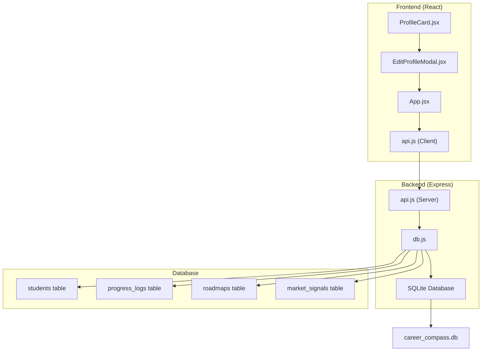
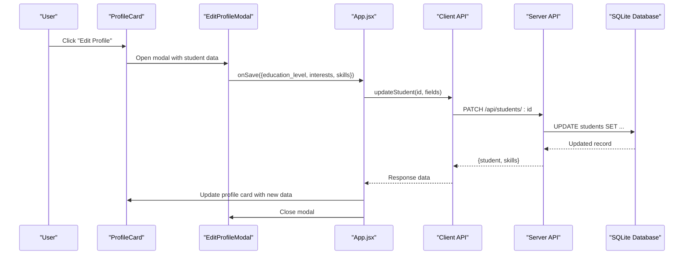
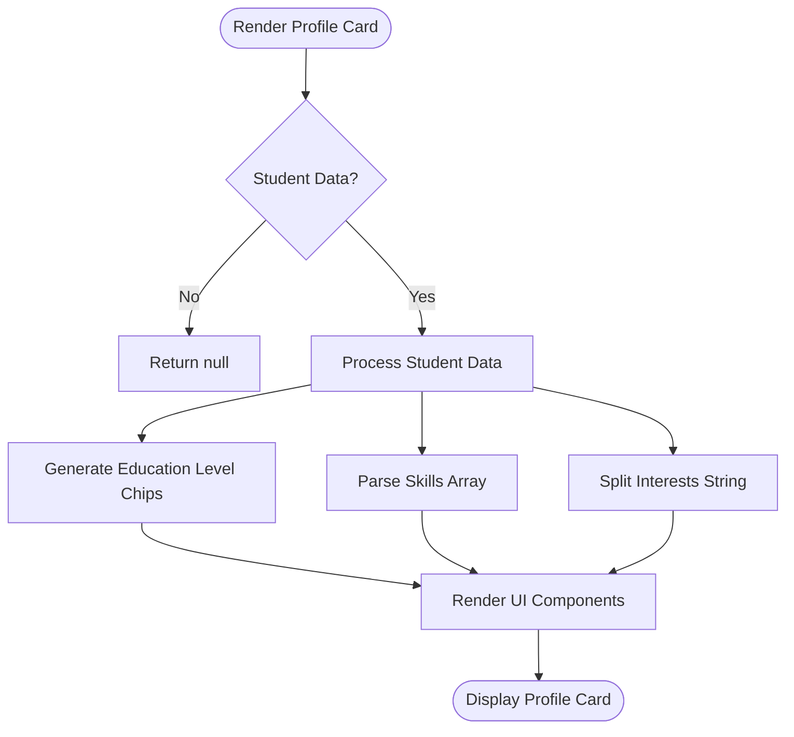
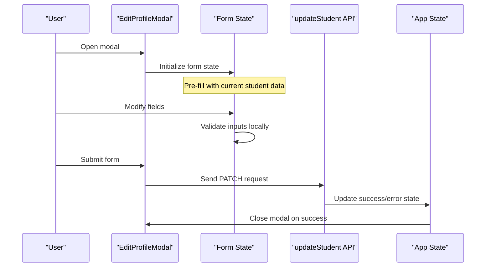
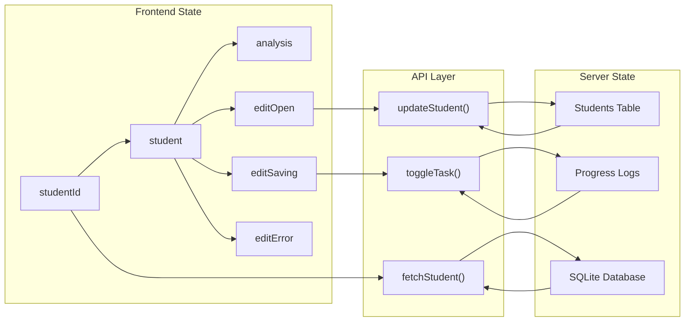
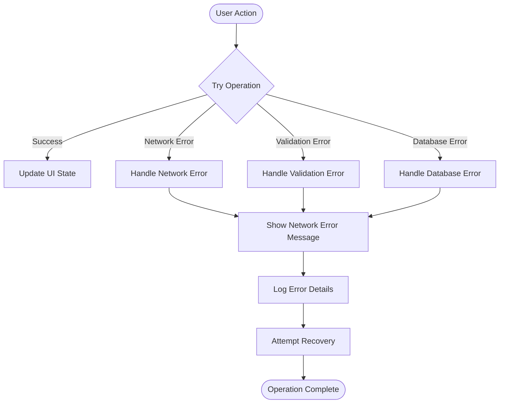

# Profile Management System

<cite>
**Referenced Files in This Document**
- [ProfileCard.jsx](file://frontend/src/components/ProfileCard.jsx)
- [EditProfileModal.jsx](file://frontend/src/components/EditProfileModal.jsx)
- [api.js](file://routes/api.js)
- [db.js](file://database/db.js)
- [seed.js](file://database/seed.js)
- [App.jsx](file://frontend/src/App.jsx)
- [api.js](file://frontend/src/api.js)
</cite>

## Update Summary
**Changes Made**
- Updated architecture section to reflect SQLite database integration and RESTful API endpoints
- Added comprehensive database schema documentation with validation rules
- Replaced client-side state management with server-side data persistence
- Documented new API endpoints for profile CRUD operations
- Updated component interactions to use async API calls instead of local state
- Added error handling and validation throughout the data flow

## Table of Contents
1. [Introduction](#introduction)
2. [Project Structure](#project-structure)
3. [Core Components](#core-components)
4. [Architecture Overview](#architecture-overview)
5. [Database Schema and Data Persistence](#database-schema-and-data-persistence)
6. [RESTful API Endpoints](#restful-api-endpoints)
7. [Detailed Component Analysis](#detailed-component-analysis)
8. [Data Flow and State Management](#data-flow-and-state-management)
9. [Validation and Error Handling](#validation-and-error-handling)
10. [Performance Considerations](#performance-considerations)
11. [Troubleshooting Guide](#troubleshooting-guide)
12. [Conclusion](#conclusion)

## Introduction
This document explains the profile management system within Career Compass, which provides comprehensive user data display and editing capabilities backed by a persistent SQLite database. The system has evolved from a static prototype to a full-stack application featuring:

- **SQLite Database Integration**: All profile data is now persisted in a SQLite database with proper schema validation
- **RESTful API Endpoints**: Server-side endpoints handle all profile CRUD operations with comprehensive validation
- **Real-time Data Synchronization**: Frontend components fetch and update data through asynchronous API calls
- **Robust Error Handling**: Network failures, validation errors, and database exceptions are properly handled
- **Persistent State**: User profiles survive page refreshes and application restarts

The system focuses on displaying education level, current skills, interests, and career goals with visual indicators, while providing edit functionality through a modal interface that persists changes to the database.

## Project Structure
The application follows a modern React + Express architecture with clear separation between frontend components and backend services:



**Section sources**
- [ProfileCard.jsx:1-111](file://frontend/src/components/ProfileCard.jsx#L1-L111)
- [EditProfileModal.jsx:1-180](file://frontend/src/components/EditProfileModal.jsx#L1-L180)
- [api.js:1-176](file://routes/api.js#L1-L176)
- [db.js:1-125](file://database/db.js#L1-L125)

## Core Components
The profile management system consists of several key components that work together to provide a seamless user experience:

### Profile Card Component
- **Education Level Display**: Shows selectable chips for Intermediate and Graduate levels with visual indicators
- **Skills Visualization**: Renders skill tags with appropriate styling based on proficiency context
- **Interests Display**: Shows comma-separated interests as styled tags
- **Career Goal Integration**: Displays career-related information for coaching recommendations

### Edit Profile Modal
- **Form Fields**: Education level selection, institution input, skills textarea, interests textarea
- **Validation**: Client-side validation before sending data to server
- **Persistence**: Saves changes via PATCH API endpoint with proper error handling
- **User Experience**: Glass-morphism design with backdrop blur and smooth animations

### Data Management Layer
- **API Client**: Centralized fetch wrapper with JSON parsing and error handling
- **State Management**: React hooks manage loading states, errors, and data synchronization
- **Optimistic Updates**: UI updates immediately while waiting for server confirmation

**Section sources**
- [ProfileCard.jsx:5-111](file://frontend/src/components/ProfileCard.jsx#L5-L111)
- [EditProfileModal.jsx:11-180](file://frontend/src/components/EditProfileModal.jsx#L11-L180)
- [App.jsx:82-388](file://frontend/src/App.jsx#L82-L388)

## Architecture Overview
The profile management system follows a client-server architecture with SQLite database persistence:



**Diagram sources**
- [App.jsx:280-303](file://frontend/src/App.jsx#L280-L303)
- [api.js:54-63](file://routes/api.js#L54-L63)
- [db.js:36-39](file://database/db.js#L36-L39)

The architecture ensures data consistency through:
- **Server-side Validation**: All input is validated before database updates
- **Atomic Operations**: Database transactions ensure data integrity
- **Error Propagation**: Errors bubble up from database to UI with meaningful messages
- **State Synchronization**: Frontend state stays synchronized with database state

## Database Schema and Data Persistence
The system uses SQLite with a well-defined schema that enforces data integrity through constraints:

### Students Table Schema
```sql
CREATE TABLE students (
  id INTEGER PRIMARY KEY AUTOINCREMENT,
  name TEXT NOT NULL,
  education_level TEXT NOT NULL CHECK(education_level IN ('Intermediate','Graduate')),
  stream_or_degree TEXT,
  interests TEXT,
  skills TEXT DEFAULT '[]',
  skill_match_pct REAL DEFAULT 0,
  remote_demand_pct REAL DEFAULT 0,
  readiness_score INTEGER DEFAULT 0 CHECK(readiness_score BETWEEN 0 AND 100)
)
```

### Key Features
- **Data Types**: Proper typing with TEXT for strings, REAL for percentages, INTEGER for scores
- **Constraints**: CHECK constraints enforce valid values (education levels, score ranges)
- **Default Values**: sensible defaults for optional fields like skills array
- **Foreign Keys**: Referential integrity maintained across related tables

### Data Persistence Strategy
- **Automatic Saving**: All write operations automatically persist to disk
- **Schema Migration**: Database schema is created if it doesn't exist
- **Seed Data**: Initial data populated through seed script for development
- **Backup Support**: Database file can be backed up and restored

**Section sources**
- [db.js:71-84](file://database/db.js#L71-L84)
- [seed.js:43-79](file://database/seed.js#L43-L79)

## RESTful API Endpoints
The backend exposes RESTful endpoints for profile management with comprehensive validation:

### Profile Management Endpoints

#### GET /api/students
Returns all students for the student switcher functionality.

#### GET /api/students/:id
Returns detailed student profile including skills array and progress statistics.

#### PATCH /api/students/:id
Updates profile fields with strict validation:
- **education_level**: Must be "Intermediate" or "Graduate"
- **interests**: Must be a string
- **skills**: Must be an array of strings

### Additional Endpoints
- **POST /api/coach/analyze**: Runs multi-agent pipeline analysis
- **POST /api/progress/toggle**: Toggles task status and recalculates readiness score

### Request/Response Examples
```javascript
// Update profile request
PATCH /api/students/1
{
  "education_level": "Graduate",
  "interests": "AI, Machine Learning, Web Dev",
  "skills": ["Python", "JavaScript", "React"]
}

// Success response
{
  "id": 1,
  "name": "Ali Khan",
  "education_level": "Graduate",
  "stream_or_degree": "BS Computer Science — FAST NUCES, Islamabad",
  "interests": "AI, Machine Learning, Web Dev",
  "skills": ["Python", "JavaScript", "React"],
  "skill_match_pct": 25,
  "remote_demand_pct": 92,
  "readiness_score": 43
}
```

**Section sources**
- [api.js:18-21](file://routes/api.js#L18-L21)
- [api.js:27-69](file://routes/api.js#L27-L69)
- [api.js:74-112](file://routes/api.js#L74-L112)

## Detailed Component Analysis

### Profile Card Implementation
The ProfileCard component displays student information with dynamic styling based on data:



**Key Features:**
- **Dynamic Skill Tags**: Skills rendered as styled tags with consistent formatting
- **Education Level Badges**: Visual indicators showing current education level
- **Interest Tags**: Comma-separated interests displayed as individual tags
- **Responsive Design**: Adapts to different screen sizes gracefully

**Section sources**
- [ProfileCard.jsx:5-111](file://frontend/src/components/ProfileCard.jsx#L5-L111)

### Edit Profile Modal Functionality
The modal provides a comprehensive interface for editing profile data:



**Form Fields:**
- **Education Level**: Radio buttons for Intermediate/Graduate selection
- **Institution**: Text input for educational institution
- **Skills**: Textarea for comma-separated skill list
- **Interests**: Textarea for interest areas
- **Career Question**: Textarea for career guidance questions

**Section sources**
- [EditProfileModal.jsx:11-180](file://frontend/src/components/EditProfileModal.jsx#L11-L180)

### CSS Styling and Visual Design
The system employs modern CSS techniques for an engaging user interface:

- **Glass Morphism Effects**: Semi-transparent backgrounds with backdrop blur create depth
- **Gradient Backgrounds**: Brand gradients used for avatars and interactive elements
- **Responsive Layout**: Grid-based layouts that adapt across breakpoints
- **Animation Effects**: Smooth transitions for modals, hover states, and loading indicators
- **Color Coding**: Consistent color scheme for different data types and states

**Section sources**
- [ProfileCard.jsx:22-28](file://frontend/src/components/ProfileCard.jsx#L22-L28)
- [EditProfileModal.jsx:54-71](file://frontend/src/components/EditProfileModal.jsx#L54-L71)

## Data Flow and State Management
The system implements a unidirectional data flow pattern with proper state synchronization:

### State Management Architecture


### Data Synchronization Patterns
- **Lazy Loading**: Student data loaded on demand when selected
- **Optimistic Updates**: UI updates immediately, then syncs with server
- **Error Recovery**: Failed operations revert UI state to previous valid state
- **Cache Invalidation**: Related data refreshed when primary data changes

**Section sources**
- [App.jsx:82-164](file://frontend/src/App.jsx#L82-L164)
- [App.jsx:280-303](file://frontend/src/App.jsx#L280-L303)

## Validation and Error Handling
Comprehensive validation and error handling ensure data integrity and user experience:

### Client-Side Validation
- **Form Validation**: Real-time validation of user inputs before submission
- **Type Checking**: Ensures correct data types for API requests
- **Empty Field Handling**: Graceful handling of missing or empty values

### Server-Side Validation
- **Input Sanitization**: All user inputs sanitized before processing
- **Constraint Enforcement**: Database constraints prevent invalid data insertion
- **Business Logic Validation**: Complex rules enforced at API layer

### Error Handling Strategy


**Section sources**
- [api.js:27-69](file://routes/api.js#L27-L69)
- [api.js:74-112](file://routes/api.js#L74-L112)
- [App.jsx:280-303](file://frontend/src/App.jsx#L280-L303)

## Performance Considerations
The system is optimized for performance through several strategies:

### Database Optimization
- **Indexed Queries**: Primary keys and foreign keys automatically indexed
- **Efficient Updates**: COALESCE function minimizes unnecessary writes
- **Connection Pooling**: Single database connection reused throughout application lifecycle

### Frontend Optimization
- **Component Memoization**: React.memo and useMemo prevent unnecessary re-renders
- **Lazy Loading**: Data fetched only when needed
- **Debounced Updates**: Frequent updates batched for efficiency

### Network Optimization
- **Request Deduplication**: Prevents duplicate API calls for same data
- **Caching Strategy**: Client-side caching reduces network requests
- **Error Retry Logic**: Automatic retry for transient network failures

## Troubleshooting Guide
Common issues and their solutions:

### Database Connection Issues
- **Symptom**: "Database not initialized" error
- **Solution**: Ensure `initDatabase()` is called before any database operations
- **Prevention**: Initialize database during application startup

### API Endpoint Errors
- **Symptom**: 404 Not Found for student ID
- **Solution**: Verify student exists in database before making requests
- **Prevention**: Implement existence checks before API calls

### Data Validation Errors
- **Symptom**: 400 Bad Request with validation message
- **Solution**: Check input format matches expected schema
- **Prevention**: Implement client-side validation matching server rules

### State Synchronization Issues
- **Symptom**: UI shows stale data after updates
- **Solution**: Ensure proper state updates after successful API calls
- **Prevention**: Use optimistic updates with rollback on failure

**Section sources**
- [db.js:17-19](file://database/db.js#L17-L19)
- [api.js:27-36](file://routes/api.js#L27-L36)
- [App.jsx:280-303](file://frontend/src/App.jsx#L280-L303)

## Conclusion
The Profile Management System has evolved from a static prototype to a robust, database-backed application that provides reliable user profile management with persistent storage. The integration of SQLite database, RESTful API endpoints, and comprehensive validation ensures data integrity while maintaining an excellent user experience.

Key achievements include:
- **Persistent Data Storage**: All profile information survives application restarts
- **Scalable Architecture**: Clean separation between frontend and backend concerns
- **Robust Error Handling**: Comprehensive error detection and recovery mechanisms
- **User-Friendly Interface**: Intuitive editing interface with real-time feedback
- **Performance Optimization**: Efficient data loading and rendering strategies

The system provides a solid foundation for future enhancements such as user authentication, advanced analytics, and integration with external career resources. The modular architecture allows for easy extension and maintenance while ensuring data consistency across all components.