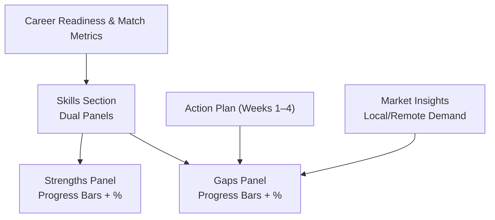
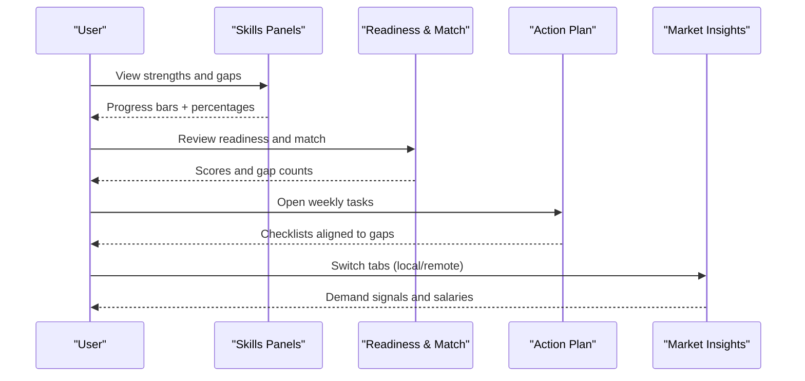
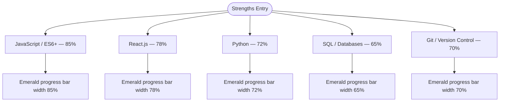
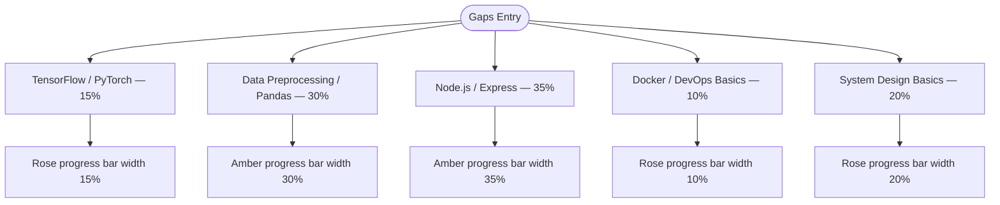
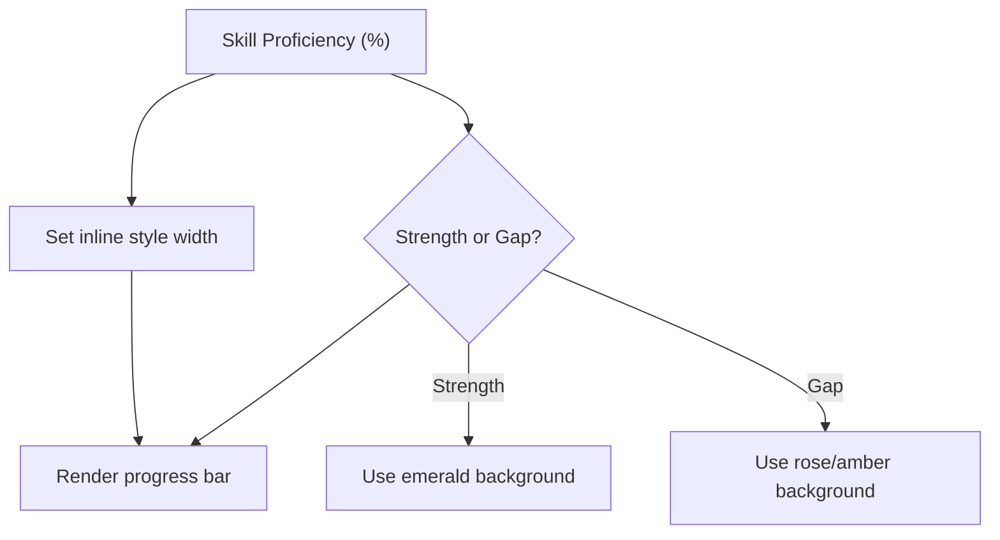
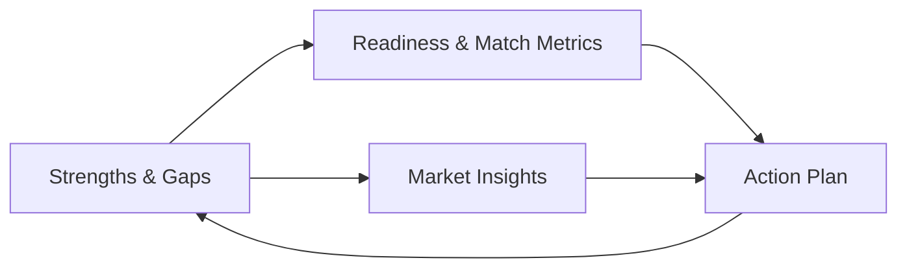
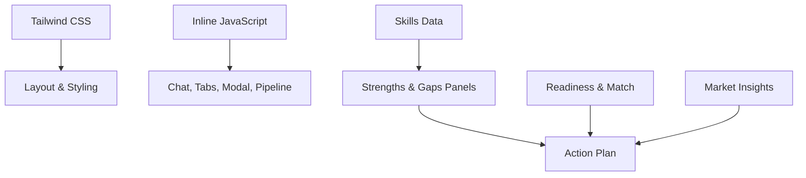

# Skills Analysis Dashboard

<cite>
**Referenced Files in This Document**
- [index.html](file://index.html)
</cite>

## Table of Contents
1. [Introduction](#introduction)
2. [Project Structure](#project-structure)
3. [Core Components](#core-components)
4. [Architecture Overview](#architecture-overview)
5. [Detailed Component Analysis](#detailed-component-analysis)
6. [Dependency Analysis](#dependency-analysis)
7. [Performance Considerations](#performance-considerations)
8. [Troubleshooting Guide](#troubleshooting-guide)
9. [Conclusion](#conclusion)
10. [Appendices](#appendices)

## Introduction
This document explains the Skills Analysis Dashboard focused on strength identification and gap detection visualization. It covers the dual-panel layout that presents “Strengths” (existing skills with high proficiency) and “Gaps to Close” (skills needing development), including progress bars, percentage indicators, color coding, and accessibility considerations. It also describes how this data integrates with career path recommendations and action planning features within the application.

## Project Structure
The dashboard is implemented as a single-page HTML file using Tailwind CSS for styling and minimal inline JavaScript for interactivity. The key sections relevant to skills analysis are:
- A dual-panel section displaying Strengths and Gaps with per-skill progress bars and percentages
- Career readiness and skill match metrics that contextualize strengths and gaps
- An action plan section that translates identified gaps into weekly tasks
- Market insights that inform which gaps matter most for local and remote opportunities

**Diagram sources**
- [index.html:283-313](file://index.html#L283-L313)
- [index.html:123-169](file://index.html#L123-L169)
- [index.html:392-458](file://index.html#L392-L458)
- [index.html:315-390](file://index.html#L315-L390)

**Section sources**
- [index.html:283-313](file://index.html#L283-L313)
- [index.html:123-169](file://index.html#L123-L169)
- [index.html:392-458](file://index.html#L392-L458)
- [index.html:315-390](file://index.html#L315-L390)

## Core Components
- Dual-panel skills view:
  - Strengths panel lists existing skills with high proficiency and shows progress bars colored emerald with percentage labels
  - Gaps panel lists skills needing development and shows progress bars colored rose or amber with percentage labels
- Progress bars:
  - Implemented via inline styles setting width percentages and background colors
  - Each row includes a skill label, a percentage indicator, and a visual bar
- Color coding system:
  - Emerald for strengths indicating higher proficiency levels
  - Rose/amber for gaps indicating lower proficiency and areas requiring attention
- Integration points:
  - Skill match metrics provide context for overall readiness and highlight specific gaps
  - Action plan converts gaps into concrete weekly tasks
  - Market insights prioritize gaps based on demand signals

**Section sources**
- [index.html:283-313](file://index.html#L283-L313)
- [index.html:123-169](file://index.html#L123-L169)
- [index.html:392-458](file://index.html#L392-L458)
- [index.html:315-390](file://index.html#L315-L390)

## Architecture Overview
The dashboard organizes information to guide users from assessment to action:
- Assessment: Strengths and Gaps panels visualize current skill levels
- Context: Career readiness score and skill match percentages frame the user’s standing
- Planning: Weekly action items translate gaps into actionable steps
- Market alignment: Local and remote demand informs prioritization of gaps

**Diagram sources**
- [index.html:283-313](file://index.html#L283-L313)
- [index.html:123-169](file://index.html#L123-L169)
- [index.html:392-458](file://index.html#L392-L458)
- [index.html:315-390](file://index.html#L315-L390)

## Detailed Component Analysis

### Strengths Panel
- Purpose: Show existing skills where proficiency is strong
- Visuals:
  - Each skill has a label, a percentage indicator, and an emerald progress bar
  - Percentages reflect relative mastery; higher values indicate stronger capability
- Example skills tracked:
  - JavaScript / ES6+
  - React.js
  - Python
  - SQL / Databases
  - Git / Version Control
- Implementation notes:
  - Inline styles set width percentages for each bar
  - Colors use emerald tones to signal strengths

**Diagram sources**
- [index.html:291-297](file://index.html#L291-L297)

**Section sources**
- [index.html:291-297](file://index.html#L291-L297)

### Gaps Panel
- Purpose: Highlight skills that need development
- Visuals:
  - Each skill has a label, a percentage indicator, and a rose or amber progress bar
  - Lower percentages indicate greater need for improvement
- Example skills tracked:
  - TensorFlow / PyTorch
  - Data Preprocessing / Pandas
  - Node.js / Express
  - Docker / DevOps Basics
  - System Design Basics
- Implementation notes:
  - Inline styles set width percentages for each bar
  - Colors use rose/amber tones to signal gaps

**Diagram sources**
- [index.html:305-311](file://index.html#L305-L311)

**Section sources**
- [index.html:305-311](file://index.html#L305-L311)

### Progress Bars and Color Coding
- Progress bars:
  - Use inline styles to set width percentages corresponding to skill proficiency
  - Background colors differentiate strengths (emerald) from gaps (rose/amber)
- Percentage indicators:
  - Displayed next to skill names for quick comprehension
- Accessibility:
  - Ensure sufficient contrast between text and backgrounds
  - Provide descriptive labels for screen readers (e.g., aria attributes would be ideal if added)
  - Avoid relying solely on color; include text percentages and clear headings

[No sources needed since this diagram shows conceptual workflow, not actual code structure]

**Section sources**
- [index.html:291-297](file://index.html#L291-L297)
- [index.html:305-311](file://index.html#L305-L311)

### Integration with Career Path Recommendations and Action Planning
- Career readiness and skill match metrics:
  - Provide overall readiness scores and path-specific match percentages
  - Indicate number of gaps identified and those in progress
- Action plan:
  - Weekly checklists align with identified gaps (e.g., Node.js/Express, Docker basics, ML fundamentals)
  - Encourages building portfolio projects that reinforce both strengths and gaps
- Market insights:
  - Local and remote demand signals help prioritize which gaps to address first
  - Salary ranges and hiring hubs contextualize the value of closing specific gaps

**Diagram sources**
- [index.html:123-169](file://index.html#L123-L169)
- [index.html:392-458](file://index.html#L392-L458)
- [index.html:315-390](file://index.html#L315-L390)

**Section sources**
- [index.html:123-169](file://index.html#L123-L169)
- [index.html:392-458](file://index.html#L392-L458)
- [index.html:315-390](file://index.html#L315-L390)

## Dependency Analysis
- UI dependencies:
  - Tailwind CSS provides utility classes for layout, spacing, and typography
  - Inline styles control dynamic widths for progress bars
- Interactivity:
  - Minimal JavaScript handles chat interactions, pipeline animation, tab switching, and modal toggling
- Data flow:
  - Skills data drives visual representation in the dual panels
  - Metrics and market insights influence perceived priority of gaps
  - Action plan reflects targeted improvements based on gaps

**Diagram sources**
- [index.html:10-21](file://index.html#L10-L21)
- [index.html:565-681](file://index.html#L565-L681)
- [index.html:283-313](file://index.html#L283-L313)
- [index.html:123-169](file://index.html#L123-L169)
- [index.html:392-458](file://index.html#L392-L458)
- [index.html:315-390](file://index.html#L315-L390)

**Section sources**
- [index.html:10-21](file://index.html#L10-L21)
- [index.html:565-681](file://index.html#L565-L681)
- [index.html:283-313](file://index.html#L283-L313)
- [index.html:123-169](file://index.html#L123-L169)
- [index.html:392-458](file://index.html#L392-L458)
- [index.html:315-390](file://index.html#L315-L390)

## Performance Considerations
- Keep progress bars lightweight by using inline styles for width only
- Avoid excessive DOM manipulations; reuse elements where possible
- Prefer semantic markup for better rendering performance and accessibility
- Limit animations to essential interactions to maintain responsiveness

[No sources needed since this section provides general guidance]

## Troubleshooting Guide
- If progress bars do not render correctly:
  - Verify inline width percentages are valid numbers between 0 and 100
  - Ensure parent containers have adequate width to display bars
- If color coding is unclear:
  - Confirm class usage aligns with intended meaning (emerald for strengths, rose/amber for gaps)
  - Check contrast ratios for readability
- If interactivity fails:
  - Inspect console for errors in event handlers
  - Ensure IDs referenced by JavaScript exist in the DOM

**Section sources**
- [index.html:291-297](file://index.html#L291-L297)
- [index.html:305-311](file://index.html#L305-L311)
- [index.html:565-681](file://index.html#L565-L681)

## Conclusion
The Skills Analysis Dashboard effectively communicates strengths and gaps through a clear dual-panel layout with progress bars and percentage indicators. The color coding system enhances immediate understanding, while integration with career readiness metrics, market insights, and an action plan guides users toward targeted development. By maintaining accessible visuals and concise interactivity, the dashboard supports informed decision-making for career growth.

[No sources needed since this section summarizes without analyzing specific files]

## Appendices

### Skills Tracked
- Strengths:
  - JavaScript / ES6+
  - React.js
  - Python
  - SQL / Databases
  - Git / Version Control
- Gaps:
  - TensorFlow / PyTorch
  - Data Preprocessing / Pandas
  - Node.js / Express
  - Docker / DevOps Basics
  - System Design Basics

**Section sources**
- [index.html:291-297](file://index.html#L291-L297)
- [index.html:305-311](file://index.html#L305-L311)