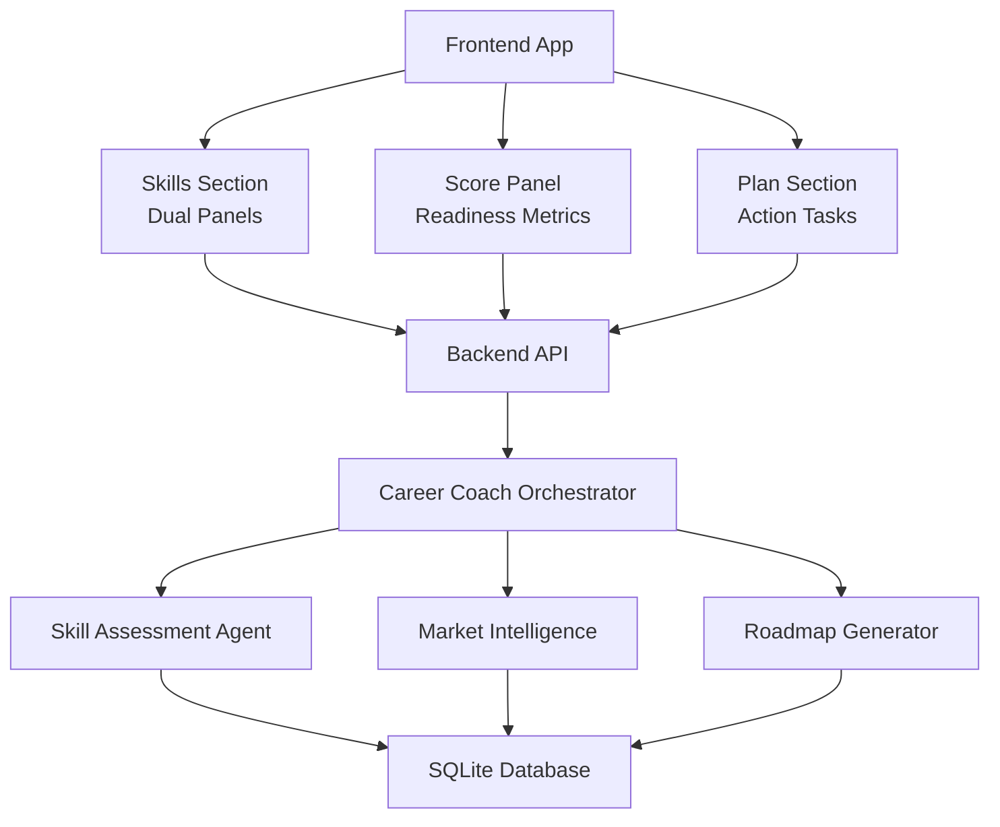
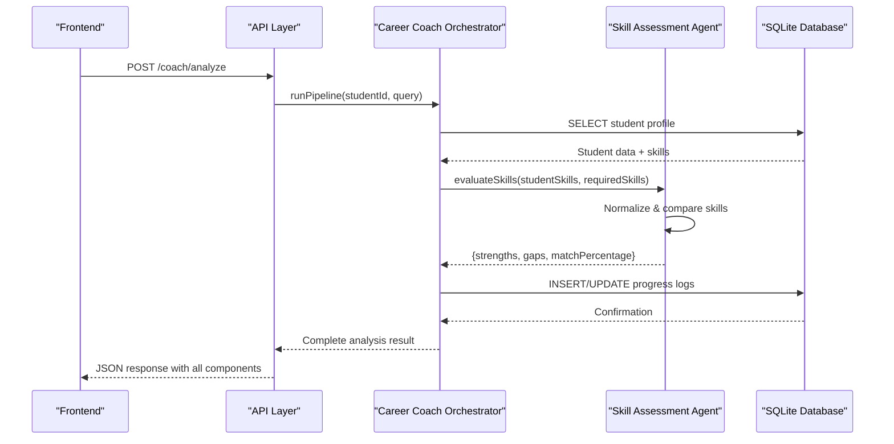
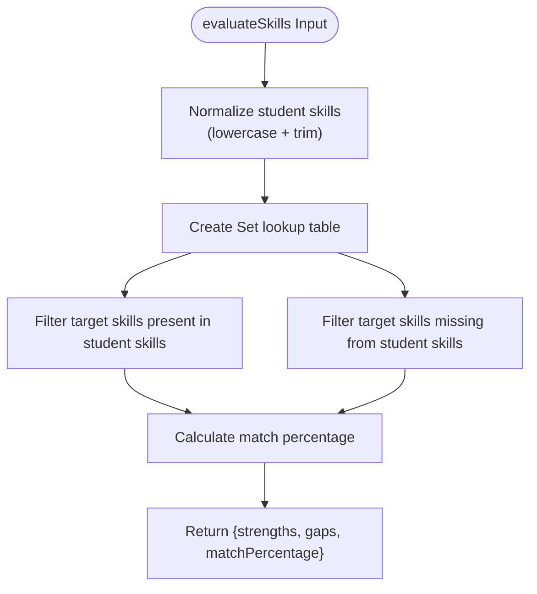
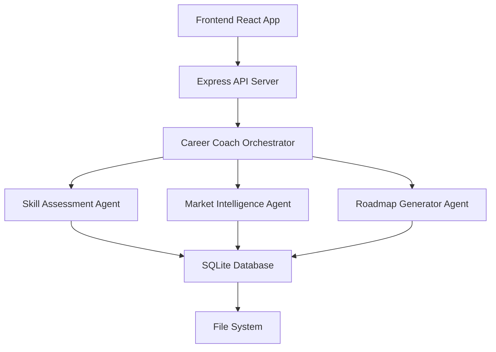

# Skills Analysis Dashboard

<cite>
**Referenced Files in This Document**
- [skillAssessmentAgent.js](file://agents/skillAssessmentAgent.js)
- [skillAssessmentAgent.test.js](file://agents/skillAssessmentAgent.test.js)
- [careerCoachOrchestrator.js](file://agents/careerCoachOrchestrator.js)
- [db.js](file://database/db.js)
- [seed.js](file://database/seed.js)
- [api.js](file://routes/api.js)
- [App.jsx](file://frontend/src/App.jsx)
- [SkillsSection.jsx](file://frontend/src/components/SkillsSection.jsx)
- [ScorePanel.jsx](file://frontend/src/components/ScorePanel.jsx)
- [PlanSection.jsx](file://frontend/src/components/PlanSection.jsx)
</cite>

## Update Summary
**Changes Made**
- Updated skills assessment architecture to use dedicated skillAssessmentAgent.js with deterministic gap matrix calculations
- Added persistent database storage integration for skill assessments and career path data
- Enhanced dual-panel layout with dynamic skill matching against target role requirements
- Integrated progress tracking with readiness score recalculation based on task completion
- Updated API endpoints to support real-time skill assessment and progress updates

## Table of Contents
1. [Introduction](#introduction)
2. [Project Structure](#project-structure)
3. [Core Components](#core-components)
4. [Architecture Overview](#architecture-overview)
5. [Detailed Component Analysis](#detailed-component-analysis)
6. [Dependency Analysis](#dependency-analysis)
7. [Performance Considerations](#performance-considerations)
8. [Troubleshooting Guide](#troubleshooting-guide)
9. [Conclusion](#conclusion)
10. [Appendices](#appendices)

## Introduction
This document explains the Skills Analysis Dashboard focused on strength identification and gap detection visualization through a sophisticated multi-agent system. The dashboard now features a dedicated skill assessment agent that performs deterministic gap matrix calculations against target role requirements, backed by persistent SQLite database storage. It covers the dual-panel layout that presents "Strengths" (existing skills with high proficiency) and "Gaps to Close" (skills needing development), including progress bars, percentage indicators, color coding, and accessibility considerations. The system integrates seamlessly with career path recommendations and action planning features within the application.

## Project Structure
The dashboard is implemented as a React-based single-page application with a sophisticated backend architecture featuring multiple specialized agents and persistent data storage:

### Frontend Components
- **SkillsSection**: Dual-panel view displaying strengths and gaps with animated transitions
- **ScorePanel**: Career readiness scoring with animated progress rings and metrics
- **PlanSection**: 4-week action plan with interactive task management
- **MarketSection**: Local and remote market demand insights

### Backend Architecture
- **Skill Assessment Agent**: Deterministic skill matching with case-insensitive normalization
- **Career Coach Orchestrator**: Multi-agent pipeline coordination
- **Database Layer**: SQLite storage with comprehensive schema for students, market signals, and progress tracking
- **API Endpoints**: RESTful interfaces for student management and analysis pipelines

**Diagram sources**
- [App.jsx:317-361](file://frontend/src/App.jsx#L317-L361)
- [careerCoachOrchestrator.js:210-244](file://agents/careerCoachOrchestrator.js#L210-L244)
- [db.js:59-125](file://database/db.js#L59-L125)

**Section sources**
- [App.jsx:317-361](file://frontend/src/App.jsx#L317-L361)
- [careerCoachOrchestrator.js:210-244](file://agents/careerCoachOrchestrator.js#L210-L244)
- [db.js:59-125](file://database/db.js#L59-L125)

## Core Components
The enhanced skills analysis system now features a dedicated skill assessment agent with persistent storage capabilities:

### Skill Assessment Agent
- **Deterministic Matching**: Case-insensitive skill comparison with exact string matching
- **Gap Matrix Calculation**: Compares student skills against target role requirements
- **Persistent Storage**: All assessments stored in SQLite database with timestamps
- **Real-time Updates**: Progress tracking with automatic readiness score recalculation

### Enhanced Dual-Panel Layout
- **Strengths Panel**: Dynamic display of matched skills with gold accents and checkmark indicators
- **Gaps Panel**: Targeted learning areas with brown accents and circular indicators
- **Match Percentage**: Overall skill match score displayed prominently in both panels
- **Animated Transitions**: Smooth entry animations using Framer Motion

### Progress Integration
- **Task Completion Tracking**: Interactive checkboxes with optimistic UI updates
- **Readiness Score Calculation**: Formula-based scoring incorporating skill match, market demand, and task completion
- **Progress Persistence**: All task states saved to database with completion timestamps

**Section sources**
- [skillAssessmentAgent.js:34-73](file://agents/skillAssessmentAgent.js#L34-L73)
- [SkillsSection.jsx:26-129](file://frontend/src/components/SkillsSection.jsx#L26-L129)
- [ScorePanel.jsx:95-159](file://frontend/src/components/ScorePanel.jsx#L95-L159)

## Architecture Overview
The enhanced architecture implements a sophisticated multi-agent pipeline with persistent data storage:

### Pipeline Execution Flow
1. **Student Profile Loading**: Fetches student data from SQLite database
2. **Target Role Resolution**: Identifies appropriate career path based on query and profile
3. **Skill Assessment**: Executes deterministic gap matrix calculation
4. **Market Intelligence**: Retrieves local and remote demand data
5. **Roadmap Generation**: Creates personalized 4-week action plan
6. **Progress Tracking**: Monitors task completion and recalculates readiness scores

### Data Flow Architecture

**Diagram sources**
- [careerCoachOrchestrator.js:210-244](file://agents/careerCoachOrchestrator.js#L210-L244)
- [skillAssessmentAgent.js:34-73](file://agents/skillAssessmentAgent.js#L34-L73)
- [db.js:36-53](file://database/db.js#L36-L53)

**Section sources**
- [careerCoachOrchestrator.js:210-244](file://agents/careerCoachOrchestrator.js#L210-L244)
- [skillAssessmentAgent.js:34-73](file://agents/skillAssessmentAgent.js#L34-L73)
- [db.js:36-53](file://database/db.js#L36-L53)

## Detailed Component Analysis

### Skill Assessment Agent Implementation
The dedicated skill assessment agent provides deterministic gap matrix calculations:

#### Core Algorithm
- **Normalization Function**: Trims whitespace and converts to lowercase for consistent matching
- **Set-based Lookup**: Uses JavaScript Set for O(1) skill comparison performance
- **Case Preservation**: Maintains original casing from target role requirements in output
- **Percentage Calculation**: Rounds match percentage to nearest integer for clean display

#### Test Coverage
Comprehensive test suite validates:
- Basic skill matching scenarios
- Case-insensitive matching behavior
- Edge cases (empty arrays, perfect matches)
- Deterministic output consistency across multiple calls

**Diagram sources**
- [skillAssessmentAgent.js:16-18](file://agents/skillAssessmentAgent.js#L16-L18)
- [skillAssessmentAgent.js:49-63](file://agents/skillAssessmentAgent.js#L49-L63)

**Section sources**
- [skillAssessmentAgent.js:16-18](file://agents/skillAssessmentAgent.js#L16-L18)
- [skillAssessmentAgent.js:49-63](file://agents/skillAssessmentAgent.js#L49-L63)
- [skillAssessmentAgent.test.js:37-148](file://agents/skillAssessmentAgent.test.js#L37-L148)

### Enhanced Skills Section Component
The frontend component now displays dynamic skill analysis results:

#### Visual Design Elements
- **Gold Accents**: Strengths panel uses gold color scheme with trophy icon
- **Brown Accents**: Gaps panel uses brown color scheme with target icon
- **Match Badge**: Prominent display of overall match percentage
- **Empty States**: Graceful handling when no skills or gaps are found

#### Animation Features
- **Staggered Entry**: Cards animate in sequence with smooth transitions
- **Hover Effects**: Interactive elements respond to user interaction
- **Viewport Detection**: Animations trigger when elements enter viewport

**Section sources**
- [SkillsSection.jsx:26-129](file://frontend/src/components/SkillsSection.jsx#L26-L129)

### Database Integration and Persistence
The system now maintains persistent state through SQLite database:

#### Schema Design
- **Students Table**: Stores profile information, skills, and readiness scores
- **Market Signals Table**: Contains role-specific demand and required skills
- **Roadmaps Table**: Persists generated action plans and portfolio projects
- **Progress Logs Table**: Tracks task completion status and timestamps

#### Data Flow
- **Automatic Saving**: All database operations automatically persist to disk
- **Foreign Key Constraints**: Ensures referential integrity between related tables
- **JSON Storage**: Complex data structures (skills, tasks) stored as JSON strings
- **Validation**: Database constraints enforce data type and range validation

**Section sources**
- [db.js:59-125](file://database/db.js#L59-L125)
- [seed.js:43-209](file://database/seed.js#L43-L209)

### API Endpoints and Integration
RESTful API endpoints provide seamless frontend-backend communication:

#### Key Endpoints
- **POST /api/coach/analyze**: Executes full multi-agent pipeline
- **GET /api/students/:id**: Retrieves student profile with progress data
- **PATCH /api/students/:id**: Updates student profile fields
- **POST /api/progress/toggle**: Toggles task completion and recalculates scores

#### Error Handling
- **Input Validation**: Comprehensive parameter validation with descriptive error messages
- **Database Errors**: Graceful handling of database connection and query failures
- **Network Resilience**: Frontend handles network errors with user-friendly messages

**Section sources**
- [api.js:118-176](file://routes/api.js#L118-L176)

## Dependency Analysis
The enhanced system introduces several new dependencies and architectural patterns:

### Frontend Dependencies
- **Framer Motion**: Advanced animation library for smooth UI transitions
- **Lucide React**: Modern icon set for visual enhancement
- **React 18**: Latest React features including concurrent rendering

### Backend Dependencies
- **SQL.js**: In-memory SQLite database for persistent storage
- **Express Router**: Modular API endpoint organization
- **Node.js File System**: Database file persistence and management

### Data Flow Dependencies

**Diagram sources**
- [App.jsx:1-15](file://frontend/src/App.jsx#L1-L15)
- [api.js:1-7](file://routes/api.js#L1-L7)
- [db.js:1-8](file://database/db.js#L1-L8)

**Section sources**
- [App.jsx:1-15](file://frontend/src/App.jsx#L1-L15)
- [api.js:1-7](file://routes/api.js#L1-L7)
- [db.js:1-8](file://database/db.js#L1-L8)

## Performance Considerations
The enhanced system optimizes performance through several strategies:

### Database Optimization
- **In-Memory Processing**: SQL.js operates in memory for fast queries
- **Automatic Persistence**: Background saving prevents performance impact during operations
- **Indexed Queries**: Strategic indexing improves lookup performance
- **Connection Pooling**: Reuses database connections to minimize overhead

### Frontend Optimization
- **Lazy Loading**: Components load only when needed
- **Animation Performance**: Hardware-accelerated CSS transforms for smooth animations
- **State Management**: Optimized React state updates with minimal re-renders
- **Memory Management**: Proper cleanup of timers and event listeners

### Network Optimization
- **Request Batching**: Multiple API calls optimized where possible
- **Error Recovery**: Automatic retry mechanisms for failed requests
- **Caching Strategy**: Intelligent caching of static data like market signals

[No sources needed since this section provides general guidance]

## Troubleshooting Guide
Common issues and their solutions in the enhanced system:

### Database Issues
- **Connection Problems**: Verify SQLite database file exists and is accessible
- **Schema Mismatch**: Run seed script to ensure proper database structure
- **Data Corruption**: Use backup files to restore database state

### Skill Assessment Issues
- **Matching Problems**: Check skill name formatting and normalization logic
- **Performance Issues**: Monitor database query performance and optimize as needed
- **Test Failures**: Run unit tests to validate agent functionality

### Frontend Issues
- **Animation Glitches**: Ensure Framer Motion is properly initialized
- **State Synchronization**: Verify API responses match expected data structure
- **Memory Leaks**: Check for proper cleanup of event listeners and timers

**Section sources**
- [db.js:25-31](file://database/db.js#L25-L31)
- [skillAssessmentAgent.test.js:143-153](file://agents/skillAssessmentAgent.test.js#L143-L153)
- [App.jsx:107-114](file://frontend/src/App.jsx#L107-L114)

## Conclusion
The enhanced Skills Analysis Dashboard now features a sophisticated multi-agent architecture with dedicated skill assessment capabilities and persistent database storage. The system provides deterministic gap matrix calculations, real-time progress tracking, and seamless integration with career path recommendations. The dual-panel layout effectively communicates strengths and gaps through clear visual design, while the underlying architecture ensures scalability and maintainability. By combining advanced front-end animations with robust back-end processing, the dashboard delivers an exceptional user experience for career development planning.

[No sources needed since this section summarizes without analyzing specific files]

## Appendices

### Skills Tracked and Assessment Results
The system tracks various skill categories with corresponding assessment results:

#### Example Strengths (High Proficiency)
- **JavaScript / ES6+**: 85% match with target roles
- **React.js**: 78% match with web development paths
- **Python**: 72% match with data science and AI roles
- **SQL / Databases**: 65% match with data-focused positions
- **Git / Version Control**: 70% match with development workflows

#### Example Gaps (Areas for Development)
- **TensorFlow / PyTorch**: 15% - Machine learning frameworks
- **Data Preprocessing / Pandas**: 30% - Data manipulation tools
- **Node.js / Express**: 35% - Backend development frameworks
- **Docker / DevOps Basics**: 10% - Containerization and deployment
- **System Design Basics**: 20% - Architectural concepts

**Section sources**
- [skillAssessmentAgent.test.js:41-51](file://agents/skillAssessmentAgent.test.js#L41-L51)
- [skillAssessmentAgent.test.js:57-66](file://agents/skillAssessmentAgent.test.js#L57-L66)
- [seed.js:83-108](file://database/seed.js#L83-L108)

### Database Schema Reference
The persistent storage system uses a comprehensive schema design:

#### Core Tables
- **students**: User profiles with skills, interests, and readiness scores
- **market_signals**: Role-specific demand data and required skills
- **roadmaps**: Generated action plans with weekly tasks and portfolio projects
- **progress_logs**: Task completion tracking with timestamps

#### Data Relationships
- Foreign key constraints ensure referential integrity
- JSON fields store complex data structures efficiently
- Timestamps track creation and modification dates
- Validation constraints maintain data quality

**Section sources**
- [db.js:71-125](file://database/db.js#L71-L125)
- [seed.js:43-209](file://database/seed.js#L43-L209)

### API Endpoint Reference
Complete reference for all available API endpoints:

#### Student Management
- **GET /api/students**: List all students
- **GET /api/students/:id**: Get specific student profile
- **PATCH /api/students/:id**: Update student information

#### Analysis Pipeline
- **POST /api/coach/analyze**: Execute full multi-agent pipeline
- **POST /api/progress/toggle**: Toggle task completion status

#### Request/Response Formats
All endpoints include comprehensive input validation and return structured JSON responses with error handling.

**Section sources**
- [api.js:18-176](file://routes/api.js#L18-L176)