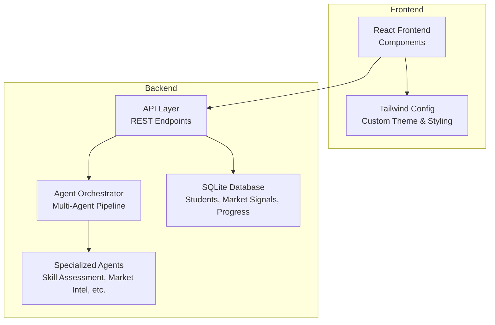
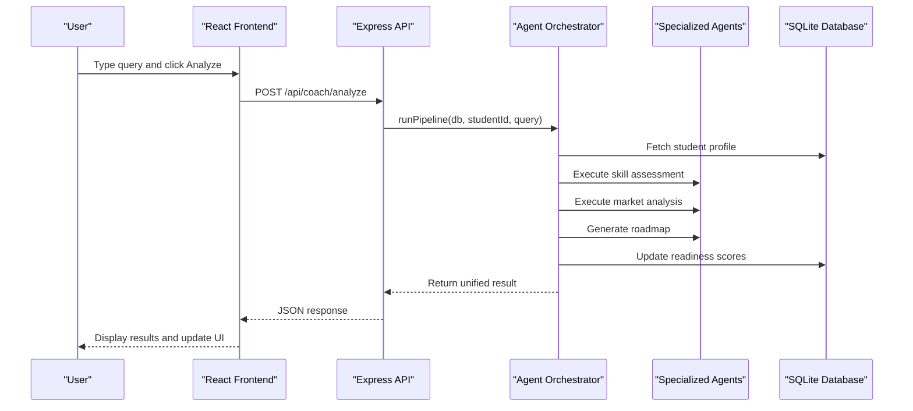
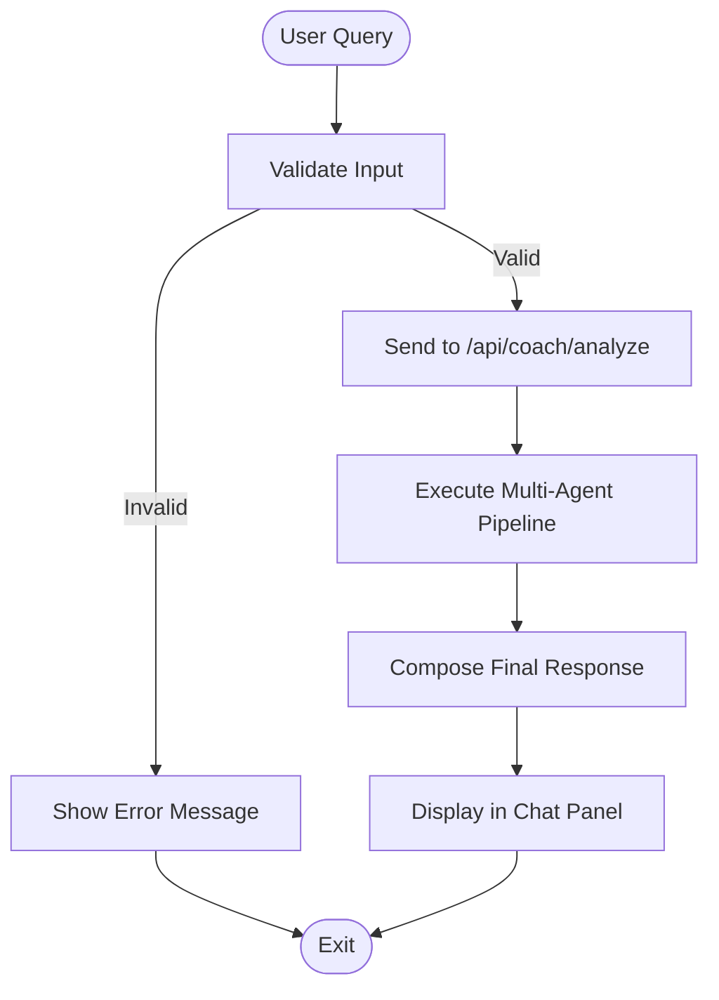
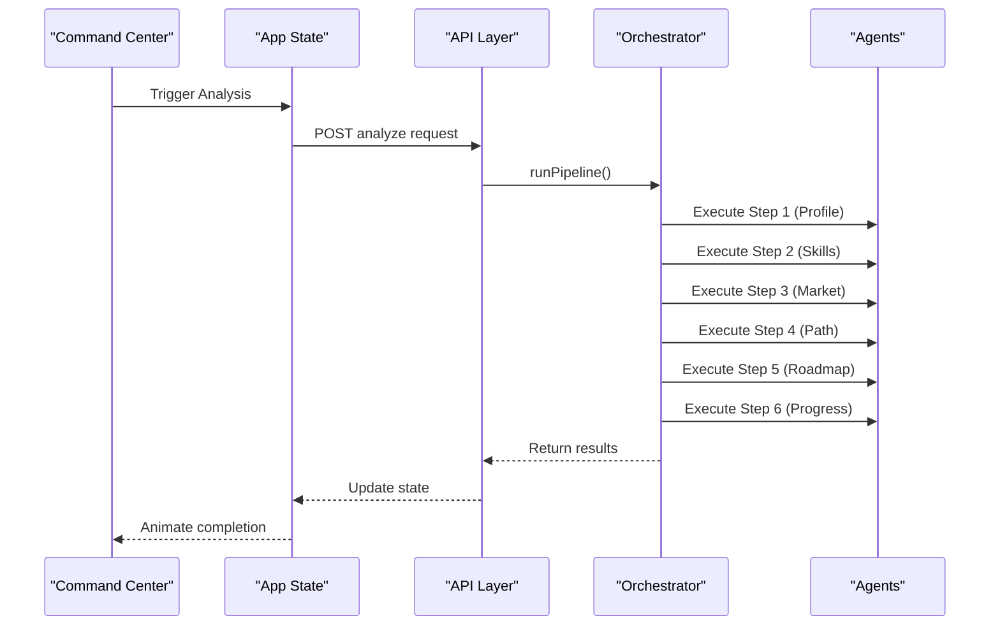
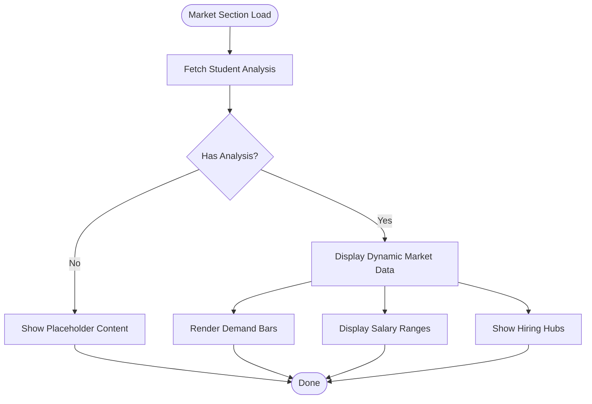
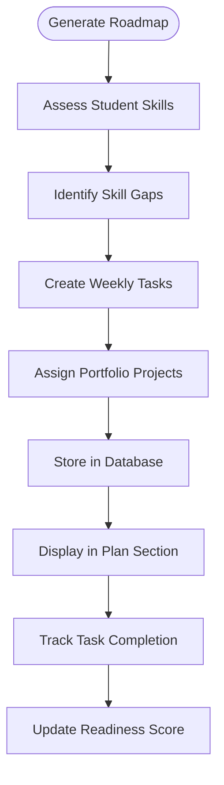

# Customization Guide

<cite>
**Referenced Files in This Document**
- [App.jsx](file://frontend/src/App.jsx)
- [careerCoachOrchestrator.js](file://agents/careerCoachOrchestrator.js)
- [skillAssessmentAgent.js](file://agents/skillAssessmentAgent.js)
- [db.js](file://database/db.js)
- [api.js](file://routes/api.js)
- [ChatPanel.jsx](file://frontend/src/components/ChatPanel.jsx)
- [CommandCenter.jsx](file://frontend/src/components/CommandCenter.jsx)
- [MarketSection.jsx](file://frontend/src/components/MarketSection.jsx)
- [PlanSection.jsx](file://frontend/src/components/PlanSection.jsx)
- [tailwind.config.js](file://frontend/tailwind.config.js)
- [seed.js](file://database/seed.js)
</cite>

## Update Summary
**Changes Made**
- Updated architecture overview to reflect multi-file React application structure
- Replaced single-file customization instructions with modular component-based approach
- Added agent logic customization for the multi-agent pipeline
- Updated database schema modification guidance
- Added API endpoint customization for backend integration
- Enhanced styling customization through Tailwind configuration
- Updated practical examples to reflect current codebase structure

## Table of Contents
1. [Introduction](#introduction)
2. [Project Structure](#project-structure)
3. [Core Components](#core-components)
4. [Architecture Overview](#architecture-overview)
5. [Detailed Component Analysis](#detailed-component-analysis)
6. [Agent Logic Customization](#agent-logic-customization)
7. [Database Schema Customization](#database-schema-customization)
8. [API Endpoints Customization](#api-endpoints-customization)
9. [Frontend Component Customization](#frontend-component-customization)
10. [Styling and Theme Customization](#styling-and-theme-customization)
11. [Performance Considerations](#performance-considerations)
12. [Troubleshooting Guide](#troubleshooting-guide)
13. [Conclusion](#conclusion)
14. [Appendices](#appendices)

## Introduction
This guide explains how to customize CareerCompass, a modern React application with a multi-agent pipeline system, SQLite database, and RESTful API endpoints. You will learn how to:
- Modify chat responses by editing the orchestrator logic and frontend components
- Add new agents to the multi-agent pipeline by extending the orchestrator and creating new agent modules
- Extend market data sections by modifying database schemas and API endpoints
- Customize the 4-week action plan through roadmap generation logic and database seeding
- Adjust styling via Tailwind config and React component styling
- Maintain code organization across the modular file structure

The goal is to make it easy to adapt the application for different student profiles, career paths, and integration scenarios while maintaining clean separation of concerns.

## Project Structure
CareerCompass is implemented as a modern full-stack application with:
- **Frontend**: React application with modular components using Framer Motion for animations
- **Backend**: Express.js server with RESTful API endpoints
- **Agents**: Modular agent system with specialized functionality
- **Database**: SQLite database with structured schema for students, market signals, and progress tracking
- **Configuration**: Tailwind CSS for styling with custom theme configuration



**Diagram sources**
- [App.jsx:1-388](file://frontend/src/App.jsx#L1-L388)
- [api.js:1-176](file://routes/api.js#L1-L176)
- [careerCoachOrchestrator.js:1-337](file://agents/careerCoachOrchestrator.js#L1-L337)
- [db.js:1-125](file://database/db.js#L1-L125)
- [tailwind.config.js:1-31](file://frontend/tailwind.config.js#L1-L31)

**Section sources**
- [App.jsx:1-388](file://frontend/src/App.jsx#L1-L388)
- [api.js:1-176](file://routes/api.js#L1-L176)
- [db.js:1-125](file://database/db.js#L1-L125)
- [tailwind.config.js:1-31](file://frontend/tailwind.config.js#L1-L31)

## Core Components
Key customizable areas in the modular architecture:
- **Chat System**: Editable response logic in orchestrator and frontend chat components
- **Multi-Agent Pipeline**: Agent orchestration and individual agent logic
- **Market Data**: Database schema and API endpoints for market information
- **Action Plan**: Roadmap generation logic and weekly task management
- **Styling**: Tailwind configuration and component-specific styles

Practical tips:
- Keep each module focused on single responsibility
- Use consistent naming conventions across components and agents
- Maintain clear separation between frontend, backend, and business logic
- Document API contracts between frontend and backend

**Section sources**
- [App.jsx:172-238](file://frontend/src/App.jsx#L172-L238)
- [careerCoachOrchestrator.js:210-337](file://agents/careerCoachOrchestrator.js#L210-L337)
- [api.js:118-176](file://routes/api.js#L118-L176)
- [db.js:71-125](file://database/db.js#L71-L125)

## Architecture Overview
The application follows a modern client-server architecture:
- **Frontend**: React components handle user interactions and display state
- **API Layer**: Express routes provide RESTful endpoints for data operations
- **Agent System**: Modular agents process specific tasks in a coordinated pipeline
- **Database**: SQLite stores persistent data with well-defined relationships
- **Styling**: Tailwind CSS provides utility classes with custom theme extensions



**Diagram sources**
- [App.jsx:172-238](file://frontend/src/App.jsx#L172-L238)
- [api.js:118-142](file://routes/api.js#L118-L142)
- [careerCoachOrchestrator.js:210-337](file://agents/careerCoachOrchestrator.js#L210-L337)
- [db.js:71-125](file://database/db.js#L71-L125)

## Detailed Component Analysis

### Chat System Customization
The chat system now uses a sophisticated orchestrator that processes queries through multiple agents rather than simple array-based responses.

**Updated** - Chat responses are now dynamically generated based on pipeline results rather than static arrays.

**How to modify:**
- Edit the `composeReply` function in App.jsx to customize final coach responses
- Modify the orchestrator's recommendation building logic for different tones
- Update suggested queries in ChatPanel.jsx for different career paths
- Adjust typing indicators and message formatting in ChatPanel.jsx



**Diagram sources**
- [App.jsx:172-238](file://frontend/src/App.jsx#L172-L238)
- [ChatPanel.jsx:18-23](file://frontend/src/components/ChatPanel.jsx#L18-L23)

**Section sources**
- [App.jsx:25-46](file://frontend/src/App.jsx#L25-L46)
- [ChatPanel.jsx:1-187](file://frontend/src/components/ChatPanel.jsx#L1-L187)

### Multi-Agent Pipeline Customization
The pipeline now consists of six specialized agents orchestrated by a central coordinator.

**Updated** - Pipeline animation and execution is handled through React state management rather than DOM manipulation.

**How to extend:**
- Add new agent modules in the agents directory
- Extend the orchestrator to include new agent steps
- Update CommandCenter.jsx to display new agent status
- Modify the STEPS array to include new agent definitions



**Diagram sources**
- [careerCoachOrchestrator.js:210-337](file://agents/careerCoachOrchestrator.js#L210-L337)
- [CommandCenter.jsx:28-35](file://frontend/src/components/CommandCenter.jsx#L28-L35)
- [App.jsx:172-238](file://frontend/src/App.jsx#L172-L238)

**Section sources**
- [careerCoachOrchestrator.js:1-337](file://agents/careerCoachOrchestrator.js#L1-L337)
- [CommandCenter.jsx:1-531](file://frontend/src/components/CommandCenter.jsx#L1-L531)

### Market Data Sections Customization
Market data is now stored in the database and served through API endpoints.

**Updated** - Market insights are dynamic and based on database queries rather than static content.

**How to extend:**
- Add new market roles in the seed script or directly in the database
- Modify market signal queries in the orchestrator
- Update MarketSection.jsx to display new market categories
- Extend database schema if new market attributes are needed



**Diagram sources**
- [MarketSection.jsx:38-126](file://frontend/src/components/MarketSection.jsx#L38-L126)
- [seed.js:82-117](file://database/seed.js#L82-L117)

**Section sources**
- [MarketSection.jsx:1-126](file://frontend/src/components/MarketSection.jsx#L1-L126)
- [seed.js:82-117](file://database/seed.js#L82-L117)

### 4-Week Action Plan Customization
The action plan is now generated dynamically based on student skills and target roles.

**Updated** - Weekly tasks are stored in the database and can be tracked with progress logging.

**How to customize:**
- Modify roadmap generation logic in the orchestrator
- Update seed data for different student profiles
- Extend PlanSection.jsx to show additional task metadata
- Add new task types and completion tracking



**Diagram sources**
- [careerCoachOrchestrator.js:256-274](file://agents/careerCoachOrchestrator.js#L256-L274)
- [PlanSection.jsx:12-163](file://frontend/src/components/PlanSection.jsx#L12-L163)

**Section sources**
- [PlanSection.jsx:1-163](file://frontend/src/components/PlanSection.jsx#L1-L163)
- [careerCoachOrchestrator.js:256-274](file://agents/careerCoachOrchestrator.js#L256-L274)

## Agent Logic Customization

### Adding New Agents
To add a new agent to the pipeline:

1. **Create Agent Module**: Create a new file in the `agents/` directory
2. **Implement Agent Logic**: Define the agent's specific functionality
3. **Update Orchestrator**: Import and call the new agent in the pipeline
4. **Add UI Support**: Update CommandCenter to display the new agent's status

**Example - Adding a Research Agent:**

```javascript
// In agents/researchAgent.js
export function conductResearch(student, targetRole) {
  // Research logic here
  return { findings: [], resources: [] };
}

// In careerCoachOrchestrator.js
import { conductResearch } from './researchAgent.js';

// Add step in runPipeline function
const stepX = mark('ResearchAgent');
const researchResult = conductResearch(student, targetRole);
done(stepX);
```

**Section sources**
- [careerCoachOrchestrator.js:210-337](file://agents/careerCoachOrchestrator.js#L210-L337)

### Modifying Existing Agents
Each agent has specific responsibilities:

- **Skill Assessment**: Evaluates student skills against target requirements
- **Market Intelligence**: Analyzes job market conditions and demand
- **Career Path**: Determines optimal learning path based on goals
- **Roadmap Generator**: Creates detailed weekly action plans
- **Progress Tracker**: Calculates readiness scores and tracks completion

**Section sources**
- [skillAssessmentAgent.js:1-74](file://agents/skillAssessmentAgent.js#L1-L74)

## Database Schema Customization

### Extending Database Tables
The database schema supports several core tables:

**Students Table**: Stores student profiles and metrics
**Market Signals**: Contains job market data and requirements  
**Roadmaps**: Holds personalized learning plans
**Progress Logs**: Tracks task completion and progress

**How to extend:**
1. Modify schema in `db.js` initialization
2. Update seed script to include new data
3. Add API endpoints for new data operations
4. Update frontend components to display new fields

**Section sources**
- [db.js:71-125](file://database/db.js#L71-L125)
- [seed.js:43-210](file://database/seed.js#L43-L210)

### Adding New Data Types
To add new data types:

1. **Define Schema**: Add new table or columns in `db.js`
2. **Update Seed**: Include sample data in `seed.js`
3. **Modify APIs**: Add endpoints to handle new data
4. **Update UI**: Display new information in relevant components

**Section sources**
- [db.js:59-125](file://database/db.js#L59-L125)

## API Endpoints Customization

### Available Endpoints
The application provides these RESTful endpoints:

- `GET /api/students` - List all students
- `GET /api/students/:id` - Get student details with progress
- `PATCH /api/students/:id` - Update student profile
- `POST /api/coach/analyze` - Run full multi-agent pipeline
- `POST /api/progress/toggle` - Toggle task completion status

**How to extend:**
1. Add new route handlers in `routes/api.js`
2. Implement business logic in agent modules
3. Update database queries as needed
4. Add frontend API calls in `frontend/src/api.js`

**Section sources**
- [api.js:1-176](file://routes/api.js#L1-L176)

### Creating New Endpoints
To add new API functionality:

1. **Define Route**: Add new endpoint in `routes/api.js`
2. **Implement Logic**: Create handler function with validation
3. **Database Operations**: Add necessary database queries
4. **Frontend Integration**: Call new endpoint from React components

**Section sources**
- [api.js:118-176](file://routes/api.js#L118-L176)

## Frontend Component Customization

### Modifying Chat Panel
The chat panel handles user interactions and displays messages.

**How to customize:**
- Edit suggested queries in `SUGGESTED` array
- Modify message formatting and styling
- Add new interaction patterns
- Update language support

**Section sources**
- [ChatPanel.jsx:1-187](file://frontend/src/components/ChatPanel.jsx#L1-L187)

### Customizing Command Center
The command center visualizes the multi-agent pipeline execution.

**How to extend:**
- Add new agent steps to the `STEPS` array
- Update state management for new agent states
- Modify animation timing and effects
- Add new detail views for agent outputs

**Section sources**
- [CommandCenter.jsx:1-531](file://frontend/src/components/CommandCenter.jsx#L1-L531)

### Updating Market Section
The market section displays job market insights and salary information.

**How to modify:**
- Add new salary ranges in the `SALARIES` array
- Include new hiring hubs in the `HUBS` array
- Update demand visualization components
- Add new market categories

**Section sources**
- [MarketSection.jsx:1-126](file://frontend/src/components/MarketSection.jsx#L1-L126)

### Enhancing Plan Section
The plan section shows the 4-week action plan with task tracking.

**How to customize:**
- Modify week themes and descriptions
- Add new task types and metadata
- Update completion tracking functionality
- Enhance portfolio project display

**Section sources**
- [PlanSection.jsx:1-163](file://frontend/src/components/PlanSection.jsx#L1-L163)

## Styling and Theme Customization

### Tailwind Configuration
The application uses Tailwind CSS with extensive custom theme configuration.

**How to customize:**
- Modify color palette in `tailwind.config.js`
- Add new font families and typography
- Extend shadow configurations
- Add custom breakpoints if needed

**Section sources**
- [tailwind.config.js:1-31](file://frontend/tailwind.config.js#L1-L31)

### Component-Level Styling
Each component uses inline styles and Tailwind classes for consistent theming.

**Best practices:**
- Use existing color tokens from Tailwind config
- Maintain responsive design patterns
- Follow consistent spacing and sizing
- Use motion libraries for smooth transitions

**Section sources**
- [App.jsx:313-388](file://frontend/src/App.jsx#L313-L388)

## Performance Considerations
- **Component Optimization**: Use React.memo and useMemo for expensive computations
- **Database Queries**: Optimize SQL queries and use proper indexing
- **API Calls**: Implement caching strategies and error handling
- **Animation Performance**: Use Framer Motion efficiently with proper key props
- **Memory Management**: Clean up event listeners and timers properly

## Troubleshooting Guide

### Common Issues and Solutions

**Chat Not Responding:**
- Verify API connectivity and endpoint availability
- Check network requests in browser developer tools
- Ensure student ID is valid and exists in database

**Pipeline Animation Issues:**
- Confirm agent states are properly managed in React state
- Check that CommandCenter receives correct props
- Verify animation timing constants are appropriate

**Database Connection Problems:**
- Ensure database file exists and is accessible
- Check SQLite initialization in server startup
- Verify database permissions and file paths

**API Endpoint Errors:**
- Validate request payload format and required fields
- Check database query syntax and parameter binding
- Review error handling in API route handlers

**Section sources**
- [App.jsx:172-238](file://frontend/src/App.jsx#L172-L238)
- [api.js:118-176](file://routes/api.js#L118-L176)
- [db.js:59-125](file://database/db.js#L59-L125)

## Conclusion
CareerCompass provides a robust foundation for career guidance with its modular architecture, multi-agent system, and modern React frontend. The customization options allow for extensive personalization while maintaining clean code organization and scalability. By following the guidelines in this document, you can adapt the application to various educational contexts, career paths, and technical requirements.

## Appendices

### Practical Examples

#### Adapting for Different Student Profiles
- Modify seed data to include diverse student backgrounds
- Update skill assessment logic to handle different education levels
- Customize recommended career paths based on student interests
- Adjust difficulty levels in action plans

#### Adding New Career Paths Beyond AI/ML and Full Stack
- Add new market signals in the database seed
- Create specialized agents for new career domains
- Update career path resolution logic in orchestrator
- Extend UI components to display new career information

#### Integrating with External APIs for Real-time Data
- Create new API endpoints for external data sources
- Implement caching strategies for third-party data
- Add error handling for API failures
- Update UI to show real-time data updates

**Section sources**
- [seed.js:43-210](file://database/seed.js#L43-L210)
- [careerCoachOrchestrator.js:47-159](file://agents/careerCoachOrchestrator.js#L47-L159)
- [api.js:1-176](file://routes/api.js#L1-L176)

### Code Organization Best Practices
- **Modular Design**: Keep related functionality in separate files
- **Consistent Naming**: Use descriptive names for functions and variables
- **Error Handling**: Implement proper error handling throughout the stack
- **Documentation**: Comment complex logic and maintain README files
- **Testing**: Write tests for critical business logic and API endpoints

[No sources needed since this section provides general guidance]