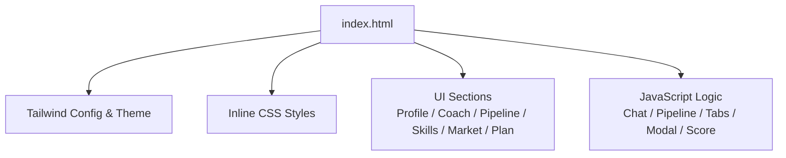
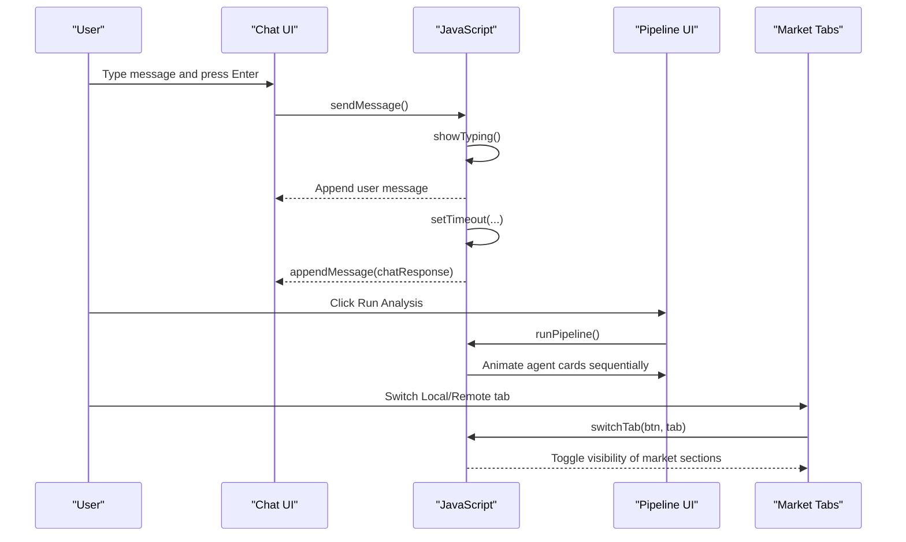
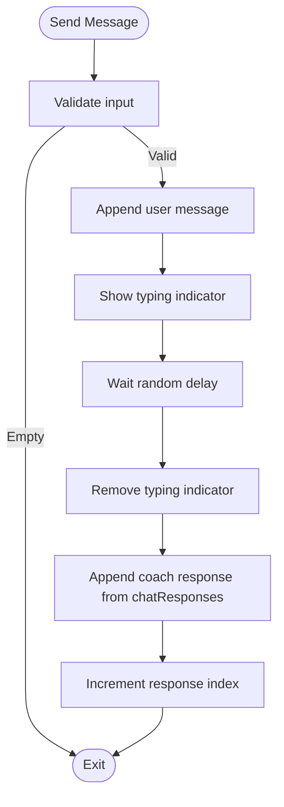
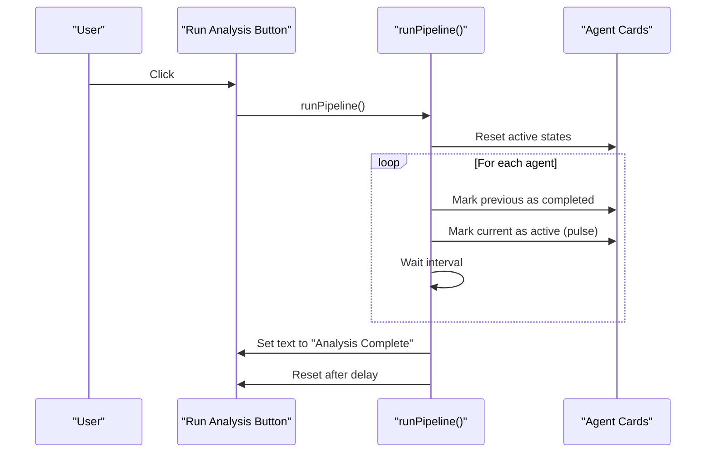
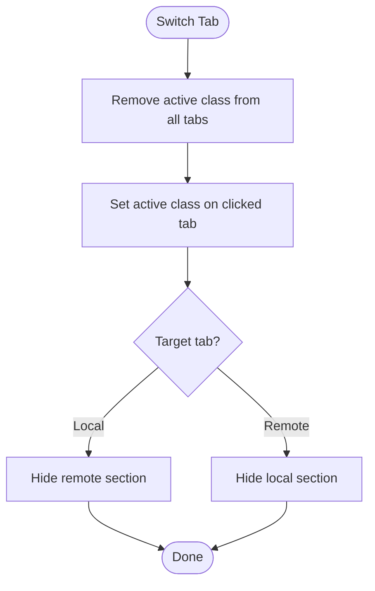
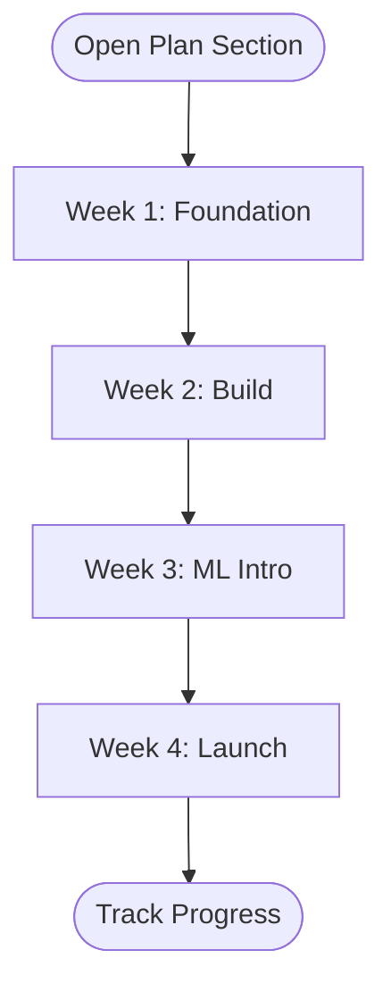
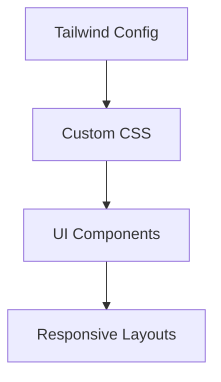
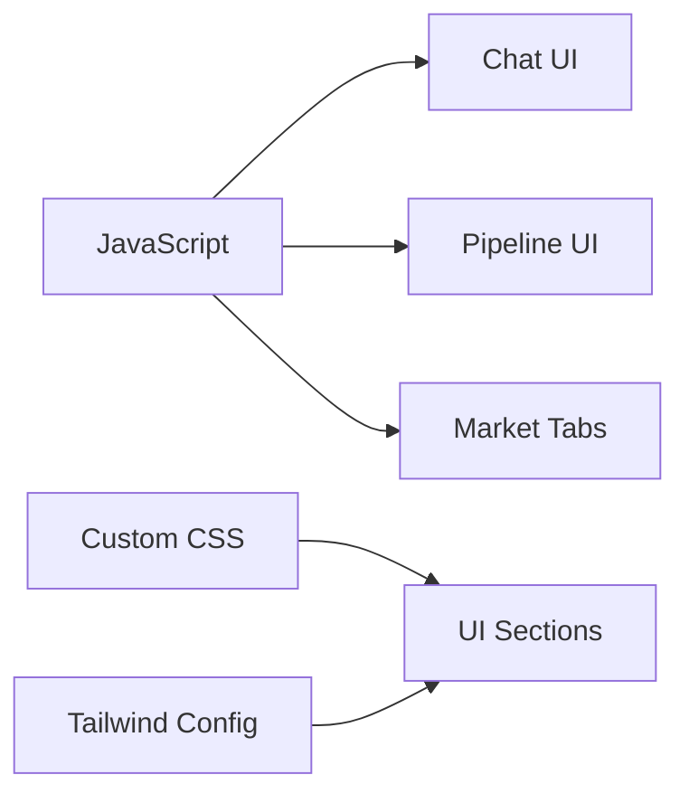

# Customization Guide

<cite>
**Referenced Files in This Document**
- [index.html](file://index.html)
</cite>

## Table of Contents
1. [Introduction](#introduction)
2. [Project Structure](#project-structure)
3. [Core Components](#core-components)
4. [Architecture Overview](#architecture-overview)
5. [Detailed Component Analysis](#detailed-component-analysis)
6. [Dependency Analysis](#dependency-analysis)
7. [Performance Considerations](#performance-considerations)
8. [Troubleshooting Guide](#troubleshooting-guide)
9. [Conclusion](#conclusion)
10. [Appendices](#appendices)

## Introduction
This guide explains how to customize the CareerCompass prototype, a single-file HTML application that includes Tailwind CSS and inline JavaScript. You will learn how to:
- Modify chat responses by editing the chatResponses array
- Add new agents to the multi-agent pipeline by duplicating agent card structures and updating animation logic
- Extend market data sections by adding tabs or modifying existing market information arrays
- Customize the 4-week action plan by editing checklist items and week descriptions
- Adjust styling via Tailwind config and custom CSS for color schemes, responsive behavior, and animations
- Maintain code organization and readability within the single-file structure

The goal is to make it easy to adapt the prototype for different student profiles, career paths, and integration scenarios without breaking functionality.

## Project Structure
CareerCompass is implemented as a single HTML file with:
- Inline Tailwind configuration and theme customization
- Inline CSS for glass effects, animations, and component styles
- A structured UI with sections for Profile, Coach (chat), Multi-Agent Pipeline, Skills, Market Insights, Action Plan, and Portfolio Recommendations
- Inline JavaScript handling chat interactions, pipeline animation, tab switching, modal toggles, and score animation

**Diagram sources**
- [index.html:10-21](file://index.html#L10-L21)
- [index.html:22-43](file://index.html#L22-L43)
- [index.html:47-527](file://index.html#L47-L527)
- [index.html:565-681](file://index.html#L565-L681)

**Section sources**
- [index.html:10-21](file://index.html#L10-L21)
- [index.html:22-43](file://index.html#L22-L43)
- [index.html:47-527](file://index.html#L47-L527)
- [index.html:565-681](file://index.html#L565-L681)

## Core Components
Key customizable areas:
- Chat responses: Editable array driving coach replies
- Multi-agent pipeline: Agent cards and animation sequence
- Market insights: Local/Remote tabs and content blocks
- 4-week action plan: Weekly checklists and descriptions
- Styling: Tailwind theme colors and custom CSS animations

Practical tips:
- Keep each section clearly separated with comments
- Use descriptive variable names and consistent indentation
- Avoid hardcoding values where possible; prefer arrays or constants for repeated patterns

**Section sources**
- [index.html:565-681](file://index.html#L565-L681)
- [index.html:172-226](file://index.html#L172-L226)
- [index.html:228-281](file://index.html#L228-L281)
- [index.html:315-390](file://index.html#L315-L390)
- [index.html:392-458](file://index.html#L392-L458)
- [index.html:10-21](file://index.html#L10-L21)
- [index.html:22-43](file://index.html#L22-L43)

## Architecture Overview
The application follows a simple client-side architecture:
- UI sections render static content and interactive elements
- JavaScript handles user interactions and updates DOM state
- Tailwind provides utility classes; custom CSS adds specialized effects
- No external APIs are connected; all data is embedded in the HTML/JS

**Diagram sources**
- [index.html:565-681](file://index.html#L565-L681)
- [index.html:172-226](file://index.html#L172-L226)
- [index.html:228-281](file://index.html#L228-L281)
- [index.html:315-390](file://index.html#L315-L390)

## Detailed Component Analysis

### Chat Responses Customization
- Location: The chatResponses array defines pre-written coach replies used when sending messages or suggested questions.
- How to modify:
  - Add new strings to the array to expand response options
  - Update existing entries to tailor tone, advice, or references
  - Ensure HTML-safe formatting if using tags like strong
- Behavior:
  - Each send cycles through responses using an index modulo length
  - Typing indicator appears briefly before appending the next response

**Diagram sources**
- [index.html:565-681](file://index.html#L565-L681)

**Section sources**
- [index.html:565-681](file://index.html#L565-L681)

### Multi-Agent Pipeline Customization
- Location: Agent cards grid and runPipeline function control the visual flow of sub-agents.
- How to add a new agent:
  - Duplicate an existing agent card block and update its label, role, and icon
  - Ensure the card has a unique data-agent attribute
  - Optionally adjust gradient colors to match the new agent’s theme
- Animation logic:
  - runPipeline iterates over agent cards, highlighting each in sequence
  - Status dots change color to indicate active/completed states
  - Button state reflects analysis progress and completion

**Diagram sources**
- [index.html:228-281](file://index.html#L228-L281)
- [index.html:630-657](file://index.html#L630-L657)

**Section sources**
- [index.html:228-281](file://index.html#L228-L281)
- [index.html:630-657](file://index.html#L630-L657)

### Market Data Sections Customization
- Location: Market insights section contains Local and Remote tabs with content blocks.
- How to extend:
  - Add a new tab button and corresponding content container
  - Update switchTab to handle the new tab ID and toggle visibility
  - Populate content blocks with new roles, salary ranges, platforms, or hubs
- Current structure:
  - Two tabs: Local and Remote
  - Each tab shows three columns: demand, salary, and platforms/hubs

**Diagram sources**
- [index.html:315-390](file://index.html#L315-L390)
- [index.html:659-665](file://index.html#L659-L665)

**Section sources**
- [index.html:315-390](file://index.html#L315-L390)
- [index.html:659-665](file://index.html#L659-L665)

### 4-Week Action Plan Customization
- Location: Four weekly cards with checklist items and week labels/descriptions.
- How to customize:
  - Edit checklist item text to reflect new tasks or milestones
  - Change week titles and subtitles to align with your curriculum or goals
  - Adjust initial checked states to represent starting points
- Tips:
  - Keep tasks actionable and time-bound
  - Group related tasks under each week for clarity

**Diagram sources**
- [index.html:392-458](file://index.html#L392-L458)

**Section sources**
- [index.html:392-458](file://index.html#L392-L458)

### Styling and Theme Customization
- Tailwind config:
  - Colors: Define brand palette and extend theme colors
  - Fonts: Configure sans-serif font stack
- Custom CSS:
  - Glass effect, glow, score ring, and animations
  - Scrollbar styling and component transitions
- Responsive design:
  - Grid layouts adapt across breakpoints (sm, md, lg)
  - Navigation hides/shows based on screen size

**Diagram sources**
- [index.html:10-21](file://index.html#L10-L21)
- [index.html:22-43](file://index.html#L22-L43)
- [index.html:47-527](file://index.html#L47-L527)

**Section sources**
- [index.html:10-21](file://index.html#L10-L21)
- [index.html:22-43](file://index.html#L22-L43)
- [index.html:47-527](file://index.html#L47-L527)

## Dependency Analysis
Within this single-file prototype:
- JavaScript depends on DOM elements identified by IDs and classes
- UI sections rely on Tailwind utility classes and custom CSS
- Pipeline animation depends on agent card structure and status dot elements
- Market tabs depend on tab buttons and content containers with specific IDs

Potential coupling points:
- Changing agent card structure may require updates to runPipeline iteration logic
- Adding new tabs requires updating switchTab to handle additional IDs
- Modifying chat responses does not affect other components but should maintain consistent formatting

**Diagram sources**
- [index.html:565-681](file://index.html#L565-L681)
- [index.html:172-226](file://index.html#L172-L226)
- [index.html:228-281](file://index.html#L228-L281)
- [index.html:315-390](file://index.html#L315-L390)
- [index.html:10-21](file://index.html#L10-L21)
- [index.html:22-43](file://index.html#L22-L43)

**Section sources**
- [index.html:565-681](file://index.html#L565-L681)
- [index.html:172-226](file://index.html#L172-L226)
- [index.html:228-281](file://index.html#L228-L281)
- [index.html:315-390](file://index.html#L315-L390)
- [index.html:10-21](file://index.html#L10-L21)
- [index.html:22-43](file://index.html#L22-L43)

## Performance Considerations
- Keep chat responses concise to avoid long DOM updates
- Limit the number of agent cards to maintain smooth animation performance
- Prefer minimal reflows by toggling visibility rather than recreating elements
- Use Tailwind utilities to reduce custom CSS complexity
- Debounce frequent interactions if adding more dynamic features later

[No sources needed since this section provides general guidance]

## Troubleshooting Guide
Common issues and fixes:
- Chat not responding:
  - Ensure chatInput element exists and event handlers are attached
  - Verify chatResponses array is defined and non-empty
- Pipeline animation not working:
  - Confirm agent cards have correct classes and status dot elements
  - Check that runPipeline targets .agent-card nodes correctly
- Market tabs not switching:
  - Ensure tab buttons call switchTab with correct arguments
  - Verify content containers have matching IDs and hidden class toggling
- Modal not opening/closing:
  - Confirm openEditProfile/closeEditProfile functions reference correct IDs
  - Check that modal container has proper hidden class management

**Section sources**
- [index.html:565-681](file://index.html#L565-L681)
- [index.html:529-562](file://index.html#L529-L562)

## Conclusion
You can confidently customize CareerCompass by editing the chat responses, extending the multi-agent pipeline, expanding market data sections, and tailoring the 4-week action plan. Use Tailwind config and custom CSS to adjust themes and animations. Maintain clear structure and comments to keep the single-file prototype readable and maintainable.

[No sources needed since this section summarizes without analyzing specific files]

## Appendices

### Practical Examples

- Adapting for different student profiles:
  - Update profile fields and interests in the UI
  - Adjust skill match percentages and gaps to reflect new backgrounds
  - Modify chat responses to address new goals and constraints

- Adding new career paths beyond AI/ML and Full Stack:
  - Insert new tabs or sections under Market Insights
  - Add relevant skills and project recommendations
  - Update action plan weeks to include path-specific tasks

- Integrating with external APIs for real-time data:
  - Replace static arrays with fetch calls to retrieve live data
  - Handle loading states and errors gracefully
  - Cache results locally to improve responsiveness

[No sources needed since this section provides conceptual guidance]