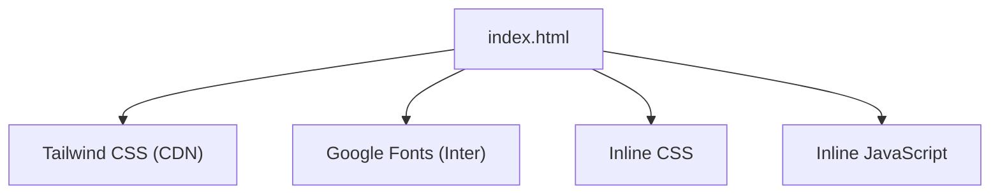
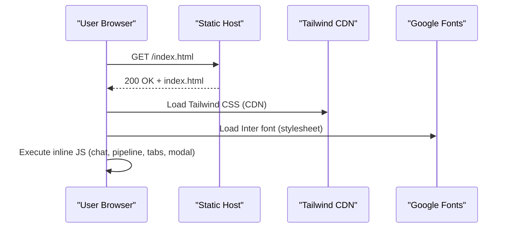
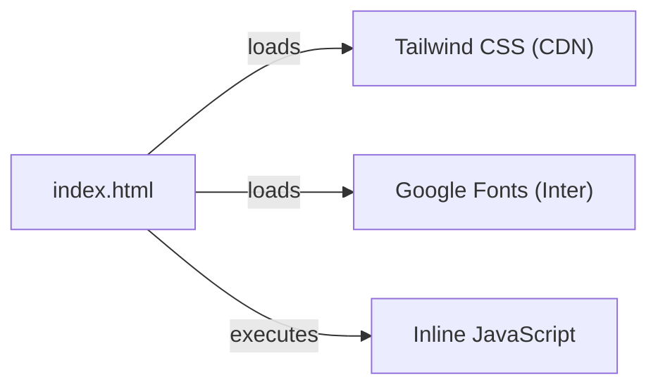

# Deployment

<cite>
**Referenced Files in This Document**
- [index.html](file://index.html)
</cite>

## Table of Contents
1. [Introduction](#introduction)
2. [Project Structure](#project-structure)
3. [Core Components](#core-components)
4. [Architecture Overview](#architecture-overview)
5. [Detailed Component Analysis](#detailed-component-analysis)
6. [Dependency Analysis](#dependency-analysis)
7. [Performance Considerations](#performance-considerations)
8. [Troubleshooting Guide](#troubleshooting-guide)
9. [Conclusion](#conclusion)
10. [Appendices](#appendices)

## Introduction
This document provides comprehensive deployment guidance for the CareerCompass prototype, a single-page static application contained entirely within one HTML file. It explains how to deploy without any build step or backend dependencies across GitHub Pages, Netlify, Vercel, and traditional web servers. It also covers performance optimization for users with slower internet connections (common in Pakistan), browser requirements, domain configuration, SSL setup, analytics integration options, and troubleshooting for common issues such as CORS, compatibility, and mobile responsiveness.

## Project Structure
The project consists of a single self-contained HTML file that includes:
- Inline CSS styles and Tailwind CSS via CDN
- Embedded JavaScript for interactivity (chat simulation, pipeline animation, tabs, modal)
- External resources loaded at runtime (Google Fonts, Tailwind CSS CDN)

**Diagram sources**
- [index.html:7-21](file://index.html#L7-L21)
- [index.html:22-43](file://index.html#L22-L43)
- [index.html:565-681](file://index.html#L565-L681)

**Section sources**
- [index.html:1-684](file://index.html#L1-L684)

## Core Components
- Single-file static site: No server-side code is required; all logic runs in the browser.
- UI framework: Tailwind CSS loaded from CDN for styling and responsive layout.
- Typography: Google Fonts Inter loaded via preconnect and stylesheet link.
- Interactivity: Vanilla JavaScript handles chat messages, agent pipeline animation, tab switching, modal toggling, and score counter animation.

Key implementation references:
- Tailwind CDN and config: [index.html:7-21](file://index.html#L7-L21)
- Custom CSS and animations: [index.html:22-43](file://index.html#L22-L43)
- Chat and pipeline scripts: [index.html:565-681](file://index.html#L565-L681)

**Section sources**
- [index.html:7-21](file://index.html#L7-L21)
- [index.html:22-43](file://index.html#L22-L43)
- [index.html:565-681](file://index.html#L565-L681)

## Architecture Overview
CareerCompass is a client-only static site. The browser fetches external assets (Tailwind, fonts) and executes embedded scripts to render interactive features. There are no backend endpoints, APIs, or databases involved in this prototype.

**Diagram sources**
- [index.html:7-21](file://index.html#L7-L21)
- [index.html:8-9](file://index.html#L8-L9)
- [index.html:565-681](file://index.html#L565-L681)

## Detailed Component Analysis

### Static Hosting Options
- GitHub Pages
  - Create a repository and push index.html to the root.
  - Enable Pages in repository settings and select the branch/folder (root).
  - Access via https://<username>.github.io/<repo>/
  - Optional custom domain: configure DNS and verify in Pages settings.
  - HTTPS is automatic on GitHub Pages.

- Netlify
  - Drag-and-drop index.html into Netlify’s dashboard to deploy instantly.
  - Or connect a Git repository and deploy on push.
  - Configure redirects and headers if needed later.
  - Automatic HTTPS; add custom domains under Domain settings.

- Vercel
  - Import the repository or upload index.html via Vercel CLI/dashboard.
  - Vercel detects static sites automatically.
  - Add custom domains and enable HTTPS in Domains settings.

- Traditional Web Server (Apache/Nginx)
  - Place index.html in the web root (e.g., /var/www/html/).
  - Ensure MIME types are correct for HTML/CSS/JS.
  - Configure virtual host and enable HTTPS using a certificate (see SSL section).

[No sources needed since this section provides general guidance]

### Domain Configuration and SSL Setup
- Use a managed platform (GitHub Pages, Netlify, Vercel) for automatic HTTPS and simplified domain management.
- For custom domains:
  - Add your domain in the platform’s domain settings.
  - Point DNS records (CNAME or A) as instructed by the platform.
  - Verify ownership and allow time for propagation.
  - Ensure SSL certificates are provisioned automatically by the platform.
- For traditional servers:
  - Obtain an SSL certificate (e.g., Let’s Encrypt) and configure your server to serve HTTPS.
  - Redirect HTTP to HTTPS and enforce security headers as needed.

[No sources needed since this section provides general guidance]

### Monitoring and Analytics Integration
Since the app is static, integrate analytics via script tags directly in the HTML head or before closing body tag:
- Google Analytics (GA4): Insert measurement ID and initialization snippet provided by GA.
- Plausible Analytics: Lightweight privacy-friendly alternative; add their script snippet.
- Hotjar or Microsoft Clarity: Add their tracking snippets for heatmaps and session recordings.
- Performance monitoring: Consider adding a lightweight beacon or use browser-native metrics (e.g., Performance API) to capture load times.

Note: Avoid third-party scripts that require cross-origin requests to restricted endpoints unless you control the server or use allowed platforms.

[No sources needed since this section provides general guidance]

### Browser Requirements
Modern browsers are required due to:
- CSS backdrop-filter used for glass effects.
- CSS custom properties used in gradients and dynamic values.
- ES6+ JavaScript features used in inline scripts (arrow functions, const/let, template literals, async patterns).

Recommended minimum versions:
- Chrome 80+, Firefox 72+, Safari 12.1+, Edge 80+
- Mobile browsers: iOS Safari 12.1+, Android Chrome 80+

If targeting older browsers, provide fallbacks or polyfills for backdrop-filter and modern JS features.

[No sources needed since this section provides general guidance]

## Dependency Analysis
External runtime dependencies:
- Tailwind CSS via CDN
- Google Fonts (Inter)

Local dependencies:
- None (single HTML file)

**Diagram sources**
- [index.html:7-21](file://index.html#L7-L21)
- [index.html:8-9](file://index.html#L8-L9)
- [index.html:565-681](file://index.html#L565-L681)

**Section sources**
- [index.html:7-21](file://index.html#L7-L21)
- [index.html:8-9](file://index.html#L8-L9)
- [index.html:565-681](file://index.html#L565-L681)

## Performance Considerations
Optimize for fast loading on slower networks typical in Pakistan:
- Minimize initial payload
  - Prefer critical CSS inlined (already present) and defer non-critical resources.
  - Remove unused Tailwind utilities by generating a purged CSS bundle if you switch to a local build later.
- Optimize fonts
  - Keep only necessary weights/styles for Inter.
  - Use font-display: swap to avoid FOIT.
- Reduce network requests
  - Cache static assets aggressively via cache-control headers on your host.
  - Preconnect to CDNs (preconnect already present for fonts; consider adding for Tailwind CDN if feasible).
- Optimize animations
  - Limit heavy animations on mobile; prefer transform and opacity changes.
  - Use will-change sparingly and remove after animations complete.
- Improve perceived performance
  - Show skeleton loaders or minimal content first.
  - Defer non-essential scripts until after main content renders.
- Measure and monitor
  - Use Lighthouse or WebPageTest to identify bottlenecks.
  - Track Core Web Vitals (LCP, FID, CLS) via analytics.

[No sources needed since this section provides general guidance]

## Troubleshooting Guide
Common deployment issues and resolutions:
- CORS restrictions
  - Cause: Client-side scripts making cross-origin requests to unauthorized endpoints.
  - Resolution: Since this prototype does not call external APIs, ensure any future integrations either allow your origin or are hosted on the same domain. If using third-party services, follow their documentation for allowed origins.
- Browser compatibility problems
  - Cause: Older browsers lacking support for backdrop-filter or ES6+ features.
  - Resolution: Provide feature detection and fallbacks; target modern browsers as per recommendations above.
- Mobile responsiveness issues
  - Cause: Viewport or container sizing problems.
  - Resolution: Ensure viewport meta tag is present and test on multiple devices. Confirm media queries and grid layouts render correctly.
- Slow loading on low bandwidth
  - Cause: Large external resources or unoptimized assets.
  - Resolution: Apply performance optimizations listed earlier; leverage CDN caching and compression on your host.
- Custom domain not resolving
  - Cause: DNS misconfiguration or propagation delay.
  - Resolution: Verify DNS records match platform instructions; allow up to 48 hours for propagation; re-check SSL provisioning status.

[No sources needed since this section provides general guidance]

## Conclusion
CareerCompass is a zero-dependency static prototype that can be deployed anywhere that serves static files. By leveraging modern hosting platforms, optimizing for performance, ensuring broad browser support, and integrating lightweight analytics, you can deliver a fast, secure, and user-friendly experience—especially important for audiences on slower networks.

[No sources needed since this section summarizes without analyzing specific files]

## Appendices

### Step-by-Step Deployment Instructions

- GitHub Pages
  - Push index.html to a new repository.
  - Go to Settings > Pages and select the source branch.
  - Visit https://<username>.github.io/<repo>/
  - Add a custom domain in Pages settings if desired; configure DNS accordingly.

- Netlify
  - Drag and drop index.html into the Netlify dashboard to deploy instantly.
  - Connect a Git repository for continuous deployment.
  - Add custom domains and enable HTTPS in Domain settings.

- Vercel
  - Install Vercel CLI or use the dashboard to import your repo or upload index.html.
  - Deploy and access via the provided URL.
  - Add custom domains and enable HTTPS in Domains settings.

- Traditional Web Server (Apache/Nginx)
  - Place index.html in the server’s public directory.
  - Configure virtual hosts and enable HTTPS using a certificate manager like Certbot.
  - Set appropriate cache-control and compression headers.

[No sources needed since this section provides general guidance]