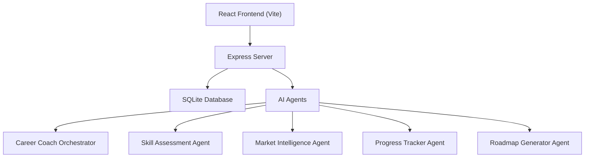
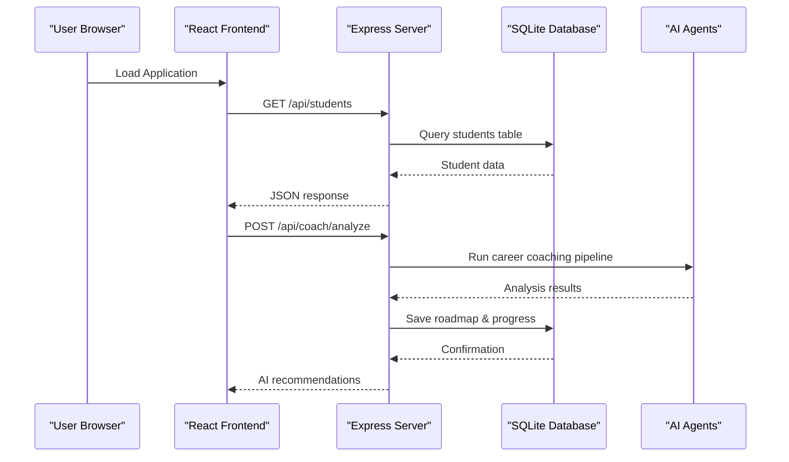
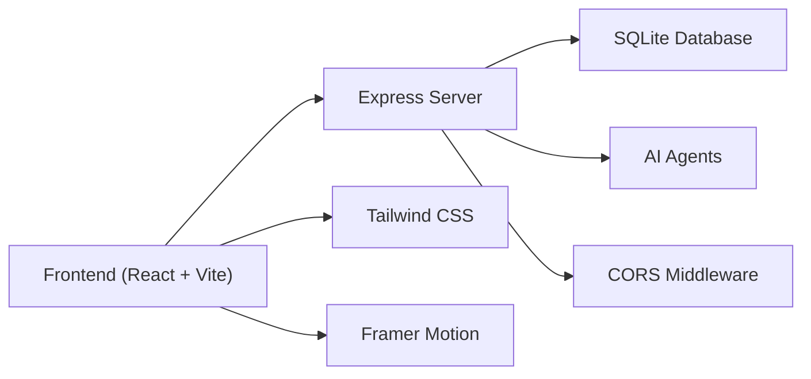

# Deployment

<cite>
**Referenced Files in This Document**
- [package.json](file://package.json)
- [server.js](file://server.js)
- [frontend/package.json](file://frontend/package.json)
- [database/db.js](file://database/db.js)
- [routes/api.js](file://routes/api.js)
- [routes/health.js](file://routes/health.js)
- [frontend/vite.config.js](file://frontend/vite.config.js)
- [database/seed.js](file://database/seed.js)
- [frontend/src/api.js](file://frontend/src/api.js)
</cite>

## Update Summary
**Changes Made**
- Updated entire deployment guide to reflect new full-stack architecture
- Added Node.js server requirements and Express.js backend setup
- Included SQLite database initialization and seeding process
- Added React/Vite frontend build process documentation
- Updated hosting options to support dynamic applications with API endpoints
- Revised performance considerations for full-stack deployment
- Enhanced troubleshooting section for server-side issues

## Table of Contents
1. [Introduction](#introduction)
2. [Project Structure](#project-structure)
3. [Core Components](#core-components)
4. [Architecture Overview](#architecture-overview)
5. [Detailed Component Analysis](#detailed-component-analysis)
6. [Dependency Analysis](#dependency-analysis)
7. [Performance Considerations](#performance-considerations)
8. [Troubleshooting Guide](#troubleshooting-guide)
9. [Conclusion](#conclusion)
10. [Appendices](#appendices)

## Introduction
This document provides comprehensive deployment guidance for the CareerCompass prototype, a full-stack AI-powered career guidance platform for Pakistani students. The application consists of a Node.js/Express backend with SQLite database, a React/Vite frontend, and multiple AI agents that provide personalized career recommendations. Unlike the previous static version, this requires server-side processing, database management, and a build pipeline for optimal performance.

## Project Structure
The project now follows a modern full-stack architecture:
- **Backend**: Node.js/Express server with RESTful API endpoints
- **Database**: SQLite database with schema for students, market signals, roadmaps, and progress tracking
- **Frontend**: React application built with Vite, serving optimized static assets
- **AI Agents**: Modular agent system for career coaching, skill assessment, and roadmap generation



**Diagram sources**
- [server.js:1-37](file://server.js#L1-L37)
- [routes/api.js:1-176](file://routes/api.js#L1-L176)
- [database/db.js:1-125](file://database/db.js#L1-L125)

**Section sources**
- [package.json:1-30](file://package.json#L1-L30)
- [server.js:1-37](file://server.js#L1-L37)
- [frontend/package.json:1-25](file://frontend/package.json#L1-L25)

## Core Components
- **Node.js Backend**: Express.js server handling API requests, CORS configuration, and static file serving
- **SQLite Database**: In-memory database with persistence to disk, containing student profiles, market data, and progress tracking
- **React Frontend**: Modern UI built with React, Vite, Tailwind CSS, and Framer Motion for animations
- **AI Agent System**: Modular architecture with specialized agents for different career guidance tasks
- **API Layer**: RESTful endpoints for CRUD operations and AI-powered analysis

Key implementation references:
- Server setup and middleware: [server.js:13-24](file://server.js#L13-L24)
- Database initialization: [database/db.js:59-125](file://database/db.js#L59-L125)
- API routes: [routes/api.js:18-176](file://routes/api.js#L18-L176)
- Frontend build config: [frontend/vite.config.js:4-15](file://frontend/vite.config.js#L4-L15)

**Section sources**
- [server.js:13-24](file://server.js#L13-L24)
- [database/db.js:59-125](file://database/db.js#L59-L125)
- [routes/api.js:18-176](file://routes/api.js#L18-L176)
- [frontend/vite.config.js:4-15](file://frontend/vite.config.js#L4-L15)

## Architecture Overview
CareerCompass follows a client-server architecture where the React frontend communicates with the Express backend through REST APIs. The backend processes requests, interacts with the SQLite database, and orchestrates AI agents to provide intelligent career guidance.



**Diagram sources**
- [routes/api.js:118-142](file://routes/api.js#L118-L142)
- [database/db.js:71-120](file://database/db.js#L71-L120)
- [frontend/src/api.js:32-41](file://frontend/src/api.js#L32-L41)

## Detailed Component Analysis

### Server Requirements and Setup

**Updated** The application now requires a Node.js environment with specific dependencies for server-side functionality.

#### Prerequisites
- Node.js 18+ (recommended) or 16+ (minimum)
- npm package manager
- SQLite3 runtime (included via sql.js)

#### Installation Process
1. Install backend dependencies: `npm install`
2. Install frontend dependencies: `npm run frontend:install`
3. Initialize database: `npm run seed`
4. Start development server: `npm run dev`

#### Production Build
1. Build frontend: `npm run frontend:build`
2. Serve built assets: Configure Express to serve `public/` directory
3. Set up environment variables for production configuration

**Section sources**
- [package.json:7-14](file://package.json#L7-L14)
- [server.js:13-31](file://server.js#L13-L31)

### Database Management

**Updated** The application uses SQLite for lightweight, embedded database functionality with automatic persistence.

#### Database Schema
- **students**: User profiles with education level, skills, and readiness scores
- **market_signals**: Job market data including demand percentages and required skills
- **roadmaps**: Personalized career paths with weekly tasks and portfolio projects
- **progress_logs**: Task completion tracking with timestamps

#### Database Operations
- Automatic schema creation on startup
- Data persistence to `career_compass.db` file
- Transaction support for data integrity
- Foreign key constraints for relational data

**Section sources**
- [database/db.js:71-120](file://database/db.js#L71-L120)
- [database/seed.js:43-209](file://database/seed.js#L43-L209)

### Frontend Build Process

**Updated** The React frontend requires a build step to optimize assets for production deployment.

#### Development vs Production
- **Development**: Vite dev server with hot module replacement (port 5173)
- **Production**: Optimized static assets served by Express (port 3000)

#### Build Configuration
- React components compiled with Babel
- CSS processed with PostCSS and Tailwind CSS
- Assets optimized and bundled for performance
- API proxy configured for development environment

**Section sources**
- [frontend/vite.config.js:4-15](file://frontend/vite.config.js#L4-L15)
- [frontend/package.json:6-9](file://frontend/package.json#L6-L9)

### API Endpoints

**Updated** Comprehensive REST API supporting all application functionality.

#### Available Endpoints
- `GET /api/students` - List all students
- `PATCH /api/students/:id` - Update student profile
- `GET /api/students/:id` - Get student details with progress
- `POST /api/coach/analyze` - Run AI career analysis pipeline
- `POST /api/progress/toggle` - Toggle task completion status
- `GET /api/health` - Health check endpoint

#### Error Handling
- Input validation with descriptive error messages
- HTTP status codes for different error scenarios
- Consistent error response format

**Section sources**
- [routes/api.js:18-176](file://routes/api.js#L18-L176)
- [routes/health.js:6-22](file://routes/health.js#L6-L22)

### Hosting Options

**Updated** Multiple deployment strategies available for the full-stack application.

#### Platform-Specific Deployment

**Heroku**
- Use Node.js buildpack
- Set `PORT` environment variable
- Configure SQLite database persistence
- Add buildpacks for Node.js and static assets

**Railway**
- Auto-detect Node.js application
- Built-in PostgreSQL option (alternative to SQLite)
- Environment variable management
- Automatic HTTPS and domain configuration

**DigitalOcean App Platform**
- Docker-based deployment
- Persistent storage for SQLite database
- Custom domain and SSL certificate management
- Scaling capabilities for high traffic

**Traditional Web Server (Apache/Nginx)**
- Reverse proxy configuration for API endpoints
- Static asset serving optimization
- SSL certificate setup with Let's Encrypt
- Load balancing for multiple instances

**Section sources**
- [server.js:14-31](file://server.js#L14-L31)
- [package.json:23-28](file://package.json#L23-L28)

### Domain Configuration and SSL Setup

**Updated** SSL and domain configuration for secure API communication.

#### Managed Platforms
- Automatic SSL provisioning on Heroku, Railway, and DigitalOcean
- Custom domain configuration through platform dashboards
- DNS record management (CNAME or A records)
- Certificate renewal automation

#### Self-Hosted Solutions
- Nginx reverse proxy with SSL termination
- Apache with mod_ssl for HTTPS
- Certbot for automated certificate management
- Security headers configuration (HSTS, CSP, etc.)

**Section sources**
- [server.js:17-19](file://server.js#L17-L19)

### Monitoring and Analytics Integration

**Updated** Comprehensive monitoring for both frontend and backend components.

#### Backend Monitoring
- Health check endpoint (`/api/health`) for uptime monitoring
- Database connectivity checks
- Request logging and error tracking
- Performance metrics collection

#### Frontend Analytics
- Google Analytics integration via script tags
- Performance monitoring with Web Vitals
- Error tracking with services like Sentry
- User behavior analytics

#### Infrastructure Monitoring
- Server resource usage (CPU, memory, disk)
- Database query performance
- API response time tracking
- Error rate monitoring

**Section sources**
- [routes/health.js:6-22](file://routes/health.js#L6-L22)

### Browser Requirements

**Updated** Modern browser requirements due to advanced JavaScript features and API usage.

#### Minimum Browser Support
- Chrome 90+, Firefox 88+, Safari 14+, Edge 90+
- Mobile browsers: iOS Safari 14+, Android Chrome 90+
- ES2020+ JavaScript features support
- Fetch API and modern Promise support

#### Feature Detection
- Modern CSS Grid and Flexbox layout
- CSS custom properties (variables)
- ES6+ modules and async/await patterns
- Web Storage API for local data persistence

**Section sources**
- [frontend/src/api.js:1-64](file://frontend/src/api.js#L1-L64)

## Dependency Analysis

**Updated** Comprehensive dependency management for full-stack application.

### Backend Dependencies
- **express**: Web framework for API endpoints
- **cors**: Cross-origin resource sharing middleware
- **sql.js**: SQLite database engine for Node.js
- **dotenv**: Environment variable management

### Frontend Dependencies
- **react**: UI component library
- **vite**: Build tool and development server
- **tailwindcss**: Utility-first CSS framework
- **framer-motion**: Animation library
- **lucide-react**: Icon library

### Development Dependencies
- **@vitejs/plugin-react**: React support for Vite
- **autoprefixer**: CSS vendor prefixing
- **postcss**: CSS processing pipeline



**Diagram sources**
- [package.json:23-28](file://package.json#L23-L28)
- [frontend/package.json:11-23](file://frontend/package.json#L11-L23)

**Section sources**
- [package.json:23-28](file://package.json#L23-L28)
- [frontend/package.json:11-23](file://frontend/package.json#L11-L23)

## Performance Considerations

**Updated** Performance optimization for full-stack application deployment.

### Backend Optimization
- **Database**: SQLite queries optimized with proper indexing
- **API**: Efficient request handling with connection pooling
- **Memory**: Proper cleanup of database connections and resources
- **Caching**: Implement caching strategies for frequently accessed data

### Frontend Optimization
- **Bundle Size**: Tree shaking and code splitting with Vite
- **Asset Optimization**: Image compression and lazy loading
- **Network Requests**: API request batching and caching
- **Rendering**: React component optimization with memoization

### Network Performance
- **CDN Usage**: Serve static assets through CDN for global distribution
- **Compression**: Enable gzip/brotli compression for API responses
- **Caching**: Implement proper cache headers for static assets
- **Connection Reuse**: HTTP/2 multiplexing for concurrent requests

### Mobile Optimization
- **Responsive Design**: Mobile-first approach with Tailwind CSS
- **Touch Interactions**: Optimized touch events and gestures
- **Battery Life**: Minimize background processing and network calls
- **Data Usage**: Compress API responses and minimize payload size

**Section sources**
- [frontend/vite.config.js:4-15](file://frontend/vite.config.js#L4-L15)
- [routes/api.js:18-176](file://routes/api.js#L18-L176)

## Troubleshooting Guide

**Updated** Comprehensive troubleshooting for full-stack deployment issues.

### Common Deployment Issues

#### Database Connection Errors
- **Symptom**: "Database not initialized" errors
- **Solution**: Ensure `initDatabase()` is called before any database operations
- **Prevention**: Check database file permissions and disk space

#### API Endpoint Failures
- **Symptom**: 404 or 500 errors on API calls
- **Solution**: Verify route definitions and middleware order
- **Debugging**: Check server logs for detailed error information

#### CORS Issues
- **Symptom**: Cross-origin request blocked errors
- **Solution**: Configure CORS middleware with appropriate origins
- **Development**: Use Vite proxy for local development

#### Frontend Build Failures
- **Symptom**: Build errors during production compilation
- **Solution**: Check Node.js version compatibility and dependency versions
- **Resolution**: Clear node_modules and reinstall dependencies

#### Memory Leaks
- **Symptom**: Increasing memory usage over time
- **Solution**: Monitor database connections and clean up unused resources
- **Prevention**: Implement proper error handling and resource cleanup

### Performance Issues

#### Slow API Responses
- **Investigation**: Profile database queries and AI agent execution
- **Optimization**: Implement caching and query optimization
- **Monitoring**: Add performance metrics and logging

#### High Resource Usage
- **Analysis**: Monitor CPU and memory consumption
- **Scaling**: Implement horizontal scaling for high traffic
- **Optimization**: Optimize database queries and reduce unnecessary computations

### Browser Compatibility Issues

#### Modern Feature Support
- **Detection**: Use feature detection libraries for browser capabilities
- **Fallbacks**: Provide alternative implementations for unsupported features
- **Polyfills**: Include polyfills for missing modern JavaScript features

#### Mobile Responsiveness
- **Testing**: Test on various devices and screen sizes
- **Adaptation**: Implement responsive design patterns
- **Optimization**: Optimize images and assets for mobile networks

**Section sources**
- [database/db.js:17-20](file://database/db.js#L17-L20)
- [routes/api.js:28-68](file://routes/api.js#L28-L68)
- [server.js:17-19](file://server.js#L17-L19)

## Conclusion
CareerCompass has evolved from a simple static prototype to a sophisticated full-stack application requiring comprehensive deployment infrastructure. The new architecture supports real-time AI-powered career guidance, persistent user data, and scalable performance. By following the deployment guidelines outlined in this document, you can successfully deploy the application across various platforms while ensuring optimal performance and reliability for users in Pakistan and beyond.

## Appendices

### Step-by-Step Deployment Instructions

#### Local Development Setup
1. **Install Dependencies**
   ```bash
   npm install
   npm run frontend:install
   ```

2. **Initialize Database**
   ```bash
   npm run seed
   ```

3. **Start Development Servers**
   ```bash
   npm run dev
   # Frontend: http://localhost:5173
   # Backend: http://localhost:3000
   ```

#### Production Deployment

##### Option 1: Heroku Deployment
1. **Create Heroku App**
   ```bash
   heroku create your-app-name
   git push heroku main
   ```

2. **Configure Environment Variables**
   ```bash
   heroku config:set NODE_ENV=production
   heroku config:set PORT=3000
   ```

3. **Run Database Migration**
   ```bash
   heroku run npm run seed
   ```

##### Option 2: DigitalOcean App Platform
1. **Create Dockerfile**
   ```dockerfile
   FROM node:18-alpine
   WORKDIR /app
   COPY package*.json ./
   RUN npm install
   COPY . .
   RUN npm run frontend:build
   EXPOSE 3000
   CMD ["npm", "start"]
   ```

2. **Deploy to Platform**
   - Connect GitHub repository
   - Configure build settings
   - Set environment variables
   - Deploy and monitor

##### Option 3: Traditional Web Server
1. **Build Application**
   ```bash
   npm run frontend:build
   ```

2. **Configure Nginx**
   ```nginx
   server {
       listen 80;
       server_name yourdomain.com;
       
       location / {
           root /var/www/careercompass/public;
           index index.html;
           try_files $uri $uri/ /index.html;
       }
       
       location /api {
           proxy_pass http://localhost:3000;
           proxy_http_version 1.1;
           proxy_set_header Upgrade $http_upgrade;
           proxy_set_header Connection 'upgrade';
           proxy_set_header Host $host;
           proxy_cache_bypass $http_upgrade;
       }
   }
   ```

3. **Set Up SSL**
   ```bash
   sudo certbot --nginx -d yourdomain.com
   ```

### Environment Configuration

#### Development Environment
```bash
NODE_ENV=development
PORT=3000
DATABASE_PATH=./career_compass.db
```

#### Production Environment
```bash
NODE_ENV=production
PORT=3000
DATABASE_PATH=/var/data/career_compass.db
LOG_LEVEL=error
```

### Monitoring and Maintenance

#### Health Checks
- Regular database connectivity tests
- API endpoint availability monitoring
- Disk space and memory usage alerts
- Error rate and response time tracking

#### Backup Strategy
- Automated database backups
- Version control for configuration files
- Disaster recovery procedures
- Data migration scripts

**Section sources**
- [package.json:7-14](file://package.json#L7-L14)
- [database/seed.js:18-27](file://database/seed.js#L18-L27)
- [server.js:26-31](file://server.js#L26-L31)