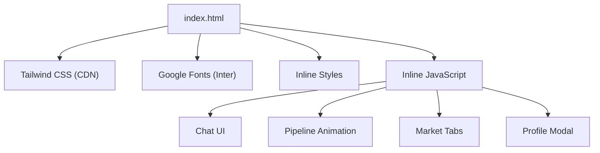
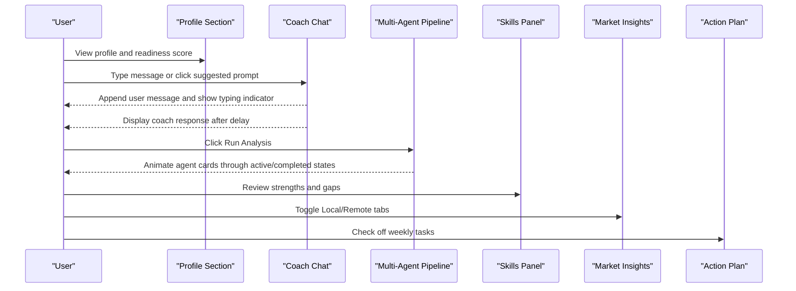
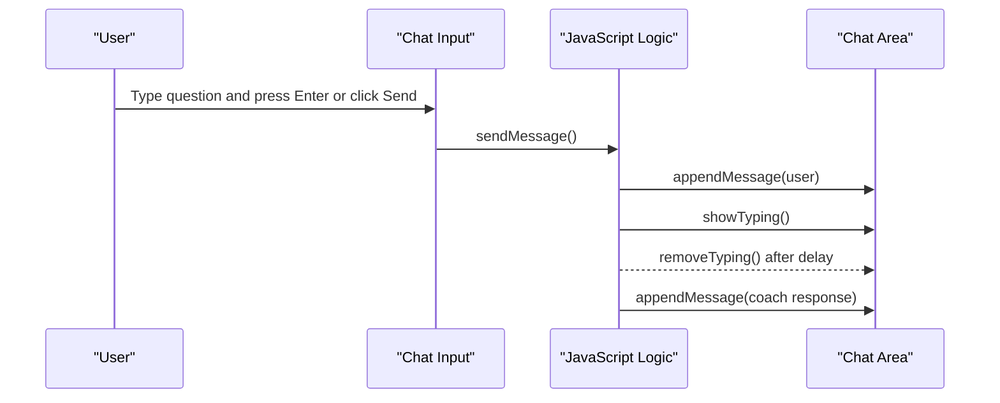
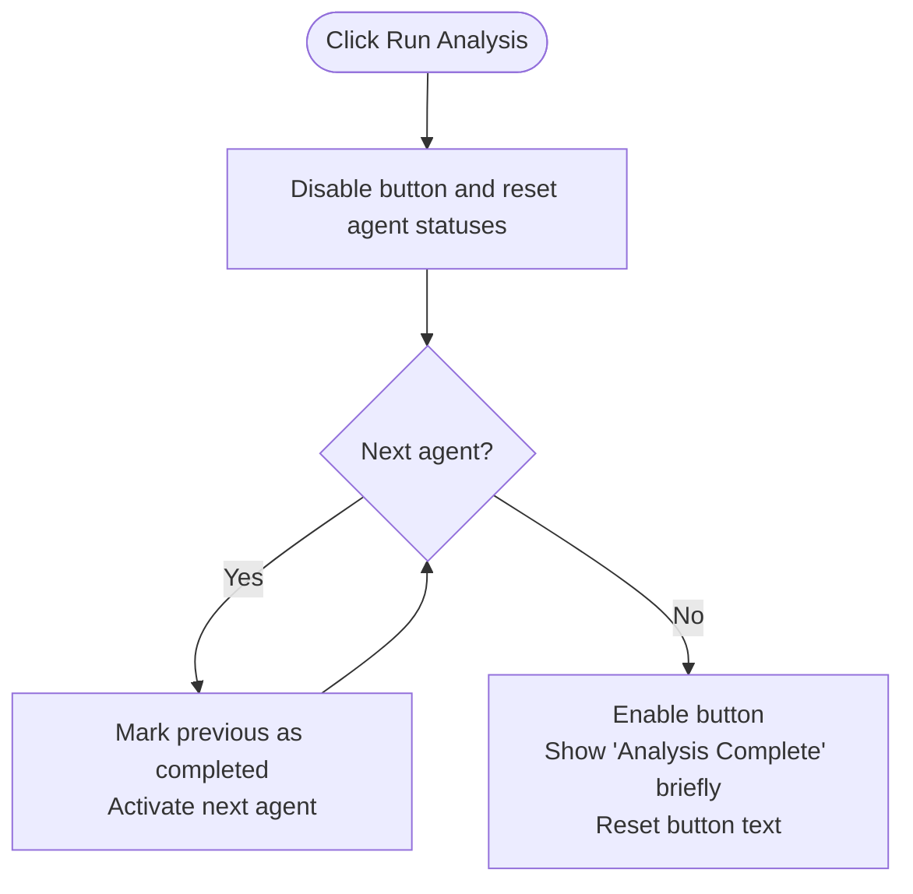
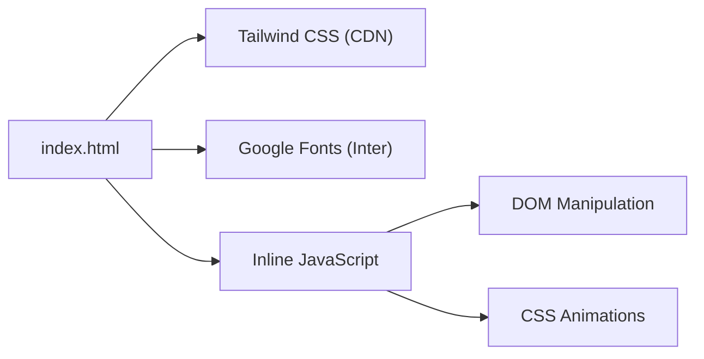

# Getting Started

<cite>
**Referenced Files in This Document**
- [index.html](file://index.html)
</cite>

## Table of Contents
1. [Introduction](#introduction)
2. [Project Structure](#project-structure)
3. [Core Components](#core-components)
4. [Architecture Overview](#architecture-overview)
5. [Detailed Component Analysis](#detailed-component-analysis)
6. [Dependency Analysis](#dependency-analysis)
7. [Performance Considerations](#performance-considerations)
8. [Troubleshooting Guide](#troubleshooting-guide)
9. [Conclusion](#conclusion)

## Introduction
CareerCompass is a single-file, client-side prototype that helps Pakistani students explore career paths, chat with an AI-style coach, run a simulated multi-agent analysis, review skill gaps, and follow a 4-week action plan. You can run it immediately by opening index.html in any modern web browser—no installation or server setup required.

Key highlights:
- Zero dependencies to install; uses Tailwind CSS via CDN for styling
- Fully client-side JavaScript for interactivity (chat, pipeline animation, tabs, modal)
- Designed for modern browsers with support for CSS backdrop-filter and animations

## Project Structure
The application is contained entirely within one HTML file. It includes:
- A responsive layout with sections for Profile, Coach Chat, Multi-Agent Pipeline, Skills, Market Insights, and Action Plan
- Inline styles and Tailwind utility classes for consistent design
- Embedded JavaScript for all interactive behaviors

**Diagram sources**
- [index.html:7-21](file://index.html#L7-L21)
- [index.html:22-43](file://index.html#L22-L43)
- [index.html:565-680](file://index.html#L565-L680)

**Section sources**
- [index.html:1-70](file://index.html#L1-L70)
- [index.html:72-527](file://index.html#L72-L527)
- [index.html:565-680](file://index.html#L565-L680)

## Core Components
- Profile and Readiness Score: Displays education, skills, interests, career goal, and a readiness score with quick stats for different career paths and market demand.
- AI Career Coach Chat: A chat interface where you can type questions or use suggested prompts to receive guided responses.
- Multi-Agent Pipeline: A visual simulation of six agents collaborating to analyze your profile and generate insights.
- Skill Gap Assessment: Strengths and gaps with progress bars indicating proficiency levels.
- Pakistan Job Market Insights: Local and remote job market data with salary ranges and hiring hubs.
- 4-Week Action Plan: A weekly checklist to build skills and prepare for opportunities.

How to use each component:
- Profile viewing: Scroll to the top section to see your profile card and readiness score. Click Edit Profile to open the modal and update fields.
- AI coach chat: Type a question in the input box and press Enter or click Send. Alternatively, click any suggested question below the chat area.
- Run multi-agent pipeline: Click Run Analysis to animate the agent cards through their roles and complete state.
- Explore skill gaps: Review strengths and gaps panels to understand areas to improve.
- Navigate market insights: Toggle between Local and Remote tabs to view relevant information.
- Follow the 4-week plan: Check off tasks week by week to track progress.

**Section sources**
- [index.html:74-170](file://index.html#L74-L170)
- [index.html:172-226](file://index.html#L172-L226)
- [index.html:228-281](file://index.html#L228-L281)
- [index.html:283-313](file://index.html#L283-L313)
- [index.html:315-390](file://index.html#L315-L390)
- [index.html:392-458](file://index.html#L392-L458)
- [index.html:529-562](file://index.html#L529-L562)

## Architecture Overview
This is a single-page, client-only application. All logic runs in the browser using inline JavaScript. Styling is provided by Tailwind CSS loaded from a CDN. There are no backend services or external APIs connected in this prototype.

**Diagram sources**
- [index.html:172-226](file://index.html#L172-L226)
- [index.html:228-281](file://index.html#L228-L281)
- [index.html:283-313](file://index.html#L283-L313)
- [index.html:315-390](file://index.html#L315-L390)
- [index.html:392-458](file://index.html#L392-L458)
- [index.html:565-680](file://index.html#L565-L680)

## Detailed Component Analysis

### Profile and Readiness Score
- Displays education level, current skills, interests, and a career goal statement.
- Shows a circular readiness score with animated counter and quick stats for path match percentages and market demand.

Usage tips:
- Use the Edit Profile button to open the modal and adjust fields like education, institution, skills, interests, and career question.

**Section sources**
- [index.html:74-170](file://index.html#L74-L170)
- [index.html:529-562](file://index.html#L529-L562)
- [index.html:667-680](file://index.html#L667-L680)

### AI Career Coach Chat
- Supports sending messages via Enter key or Send button.
- Provides suggested prompts to quickly start conversations.
- Simulates typing indicators and cycles through predefined responses.

Interaction flow:

**Diagram sources**
- [index.html:172-226](file://index.html#L172-L226)
- [index.html:565-628](file://index.html#L565-L628)

**Section sources**
- [index.html:172-226](file://index.html#L172-L226)
- [index.html:565-628](file://index.html#L565-L628)

### Multi-Agent Pipeline
- Visualizes six agents: Career Coach (orchestrator), Skill Assessment, Market Intel, Career Path, Roadmap Gen, Progress Tracker.
- Running the pipeline animates each agent’s status from idle to active to completed.

Behavior overview:

**Diagram sources**
- [index.html:228-281](file://index.html#L228-L281)
- [index.html:630-657](file://index.html#L630-L657)

**Section sources**
- [index.html:228-281](file://index.html#L228-L281)
- [index.html:630-657](file://index.html#L630-L657)

### Skill Gap Assessment
- Two panels: Strengths (already known skills) and Gaps (skills to close).
- Each skill shows a percentage bar indicating proficiency or need for improvement.

How to use:
- Review the Strengths panel to identify what you already know well.
- Focus on the Gaps panel to prioritize learning targets.

**Section sources**
- [index.html:283-313](file://index.html#L283-L313)

### Pakistan Job Market Insights
- Toggle between Local and Remote tabs to view demand, salary ranges, and platforms/hubs.
- Local tab lists top demand roles, average salaries in PKR, and major hiring cities.
- Remote tab lists global demand, USD salaries, and platforms suitable for Pakistani developers.

Navigation:
- Click Local or Remote buttons to switch content.

**Section sources**
- [index.html:315-390](file://index.html#L315-L390)
- [index.html:659-665](file://index.html#L659-L665)

### 4-Week Action Plan
- Four weekly columns with checklists to track progress.
- Week themes: Foundation, Build, ML Intro, Launch.

How to use:
- Check off tasks as you complete them to visualize progress across weeks.

**Section sources**
- [index.html:392-458](file://index.html#L392-L458)

## Dependency Analysis
- Tailwind CSS is loaded via CDN for styling utilities and theme configuration.
- Google Fonts provides the Inter font family used throughout the UI.
- All interactive behavior is implemented with inline JavaScript embedded in the HTML file.

**Diagram sources**
- [index.html:7-21](file://index.html#L7-L21)
- [index.html:22-43](file://index.html#L22-L43)
- [index.html:565-680](file://index.html#L565-L680)

**Section sources**
- [index.html:7-21](file://index.html#L7-L21)
- [index.html:565-680](file://index.html#L565-L680)

## Performance Considerations
- Single-file architecture keeps load times minimal; only external resources are the Tailwind CDN and Google Fonts.
- Animations are lightweight CSS transitions and keyframes; avoid excessive DOM updates in tight loops.
- The chat and pipeline interactions use simple timeouts and intervals; keep delays reasonable for responsiveness.
- If running offline, ensure internet access for CDN resources or consider downloading Tailwind and fonts locally for fully offline use.

[No sources needed since this section provides general guidance]

## Troubleshooting Guide
Common issues and resolutions:
- Browser compatibility:
  - Ensure your browser supports modern CSS features like backdrop-filter and CSS animations. If effects appear missing, try updating to a recent version of Chrome, Edge, Firefox, or Safari.
- JavaScript execution errors:
  - If chat messages do not appear or the pipeline does not animate, check that JavaScript is enabled and not blocked by extensions or security settings.
  - Clear browser cache and reload if the page behaves unexpectedly after changes.
- Network-related issues:
  - Since Tailwind CSS and fonts are loaded from CDNs, ensure your network allows these domains. If blocked, the UI may look unstyled or fonts may not render.
- Modal and tabs not working:
  - Verify that event handlers are attached (e.g., clicking tabs or opening the profile modal). If not, reload the page or disable interfering browser extensions.

If problems persist:
- Try opening index.html in a different modern browser.
- Disable ad blockers or privacy extensions temporarily to test if they interfere with CDN loading or script execution.

[No sources needed since this section provides general guidance]

## Conclusion
CareerCompass offers a fast, zero-setup way to explore career guidance, interact with an AI-style coach, simulate a multi-agent analysis, assess skills, review market insights, and follow a structured 4-week plan. Open index.html in any modern browser to get started immediately. For best results, use an up-to-date browser that supports modern CSS features and has JavaScript enabled.

[No sources needed since this section summarizes without analyzing specific files]