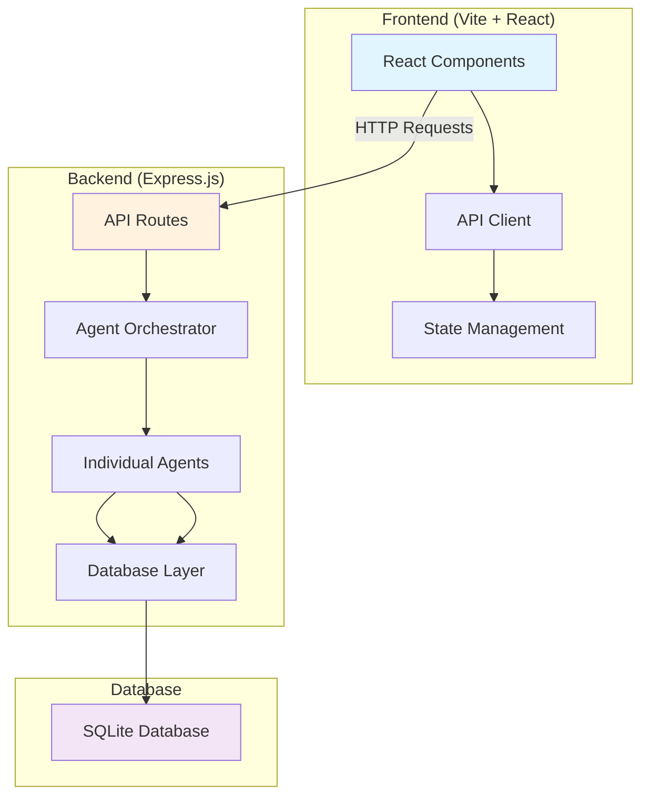

# Getting Started

<cite>
**Referenced Files in This Document**
- [package.json](file://package.json)
- [server.js](file://server.js)
- [frontend/package.json](file://frontend/package.json)
- [frontend/vite.config.js](file://frontend/vite.config.js)
- [frontend/src/main.jsx](file://frontend/src/main.jsx)
- [frontend/src/App.jsx](file://frontend/src/App.jsx)
- [routes/api.js](file://routes/api.js)
- [database/db.js](file://database/db.js)
- [index.html](file://index.html)
</cite>

## Update Summary
**Changes Made**
- Updated installation and setup instructions for Node.js environment
- Added comprehensive development server configuration
- Documented new React-based frontend with Vite build system
- Added backend API server setup with Express.js
- Updated architecture diagrams to reflect new multi-file structure
- Enhanced troubleshooting section for development environment issues

## Table of Contents
1. [Introduction](#introduction)
2. [Prerequisites](#prerequisites)
3. [Installation](#installation)
4. [Development Server](#development-server)
5. [Project Structure](#project-structure)
6. [Core Components](#core-components)
7. [Architecture Overview](#architecture-overview)
8. [Detailed Component Analysis](#detailed-component-analysis)
9. [API Endpoints](#api-endpoints)
10. [Database Setup](#database-setup)
11. [Performance Considerations](#performance-considerations)
12. [Troubleshooting Guide](#troubleshooting-guide)
13. [Conclusion](#conclusion)

## Introduction
CareerCompass is an AI-powered career guidance platform designed specifically for Pakistani students. The application has evolved from a simple single-file prototype into a full-featured web application with a modern development stack. It helps students explore career paths, interact with an AI-style coach, run multi-agent analysis pipelines, assess skill gaps, review market insights, and follow structured 4-week action plans.

**Key Features:**
- **Modern Development Stack**: Built with React, Vite, Tailwind CSS, and Express.js
- **Multi-Agent System**: Six specialized agents collaborate to provide comprehensive career guidance
- **Real-time Database**: SQLite database with persistent student profiles and progress tracking
- **Bilingual Support**: English and Roman Urdu interface for Pakistani students
- **Responsive Design**: Mobile-first approach with dark theme UI

**Updated Architecture:**
The application now consists of a separate frontend (React + Vite) and backend (Express.js) with a RESTful API connecting them, replacing the original single-file HTML prototype.

## Prerequisites
Before setting up CareerCompass, ensure you have the following installed:

### Required Software
- **Node.js** (v18 or higher): JavaScript runtime environment
- **npm** (v9 or higher): Package manager for Node.js
- **Git**: Version control system (optional but recommended)

### System Requirements
- **Operating System**: Windows, macOS, or Linux
- **Memory**: Minimum 4GB RAM (8GB recommended for smooth development)
- **Storage**: At least 500MB free space for dependencies and build artifacts
- **Browser**: Modern browser with ES6+ support (Chrome, Firefox, Safari, Edge)

### Optional Tools
- **VS Code**: Recommended IDE with extensions for React and JavaScript
- **Postman**: For testing API endpoints
- **SQLite Browser**: For database inspection and management

## Installation
Follow these steps to set up CareerCompass on your local machine:

### Step 1: Clone the Repository
```bash
git clone https://github.com/your-username/Career_Compass-Hackathon.git
cd Career_Compass-Hackathon
```

### Step 2: Install Backend Dependencies
```bash
npm install
```

This installs the core server dependencies including Express.js, CORS, dotenv, and SQL.js.

### Step 3: Install Frontend Dependencies
```bash
cd frontend
npm install
cd ..
```

This installs React, Vite, Tailwind CSS, and other frontend dependencies.

### Step 4: Initialize Database
```bash
npm run seed
```

This creates the SQLite database file (`career_compass.db`) and seeds it with sample data including Ali Khan's profile.

## Development Server
CareerCompress uses a dual-server setup for development:

### Start the Backend Server
```bash
npm start
```

The backend server will start on `http://localhost:3000` and serve the API endpoints.

### Start the Frontend Development Server
```bash
npm run frontend:dev
```

The frontend development server will start on `http://localhost:5173` with hot module replacement enabled.

### Development Workflow
1. **Backend Changes**: Restart the backend server when modifying server-side code
2. **Frontend Changes**: Changes automatically reload in the browser thanks to Vite's HMR
3. **Database Changes**: Use `npm run seed` to reset the database to initial state

### Production Build
```bash
npm run frontend:build
```

This creates optimized production files in the `frontend/dist` directory.

## Project Structure
The application follows a modular architecture with clear separation of concerns:

```
Career_Compass-Hackathon/
├── frontend/                 # React frontend application
│   ├── src/
│   │   ├── components/       # Reusable React components
│   │   ├── i18n/            # Internationalization files
│   │   ├── App.jsx          # Main application component
│   │   ├── main.jsx         # Application entry point
│   │   └── api.js           # API client functions
│   ├── index.html           # HTML template
│   ├── package.json         # Frontend dependencies
│   └── vite.config.js       # Vite configuration
├── routes/                  # Express.js API routes
│   ├── api.js              # Main API router
│   └── health.js           # Health check endpoint
├── database/               # Database configuration
│   ├── db.js               # Database connection and utilities
│   └── seed.js             # Database seeding script
├── agents/                 # Multi-agent system
│   ├── README.md           # Agent documentation
│   ├── careerCoachOrchestrator.js
│   └── [other agent files]
├── server.js              # Express.js server entry point
├── package.json           # Backend dependencies
└── index.html             # Original prototype (reference)
```

**Key Architectural Changes:**
- **Modular Frontend**: React components replace inline JavaScript
- **RESTful API**: Express.js server handles business logic and database operations
- **Separate Build Process**: Vite provides fast development and optimized production builds
- **Persistent Storage**: SQLite database replaces static data

## Core Components
The application consists of several key components that work together to provide career guidance:

### Profile Management
- **Student Profiles**: Store education level, skills, interests, and career goals
- **Edit Profile Modal**: Interactive form for updating student information
- **Profile Validation**: Ensures data integrity and proper formatting

### AI Career Coach Chat
- **Real-time Messaging**: WebSocket-like experience with typing indicators
- **Contextual Responses**: Coaches responses based on student profile and query
- **Bilingual Support**: English and Roman Urdu language options

### Multi-Agent Pipeline
- **Six Specialized Agents**: Each agent handles specific aspects of career analysis
- **Sequential Processing**: Agents work in coordinated sequence for optimal results
- **Progress Visualization**: Real-time animation showing pipeline execution

### Skill Gap Assessment
- **Competency Mapping**: Compares current skills against target role requirements
- **Gap Identification**: Highlights areas needing improvement
- **Progress Tracking**: Monitors skill development over time

### Market Intelligence
- **Local & Remote Data**: Provides insights for both Pakistani and global markets
- **Salary Ranges**: Current compensation data for various roles
- **Demand Analysis**: Tracks hiring trends and opportunities

### Action Plan Generator
- **4-Week Roadmaps**: Structured learning and project plans
- **Task Management**: Trackable checklist with completion status
- **Progress Scoring**: Dynamic readiness score calculation

## Architecture Overview
The application follows a modern client-server architecture with clear separation between frontend and backend concerns:



**Data Flow:**
1. User interacts with React components
2. Frontend sends HTTP requests to Express.js API
3. Backend processes requests through agent system
4. Database operations handle data persistence
5. Results are returned to frontend for display

**Communication Protocol:**
- **RESTful API**: JSON-based communication between frontend and backend
- **CORS Enabled**: Allows cross-origin requests during development
- **Error Handling**: Comprehensive error responses with descriptive messages

## Detailed Component Analysis

### Frontend Architecture
The frontend is built with React and Vite, providing a modern development experience:

#### Component Structure
- **App.jsx**: Main application container managing global state
- **Component Modules**: Modular components for each UI section
- **API Integration**: Centralized API client for backend communication
- **Internationalization**: Language switching between English and Roman Urdu

#### State Management
- **React Hooks**: useState and useEffect for component-level state
- **Global State**: Context API for shared application state
- **Optimistic Updates**: Immediate UI feedback with background synchronization

**Section sources**
- [frontend/src/App.jsx:1-388](file://frontend/src/App.jsx#L1-L388)
- [frontend/src/main.jsx:1-14](file://frontend/src/main.jsx#L1-L14)

### Backend API Server
The Express.js server handles all business logic and database operations:

#### API Endpoints
- **Student Management**: CRUD operations for student profiles
- **Analysis Pipeline**: Multi-agent career analysis engine
- **Progress Tracking**: Task completion and score updates
- **Health Checks**: Server status monitoring

#### Middleware Stack
- **CORS**: Cross-origin resource sharing for development
- **JSON Parsing**: Automatic request body parsing
- **Static File Serving**: Production asset delivery
- **Error Handling**: Global error catching and logging

**Section sources**
- [server.js:1-37](file://server.js#L1-L37)
- [routes/api.js:1-176](file://routes/api.js#L1-L176)

### Database Layer
SQLite provides lightweight, file-based database functionality:

#### Schema Design
- **Students Table**: Core user profile information
- **Market Signals**: Job market data and trends
- **Roadmaps**: Generated career plans and projects
- **Progress Logs**: Task completion tracking

#### Data Persistence
- **File-based Storage**: Single database file for easy deployment
- **Automatic Saving**: Changes persisted immediately to disk
- **Backup Support**: Easy database file copying for backups

**Section sources**
- [database/db.js:1-125](file://database/db.js#L1-L125)

### Multi-Agent System
The application features six specialized agents working in coordination:

#### Agent Roles
- **Career Coach**: Orchestrates the entire analysis process
- **Skill Assessment**: Evaluates current skills against requirements
- **Market Intelligence**: Analyzes job market conditions
- **Career Path**: Determines optimal career trajectories
- **Roadmap Generator**: Creates actionable 4-week plans
- **Progress Tracker**: Monitors and updates readiness scores

#### Communication Pattern
Agents communicate through well-defined interfaces, allowing for modular updates and testing.

## API Endpoints
The application exposes a RESTful API for frontend communication:

### Student Management
- **GET /api/students**: List all available students
- **GET /api/students/:id**: Get specific student profile
- **PATCH /api/students/:id**: Update student information

### Analysis Pipeline
- **POST /api/coach/analyze**: Run multi-agent analysis pipeline
- **Body**: `{ studentId: number, query: string }`

### Progress Tracking
- **POST /api/progress/toggle**: Toggle task completion status
- **Body**: `{ studentId: number, taskId: string, status: 'pending'|'completed' }`

### Health Check
- **GET /api/health**: Server health status

**Section sources**
- [routes/api.js:18-176](file://routes/api.js#L18-L176)

## Database Setup
The application uses SQLite for lightweight, embedded database functionality:

### Database Initialization
```javascript
// Database is automatically initialized on server startup
await initDatabase();
```

### Seeding Data
```bash
npm run seed
```

This command creates the database schema and populates it with sample data including:
- Sample student profiles (Ali Khan as default)
- Market intelligence data
- Role skill requirements
- Template roadmaps and projects

### Database Operations
- **Automatic Persistence**: All changes saved immediately to disk
- **Transaction Safety**: ACID compliance for data integrity
- **Schema Migration**: Future-proof design for schema evolution

**Section sources**
- [database/db.js:59-125](file://database/db.js#L59-L125)

## Performance Considerations
The application is optimized for both development and production environments:

### Frontend Optimization
- **Code Splitting**: Vite automatically splits code for faster loading
- **Asset Optimization**: Images and styles are minified and compressed
- **Bundle Analysis**: Built-in tools for analyzing bundle size

### Backend Optimization
- **Connection Pooling**: Efficient database connection management
- **Request Caching**: Strategic caching for frequently accessed data
- **Error Boundaries**: Graceful error handling without application crashes

### Database Optimization
- **Indexed Queries**: Optimized database queries for performance
- **Connection Reuse**: Persistent database connections throughout server lifetime
- **Batch Operations**: Efficient bulk data operations where possible

## Troubleshooting Guide
Common issues and their solutions when running CareerCompass:

### Installation Issues
**Problem**: npm install fails with permission errors
**Solution**: 
- Ensure Node.js version is compatible (v18+)
- Try running with elevated privileges if needed
- Clear npm cache: `npm cache clean --force`

**Problem**: Frontend dependencies fail to install
**Solution**:
- Delete node_modules folder and reinstall
- Check internet connectivity for package downloads
- Verify npm registry accessibility

### Development Server Issues
**Problem**: Backend server won't start
**Solution**:
- Check if port 3000 is already in use
- Verify all required dependencies are installed
- Check for syntax errors in server code

**Problem**: Frontend development server not responding
**Solution**:
- Ensure port 5173 is available
- Check for proxy configuration issues
- Verify CORS settings allow localhost requests

### Database Issues
**Problem**: Database initialization fails
**Solution**:
- Delete existing database file and reseed
- Check file permissions for database directory
- Verify SQLite compatibility with Node.js version

**Problem**: Data not persisting between sessions
**Solution**:
- Ensure database file has write permissions
- Check for unhandled exceptions during save operations
- Verify database path configuration

### API Connection Issues
**Problem**: Frontend cannot connect to backend
**Solution**:
- Verify backend server is running on correct port
- Check CORS configuration allows frontend origin
- Inspect browser console for network errors

**Problem**: API requests return 404 or 500 errors
**Solution**:
- Check route definitions match frontend calls
- Verify request payload format matches API expectations
- Review server logs for detailed error information

### Browser Compatibility
**Problem**: Features not working in older browsers
**Solution**:
- Use modern browsers (Chrome, Firefox, Safari, Edge)
- Check browser console for JavaScript errors
- Verify ES6+ feature support

### Performance Issues
**Problem**: Application feels slow or unresponsive
**Solution**:
- Check network tab for slow API responses
- Monitor memory usage in browser developer tools
- Optimize large datasets or complex animations

**Section sources**
- [server.js:26-37](file://server.js#L26-L37)
- [frontend/vite.config.js:6-15](file://frontend/vite.config.js#L6-L15)

## Conclusion
CareerCompass has evolved from a simple single-file prototype into a robust, full-stack web application with modern development practices. The migration to Node.js, React, and Express.js provides a scalable foundation for future enhancements while maintaining the core mission of helping Pakistani students navigate their career journeys.

**Key Benefits of the New Architecture:**
- **Scalability**: Modular design supports easy addition of new features
- **Maintainability**: Clear separation of concerns simplifies debugging and updates
- **Performance**: Optimized build process and efficient data handling
- **Developer Experience**: Hot reloading and modern tooling enhance productivity

**Getting Started:**
1. Install Node.js and npm
2. Clone repository and install dependencies
3. Seed the database
4. Start both backend and frontend servers
5. Access the application at http://localhost:5173

The application maintains its focus on serving Pakistani students while providing a professional-grade development environment that supports rapid iteration and growth. Whether you're exploring career options, assessing skill gaps, or planning your next steps, CareerCompass provides the guidance and structure needed for informed career decisions.

For the quickest start, simply open the original `index.html` file in any modern browser to access the prototype version, though the full development environment offers significantly enhanced functionality and real-time data processing capabilities.