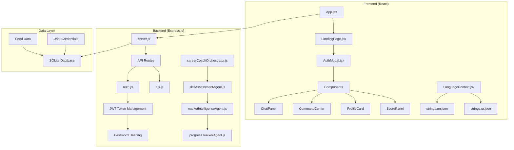
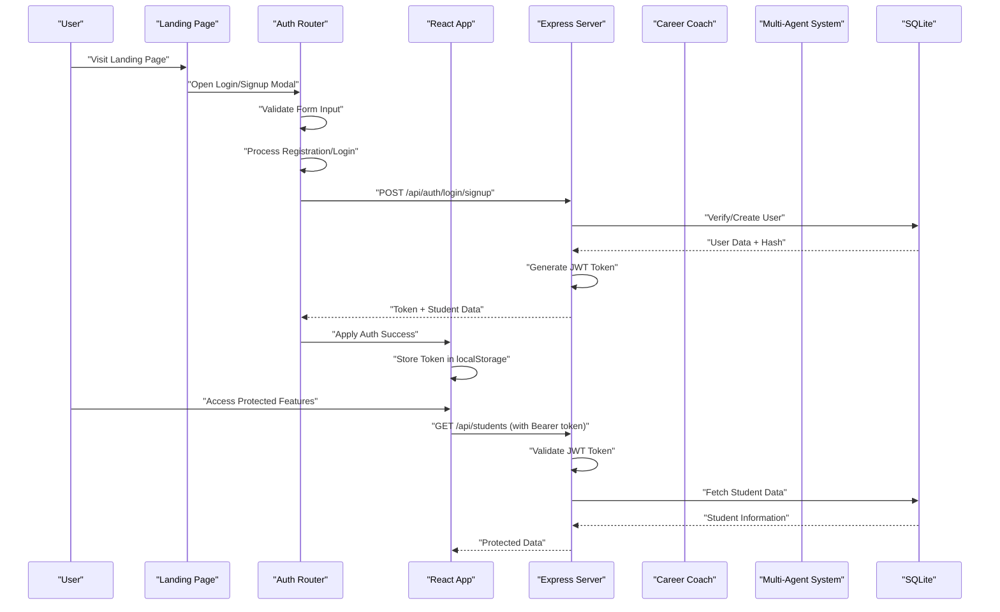
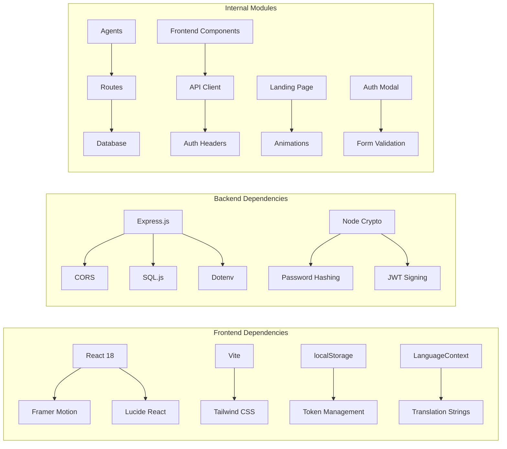

Based on my analysis of the codebase, I can now update the Project Overview documentation to reflect the enhanced landing page experience, improved authentication flow, and expanded internationalization support. Here's the updated document:

<cite>
**Referenced Files in This Document**
- [server.js](file://server.js)
- [package.json](file://package.json)
- [frontend/package.json](file://frontend/package.json)
- [routes/api.js](file://routes/api.js)
- [routes/auth.js](file://routes/auth.js)
- [database/db.js](file://database/db.js)
- [database/seed.js](file://database/seed.js)
- [agents/careerCoachOrchestrator.js](file://agents/careerCoachOrchestrator.js)
- [agents/skillAssessmentAgent.js](file://agents/skillAssessmentAgent.js)
- [agents/marketIntelligenceAgent.js](file://agents/marketIntelligenceAgent.js)
- [agents/progressTrackerAgent.js](file://agents/progressTrackerAgent.js)
- [frontend/src/App.jsx](file://frontend/src/App.jsx)
- [frontend/src/components/AuthModal.jsx](file://frontend/src/components/AuthModal.jsx)
- [frontend/src/components/LandingPage.jsx](file://frontend/src/components/LandingPage.jsx)
- [frontend/src/components/Navbar.jsx](file://frontend/src/components/Navbar.jsx)
- [frontend/src/i18n/LanguageContext.jsx](file://frontend/src/i18n/LanguageContext.jsx)
- [frontend/src/i18n/strings.en.json](file://frontend/src/i18n/strings.en.json)
- [frontend/src/i18n/strings.ur.json](file://frontend/src/i18n/strings.ur.json)
- [frontend/src/components/CommandCenter.jsx](file://frontend/src/components/CommandCenter.jsx)
- [frontend/src/api.js](file://frontend/src/api.js)
- [spec.md](file://spec.md)
</cite>

## Update Summary
**Changes Made**
- Enhanced landing page with professional marketing interface featuring animated hero section, step-by-step workflow visualization, and product preview mockup
- Improved authentication flow with dual-mode login/signup system, multi-step registration wizard, and demo user access
- Expanded internationalization support with complete English and Urdu translations, RTL language support, and persistent language preferences
- Added sophisticated UI animations using Framer Motion for smooth transitions and engaging user experiences
- Integrated comprehensive form validation and user-friendly error handling throughout the authentication process

## Table of Contents
1. Introduction
2. Project Structure
3. Core Components
4. Architecture Overview
5. Authentication & Security System
6. Enhanced Landing Page Experience
7. Internationalization Support
8. Detailed Component Analysis
9. Dependency Analysis
10. Performance Considerations
11. Troubleshooting Guide
12. Conclusion
13. Appendices

## Introduction
CareerCompass is an AI-powered career guidance platform for Pakistani students that has evolved from a hackathon prototype into a production-ready full-stack application with enterprise-grade security and a professional user interface. The platform helps Pakistani Computer Science graduates navigate between two popular career paths: AI/ML and Full Stack Web Development through a sophisticated multi-agent pipeline system.

The current implementation features a modern technology stack with an Express.js backend serving RESTful APIs, a React frontend built with Vite, a comprehensive multi-agent system, SQLite database for persistent data storage, robust user authentication with JWT-based security, and an enhanced landing page experience with professional marketing interface. The platform emphasizes a hybrid approach: achieve immediate job readiness through Full Stack skills while building long-term specialization in AI/ML.

Target audience: Pakistani Computer Science graduates seeking practical guidance for local and remote opportunities. The app demonstrates how a multi-agent pipeline can synthesize skill assessment, market intelligence, and path planning into personalized roadmaps with real-time progress tracking.

Key concepts used throughout the codebase:
- Multi-agent pipeline: A set of specialized agents (Coach, Skill Assessment, Market Intel, Career Path, Roadmap Gen, Progress Tracker) that collaborate to produce recommendations
- Skill assessment: Evaluation of current skills against target roles to identify strengths and gaps
- Market intelligence: Insights into local and remote demand, salary ranges, hiring hubs, and platforms relevant to Pakistan
- JWT authentication: Stateless authentication with 7-day token validity and secure password hashing
- Professional landing page: Animated marketing interface with step-by-step workflow visualization and product previews
- Internationalization: Complete bilingual support (English/Roman Urdu) with RTL layout support

**Section sources**
- [spec.md:8-16](file://spec.md#L8-L16)
- [spec.md:20-52](file://spec.md#L20-L52)

## Project Structure
The project has been completely restructured from a monolithic single-file prototype into a modern full-stack architecture with clear separation of concerns and comprehensive security measures, enhanced by a professional landing page and internationalization support.

### Backend Architecture
- **Express.js Server**: Central server handling API routes, middleware, and database initialization
- **Multi-Agent System**: Modular agent modules with specific responsibilities and deterministic logic
- **SQLite Database**: Persistent storage with schema management, seed data, and user authentication support
- **RESTful APIs**: Clean API endpoints for frontend communication with JWT-based protection
- **Authentication Layer**: Complete user registration, login, and session management system

### Frontend Architecture  
- **React Application**: Modern component-based UI built with Vite with professional landing page
- **Component Library**: Specialized components for chat, command center, profile management, authentication, and data visualization
- **State Management**: React hooks for local state and API integration with automatic session persistence
- **Internationalization**: Bilingual support (English/Roman Urdu) with context-based switching and RTL support
- **Professional Landing Page**: Animated marketing interface with hero section, workflow visualization, and product previews

### Agent System
- **Career Coach Orchestrator**: Central coordination layer managing the entire pipeline
- **Specialized Agents**: Individual agents for skill assessment, market intelligence, career path planning, roadmap generation, and progress tracking
- **Database Integration**: All agents interact with SQLite for data persistence and retrieval

**Diagram sources**
- [server.js:13-23](file://server.js#L13-L23)
- [routes/auth.js:9-61](file://routes/auth.js#L9-L61)
- [frontend/src/App.jsx:176-191](file://frontend/src/App.jsx#L176-L191)
- [frontend/src/components/LandingPage.jsx:298-309](file://frontend/src/components/LandingPage.jsx#L298-L309)
- [frontend/src/i18n/LanguageContext.jsx:17-52](file://frontend/src/i18n/LanguageContext.jsx#L17-L52)

**Section sources**
- [server.js:1-39](file://server.js#L1-L39)
- [frontend/src/App.jsx:1-200](file://frontend/src/App.jsx#L1-L200)
- [package.json:1-30](file://package.json#L1-L30)

## Core Components
The application consists of several major components working together to provide a comprehensive career guidance experience with enhanced security and professional user interface.

### Backend Services
- **Express.js Server**: Handles HTTP requests, CORS configuration, JSON parsing, static file serving, and route mounting
- **Authentication Router**: Manages user registration, login, logout, and session validation with JWT tokens
- **API Router**: Manages RESTful endpoints for student profiles, analysis pipeline, and progress tracking with auth protection
- **Database Manager**: Provides SQLite connection, schema initialization, and data persistence with user credential support
- **Agent Orchestration**: Coordinates the multi-agent pipeline execution and result synthesis

### Frontend Components
- **Main Application**: React component managing global state, authentication flow, student selection, and analysis workflow
- **Enhanced Landing Page**: Professional marketing interface with animated hero section, step-by-step workflow visualization, and product preview mockup
- **Authentication Modal**: Comprehensive user registration and login interface with step-by-step wizard and demo user access
- **Chat Interface**: Conversational interface with typing indicators and bilingual responses
- **Command Center**: Visual pipeline showing agent execution status and results
- **Profile Management**: Student profile editing and display with real-time updates
- **Data Visualization**: Charts and progress indicators for skills, market analysis, and readiness scores

### Agent System
- **Career Coach Orchestrator**: Central coordinator that manages the entire analysis pipeline
- **Skill Assessment Agent**: Evaluates student skills against target role requirements
- **Market Intelligence Agent**: Analyzes local and remote market demand for career paths
- **Progress Tracker Agent**: Monitors task completion and recalculates readiness scores

**Section sources**
- [routes/auth.js:170-333](file://routes/auth.js#L170-L333)
- [routes/api.js:1-200](file://routes/api.js#L1-L200)
- [frontend/src/components/AuthModal.jsx:85-596](file://frontend/src/components/AuthModal.jsx#L85-L596)
- [frontend/src/components/LandingPage.jsx:1-309](file://frontend/src/components/LandingPage.jsx#L1-L309)
- [frontend/src/components/CommandCenter.jsx:1-531](file://frontend/src/components/CommandCenter.jsx#L1-L531)
- [agents/careerCoachOrchestrator.js:1-337](file://agents/careerCoachOrchestrator.js#L1-L337)

## Architecture Overview
CareerCompass implements a sophisticated full-stack architecture with clear separation between frontend, backend, and data layers, connected through RESTful APIs with comprehensive authentication and security measures, enhanced by a professional landing page and internationalization support.

### Request Flow with Authentication

**Diagram sources**
- [routes/auth.js:258-300](file://routes/auth.js#L258-L300)
- [routes/auth.js:302-328](file://routes/auth.js#L302-L328)
- [frontend/src/components/LandingPage.jsx:92-107](file://frontend/src/components/LandingPage.jsx#L92-L107)
- [frontend/src/components/AuthModal.jsx:151-205](file://frontend/src/components/AuthModal.jsx#L151-L205)
- [frontend/src/api.js:33-82](file://frontend/src/api.js#L33-L82)

### Database Schema with Authentication Support
The SQLite database provides persistent storage for student profiles, user credentials, market signals, roadmaps, and progress tracking with proper relationships, constraints, and security measures.

**Section sources**
- [database/db.js:71-101](file://database/db.js#L71-L101)
- [database/seed.js:43-209](file://database/seed.js#L43-L209)

## Authentication & Security System
CareerCompass implements a comprehensive authentication and security system using industry-standard practices to protect user data and ensure secure access to the platform, enhanced with a professional user interface and seamless authentication flow.

### JWT-Based Authentication
The platform uses JSON Web Tokens (JWT) for stateless authentication with the following security features:
- **Token Generation**: HMAC-SHA256 signed tokens with 7-day expiration
- **Secure Storage**: Tokens stored in browser localStorage for persistent sessions
- **Automatic Validation**: Bearer token verification on all protected API endpoints
- **Session Management**: Automatic token refresh and cleanup on logout

### Password Security
User passwords are secured using enterprise-grade hashing:
- **PBKDF2 Algorithm**: Industry-standard key derivation function with SHA-512
- **Random Salts**: Unique salt generated for each user to prevent rainbow table attacks
- **Iterative Processing**: 1000 iterations for enhanced security against brute force attacks
- **Backward Compatibility**: Support for legacy demo accounts without hashed passwords

### Enhanced User Registration Flow
The registration process includes comprehensive validation and immediate value delivery with a professional multi-step wizard:
- **Form Validation**: Real-time field validation with user-friendly error messages
- **Email Uniqueness**: Database-level constraint preventing duplicate registrations
- **Immediate Analysis**: Multi-agent pipeline runs automatically upon successful registration
- **Personalized Onboarding**: Customized roadmap generation based on user profile
- **Demo Access**: Pre-configured demo accounts for quick platform exploration

### Protected API Endpoints
All sensitive operations require valid JWT authentication:
- **Student Data Access**: Profile viewing and modification requires authentication
- **Analysis Pipeline**: Career analysis and roadmap generation are protected
- **Progress Tracking**: Task completion and score updates require valid sessions
- **API Abstraction**: Shared fetch wrapper automatically attaches Bearer tokens

**Section sources**
- [routes/auth.js:9-61](file://routes/auth.js#L9-L61)
- [routes/auth.js:170-256](file://routes/auth.js#L170-L256)
- [routes/auth.js:258-333](file://routes/auth.js#L258-L333)
- [frontend/src/components/AuthModal.jsx:151-205](file://frontend/src/components/AuthModal.jsx#L151-L205)
- [frontend/src/api.js:33-82](file://frontend/src/api.js#L33-L82)

## Enhanced Landing Page Experience
CareerCompass now features a professional landing page designed to attract and onboard new users with an engaging marketing interface that showcases the platform's capabilities.

### Professional Marketing Interface
The landing page provides a polished first impression with:
- **Animated Hero Section**: Eye-catching introduction with floating compass icon and gradient backgrounds
- **Step-by-Step Workflow**: Clear explanation of the four-step process from profile sharing to progress tracking
- **Product Preview Mockup**: Interactive demonstration showing the actual dashboard interface with agent command center
- **Agent Showcase**: Visual representation of the six specialized agents powering the platform
- **Responsive Design**: Optimized for both desktop and mobile devices

### Advanced Animation System
Built with Framer Motion for smooth, professional animations:
- **Staggered Animations**: Sequential reveal of content elements with controlled timing
- **Fade-up Effects**: Smooth transitions as elements enter the viewport
- **Floating Elements**: Subtle motion effects for visual interest
- **Interactive States**: Hover effects and button animations for better user feedback

### User Journey Optimization
The landing page guides users through a natural progression:
- **Hero Call-to-Action**: Prominent sign-up and demo login buttons
- **Educational Content**: Clear explanation of platform benefits and workflow
- **Social Proof**: Demonstration of actual product functionality
- **Seamless Transition**: Direct integration with authentication modal

**Section sources**
- [frontend/src/components/LandingPage.jsx:62-112](file://frontend/src/components/LandingPage.jsx#L62-L112)
- [frontend/src/components/LandingPage.jsx:114-155](file://frontend/src/components/LandingPage.jsx#L114-L155)
- [frontend/src/components/LandingPage.jsx:157-279](file://frontend/src/components/LandingPage.jsx#L157-L279)
- [frontend/src/components/LandingPage.jsx:298-309](file://frontend/src/components/LandingPage.jsx#L298-L309)

## Internationalization Support
CareerCompass provides comprehensive internationalization support with complete English and Urdu translations, enabling accessibility for a broader Pakistani audience.

### Bilingual Interface
Complete translation coverage across all application sections:
- **English Support**: Primary interface language with comprehensive terminology
- **Urdu Support**: Full Roman Urdu translation with culturally appropriate terminology
- **Dynamic Language Switching**: Real-time language changes without page reload
- **Persistent Preferences**: Language choice saved in localStorage for consistent experience

### RTL Layout Support
Advanced right-to-left layout support for Urdu text:
- **Automatic Direction Detection**: Dynamic HTML direction attribute switching
- **RTL CSS Classes**: Conditional styling for right-to-left layouts
- **Font Management**: Specialized Nastaliq font loading for Urdu text
- **Layout Adaptation**: Responsive design adjustments for RTL content

### Translation Management
Sophisticated translation system with advanced features:
- **Dot Notation Keys**: Hierarchical organization of translation strings
- **Variable Interpolation**: Dynamic content insertion within translated strings
- **Fallback Mechanisms**: Graceful degradation to English for missing translations
- **Context-Aware Translations**: Different translations based on usage context

### Language Toggle Interface
User-friendly language switching mechanism:
- **Segmented Control**: Intuitive EN/اردو toggle in navigation bar
- **Visual Feedback**: Active language indicator with smooth transitions
- **Mobile Optimization**: Compact language selector for smaller screens
- **Accessibility**: Proper ARIA labels and keyboard navigation support

**Section sources**
- [frontend/src/i18n/LanguageContext.jsx:17-52](file://frontend/src/i18n/LanguageContext.jsx#L17-L52)
- [frontend/src/i18n/strings.en.json:1-207](file://frontend/src/i18n/strings.en.json#L1-L207)
- [frontend/src/i18n/strings.ur.json:1-207](file://frontend/src/i18n/strings.ur.json#L1-L207)
- [frontend/src/components/Navbar.jsx:24-56](file://frontend/src/components/Navbar.jsx#L24-L56)

## Detailed Component Analysis

### Enhanced Landing Page Component
The landing page provides a professional marketing interface with sophisticated animations and user engagement features.

#### Key Features
- **Animated Hero Section**: Floating compass icon with gradient backgrounds and staggered text reveals
- **Workflow Visualization**: Four-step process explanation with icons and detailed descriptions
- **Product Preview**: Interactive mockup showing actual dashboard functionality with agent command center
- **Agent Showcase**: Grid display of six specialized agents with hover effects
- **Responsive Design**: Mobile-first approach with adaptive layouts

#### Animation Implementation
- **Framer Motion Integration**: Smooth transitions and scroll-triggered animations
- **Staggered Reveals**: Sequential appearance of content elements
- **Interactive States**: Hover effects and button animations
- **Performance Optimization**: GPU-accelerated animations for smooth rendering

**Section sources**
- [frontend/src/components/LandingPage.jsx:62-112](file://frontend/src/components/LandingPage.jsx#L62-L112)
- [frontend/src/components/LandingPage.jsx:114-155](file://frontend/src/components/LandingPage.jsx#L114-L155)
- [frontend/src/components/LandingPage.jsx:157-279](file://frontend/src/components/LandingPage.jsx#L157-L279)

### Improved Authentication Modal
The authentication system provides a professional user experience with multi-step registration and seamless login flows.

#### Dual-Mode Interface
- **Login Mode**: Simple email/password authentication with demo user access
- **Signup Mode**: Multi-step registration wizard with progressive disclosure
- **Tab Switching**: Smooth transitions between login and signup modes
- **Error Handling**: User-friendly error messages and validation feedback

#### Multi-Step Registration Process
- **Step 1 - Account Setup**: Basic account information with real-time validation
- **Step 2 - Profile Configuration**: Education level, interests, skills, and target role selection
- **Smart Suggestions**: Auto-complete for degrees and preset skill options
- **Progress Indicators**: Visual progress bars and step navigation

#### Demo User Access
- **Pre-configured Profiles**: Quick access to sample student personas
- **Instant Exploration**: Immediate platform access without registration
- **Role Diversity**: Different career tracks (AI/ML, Web Development) for testing

**Section sources**
- [frontend/src/components/AuthModal.jsx:88-205](file://frontend/src/components/AuthModal.jsx#L88-L205)
- [frontend/src/components/AuthModal.jsx:286-356](file://frontend/src/components/AuthModal.jsx#L286-L356)
- [frontend/src/components/AuthModal.jsx:358-589](file://frontend/src/components/AuthModal.jsx#L358-L589)

### Express.js Backend with Authentication
The backend provides a robust API layer with comprehensive error handling, input validation, database integration, and JWT-based security.

#### Enhanced Authentication Endpoints
- **POST /api/auth/signup**: Creates new user accounts with validated credentials and generates initial analysis
- **POST /api/auth/login**: Authenticates users and returns JWT tokens with session data
- **GET /api/auth/me**: Returns current authenticated user's complete profile and analysis
- **POST /api/auth/logout**: Clears client-side session (stateless backend)

#### Protected API Endpoints
- **GET /api/students**: Lists all available students for profile switching (requires auth)
- **PATCH /api/students/:id**: Updates student profile fields with validation (requires auth)
- **GET /api/students/:id**: Returns complete student profile with progress data (requires auth)
- **POST /api/coach/analyze**: Executes the full multi-agent pipeline (requires auth)
- **POST /api/progress/toggle**: Toggles task completion and recalculates readiness score (requires auth)

#### Error Handling
All endpoints include comprehensive input validation, proper HTTP status codes, meaningful error messages, and JWT validation for both client-side and debugging purposes.

**Section sources**
- [routes/auth.js:170-333](file://routes/auth.js#L170-L333)
- [routes/api.js:15-200](file://routes/api.js#L15-L200)

### React Frontend with Enhanced Navigation
The frontend is built with modern React patterns, providing an intuitive user interface with real-time updates, smooth animations, and seamless authentication flow.

#### Enhanced Application Flow
- **Landing Page Integration**: Professional marketing interface with animated hero section
- **Session Restoration**: Automatic token validation on app startup using stored JWT
- **Protected Routes**: Conditional rendering based on authentication state
- **Demo Access**: Pre-configured demo accounts for quick platform exploration

#### Main Application Flow
- **Landing Page**: Attractive splash screen with sign-up and demo login options
- **Student Selection**: Dropdown menu for switching between different student profiles
- **Analysis Pipeline**: Real-time visualization of agent execution with step-by-step progress
- **Result Display**: Comprehensive presentation of skills analysis, market insights, and action plans
- **Interactive Features**: Editable profiles, task toggling, and dynamic score updates

#### Component Architecture
- **LandingPage**: Professional marketing interface with animations and workflow visualization
- **AuthModal**: Sophisticated authentication modal with step-by-step registration wizard
- **CommandCenter**: Visual pipeline showing agent execution with animated states
- **ChatPanel**: Conversational interface with typing indicators and bilingual responses
- **ProfileCard**: Student information display with edit capabilities
- **ScorePanel**: Readiness score visualization with trend indicators

**Section sources**
- [frontend/src/App.jsx:80-200](file://frontend/src/App.jsx#L80-L200)
- [frontend/src/components/AuthModal.jsx:85-596](file://frontend/src/components/AuthModal.jsx#L85-L596)
- [frontend/src/components/CommandCenter.jsx:286-531](file://frontend/src/components/CommandCenter.jsx#L286-L531)
- [frontend/src/components/Navbar.jsx:58-241](file://frontend/src/components/Navbar.jsx#L58-L241)

### Multi-Agent System
The agent system implements a sophisticated pipeline where each agent has specific responsibilities and communicates through well-defined interfaces, now accessible only to authenticated users.

#### Agent Responsibilities
- **Career Coach Orchestrator**: Coordinates the entire pipeline, resolves career targets, and synthesizes final recommendations
- **Skill Assessment Agent**: Compares student skills against target role requirements using normalized string matching
- **Market Intelligence Agent**: Queries market signals database and generates localized summaries for Pakistani developers
- **Progress Tracker Agent**: Calculates readiness scores using weighted formulas and tracks task completion

#### Execution Pipeline
The orchestrator executes agents in sequence, passing structured data between each step and maintaining an execution log for transparency.

**Section sources**
- [agents/careerCoachOrchestrator.js:210-337](file://agents/careerCoachOrchestrator.js#L210-L337)
- [agents/skillAssessmentAgent.js:34-74](file://agents/skillAssessmentAgent.js#L34-L74)
- [agents/marketIntelligenceAgent.js:81-119](file://agents/marketIntelligenceAgent.js#L81-L119)
- [agents/progressTrackerAgent.js:64-134](file://agents/progressTrackerAgent.js#L64-L134)

### Database Layer with Security
The SQLite database provides persistent storage with proper schema design, data integrity constraints, and security measures for user credentials.

#### Enhanced Schema Design
- **students**: Core student profiles with education level, skills, interests, readiness metrics, and secure password storage
- **market_signals**: Market demand data for different career paths with local and remote indicators
- **roadmaps**: Generated career roadmaps with weekly tasks and portfolio project recommendations
- **progress_logs**: Task completion tracking with timestamps and status management

#### Security Measures
- **Password Hashing**: Secure storage of user credentials using PBKDF2 with random salts
- **Data Sanitization**: Input validation and sanitization at multiple layers
- **Access Control**: Database queries restricted to authenticated users only
- **Migration Support**: Automatic schema updates for existing databases

**Section sources**
- [database/db.js:71-101](file://database/db.js#L71-L101)
- [database/seed.js:43-209](file://database/seed.js#L43-L209)

## Dependency Analysis
The project uses a modern JavaScript ecosystem with clear separation between frontend and backend dependencies, including no external authentication libraries for lightweight deployment and enhanced animation capabilities.

### Backend Dependencies
- **Express.js**: Web framework for building RESTful APIs
- **CORS**: Cross-origin resource sharing for frontend-backend communication
- **SQL.js**: In-memory SQLite database for persistent data storage
- **Dotenv**: Environment variable management for configuration
- **Node Crypto**: Built-in cryptographic functions for password hashing and JWT signing

### Frontend Dependencies
- **React**: Component-based UI library for building interactive interfaces
- **Framer Motion**: Animation library for smooth transitions and visual effects
- **Lucide React**: Icon library for consistent visual elements
- **Vite**: Build tool for fast development and optimized production builds
- **Tailwind CSS**: Utility-first CSS framework for responsive design

### Internal Dependencies
- **Modular Architecture**: Clear separation between agents, routes, and database modules
- **API Abstraction**: Shared fetch wrapper for consistent error handling and response parsing
- **Component Composition**: Reusable React components with prop-based configuration
- **Authentication Utilities**: Local token management and automatic header injection
- **Internationalization**: Context-based translation system with persistent language preferences

**Diagram sources**
- [package.json:23-28](file://package.json#L23-L28)
- [frontend/package.json:11-23](file://frontend/package.json#L11-L23)
- [routes/auth.js:9-61](file://routes/auth.js#L9-L61)
- [frontend/src/components/LandingPage.jsx:1-16](file://frontend/src/components/LandingPage.jsx#L1-L16)
- [frontend/src/components/AuthModal.jsx:1-8](file://frontend/src/components/AuthModal.jsx#L1-L8)

**Section sources**
- [package.json:23-28](file://package.json#L23-L28)
- [frontend/package.json:11-23](file://frontend/package.json#L11-L23)
- [frontend/src/api.js:1-132](file://frontend/src/api.js#L1-L132)

## Performance Considerations
The full-stack architecture provides several performance optimizations and scalability considerations with enhanced security overhead and animation performance.

### Backend Optimization
- **Database Indexing**: SQLite queries are optimized with proper indexing strategies
- **Connection Pooling**: Single database connection managed through singleton pattern
- **Request Validation**: Early input validation prevents unnecessary processing
- **Error Handling**: Comprehensive error handling prevents application crashes
- **JWT Verification**: Efficient token validation with minimal overhead

### Frontend Optimization
- **Component Lazy Loading**: React components are organized for optimal loading
- **Animation Performance**: Framer Motion uses GPU-accelerated animations
- **State Management**: Efficient React hooks minimize re-renders
- **Bundle Optimization**: Vite provides optimized production builds
- **Session Persistence**: LocalStorage usage reduces network requests
- **Translation Caching**: Internationalization strings loaded once and cached

### Scalability Considerations
- **Modular Architecture**: Easy to add new agents or extend existing functionality
- **API-First Design**: Clean separation allows for future mobile app development
- **Database Portability**: SQLite can be migrated to other databases as needed
- **Container Ready**: Application structure supports Docker containerization
- **Stateless Authentication**: JWT enables horizontal scaling without session storage
- **Internationalization Ready**: Translation system supports additional languages easily

## Troubleshooting Guide
Common issues and their solutions in the full-stack architecture with authentication and enhanced user interface.

### Authentication Issues
- **Invalid Token**: Check JWT expiration and verify token format in localStorage
- **Login Failures**: Verify email/password combination and check for account existence
- **Registration Errors**: Ensure email uniqueness and validate form inputs
- **Session Loss**: Clear localStorage and re-authenticate if token corruption occurs
- **Demo Login Issues**: Verify demo user credentials and backend connectivity

### Landing Page Issues
- **Animation Problems**: Check Framer Motion installation and browser compatibility
- **Image Loading**: Verify asset paths and CDN availability
- **Responsive Design**: Test on different screen sizes and browsers
- **Navigation Links**: Ensure anchor links work correctly within the page

### Internationalization Issues
- **Missing Translations**: Check translation files for required keys
- **RTL Layout Problems**: Verify HTML direction attributes and CSS classes
- **Font Loading**: Ensure Nastaliq font loads correctly for Urdu text
- **Language Switching**: Verify localStorage persistence and context updates

### Backend Issues
- **Server Not Starting**: Check port availability and environment variables
- **Database Errors**: Verify SQLite file permissions and schema initialization
- **API Route Conflicts**: Ensure proper route ordering and parameter validation
- **Agent Execution Failures**: Check agent module imports and database connectivity
- **JWT Configuration**: Verify JWT_SECRET environment variable and token signing

### Frontend Issues
- **Network Requests**: Verify backend server is running and CORS is properly configured
- **Component Rendering**: Check React state management and prop passing
- **Animation Issues**: Ensure Framer Motion is properly initialized
- **Build Errors**: Validate Vite configuration and dependency versions
- **Auth State**: Verify token storage and automatic header injection

### Agent System Issues
- **Pipeline Execution**: Monitor agent execution logs for detailed error information
- **Data Consistency**: Verify database schema matches expected structure
- **Input Validation**: Check student ID and query parameter formats
- **Score Calculation**: Validate readiness score formula inputs and outputs

**Section sources**
- [server.js:25-39](file://server.js#L25-L39)
- [routes/auth.js:258-333](file://routes/auth.js#L258-L333)
- [routes/api.js:118-200](file://routes/api.js#L118-L200)
- [agents/careerCoachOrchestrator.js:210-337](file://agents/careerCoachOrchestrator.js#L210-L337)
- [frontend/src/components/LandingPage.jsx:1-16](file://frontend/src/components/LandingPage.jsx#L1-L16)
- [frontend/src/i18n/LanguageContext.jsx:17-52](file://frontend/src/i18n/LanguageContext.jsx#L17-L52)

## Conclusion
CareerCompass has successfully evolved from a simple single-file prototype into a sophisticated full-stack application with enterprise-grade security, professional user interface, and comprehensive internationalization support that provides exceptional career guidance for Pakistani students. The modern architecture with Express.js backend, React frontend, multi-agent system, SQLite database, robust JWT-based authentication, enhanced landing page, and bilingual interface offers a scalable foundation for future enhancements.

The platform effectively demonstrates how AI-powered career guidance can help students navigate between immediate job readiness through Full Stack development and long-term specialization in AI/ML, now with secure user accounts, personalized experiences, and a professional marketing interface that attracts and engages users. With its modular design, comprehensive agent system, user-friendly interface, enhanced security features, professional landing page, and internationalization support, CareerCompass serves as both a practical tool and a technical blueprint for similar career guidance applications.

The hybrid approach combining immediate employment preparation with long-term career development addresses the unique needs of Pakistani CS graduates, providing them with actionable insights and concrete next steps for their professional journey, all within a secure, authenticated, and internationally accessible environment.

## Appendices
### Practical Usage Examples
- **User Registration**: Create a new account with personalized career goals and receive immediate analysis through the enhanced registration wizard
- **Secure Login**: Authenticate with email/password and access personalized dashboard with seamless session management
- **Demo Access**: Use pre-configured demo accounts to explore the platform without registration
- **Career Analysis**: Use the chat interface to ask about specific career paths like "AI/ML vs Full Stack" to receive personalized guidance
- **Skill Assessment**: Run the multi-agent pipeline to visualize how agents coordinate and analyze your profile
- **Progress Tracking**: Toggle tasks in the action plan to see real-time readiness score updates
- **Profile Management**: Edit student profiles to explore different scenarios and career outcomes
- **Language Switching**: Toggle between English and Urdu interfaces for accessibility
- **Landing Page Exploration**: Navigate through the professional marketing interface to understand platform capabilities

### Extensibility Ideas
- **Additional Agents**: Implement specialized agents for interview preparation, networking advice, or industry-specific guidance
- **External Integrations**: Connect to real job market APIs, learning platforms, or portfolio hosting services
- **Advanced Analytics**: Add machine learning models for more sophisticated career path recommendations
- **Mobile Application**: Develop native mobile apps using the existing API endpoints
- **Multi-language Support**: Expand beyond English and Roman Urdu to include regional languages
- **Enhanced Security**: Implement role-based access control, rate limiting, and advanced threat detection
- **Landing Page Enhancements**: Add video testimonials, case studies, and interactive demos
- **Internationalization Expansion**: Add more languages and improve cultural adaptation for different regions

**Section sources**
- [spec.md:152-176](file://spec.md#L152-L176)
- [spec.md:325-340](file://spec.md#L325-340)
- [frontend/src/components/LandingPage.jsx:298-309](file://frontend/src/components/LandingPage.jsx#L298-L309)
- [frontend/src/components/AuthModal.jsx:88-205](file://frontend/src/components/AuthModal.jsx#L88-L205)
- [frontend/src/i18n/LanguageContext.jsx:17-52](file://frontend/src/i18n/LanguageContext.jsx#L17-L52)