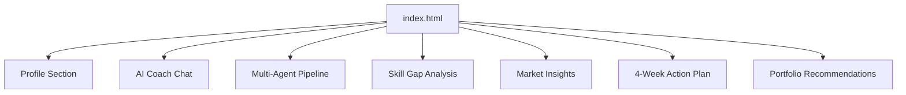
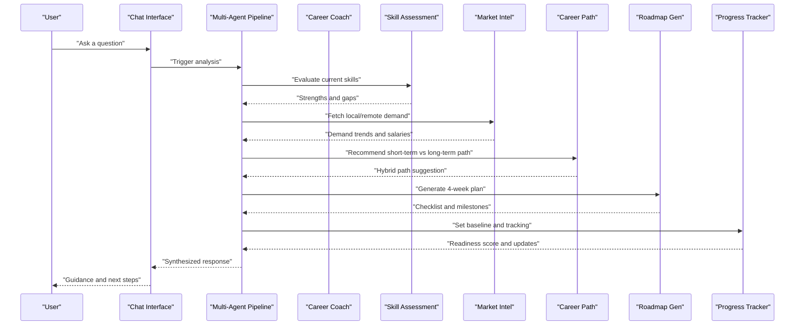
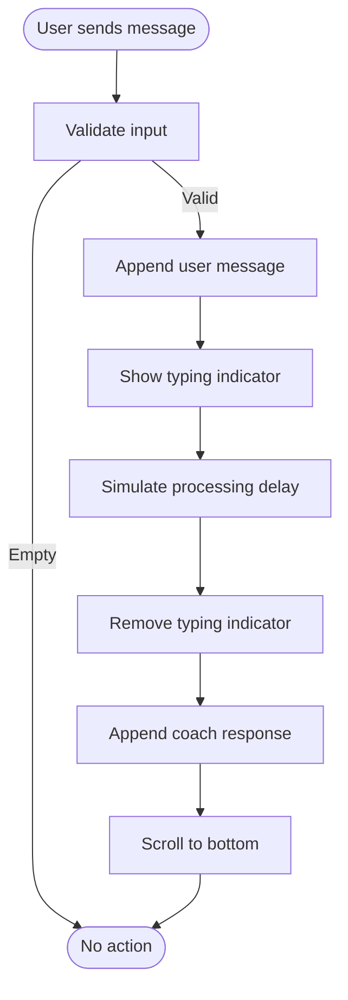
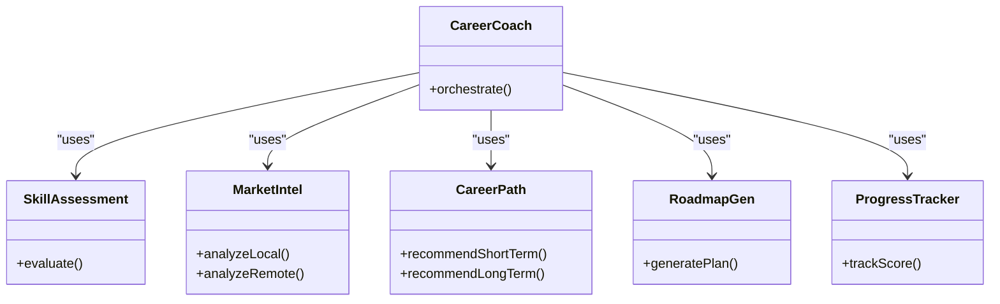
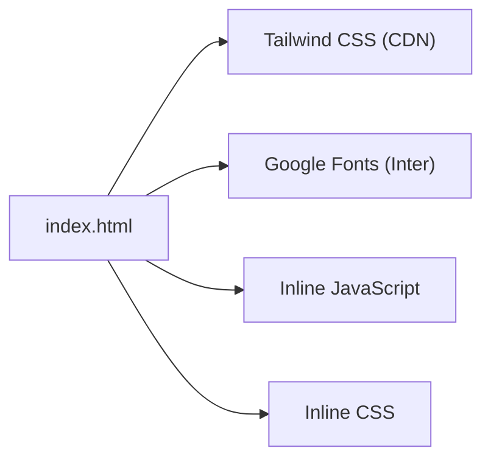

# Project Overview

<cite>
**Referenced Files in This Document**
- [index.html](file://index.html)
</cite>

## Table of Contents
1. Introduction
2. Project Structure
3. Core Components
4. Architecture Overview
5. Detailed Component Analysis
6. Dependency Analysis
7. Performance Considerations
8. Troubleshooting Guide
9. Conclusion
10. Appendices

## Introduction
CareerCompass is a hackathon prototype that helps Pakistani CS graduates navigate between two popular career paths: AI/ML and Full Stack Web Development. It uses a single-file architecture (HTML, CSS, and JavaScript in one cohesive application) to deliver an interactive experience with a chat interface, agent visualization, skill assessment, market intelligence, and an action plan. The platform emphasizes a hybrid approach: achieve immediate job readiness through Full Stack skills while building long-term specialization in AI/ML.

Target audience: Pakistani Computer Science graduates seeking practical guidance for local and remote opportunities. The app demonstrates how a multi-agent pipeline can synthesize skill assessment, market intelligence, and path planning into a personalized roadmap.

Key concepts used throughout the codebase:
- Multi-agent pipeline: A set of specialized agents (Coach, Skill Assessment, Market Intel, Career Path, Roadmap Gen, Progress Tracker) that collaborate to produce recommendations.
- Skill assessment: Evaluation of current skills against target roles to identify strengths and gaps.
- Market intelligence: Insights into local and remote demand, salary ranges, hiring hubs, and platforms relevant to Pakistan.

Practical examples included in the prototype:
- Chat interface: Ask questions and receive guidance grounded in profile data and simulated agent outputs.
- Agent visualization: Animated pipeline showing how agents process inputs and complete tasks.
- Action planning: A 4-week checklist tailored to bridge skill gaps and launch portfolio projects.

**Section sources**
- [index.html:1-684](file://index.html#L1-L684)

## Project Structure
The project is a monolithic single-page application contained entirely within one HTML file. All styling and interactivity are embedded inline, enabling quick deployment and easy demonstration during hackathons.

Highlights:
- Single-file design: HTML structure, Tailwind-based styles, and JavaScript logic coexist in index.html.
- UI sections: Profile overview, coach chat, multi-agent pipeline visualization, skill gap analysis, market insights (local and remote), 4-week action plan, and portfolio project recommendations.
- Interactive elements: Chat input with typing indicators, animated agent pipeline, tabbed market views, editable profile modal, and score counter animation.

**Diagram sources**
- [index.html:72-527](file://index.html#L72-L527)

**Section sources**
- [index.html:1-684](file://index.html#L1-L684)

## Core Components
This section maps the major user-facing components and their responsibilities as implemented in the single file.

- Profile and Readiness Dashboard
  - Displays education level, current skills, interests, and career goal.
  - Shows a Career Readiness Score with visual ring and trend indicator.
  - Provides quick stats on skills match for AI/ML and Full Stack paths, plus market demand signals.

- AI Career Coach Chat
  - Chat area with pre-populated conversation demonstrating guidance.
  - Input field and suggested question buttons; typing indicator and simulated responses.
  - Emphasizes hybrid path recommendation based on profile and market context.

- Multi-Agent Pipeline Visualization
  - Six agent cards: Career Coach (orchestrator), Skill Assessment (evaluator), Market Intel (Pakistan + Remote), Career Path (planner), Roadmap Gen (builder), Progress Tracker (monitor).
  - “Run Analysis” button triggers sequential activation animation across agents.

- Skill Gap Analysis
  - Strengths and gaps presented as progress bars with percentages.
  - Highlights key technologies to learn for both paths.

- Market Intelligence
  - Local and remote tabs showing top demand roles, salary ranges, hiring hubs, and platforms suitable for Pakistani developers.

- 4-Week Action Plan
  - Weekly checklists with realistic tasks: foundation, build, ML intro, and launch phases.
  - Encourages portfolio development, deployment, and interview preparation.

- Portfolio Project Recommendations
  - Three curated projects balancing Full Stack and AI/ML skills with time estimates and impact ratings.

**Section sources**
- [index.html:75-527](file://index.html#L75-L527)

## Architecture Overview
CareerCompass implements a conceptual multi-agent pipeline within a single-page frontend. While no external APIs are connected in this prototype, the UI simulates how agents collaborate to analyze a student’s profile and generate actionable guidance.

**Diagram sources**
- [index.html:172-226](file://index.html#L172-L226)
- [index.html:228-281](file://index.html#L228-L281)
- [index.html:283-313](file://index.html#L283-L313)
- [index.html:315-390](file://index.html#L315-L390)
- [index.html:392-458](file://index.html#L392-L458)

## Detailed Component Analysis

### Chat Interface
- Purpose: Provide conversational guidance grounded in profile data and simulated agent outputs.
- Behavior:
  - Accepts typed messages and suggested questions.
  - Shows a typing indicator before delivering a response.
  - Cycles through predefined responses that reflect hybrid path advice, freelancing tips, remote job strategies, portfolio recommendations, and readiness scoring.

**Diagram sources**
- [index.html:565-628](file://index.html#L565-L628)

**Section sources**
- [index.html:172-226](file://index.html#L172-L226)
- [index.html:565-628](file://index.html#L565-L628)

### Multi-Agent Pipeline Visualization
- Purpose: Demonstrate collaboration among specialized agents to produce career guidance.
- Agents:
  - Career Coach (Orchestrator)
  - Skill Assessment (Evaluator)
  - Market Intel (Pakistan + Remote)
  - Career Path (Planner)
  - Roadmap Gen (Builder)
  - Progress Tracker (Monitor)
- Interaction:
  - “Run Analysis” sequentially activates each agent card with status indicators and completes with a summary state.

**Diagram sources**
- [index.html:228-281](file://index.html#L228-L281)

**Section sources**
- [index.html:228-281](file://index.html#L228-L281)
- [index.html:630-657](file://index.html#L630-L657)

### Skill Gap Analysis
- Purpose: Visualize strengths and gaps to guide learning priorities.
- Features:
  - Strengths shown with high completion percentages.
  - Gaps highlighted with lower percentages to indicate focus areas.
- Impact: Helps students understand where to invest effort for both Full Stack and AI/ML paths.

**Section sources**
- [index.html:283-313](file://index.html#L283-L313)

### Market Intelligence
- Purpose: Provide localized and global insights to inform decisions.
- Tabs:
  - Local: Top demand roles, salary ranges in PKR, and hiring hubs in Pakistan.
  - Remote: Global demand, salary ranges in USD, and platforms for Pakistani developers.
- Value: Bridges understanding of immediate job readiness and long-term specialization opportunities.

**Section sources**
- [index.html:315-390](file://index.html#L315-L390)

### 4-Week Action Plan
- Purpose: Convert insights into a concrete, time-bound plan.
- Structure:
  - Week 1: Foundation (Node.js crash course, GitHub setup, REST API, industry report).
  - Week 2: Build (portfolio project, Docker basics, coding practice, deployment).
  - Week 3: ML Intro (Google ML Crash Course, Pandas/NumPy, simple model, LinkedIn update).
  - Week 4: Launch (portfolio polish, blog post, applications, mock interview).
- Outcome: Moves students from assessment to execution with measurable milestones.

**Section sources**
- [index.html:392-458](file://index.html#L392-L458)

### Portfolio Project Recommendations
- Purpose: Suggest impactful projects aligned with both paths.
- Projects:
  - Full Stack Task Manager (React, Node.js, MongoDB, Socket.io).
  - ML Sentiment Analyzer (Python, Flask, NLTK, Scikit-learn).
  - Pakistan Job Trends Dashboard (React, Chart.js, Python, API).
- Rationale: Demonstrates practical application of skills and builds a strong portfolio for local and remote markets.

**Section sources**
- [index.html:460-516](file://index.html#L460-L516)

## Dependency Analysis
- External dependencies:
  - Tailwind CSS via CDN for styling.
  - Google Fonts (Inter) for typography.
- Internal dependencies:
  - Inline CSS defines animations and component styles.
  - Inline JavaScript handles chat interactions, pipeline animation, tab switching, modal behavior, and score counter animation.
- Coupling:
  - High cohesion within the single file; low coupling due to absence of external modules or services.
- Integration points:
  - No live API integrations; all data is static or simulated for demo purposes.

**Diagram sources**
- [index.html:1-21](file://index.html#L1-L21)
- [index.html:22-43](file://index.html#L22-L43)
- [index.html:565-681](file://index.html#L565-L681)

**Section sources**
- [index.html:1-21](file://index.html#L1-L21)
- [index.html:22-43](file://index.html#L22-L43)
- [index.html:565-681](file://index.html#L565-L681)

## Performance Considerations
- Single-file simplicity reduces network requests and improves load time for demos.
- Animations are lightweight CSS transitions and keyframes; ensure they do not overwhelm low-end devices.
- Chat responses are pre-defined strings; avoid heavy DOM manipulations by reusing functions for appending messages and managing scroll position.
- For future scalability:
  - Extract CSS and JS into separate files for maintainability.
  - Introduce lazy loading for heavier content if needed.
  - Cache repeated computations if dynamic features are added.

[No sources needed since this section provides general guidance]

## Troubleshooting Guide
Common issues and resolutions observed in the prototype:
- Chat not responding:
  - Ensure the input field has focus and text is entered before sending.
  - Check that event listeners for Enter key and Send button are active.
- Pipeline animation not starting:
  - Verify the “Run Analysis” button is enabled and not disabled by previous runs.
  - Confirm agent cards exist in the DOM when the function executes.
- Market tabs not switching:
  - Ensure tab buttons have correct onclick handlers and IDs for local/remote containers.
- Modal not closing:
  - Confirm close button calls the appropriate function to toggle visibility.

Operational notes:
- Prototype disclaimer: No real AI agents or APIs are connected; all outputs are simulated for demonstration.
- Browser compatibility: Works best in modern browsers supporting ES6 features and CSS animations.

**Section sources**
- [index.html:565-681](file://index.html#L565-L681)
- [index.html:518-526](file://index.html#L518-L526)

## Conclusion
CareerCompass demonstrates a focused, hackathon-ready prototype that guides Pakistani CS graduates through a hybrid career strategy: immediate job readiness via Full Stack Web Development and long-term specialization in AI/ML. The single-file architecture keeps the application portable and easy to present, while the multi-agent pipeline conceptually models how specialized tools collaborate to produce personalized roadmaps. With clear sections for skill assessment, market intelligence, and actionable planning, the platform offers both conceptual clarity for beginners and a technical blueprint for developers extending the prototype.

[No sources needed since this section summarizes without analyzing specific files]

## Appendices
- Practical usage examples:
  - Use the chat to ask about freelancing, remote jobs, or portfolio projects; observe simulated guidance grounded in profile and market context.
  - Run the multi-agent pipeline to visualize how agents coordinate and complete analysis steps.
  - Review skill gaps and follow the 4-week action plan to build competencies and launch your portfolio.
- Extensibility ideas:
  - Connect real APIs for market data and skill assessments.
  - Persist user profiles and progress locally or in a backend service.
  - Add more agents (e.g., Interview Prep, Networking Advisor) to enrich the pipeline.

[No sources needed since this section provides general guidance]