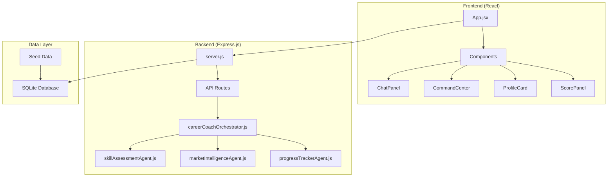
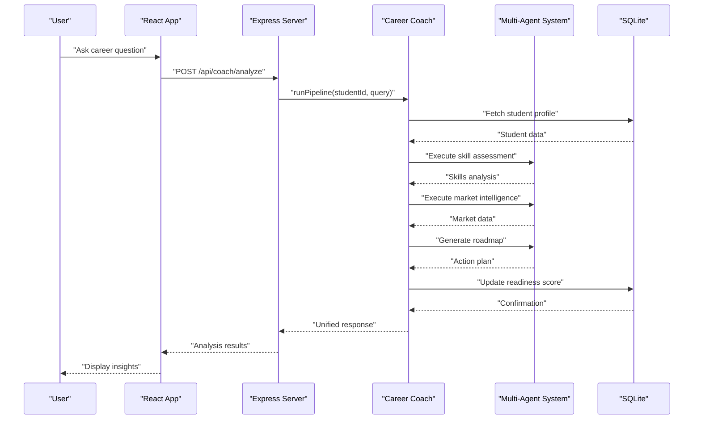
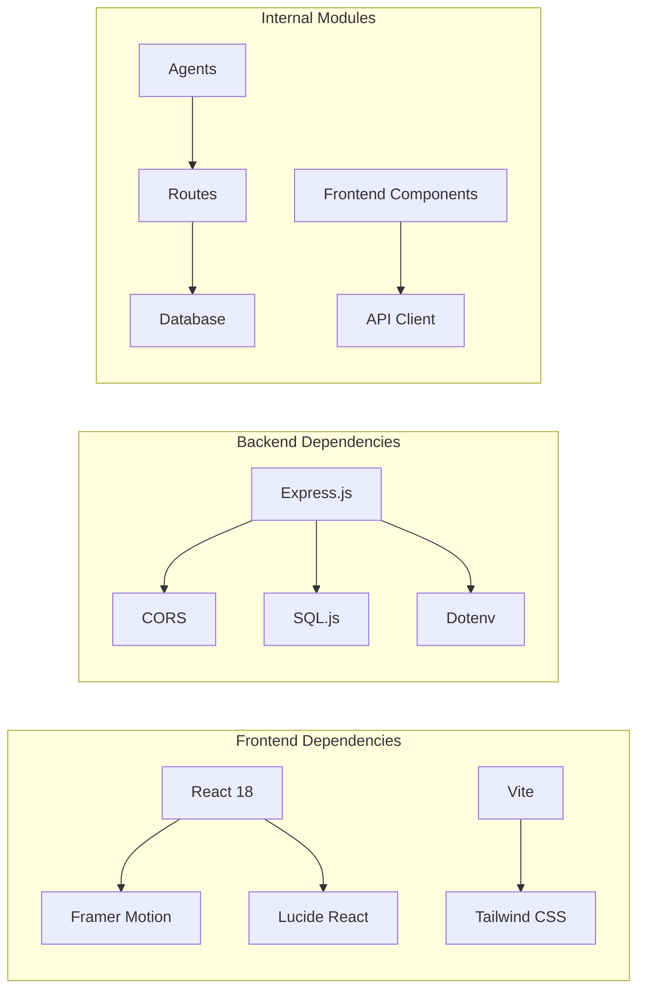

# Project Overview

<cite>
**Referenced Files in This Document**
- [server.js](file://server.js)
- [package.json](file://package.json)
- [frontend/package.json](file://frontend/package.json)
- [routes/api.js](file://routes/api.js)
- [database/db.js](file://database/db.js)
- [database/seed.js](file://database/seed.js)
- [agents/careerCoachOrchestrator.js](file://agents/careerCoachOrchestrator.js)
- [agents/skillAssessmentAgent.js](file://agents/skillAssessmentAgent.js)
- [agents/marketIntelligenceAgent.js](file://agents/marketIntelligenceAgent.js)
- [agents/progressTrackerAgent.js](file://agents/progressTrackerAgent.js)
- [frontend/src/App.jsx](file://frontend/src/App.jsx)
- [frontend/src/components/CommandCenter.jsx](file://frontend/src/components/CommandCenter.jsx)
- [frontend/src/api.js](file://frontend/src/api.js)
- [spec.md](file://spec.md)
</cite>

## Update Summary
**Changes Made**
- Updated architecture description from single-file prototype to full-stack implementation with Express.js backend, React frontend, multi-agent system, and SQLite database
- Replaced client-side HTML/CSS/JS references with modern full-stack components and services
- Updated all technical sections to reflect the new modular architecture and API-driven communication
- Enhanced agent system documentation with actual implementations and database integration
- Added comprehensive coverage of the React frontend components and Express.js routing structure

## Table of Contents
1. Introduction
2. Project Structure
3. Core Components
4. Architecture Overview
5. Detailed Component Analysis
6. Dependency Analysis
7. Performance Considerations
8. Troubleshooting Guide
9. Conclusion
10. Appendices

## Introduction
CareerCompass is an AI-powered career guidance platform for Pakistani students that has evolved from a hackathon prototype into a production-ready full-stack application. The platform helps Pakistani Computer Science graduates navigate between two popular career paths: AI/ML and Full Stack Web Development through a sophisticated multi-agent pipeline system.

The current implementation features a modern technology stack with an Express.js backend serving RESTful APIs, a React frontend built with Vite, a comprehensive multi-agent system, and SQLite database for persistent data storage. The platform emphasizes a hybrid approach: achieve immediate job readiness through Full Stack skills while building long-term specialization in AI/ML.

Target audience: Pakistani Computer Science graduates seeking practical guidance for local and remote opportunities. The app demonstrates how a multi-agent pipeline can synthesize skill assessment, market intelligence, and path planning into personalized roadmaps with real-time progress tracking.

Key concepts used throughout the codebase:
- Multi-agent pipeline: A set of specialized agents (Coach, Skill Assessment, Market Intel, Career Path, Roadmap Gen, Progress Tracker) that collaborate to produce recommendations
- Skill assessment: Evaluation of current skills against target roles to identify strengths and gaps
- Market intelligence: Insights into local and remote demand, salary ranges, hiring hubs, and platforms relevant to Pakistan

**Section sources**
- [spec.md:8-16](file://spec.md#L8-L16)
- [spec.md:20-52](file://spec.md#L20-L52)

## Project Structure
The project has been completely restructured from a monolithic single-file prototype into a modern full-stack architecture with clear separation of concerns.

### Backend Architecture
- **Express.js Server**: Central server handling API routes, middleware, and database initialization
- **Multi-Agent System**: Modular agent modules with specific responsibilities and deterministic logic
- **SQLite Database**: Persistent storage with schema management and seed data
- **RESTful APIs**: Clean API endpoints for frontend communication

### Frontend Architecture  
- **React Application**: Modern component-based UI built with Vite
- **Component Library**: Specialized components for chat, command center, profile management, and data visualization
- **State Management**: React hooks for local state and API integration
- **Internationalization**: Bilingual support (English/Roman Urdu) with context-based switching

### Agent System
- **Career Coach Orchestrator**: Central coordination layer managing the entire pipeline
- **Specialized Agents**: Individual agents for skill assessment, market intelligence, career path planning, roadmap generation, and progress tracking
- **Database Integration**: All agents interact with SQLite for data persistence and retrieval

**Diagram sources**
- [server.js:13-23](file://server.js#L13-L23)
- [frontend/src/App.jsx:82-114](file://frontend/src/App.jsx#L82-L114)
- [agents/careerCoachOrchestrator.js:210-237](file://agents/careerCoachOrchestrator.js#L210-L237)

**Section sources**
- [server.js:1-37](file://server.js#L1-L37)
- [frontend/src/App.jsx:1-388](file://frontend/src/App.jsx#L1-L388)
- [package.json:1-30](file://package.json#L1-L30)

## Core Components
The application consists of several major components working together to provide a comprehensive career guidance experience.

### Backend Services
- **Express.js Server**: Handles HTTP requests, CORS configuration, JSON parsing, and static file serving
- **API Router**: Manages RESTful endpoints for student profiles, analysis pipeline, and progress tracking
- **Database Manager**: Provides SQLite connection, schema initialization, and data persistence
- **Agent Orchestration**: Coordinates the multi-agent pipeline execution and result synthesis

### Frontend Components
- **Main Application**: React component managing global state, student selection, and analysis workflow
- **Chat Interface**: Conversational interface with typing indicators and bilingual responses
- **Command Center**: Visual pipeline showing agent execution status and results
- **Profile Management**: Student profile editing and display with real-time updates
- **Data Visualization**: Charts and progress indicators for skills, market analysis, and readiness scores

### Agent System
- **Career Coach Orchestrator**: Central coordinator that manages the entire analysis pipeline
- **Skill Assessment Agent**: Evaluates student skills against target role requirements
- **Market Intelligence Agent**: Analyzes local and remote market demand for career paths
- **Progress Tracker Agent**: Monitors task completion and recalculates readiness scores

**Section sources**
- [routes/api.js:1-176](file://routes/api.js#L1-L176)
- [frontend/src/components/CommandCenter.jsx:1-531](file://frontend/src/components/CommandCenter.jsx#L1-L531)
- [agents/careerCoachOrchestrator.js:1-337](file://agents/careerCoachOrchestrator.js#L1-L337)

## Architecture Overview
CareerCompass implements a sophisticated full-stack architecture with clear separation between frontend, backend, and data layers, connected through RESTful APIs.

### Request Flow

**Diagram sources**
- [routes/api.js:118-142](file://routes/api.js#L118-L142)
- [agents/careerCoachOrchestrator.js:210-337](file://agents/careerCoachOrchestrator.js#L210-L337)
- [frontend/src/App.jsx:172-238](file://frontend/src/App.jsx#L172-L238)

### Database Schema
The SQLite database provides persistent storage for student profiles, market signals, roadmaps, and progress tracking with proper relationships and constraints.

**Section sources**
- [database/db.js:59-125](file://database/db.js#L59-L125)
- [database/seed.js:43-209](file://database/seed.js#L43-L209)

## Detailed Component Analysis

### Express.js Backend
The backend provides a robust API layer with comprehensive error handling, input validation, and database integration.

#### API Endpoints
- **GET /api/students**: Lists all available students for profile switching
- **PATCH /api/students/:id**: Updates student profile fields with validation
- **GET /api/students/:id**: Returns complete student profile with progress data
- **POST /api/coach/analyze**: Executes the full multi-agent pipeline
- **POST /api/progress/toggle**: Toggles task completion and recalculates readiness score

#### Error Handling
All endpoints include comprehensive input validation, proper HTTP status codes, and meaningful error messages for both client-side and debugging purposes.

**Section sources**
- [routes/api.js:15-176](file://routes/api.js#L15-L176)

### React Frontend
The frontend is built with modern React patterns, providing an intuitive user interface with real-time updates and smooth animations.

#### Main Application Flow
- **Student Selection**: Dropdown menu for switching between different student profiles
- **Analysis Pipeline**: Real-time visualization of agent execution with step-by-step progress
- **Result Display**: Comprehensive presentation of skills analysis, market insights, and action plans
- **Interactive Features**: Editable profiles, task toggling, and dynamic score updates

#### Component Architecture
- **CommandCenter**: Visual pipeline showing agent execution with animated states
- **ChatPanel**: Conversational interface with typing indicators and bilingual responses
- **ProfileCard**: Student information display with edit capabilities
- **ScorePanel**: Readiness score visualization with trend indicators

**Section sources**
- [frontend/src/App.jsx:82-388](file://frontend/src/App.jsx#L82-L388)
- [frontend/src/components/CommandCenter.jsx:286-531](file://frontend/src/components/CommandCenter.jsx#L286-L531)

### Multi-Agent System
The agent system implements a sophisticated pipeline where each agent has specific responsibilities and communicates through well-defined interfaces.

#### Agent Responsibilities
- **Career Coach Orchestrator**: Coordinates the entire pipeline, resolves career targets, and synthesizes final recommendations
- **Skill Assessment Agent**: Compares student skills against target role requirements using normalized string matching
- **Market Intelligence Agent**: Queries market signals database and generates localized summaries for Pakistani developers
- **Progress Tracker Agent**: Calculates readiness scores using weighted formulas and tracks task completion

#### Execution Pipeline
The orchestrator executes agents in sequence, passing structured data between each step and maintaining an execution log for transparency.

**Section sources**
- [agents/careerCoachOrchestrator.js:210-337](file://agents/careerCoachOrchestrator.js#L210-L337)
- [agents/skillAssessmentAgent.js:34-74](file://agents/skillAssessmentAgent.js#L34-L74)
- [agents/marketIntelligenceAgent.js:81-119](file://agents/marketIntelligenceAgent.js#L81-L119)
- [agents/progressTrackerAgent.js:64-134](file://agents/progressTrackerAgent.js#L64-L134)

### Database Layer
The SQLite database provides persistent storage with proper schema design and data integrity constraints.

#### Schema Design
- **students**: Core student profiles with education level, skills, interests, and readiness metrics
- **market_signals**: Market demand data for different career paths with local and remote indicators
- **roadmaps**: Generated career roadmaps with weekly tasks and portfolio project recommendations
- **progress_logs**: Task completion tracking with timestamps and status management

#### Data Persistence
All database operations automatically persist changes to disk, ensuring data durability across application restarts.

**Section sources**
- [database/db.js:59-125](file://database/db.js#L59-L125)
- [database/seed.js:43-209](file://database/seed.js#L43-L209)

## Dependency Analysis
The project uses a modern JavaScript ecosystem with clear separation between frontend and backend dependencies.

### Backend Dependencies
- **Express.js**: Web framework for building RESTful APIs
- **CORS**: Cross-origin resource sharing for frontend-backend communication
- **SQL.js**: In-memory SQLite database for persistent data storage
- **Dotenv**: Environment variable management for configuration

### Frontend Dependencies
- **React**: Component-based UI library for building interactive interfaces
- **Framer Motion**: Animation library for smooth transitions and visual effects
- **Lucide React**: Icon library for consistent visual elements
- **Vite**: Build tool for fast development and optimized production builds
- **Tailwind CSS**: Utility-first CSS framework for responsive design

### Internal Dependencies
- **Modular Architecture**: Clear separation between agents, routes, and database modules
- **API Abstraction**: Shared fetch wrapper for consistent error handling and response parsing
- **Component Composition**: Reusable React components with prop-based configuration

**Diagram sources**
- [package.json:23-28](file://package.json#L23-L28)
- [frontend/package.json:11-23](file://frontend/package.json#L11-L23)

**Section sources**
- [package.json:23-28](file://package.json#L23-L28)
- [frontend/package.json:11-23](file://frontend/package.json#L11-L23)
- [frontend/src/api.js:1-64](file://frontend/src/api.js#L1-L64)

## Performance Considerations
The full-stack architecture provides several performance optimizations and scalability considerations.

### Backend Optimization
- **Database Indexing**: SQLite queries are optimized with proper indexing strategies
- **Connection Pooling**: Single database connection managed through singleton pattern
- **Request Validation**: Early input validation prevents unnecessary processing
- **Error Handling**: Comprehensive error handling prevents application crashes

### Frontend Optimization
- **Component Lazy Loading**: React components are organized for optimal loading
- **Animation Performance**: Framer Motion uses GPU-accelerated animations
- **State Management**: Efficient React hooks minimize re-renders
- **Bundle Optimization**: Vite provides optimized production builds

### Scalability Considerations
- **Modular Architecture**: Easy to add new agents or extend existing functionality
- **API-First Design**: Clean separation allows for future mobile app development
- **Database Portability**: SQLite can be migrated to other databases as needed
- **Container Ready**: Application structure supports Docker containerization

## Troubleshooting Guide
Common issues and their solutions in the full-stack architecture.

### Backend Issues
- **Server Not Starting**: Check port availability and environment variables
- **Database Errors**: Verify SQLite file permissions and schema initialization
- **API Route Conflicts**: Ensure proper route ordering and parameter validation
- **Agent Execution Failures**: Check agent module imports and database connectivity

### Frontend Issues
- **Network Requests**: Verify backend server is running and CORS is properly configured
- **Component Rendering**: Check React state management and prop passing
- **Animation Issues**: Ensure Framer Motion is properly initialized
- **Build Errors**: Validate Vite configuration and dependency versions

### Agent System Issues
- **Pipeline Execution**: Monitor agent execution logs for detailed error information
- **Data Consistency**: Verify database schema matches expected structure
- **Input Validation**: Check student ID and query parameter formats
- **Score Calculation**: Validate readiness score formula inputs and outputs

**Section sources**
- [server.js:25-37](file://server.js#L25-L37)
- [routes/api.js:118-176](file://routes/api.js#L118-L176)
- [agents/careerCoachOrchestrator.js:210-337](file://agents/careerCoachOrchestrator.js#L210-L337)

## Conclusion
CareerCompass has successfully evolved from a simple single-file prototype into a sophisticated full-stack application that provides comprehensive career guidance for Pakistani students. The modern architecture with Express.js backend, React frontend, multi-agent system, and SQLite database offers a scalable foundation for future enhancements.

The platform effectively demonstrates how AI-powered career guidance can help students navigate between immediate job readiness through Full Stack development and long-term specialization in AI/ML. With its modular design, comprehensive agent system, and user-friendly interface, CareerCompass serves as both a practical tool and a technical blueprint for similar career guidance applications.

The hybrid approach combining immediate employment preparation with long-term career development addresses the unique needs of Pakistani CS graduates, providing them with actionable insights and concrete next steps for their professional journey.

## Appendices
### Practical Usage Examples
- **Career Analysis**: Use the chat interface to ask about specific career paths like "AI/ML vs Full Stack" to receive personalized guidance
- **Skill Assessment**: Run the multi-agent pipeline to visualize how agents coordinate and analyze your profile
- **Progress Tracking**: Toggle tasks in the action plan to see real-time readiness score updates
- **Profile Management**: Edit student profiles to explore different scenarios and career outcomes

### Extensibility Ideas
- **Additional Agents**: Implement specialized agents for interview preparation, networking advice, or industry-specific guidance
- **External Integrations**: Connect to real job market APIs, learning platforms, or portfolio hosting services
- **Advanced Analytics**: Add machine learning models for more sophisticated career path recommendations
- **Mobile Application**: Develop native mobile apps using the existing API endpoints
- **Multi-language Support**: Expand beyond English and Roman Urdu to include regional languages

**Section sources**
- [spec.md:152-176](file://spec.md#L152-L176)
- [spec.md:325-340](file://spec.md#L325-L340)