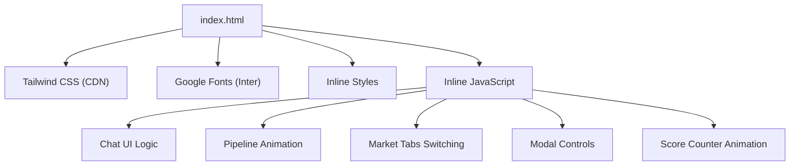
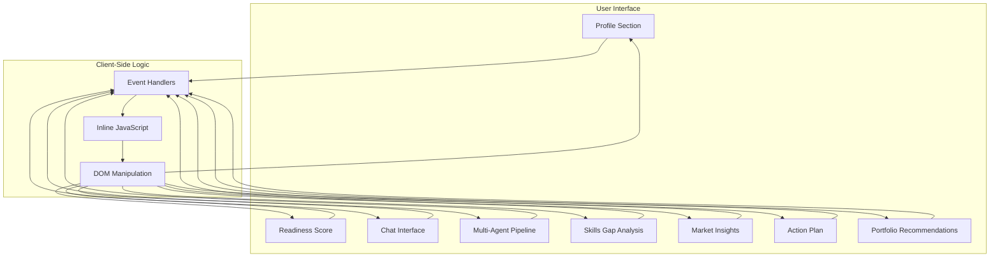
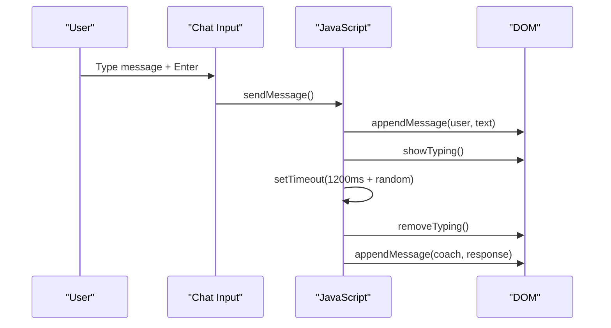
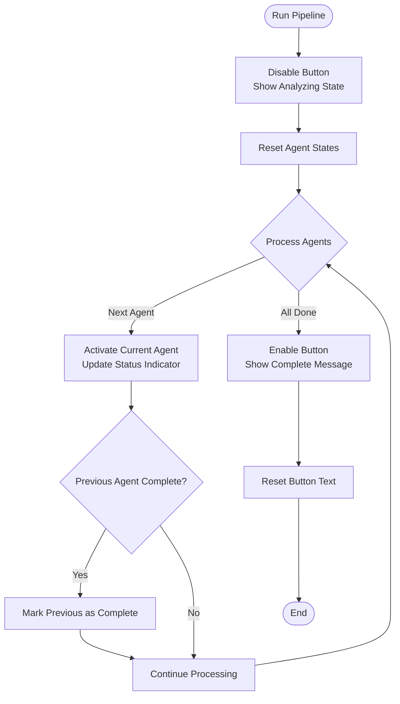
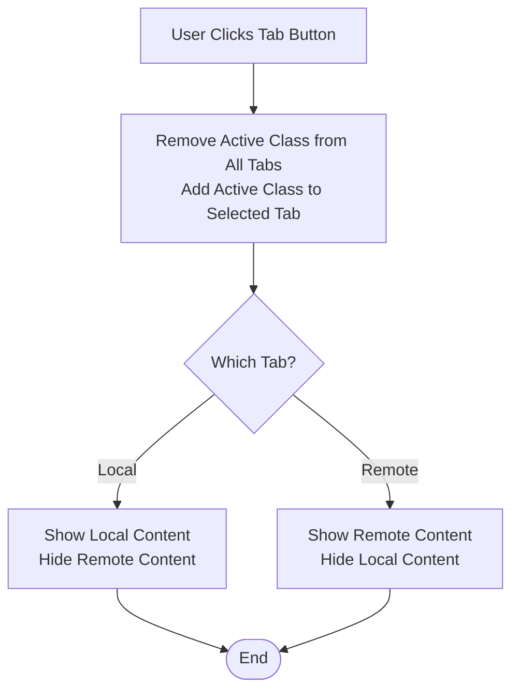
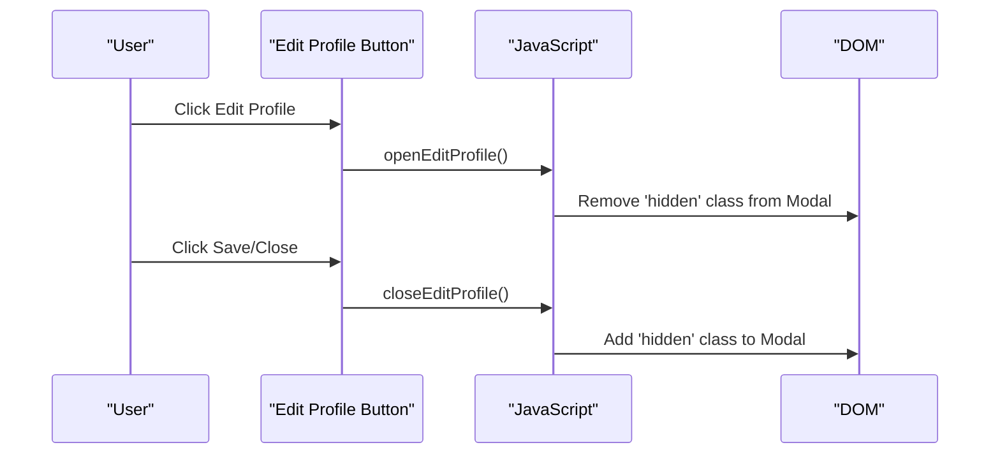
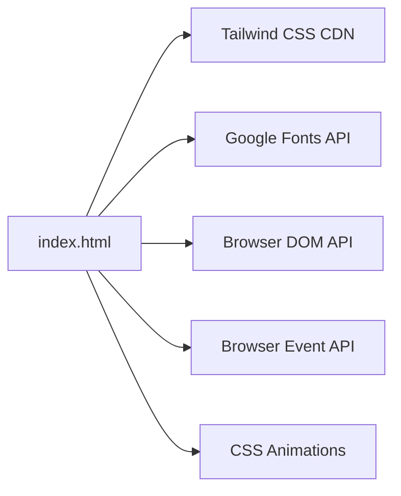

# Technical Implementation

<cite>
**Referenced Files in This Document**
- [index.html](file://index.html)
</cite>

## Table of Contents
1. Introduction
2. Project Structure
3. Core Components
4. Architecture Overview
5. Detailed Component Analysis
6. Dependency Analysis
7. Performance Considerations
8. Troubleshooting Guide
9. Conclusion
10. Appendices

## Introduction
CareerCompass is a single-file, client-side prototype that demonstrates an AI-powered career guidance experience for Pakistani students. It combines embedded CSS and JavaScript within one HTML document to deliver:
- A profile overview with readiness scoring and skill match indicators
- An interactive chat interface simulating multi-agent coaching
- A visual multi-agent pipeline animation
- Skill gap analysis and market insights (local and remote)
- A 4-week action plan checklist
- Portfolio project recommendations

The design prioritizes simplicity for hackathon deployment while providing a rich user experience through event-driven interactions and component-like sections within a single page.

## Project Structure
The application is implemented as a single HTML file with:
- Embedded Tailwind CSS via CDN for utility-first styling
- Google Fonts for typography
- Inline styles for custom animations and glassmorphism effects
- Inline JavaScript handling all interactivity

**Diagram sources**
- [index.html:1-21](file://index.html#L1-L21)
- [index.html:22-43](file://index.html#L22-L43)
- [index.html:565-681](file://index.html#L565-L681)

**Section sources**
- [index.html:1-45](file://index.html#L1-L45)

## Core Components
- Profile Section: Displays user info, education level, skills, interests, and career goal; includes an edit modal.
- Readiness Score: Animated circular score indicator with contextual messaging.
- Chat Interface: Simulated multi-agent coach with typing indicators and suggested questions.
- Multi-Agent Pipeline: Visual representation of agent orchestration with step-by-step activation.
- Skills Gap Analysis: Strengths and gaps with progress bars.
- Market Insights: Local and remote job market data with tab switching.
- Action Plan: Weekly checklists with interactive checkboxes.
- Portfolio Recommendations: Curated projects with tech stacks and impact ratings.

These components are structured as semantic sections within the DOM and interact via inline event handlers and JavaScript functions.

**Section sources**
- [index.html:74-170](file://index.html#L74-L170)
- [index.html:172-226](file://index.html#L172-L226)
- [index.html:228-281](file://index.html#L228-L281)
- [index.html:283-313](file://index.html#L283-L313)
- [index.html:315-390](file://index.html#L315-L390)
- [index.html:392-458](file://index.html#L392-L458)
- [index.html:460-516](file://index.html#L460-L516)
- [index.html:529-562](file://index.html#L529-L562)

## Architecture Overview
The system follows a monolithic, client-only architecture:
- Single-page application with no server-side logic
- Event-driven programming model using inline onclick and onkeydown handlers
- Component-like sections organized by semantic HTML elements
- Data flows from user input to DOM updates via JavaScript functions
- Styling via Tailwind utilities and custom CSS animations

**Diagram sources**
- [index.html:72-527](file://index.html#L72-L527)
- [index.html:565-681](file://index.html#L565-L681)

## Detailed Component Analysis

### Chat Interface
The chat interface simulates a multi-agent coaching experience with:
- Message sending via Enter key or button click
- Typing indicator animation during simulated processing
- Predefined response cycling for demonstration purposes
- Suggested question buttons for guided interaction

**Diagram sources**
- [index.html:576-628](file://index.html#L576-L628)

**Section sources**
- [index.html:172-226](file://index.html#L172-L226)
- [index.html:565-628](file://index.html#L565-L628)

### Multi-Agent Pipeline
The pipeline visualization demonstrates agent orchestration through:
- Sequential activation of agent cards with status indicators
- Button state management during analysis
- Visual feedback with active states and completion messages

**Diagram sources**
- [index.html:630-657](file://index.html#L630-L657)

**Section sources**
- [index.html:228-281](file://index.html#L228-L281)
- [index.html:630-657](file://index.html#L630-L657)

### Market Insights Tab System
The market section provides local and remote job market information with tab switching functionality:
- Toggle between local and remote market views
- Active tab highlighting with visual feedback
- Content visibility control through class manipulation

**Diagram sources**
- [index.html:659-665](file://index.html#L659-L665)

**Section sources**
- [index.html:315-390](file://index.html#L315-L390)
- [index.html:659-665](file://index.html#L659-L665)

### Profile Modal System
The edit profile modal provides:
- Modal open/close functionality
- Form inputs for profile editing
- Overlay backdrop with blur effect

**Diagram sources**
- [index.html:667-669](file://index.html#L667-L669)

**Section sources**
- [index.html:74-121](file://index.html#L74-L121)
- [index.html:529-562](file://index.html#L529-L562)
- [index.html:667-669](file://index.html#L667-L669)

## Dependency Analysis
The application has minimal external dependencies:
- Tailwind CSS CDN for utility-first styling framework
- Google Fonts for Inter font family
- No build tools or package managers required

**Diagram sources**
- [index.html:7-9](file://index.html#L7-L9)
- [index.html:22-43](file://index.html#L22-L43)

**Section sources**
- [index.html:1-21](file://index.html#L1-L21)

## Performance Considerations
- **Single File Optimization**: Eliminates network requests for multiple files, reducing load time
- **CDN Caching**: External resources (Tailwind, fonts) benefit from browser caching
- **Minimal JavaScript**: Lightweight event handlers avoid heavy computational overhead
- **CSS Animations**: Hardware-accelerated transforms and opacity changes for smooth interactions
- **Responsive Design**: Mobile-first approach ensures performance across devices
- **Memory Management**: Dynamic element creation and removal prevent memory leaks

## Troubleshooting Guide
Common issues and solutions:
- **Chat Not Responding**: Verify JavaScript is enabled and not blocked by browser security settings
- **Animations Not Working**: Check browser compatibility with CSS animations and ensure modern browser usage
- **Modal Not Opening**: Ensure DOM elements exist before script execution
- **Font Loading Issues**: Verify internet connectivity for Google Fonts CDN
- **Mobile Responsiveness**: Test viewport meta tag and responsive breakpoints

**Section sources**
- [index.html:565-681](file://index.html#L565-L681)

## Conclusion
CareerCompass demonstrates effective single-file architecture for rapid prototyping and hackathon deployment. The implementation successfully balances complexity with simplicity, providing a comprehensive career guidance interface while maintaining deployability constraints. The event-driven approach and component-like structure enable maintainable code organization within the single-file constraint.

Key strengths include:
- Zero deployment complexity with static hosting requirements
- Rich user experience through modern web technologies
- Scalable architecture patterns despite single-file limitation
- Cross-browser compatibility with standard web APIs

Trade-offs include limited scalability for large teams and potential maintenance challenges as features grow beyond prototype scope.

## Appendices

### Infrastructure Requirements
- Modern web browser with JavaScript support
- Internet connection for CDN resources (Tailwind CSS, Google Fonts)
- Static hosting capability (GitHub Pages, Netlify, Vercel, etc.)

### Accessibility Considerations
- Semantic HTML structure with proper heading hierarchy
- Keyboard navigation support for interactive elements
- Color contrast ratios meeting accessibility standards
- Screen reader compatibility with descriptive labels

### Deployment Topology
- Static file hosting without server-side processing
- CDN-based resource loading for optimal performance
- Client-side only execution model