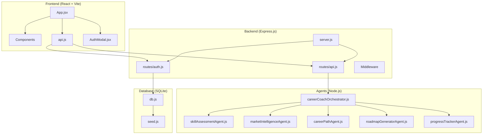
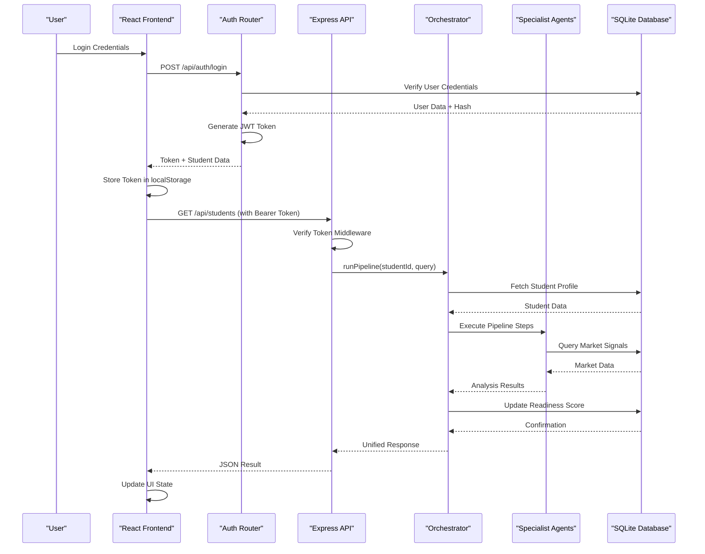
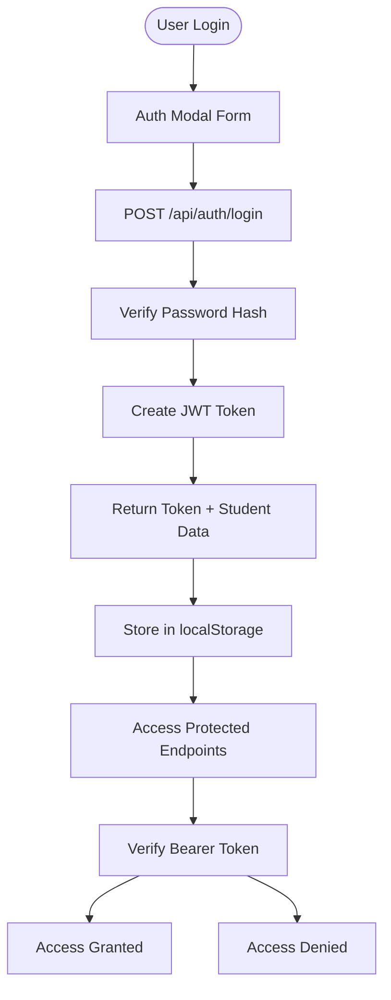
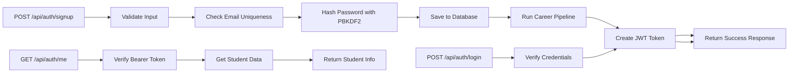
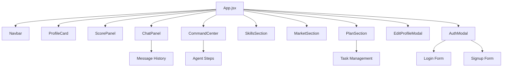
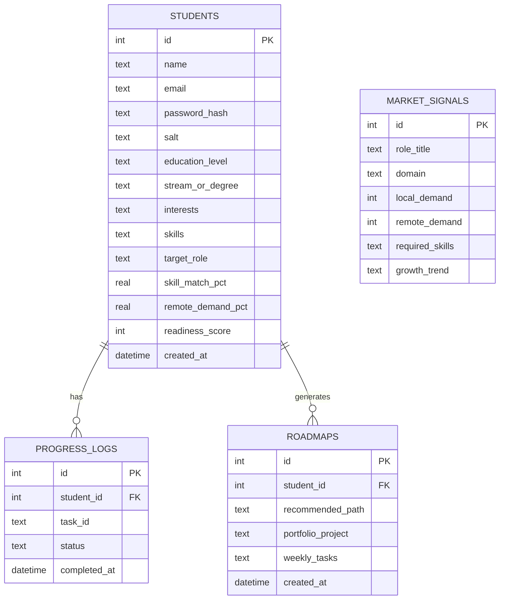

# Technical Implementation

<cite>
**Referenced Files in This Document**
- [server.js](file://server.js)
- [package.json](file://package.json)
- [routes/api.js](file://routes/api.js)
- [routes/auth.js](file://routes/auth.js)
- [database/db.js](file://database/db.js)
- [frontend/src/App.jsx](file://frontend/src/App.jsx)
- [frontend/src/api.js](file://frontend/src/api.js)
- [frontend/src/components/AuthModal.jsx](file://frontend/src/components/AuthModal.jsx)
- [agents/careerCoachOrchestrator.js](file://agents/careerCoachOrchestrator.js)
- [frontend/package.json](file://frontend/package.json)
- [frontend/src/components/CommandCenter.jsx](file://frontend/src/components/CommandCenter.jsx)
- [agents/skillAssessmentAgent.js](file://agents/skillAssessmentAgent.js)
- [database/seed.js](file://database/seed.js)
</cite>

## Update Summary
**Changes Made**
- Added comprehensive authentication system with JWT-based token management
- Implemented secure API endpoints with Bearer token authentication middleware
- Integrated frontend authentication flow with login/signup functionality
- Enhanced security with password hashing using PBKDF2 and SHA-512
- Added session management with 7-day token expiration
- Updated all API endpoints to require authentication for protected routes

## Table of Contents
1. Introduction
2. Project Structure
3. Core Components
4. Architecture Overview
5. Authentication System
6. Detailed Component Analysis
7. Dependency Analysis
8. Performance Considerations
9. Troubleshooting Guide
10. Conclusion
11. Appendices

## Introduction
CareerCompass has evolved from a single-file client-side prototype into a comprehensive full-stack AI-powered career guidance platform for Pakistani students with robust authentication and security features. The new architecture features:

- **Express.js Server**: Robust backend with RESTful API endpoints, authentication middleware, and security layers
- **React Frontend**: Modern component-based UI with state management, animations, and authentication flows
- **SQLite Database**: Persistent data storage with schema validation, seeding, and secure user data management
- **Multi-Agent System**: Specialized agents for skill assessment, market intelligence, career pathing, roadmap generation, and progress tracking
- **Authentication System**: JWT-based token management with password hashing and session handling
- **Comprehensive API Layer**: Validated endpoints with error handling, data persistence, and security middleware

The system maintains the original goal of providing AI-powered career guidance while adding enterprise-grade security, scalability, maintainability, and production-ready features suitable for real-world deployment.

## Project Structure
The application follows a modern full-stack architecture with clear separation of concerns and security boundaries:



**Diagram sources**
- [server.js:1-39](file://server.js#L1-L39)
- [routes/api.js:1-200](file://routes/api.js#L1-L200)
- [routes/auth.js:1-333](file://routes/auth.js#L1-L333)
- [agents/careerCoachOrchestrator.js:1-337](file://agents/careerCoachOrchestrator.js#L1-L337)
- [database/db.js:1-125](file://database/db.js#L1-L125)

**Section sources**
- [server.js:1-39](file://server.js#L1-L39)
- [package.json:1-30](file://package.json#L1-L30)

## Core Components

### Backend Architecture
- **Express Server**: Central application entry point with CORS, JSON parsing, static file serving, and route organization
- **API Routes**: RESTful endpoints for student management, career analysis, progress tracking, and authentication
- **Authentication Router**: Secure endpoints for user registration, login, session management, and token verification
- **Database Layer**: SQLite integration with schema management, data persistence, and secure user data handling
- **Agent System**: Modular multi-agent architecture for career guidance processing with authenticated access

### Frontend Architecture  
- **React Application**: Component-based UI with state management, routing, and authentication flows
- **Component Library**: Reusable UI components for profile cards, chat interfaces, analytics, and authentication modals
- **API Client**: Centralized HTTP client with authentication headers, error handling, and response parsing
- **Internationalization**: Multi-language support with English and Urdu translations

### Agent System
- **Orchestrator Agent**: Central coordination layer managing the entire pipeline with authenticated context
- **Skill Assessment Agent**: Evaluates student skills against target role requirements
- **Market Intelligence Agent**: Analyzes local and remote job market conditions
- **Career Path Agent**: Determines optimal career progression paths
- **Roadmap Generator**: Creates personalized 4-week action plans
- **Progress Tracker**: Monitors completion status and calculates readiness scores

**Section sources**
- [server.js:13-39](file://server.js#L13-L39)
- [routes/api.js:18-200](file://routes/api.js#L18-L200)
- [routes/auth.js:170-333](file://routes/auth.js#L170-L333)
- [frontend/src/App.jsx:82-469](file://frontend/src/App.jsx#L82-L469)
- [agents/careerCoachOrchestrator.js:210-337](file://agents/careerCoachOrchestrator.js#L210-L337)

## Architecture Overview
The system implements a modern microservices-inspired architecture within a single application with comprehensive security:



**Diagram sources**
- [routes/auth.js:258-300](file://routes/auth.js#L258-L300)
- [routes/api.js:118-167](file://routes/api.js#L118-L167)
- [agents/careerCoachOrchestrator.js:210-337](file://agents/careerCoachOrchestrator.js#L210-L337)
- [database/db.js:59-125](file://database/db.js#L59-L125)

The architecture provides:
- **Scalability**: Modular design allows independent scaling of components
- **Maintainability**: Clear separation of concerns enables focused development
- **Security**: Comprehensive authentication and authorization throughout the stack
- **Testability**: Isolated components facilitate comprehensive testing
- **Performance**: Optimized data flow with efficient database queries
- **Reliability**: Comprehensive error handling and validation throughout the stack

## Authentication System
The application implements a comprehensive JWT-based authentication system with industry-standard security practices:

### Security Features
- **Password Hashing**: PBKDF2 algorithm with SHA-512 and random salt generation
- **JWT Tokens**: Stateless authentication tokens with 7-day expiration
- **Token Verification**: HMAC-SHA256 signature validation and expiration checking
- **Session Management**: Automatic token storage and cleanup in localStorage
- **Protected Routes**: Bearer token requirement for sensitive API endpoints

### Authentication Flow


**Diagram sources**
- [routes/auth.js:258-300](file://routes/auth.js#L258-L300)
- [routes/auth.js:303-328](file://routes/auth.js#L303-L328)
- [frontend/src/api.js:43-82](file://frontend/src/api.js#L43-L82)

### API Endpoints
| Endpoint | Method | Description | Request Body | Response | Auth Required |
|----------|--------|-------------|--------------|----------|---------------|
| `/api/auth/signup` | POST | Create new student account | `{ name, email, password, education_level, stream_or_degree, interests, skills, target_role }` | `{ success, message, token, student, analysis }` | No |
| `/api/auth/login` | POST | Authenticate user | `{ email, password }` | `{ success, message, token, student, analysis }` | No |
| `/api/auth/me` | GET | Get current user session | None | `{ success, student, analysis }` | Yes |
| `/api/auth/logout` | POST | Clear session | None | `{ success, message }` | Yes |
| `/api/students` | GET | List all students | None | `{ students: [] }` | Yes |
| `/api/students/:id` | GET | Get student details | None | Student object with progress | Yes |
| `/api/students/:id` | PATCH | Update student profile | `{ education_level?, interests?, skills? }` | Updated student | Yes |
| `/api/coach/analyze` | POST | Run career analysis pipeline | `{ studentId, query }` | Analysis results | Yes |
| `/api/progress/toggle` | POST | Toggle task completion | `{ studentId, taskId, status }` | Updated progress | Yes |

**Section sources**
- [routes/auth.js:170-333](file://routes/auth.js#L170-L333)
- [routes/api.js:18-200](file://routes/api.js#L18-L200)
- [frontend/src/api.js:43-132](file://frontend/src/api.js#L43-L132)

## Detailed Component Analysis

### Express Server Configuration
The server provides a robust foundation with essential middleware, authentication routes, and security configuration:

```mermaid
flowchart TD
Start([Server Start]) --> Init[Initialize Express App]
Init --> Middleware[Configure Middleware]
Middleware --> CORS[Enable CORS]
Middleware --> JSON[Parse JSON Requests]
Middleware --> Static[Serve Static Files]
CORS --> Routes[Mount API Routes]
JSON --> Routes
Static --> Routes
Routes --> Health[/api/health]
Routes --> Auth[/api/auth]
Routes --> API[/api/*]
Health --> DBInit[Initialize Database]
Auth --> DBInit
API --> DBInit
DBInit --> Listen[Listen on Port 3000]
```

**Diagram sources**
- [server.js:13-39](file://server.js#L13-L39)

**Section sources**
- [server.js:1-39](file://server.js#L1-L39)

### Authentication Router Implementation
The authentication router handles user registration, login, session management, and token verification:



**Diagram sources**
- [routes/auth.js:170-333](file://routes/auth.js#L170-L333)

**Section sources**
- [routes/auth.js:1-333](file://routes/auth.js#L1-L333)

### API Layer Design
The API provides comprehensive endpoints with validation, authentication, and error handling:

**Section sources**
- [routes/api.js:18-200](file://routes/api.js#L18-L200)

### Multi-Agent Pipeline
The orchestrator coordinates six specialized agents in a sequential pipeline with authenticated context:

```mermaid
flowchart LR
Input[Authenticated Student Query] --> Resolver[Target Resolver]
Resolver --> Skills[Skill Assessment]
Skills --> Market[Market Intelligence]
Market --> Path[Career Path]
Path --> Roadmap[Roadmap Generator]
Roadmap --> Progress[Progress Tracker]
Progress --> Output[Unified Response]
style Input fill:#e1f5fe
style Output fill:#e8f5e8
style Resolver fill:#fff3e0
style Skills fill:#f3e5f5
style Market fill:#e0f2f1
style Path fill:#fce4ec
style Roadmap fill:#f1f8e9
style Progress fill:#fff8e1
```



**Diagram sources**
- [agents/careerCoachOrchestrator.js:210-337](file://agents/careerCoachOrchestrator.js#L210-L337)

**Section sources**
- [agents/careerCoachOrchestrator.js:1-337](file://agents/careerCoachOrchestrator.js#L1-L337)

### React Frontend Architecture
The frontend implements a modern React application with comprehensive authentication flows:



**Diagram sources**
- [frontend/src/App.jsx:82-469](file://frontend/src/App.jsx#L82-L469)
- [frontend/src/components/AuthModal.jsx:85-571](file://frontend/src/components/AuthModal.jsx#L85-L571)
- [frontend/src/components/CommandCenter.jsx:1-531](file://frontend/src/components/CommandCenter.jsx#L1-L531)

**Section sources**
- [frontend/src/App.jsx:1-469](file://frontend/src/App.jsx#L1-L469)
- [frontend/src/components/AuthModal.jsx:1-571](file://frontend/src/components/AuthModal.jsx#L1-L571)
- [frontend/src/components/CommandCenter.jsx:1-531](file://frontend/src/components/CommandCenter.jsx#L1-L531)

### Database Schema Design
The SQLite database provides persistent storage with proper relationships and security considerations:



**Diagram sources**
- [database/db.js:71-125](file://database/db.js#L71-L125)

**Section sources**
- [database/db.js:1-125](file://database/db.js#L1-L125)
- [database/seed.js:1-277](file://database/seed.js#L1-L277)

## Dependency Analysis
The application uses modern JavaScript dependencies organized by layer with security-focused packages:

### Backend Dependencies
- **Express**: Web framework for API endpoints and middleware
- **CORS**: Cross-origin resource sharing configuration
- **SQL.js**: In-memory SQLite database implementation
- **Dotenv**: Environment variable management for secrets
- **Node Crypto**: Built-in cryptographic functions for password hashing and JWT signing

### Frontend Dependencies
- **React**: UI framework with hooks and component composition
- **Framer Motion**: Animation library for smooth transitions
- **Lucide React**: Icon library for visual elements
- **Vite**: Build tool and development server

```mermaid
graph TB
subgraph "Backend Dependencies"
BE_Express[Express ^4.21.2]
BE_CORS[CORS ^2.8.5]
BE_SQLJS[SQL.js ^1.14.2]
BE_Dotenv[dotenv ^16.4.7]
BE_Crypto[Node Crypto (Built-in)]
end
subgraph "Frontend Dependencies"
FE_React[React ^18.3.1]
FE_Framer[Framer Motion ^11.11.9]
FE_Lucide[Lucide React ^0.454.0]
FE_Vite[Vite ^5.4.9]
end
FE_React --> FE_Framer
FE_React --> FE_Lucide
FE_Vite --> FE_React
BE_Express --> BE_CORS
BE_Express --> BE_SQLJS
BE_Express --> BE_Dotenv
```

**Diagram sources**
- [package.json:23-28](file://package.json#L23-L28)
- [frontend/package.json:11-23](file://frontend/package.json#L11-L23)

**Section sources**
- [package.json:1-30](file://package.json#L1-L30)
- [frontend/package.json:1-25](file://frontend/package.json#L1-L25)

## Performance Considerations
The full-stack architecture optimizes performance through several strategies with security considerations:

### Backend Optimization
- **Connection Pooling**: Efficient database connections with SQL.js
- **Query Optimization**: Parameterized queries prevent SQL injection and improve performance
- **Response Caching**: Potential for implementing caching layers for frequently accessed data
- **Error Handling**: Comprehensive error handling prevents cascading failures
- **Token Validation**: Efficient JWT verification with minimal overhead

### Frontend Optimization
- **Component Lazy Loading**: Code splitting for improved initial load times
- **State Management**: Efficient React state updates with hooks
- **Animation Performance**: Hardware-accelerated CSS transforms and opacity changes
- **Network Optimization**: Debounced API calls and optimistic UI updates
- **Token Management**: Efficient localStorage operations for session persistence

### Database Optimization
- **Schema Design**: Normalized structure with proper indexing and security fields
- **Query Efficiency**: Optimized SQL queries with proper joins and parameterization
- **Data Persistence**: Automatic save-to-disk functionality
- **Transaction Support**: ACID compliance for data integrity
- **Sensitive Data Protection**: Password hashes and salts stored securely

## Troubleshooting Guide

### Common Issues and Solutions

#### Authentication Issues
- **Invalid Token**: Check JWT secret configuration and token expiration
- **Login Failures**: Verify password hashing algorithm and database credentials
- **Session Problems**: Clear localStorage and re-authenticate
- **CORS Errors**: Configure CORS settings for development environment

#### Backend Issues
- **Server Not Starting**: Check port availability and environment variables
- **Database Connection Errors**: Verify SQLite file permissions and initialization
- **API Route 404s**: Ensure routes are properly mounted and CORS is configured
- **Agent Pipeline Failures**: Check agent dependencies and data validation

#### Frontend Issues
- **Build Failures**: Verify Node.js version compatibility and dependency installation
- **API Connection Errors**: Check backend server status and CORS configuration
- **State Synchronization**: Ensure proper cleanup of timers and event listeners
- **Animation Performance**: Monitor memory usage and optimize complex animations

#### Database Issues
- **Schema Migration**: Use seed script to reset database for development
- **Data Integrity**: Validate foreign key constraints and data types
- **Performance**: Monitor query execution times and optimize slow queries
- **Security**: Ensure password hashes and sensitive data are properly encrypted

**Section sources**
- [server.js:26-39](file://server.js#L26-L39)
- [routes/auth.js:170-333](file://routes/auth.js#L170-L333)
- [routes/api.js:27-200](file://routes/api.js#L27-L200)
- [frontend/src/App.jsx:172-238](file://frontend/src/App.jsx#L172-L238)

## Conclusion
CareerCompass has successfully evolved from a simple single-file prototype into a production-ready full-stack application with comprehensive authentication and security features. The new architecture provides:

### Key Advantages
- **Scalability**: Modular design supports independent scaling of frontend, backend, and agents
- **Maintainability**: Clear separation of concerns enables focused development and testing
- **Security**: Enterprise-grade authentication with JWT tokens and password hashing
- **Extensibility**: Plugin-like agent architecture allows easy addition of new capabilities
- **Reliability**: Comprehensive error handling and validation throughout the stack
- **Performance**: Optimized data flow and efficient resource utilization

### Technical Achievements
- **Modern Stack**: Utilizes current best practices with React, Express, and SQLite
- **Authentication System**: JWT-based security with password hashing and session management
- **Multi-Agent System**: Sophisticated orchestration of specialized AI agents
- **Robust API**: Well-designed RESTful endpoints with comprehensive validation and security
- **Rich UI**: Interactive React interface with smooth animations and responsive design
- **Persistent Storage**: Reliable data management with SQLite database and secure user data

### Future Considerations
- **Microservices Migration**: Potential to split agents into separate services
- **Cloud Deployment**: Containerization and cloud-native deployment patterns
- **Advanced Analytics**: Enhanced reporting and insights capabilities
- **Real-time Features**: WebSocket integration for live collaboration features
- **Enhanced Security**: Additional security measures like rate limiting and input sanitization

The transition demonstrates effective software engineering practices while maintaining the core mission of providing accessible AI-powered career guidance for Pakistani students with enterprise-grade security.

## Appendices

### Infrastructure Requirements
- **Node.js**: Version 18+ for modern JavaScript features
- **Modern Browser**: Chrome, Firefox, Safari, or Edge with ES6+ support
- **Development Tools**: Git, npm/yarn, and optional IDE with TypeScript support
- **Production Hosting**: Node.js runtime with SQLite file system access
- **Environment Variables**: JWT_SECRET for token signing and PORT for server configuration

### Development Workflow
```bash
# Install dependencies
npm install
cd frontend && npm install && cd ..

# Seed database
npm run seed

# Start development servers
npm run dev          # Backend server
npm run frontend:dev # Frontend development server

# Build for production
npm run frontend:build
```

### Testing Strategy
- **Unit Tests**: Individual agent functionality testing
- **Integration Tests**: API endpoint testing with mock data and authentication
- **E2E Tests**: User workflow testing across frontend and backend with auth flows
- **Performance Tests**: Load testing for concurrent user scenarios
- **Security Tests**: Authentication and authorization testing

### Deployment Topology
- **Development**: Local development with hot reloading and debug tools
- **Staging**: Containerized deployment for testing with production-like environment
- **Production**: Cloud hosting with reverse proxy, SSL termination, and monitoring
- **Monitoring**: Logging and metrics collection for operational insights
- **Security**: Environment variable management and secret rotation procedures

### Security Configuration
- **JWT Secret**: Configure strong JWT_SECRET in production environment
- **Password Policy**: Enforce minimum password requirements and complexity
- **CORS Settings**: Configure appropriate CORS policies for production domains
- **Rate Limiting**: Implement request rate limiting for authentication endpoints
- **Input Validation**: Comprehensive input sanitization and validation throughout the stack