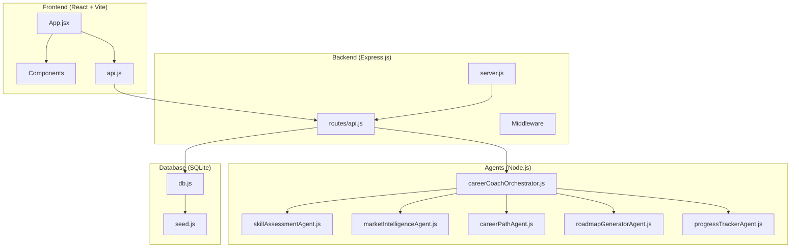
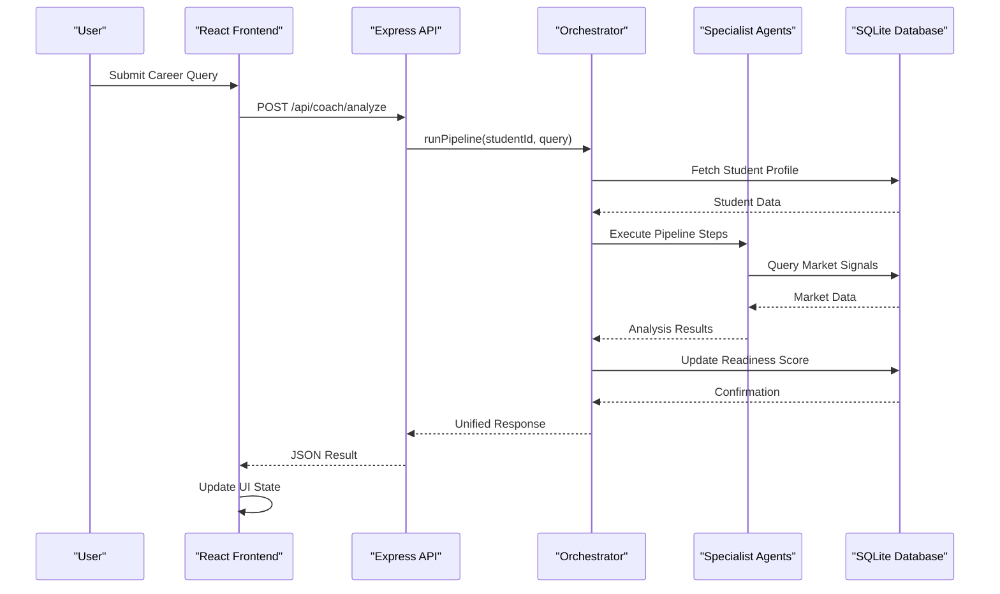
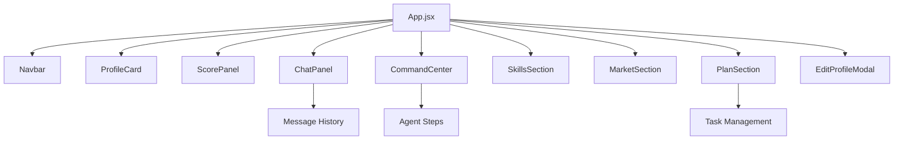
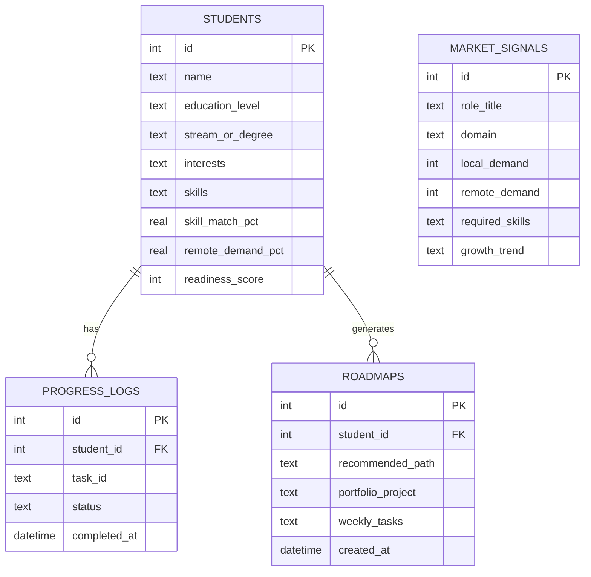
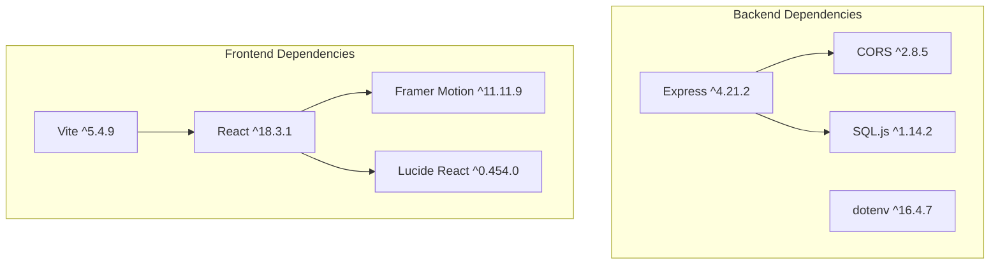

# Technical Implementation

<cite>
**Referenced Files in This Document**
- [server.js](file://server.js)
- [package.json](file://package.json)
- [routes/api.js](file://routes/api.js)
- [database/db.js](file://database/db.js)
- [frontend/src/App.jsx](file://frontend/src/App.jsx)
- [agents/careerCoachOrchestrator.js](file://agents/careerCoachOrchestrator.js)
- [frontend/src/api.js](file://frontend/src/api.js)
- [frontend/package.json](file://frontend/package.json)
- [frontend/src/components/CommandCenter.jsx](file://frontend/src/components/CommandCenter.jsx)
- [agents/skillAssessmentAgent.js](file://agents/skillAssessmentAgent.js)
- [database/seed.js](file://database/seed.js)
</cite>

## Update Summary
**Changes Made**
- Complete architectural transformation from single-file prototype to modular full-stack application
- Added Express.js server with RESTful API endpoints
- Implemented React frontend with component-based architecture
- Integrated SQLite database for persistent data storage
- Developed multi-agent system with specialized agents for career guidance
- Created comprehensive API layer with validation and error handling
- Added build tools and development environment setup

## Table of Contents
1. Introduction
2. Project Structure
3. Core Components
4. Architecture Overview
5. Detailed Component Analysis
6. Dependency Analysis
7. Performance Considerations
8. Troubleshooting Guide
9. Conclusion
10. Appendices

## Introduction
CareerCompass has evolved from a single-file client-side prototype into a comprehensive full-stack AI-powered career guidance platform for Pakistani students. The new architecture features:

- **Express.js Server**: Robust backend with RESTful API endpoints and middleware
- **React Frontend**: Modern component-based UI with state management and animations
- **SQLite Database**: Persistent data storage with schema validation and seeding
- **Multi-Agent System**: Specialized agents for skill assessment, market intelligence, career pathing, roadmap generation, and progress tracking
- **Comprehensive API Layer**: Validated endpoints with error handling and data persistence

The system maintains the original goal of providing AI-powered career guidance while adding scalability, maintainability, and production-ready features suitable for real-world deployment.

## Project Structure
The application follows a modern full-stack architecture with clear separation of concerns:



**Diagram sources**
- [server.js:1-37](file://server.js#L1-L37)
- [routes/api.js:1-176](file://routes/api.js#L1-L176)
- [agents/careerCoachOrchestrator.js:1-337](file://agents/careerCoachOrchestrator.js#L1-L337)
- [database/db.js:1-125](file://database/db.js#L1-L125)

**Section sources**
- [server.js:1-37](file://server.js#L1-L37)
- [package.json:1-30](file://package.json#L1-L30)

## Core Components

### Backend Architecture
- **Express Server**: Central application entry point with CORS, JSON parsing, and static file serving
- **API Routes**: RESTful endpoints for student management, career analysis, and progress tracking
- **Database Layer**: SQLite integration with schema management and data persistence
- **Agent System**: Modular multi-agent architecture for career guidance processing

### Frontend Architecture  
- **React Application**: Component-based UI with state management and routing
- **Component Library**: Reusable UI components for profile cards, chat interfaces, and analytics
- **API Client**: Centralized HTTP client with error handling and response parsing
- **Internationalization**: Multi-language support with English and Urdu translations

### Agent System
- **Orchestrator Agent**: Central coordination layer managing the entire pipeline
- **Skill Assessment Agent**: Evaluates student skills against target role requirements
- **Market Intelligence Agent**: Analyzes local and remote job market conditions
- **Career Path Agent**: Determines optimal career progression paths
- **Roadmap Generator**: Creates personalized 4-week action plans
- **Progress Tracker**: Monitors completion status and calculates readiness scores

**Section sources**
- [server.js:13-37](file://server.js#L13-L37)
- [routes/api.js:18-176](file://routes/api.js#L18-L176)
- [frontend/src/App.jsx:82-388](file://frontend/src/App.jsx#L82-L388)
- [agents/careerCoachOrchestrator.js:210-337](file://agents/careerCoachOrchestrator.js#L210-L337)

## Architecture Overview
The system implements a modern microservices-inspired architecture within a single application:



**Diagram sources**
- [routes/api.js:118-142](file://routes/api.js#L118-L142)
- [agents/careerCoachOrchestrator.js:210-337](file://agents/careerCoachOrchestrator.js#L210-L337)
- [database/db.js:59-125](file://database/db.js#L59-L125)

The architecture provides:
- **Scalability**: Modular design allows independent scaling of components
- **Maintainability**: Clear separation of concerns enables focused development
- **Testability**: Isolated components facilitate comprehensive testing
- **Performance**: Optimized data flow with efficient database queries
- **Reliability**: Comprehensive error handling and validation throughout the stack

## Detailed Component Analysis

### Express Server Configuration
The server provides a robust foundation with essential middleware and route organization:

```mermaid
flowchart TD
Start([Server Start]) --> Init[Initialize Express App]
Init --> Middleware[Configure Middleware]
Middleware --> CORS[Enable CORS]
Middleware --> JSON[Parse JSON Requests]
Middleware --> Static[Serve Static Files]
CORS --> Routes[Mount API Routes]
JSON --> Routes
Static --> Routes
Routes --> Health[/api/health]
Routes --> API[/api/*]
Health --> DBInit[Initialize Database]
API --> DBInit
DBInit --> Listen[Listen on Port 3000]
```

**Diagram sources**
- [server.js:13-37](file://server.js#L13-L37)

**Section sources**
- [server.js:1-37](file://server.js#L1-L37)

### API Layer Design
The API provides comprehensive endpoints with validation and error handling:

| Endpoint | Method | Description | Request Body | Response |
|----------|--------|-------------|--------------|----------|
| `/api/students` | GET | List all students | None | `{ students: [] }` |
| `/api/students/:id` | GET | Get student details | None | Student object with progress |
| `/api/students/:id` | PATCH | Update student profile | `{ education_level?, interests?, skills? }` | Updated student |
| `/api/coach/analyze` | POST | Run career analysis pipeline | `{ studentId, query }` | Analysis results |
| `/api/progress/toggle` | POST | Toggle task completion | `{ studentId, taskId, status }` | Updated progress |

**Section sources**
- [routes/api.js:18-176](file://routes/api.js#L18-L176)

### Multi-Agent Pipeline
The orchestrator coordinates six specialized agents in a sequential pipeline:

```mermaid
flowchart LR
Input[Student Query] --> Resolver[Target Resolver]
Resolver --> Skills[Skill Assessment]
Skills --> Market[Market Intelligence]
Market --> Path[Career Path]
Path --> Roadmap[Roadmap Generator]
Roadmap --> Progress[Progress Tracker]
Progress --> Output[Unified Response]
style Input fill:#e1f5fe
style Output fill:#e8f5e8
style Resolver fill:#fff3e0
style Skills fill:#f3e5f5
style Market fill:#e0f2f1
style Path fill:#fce4ec
style Roadmap fill:#f1f8e9
style Progress fill:#fff8e1
```



**Diagram sources**
- [agents/careerCoachOrchestrator.js:210-337](file://agents/careerCoachOrchestrator.js#L210-L337)

**Section sources**
- [agents/careerCoachOrchestrator.js:1-337](file://agents/careerCoachOrchestrator.js#L1-L337)

### React Frontend Architecture
The frontend implements a modern React application with component composition:



**Diagram sources**
- [frontend/src/App.jsx:82-388](file://frontend/src/App.jsx#L82-L388)
- [frontend/src/components/CommandCenter.jsx:1-531](file://frontend/src/components/CommandCenter.jsx#L1-L531)

**Section sources**
- [frontend/src/App.jsx:1-388](file://frontend/src/App.jsx#L1-L388)
- [frontend/src/components/CommandCenter.jsx:1-531](file://frontend/src/components/CommandCenter.jsx#L1-L531)

### Database Schema Design
The SQLite database provides persistent storage with proper relationships:



**Diagram sources**
- [database/db.js:71-125](file://database/db.js#L71-L125)

**Section sources**
- [database/db.js:1-125](file://database/db.js#L1-L125)
- [database/seed.js:1-277](file://database/seed.js#L1-L277)

## Dependency Analysis
The application uses modern JavaScript dependencies organized by layer:

### Backend Dependencies
- **Express**: Web framework for API endpoints
- **CORS**: Cross-origin resource sharing configuration
- **SQL.js**: In-memory SQLite database implementation
- **Dotenv**: Environment variable management

### Frontend Dependencies
- **React**: UI framework with hooks and component composition
- **Framer Motion**: Animation library for smooth transitions
- **Lucide React**: Icon library for visual elements
- **Vite**: Build tool and development server



**Diagram sources**
- [package.json:23-28](file://package.json#L23-L28)
- [frontend/package.json:11-23](file://frontend/package.json#L11-L23)

**Section sources**
- [package.json:1-30](file://package.json#L1-L30)
- [frontend/package.json:1-25](file://frontend/package.json#L1-L25)

## Performance Considerations
The full-stack architecture optimizes performance through several strategies:

### Backend Optimization
- **Connection Pooling**: Efficient database connections with SQL.js
- **Query Optimization**: Parameterized queries prevent SQL injection and improve performance
- **Response Caching**: Potential for implementing caching layers for frequently accessed data
- **Error Handling**: Comprehensive error handling prevents cascading failures

### Frontend Optimization
- **Component Lazy Loading**: Code splitting for improved initial load times
- **State Management**: Efficient React state updates with hooks
- **Animation Performance**: Hardware-accelerated CSS transforms and opacity changes
- **Network Optimization**: Debounced API calls and optimistic UI updates

### Database Optimization
- **Schema Design**: Normalized structure with proper indexing
- **Query Efficiency**: Optimized SQL queries with proper joins
- **Data Persistence**: Automatic save-to-disk functionality
- **Transaction Support**: ACID compliance for data integrity

## Troubleshooting Guide

### Common Issues and Solutions

#### Backend Issues
- **Server Not Starting**: Check port availability and environment variables
- **Database Connection Errors**: Verify SQLite file permissions and initialization
- **API Route 404s**: Ensure routes are properly mounted and CORS is configured
- **Agent Pipeline Failures**: Check agent dependencies and data validation

#### Frontend Issues
- **Build Failures**: Verify Node.js version compatibility and dependency installation
- **API Connection Errors**: Check backend server status and CORS configuration
- **State Synchronization**: Ensure proper cleanup of timers and event listeners
- **Animation Performance**: Monitor memory usage and optimize complex animations

#### Database Issues
- **Schema Migration**: Use seed script to reset database for development
- **Data Integrity**: Validate foreign key constraints and data types
- **Performance**: Monitor query execution times and optimize slow queries

**Section sources**
- [server.js:26-37](file://server.js#L26-L37)
- [routes/api.js:27-69](file://routes/api.js#L27-L69)
- [frontend/src/App.jsx:172-238](file://frontend/src/App.jsx#L172-L238)

## Conclusion
CareerCompass has successfully evolved from a simple single-file prototype into a production-ready full-stack application. The new architecture provides:

### Key Advantages
- **Scalability**: Modular design supports independent scaling of frontend, backend, and agents
- **Maintainability**: Clear separation of concerns enables focused development and testing
- **Extensibility**: Plugin-like agent architecture allows easy addition of new capabilities
- **Reliability**: Comprehensive error handling and validation throughout the stack
- **Performance**: Optimized data flow and efficient resource utilization

### Technical Achievements
- **Modern Stack**: Utilizes current best practices with React, Express, and SQLite
- **Multi-Agent System**: Sophisticated orchestration of specialized AI agents
- **Robust API**: Well-designed RESTful endpoints with comprehensive validation
- **Rich UI**: Interactive React interface with smooth animations and responsive design
- **Persistent Storage**: Reliable data management with SQLite database

### Future Considerations
- **Microservices Migration**: Potential to split agents into separate services
- **Cloud Deployment**: Containerization and cloud-native deployment patterns
- **Advanced Analytics**: Enhanced reporting and insights capabilities
- **Real-time Features**: WebSocket integration for live collaboration features

The transition demonstrates effective software engineering practices while maintaining the core mission of providing accessible AI-powered career guidance for Pakistani students.

## Appendices

### Infrastructure Requirements
- **Node.js**: Version 18+ for modern JavaScript features
- **Modern Browser**: Chrome, Firefox, Safari, or Edge with ES6+ support
- **Development Tools**: Git, npm/yarn, and optional IDE with TypeScript support
- **Production Hosting**: Node.js runtime with SQLite file system access

### Development Workflow
```bash
# Install dependencies
npm install
cd frontend && npm install && cd ..

# Seed database
npm run seed

# Start development servers
npm run dev          # Backend server
npm run frontend:dev # Frontend development server

# Build for production
npm run frontend:build
```

### Testing Strategy
- **Unit Tests**: Individual agent functionality testing
- **Integration Tests**: API endpoint testing with mock data
- **E2E Tests**: User workflow testing across frontend and backend
- **Performance Tests**: Load testing for concurrent user scenarios

### Deployment Topology
- **Development**: Local development with hot reloading
- **Staging**: Containerized deployment for testing
- **Production**: Cloud hosting with reverse proxy and SSL termination
- **Monitoring**: Logging and metrics collection for operational insights